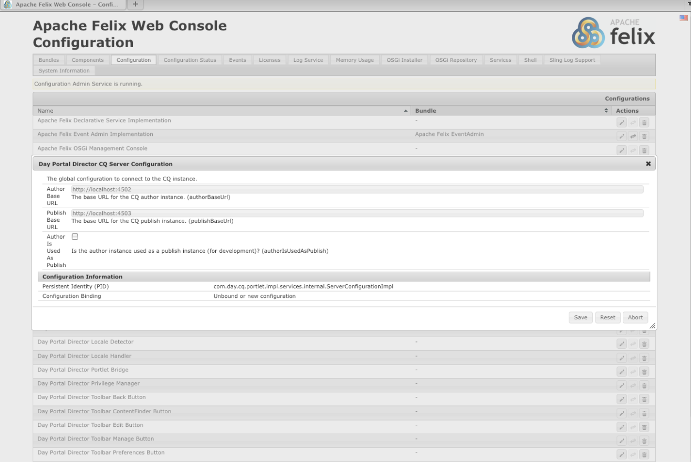

# AEM入口網站和Portlet{#aem-portals-and-portlets}

本檔案說明下列內容：

* AEM Portal架構
* 管理AEM並將其設定為入口網站
* 使用AEM做為入口網站
* 在portlet中安裝、設定和顯示AEM內容（例如，網頁伺服器）

## AEM Portal架構 {#aem-portal-architecture}

AEM入口網站架構包含入口網站和portlet的定義。

### 什麼是入口網站？ {#what-is-a-portal}

入口網站是提供個人化、單一登入、不同來源的內容整合，以及托管資訊系統表現層的網頁應用程式。

您可以在AEM中執行JSR 286相容的portlet。 Portlet元件允許您在頁上嵌入Portlet。 請參 [閱「管理AEM內容Portlet](#administeringthecqcontentportlet)」。

### 什麼是portlet? {#what-is-a-portlet}

Portlet是部署在容器內的Web元件，用於生成動態內容。 Portlet介面被打包並部署為。war檔案，位於Portlet容器內。 如果您以入口網站的形式運行AEM，則需要Portlet的。war檔案來運行Portlet。

若要設定AEM內容以顯示在入口網站中，請參 [閱Portlet中的安裝、設定和使用AEM](#installingconfiguringandusingcqinaportlet)。

### AEM Portal主管 {#aem-portal-director}

>[!CAUTION]
>
>自AEM 6.4起，AEM Portal Director已過時。請參 [閱過時和移除的功能](https://helpx.adobe.com/experience-manager/6-4/release-notes/deprecated-removed-features.html)。

## 管理AEM內容Portlet {#administering-the-aem-content-portlet}

AEM內容Portlet可讓您在入口網站中顯示AEM內容。 Portlet可在中使 `/crx-quickstart/opt/portal`用，並可以通過各種方式自定義。 例如，您可以部署您自己的驗證服務來自訂SSO/驗證處理，以產生AEM覆寫預設行為的必要驗證資訊。 外掛程式使用已定義的API，可讓您根據API建立外掛程式，以新增您自己的功能。 插件可以部署到正在運行的portlet中。 若要正常運作，它需要AEM作者和發佈例項的設定，以及要在啟動時顯示的內容路徑。

某些配置可以通過portlet首選項進行更改，而其他配置可通過OSGi服務配置進行更改。 您可以使用 **config** files或OSGi web控制台更改這些配置。

### Portlet首選項 {#portlet-preferences}

可以在部署時在門戶伺服器中配置門戶首選項，或在部署portlet web應用程式之前編輯 **WEB-INF/portlet.xml** 檔案來配置門戶首選項。 預設情況下，portlet.xml檔案顯示如下：

```xml
<?xml version="1.0" encoding="UTF-8"?>
<portlet-app xmlns="https://java.sun.com/xml/ns/portlet/portlet-app_1_0.xsd"
             xmlns:xsi="https://www.w3.org/2001/XMLSchema-instance"
             xsi:schemaLocation="https://java.sun.com/xml/ns/portlet/portlet-app_1_0.xsd /opt/SUNWps/dtd/portlet.xsd"
             version="1.0">
   <portlet>
      <portlet-name>RSSWeatherPortlet</portlet-name>
      <portlet-class>org.jboss.portlet.weather.WeatherPortlet</portlet-class>
      <init-param>
         <name>default_zipcode</name>
         <value>05673</value>
      </init-param>
      <init-param>
         <name>RSS_XSL</name>
         <value>/WEB-INF/Rss.xsl</value>
      </init-param>
      <init-param>
         <name>base_url</name>
         <value>https://xml.weather.yahoo.com/forecastrss?p=</value>
      </init-param>
      <expiration-cache>180</expiration-cache>
      <supports>
         <mime-type>text/html</mime-type>
         <portlet-mode>VIEW</portlet-mode>
         <portlet-mode>EDIT</portlet-mode>
      </supports>
      <portlet-info>
         <title>Weather Portlet</title>
      </portlet-info>
      <portlet-preferences>
         <preference>
            <name>expires</name>
            <value>180</value>
         </preference>
         <preference>
            <name>RssXml</name>
            <value>https://xml.weather.yahoo.com/forecastrss?p=33145</value>
            <read-only>false</read-only>
         </preference>
      </portlet-preferences>
   </portlet>
</portlet-app>
```

Portlet可以使用以下首選項進行配置：

<table>
 <tbody>
  <tr>
   <td>startPath</td>
   <td><p>這是portlet的開始路徑：它定義最初顯示的內容。</p> <p><strong>重要</strong>:如果Portlet設定為連線至AEM作者並發佈執行於不同於<strong> /</strong>/之上下文路徑的例項，您必須在這些AEM例項（例如透過Felix Webconsole）的「 <strong>Html程式庫管理員」設定中啟用強制</strong> CQUrlInfo，或編輯將無法運作，且偏好設定對話方塊將不會出現。</p> </td>
  </tr>
  <tr>
   <td>htmlSelector</td>
   <td>附加至每個URL的選擇器。 根據預設，這是 <strong>portlet</strong>，因此對html頁面的所有請求都使用以 <strong>.portlet.html結尾的url。</strong> 這可讓您在AEM中使用自訂指令碼來轉譯portlet。</td>
  </tr>
  <tr>
   <td>addCssToPortalHeader</td>
   <td><p>依預設，AEM的HTML頁面中包含的css檔案會包含在Portlet中。 停用此選項會排除預設的css檔案。</p> <p>如果啟用此選項，CSS檔案會新增至html頁面的標題，或內嵌在html頁面中，視入口網站的行為而定。</p> </td>
  </tr>
  <tr>
   <td>includeToolbar</td>
   <td>預設情況下，在內容portlet內顯示一個工具欄，用於管理功能。 停用此選項後，不會產生任何工具列。</td>
  </tr>
  <tr>
   <td>urlParameterNames</td>
   <td><p>可能包含要為Portlet顯示的新內容URL的替代URL參數名稱的清單。 從上到下處理清單，使用包含值的第一參數。 如果找不到URL，則會使用預設URL參數。 提供的URL會依原樣使用，而不需進一步修改。</p> <p>此設定是按部署的Portlet進行的——它還用於在OSGi配置中全局配置「Day Portal Director Portlet Bridge」的某些URL參數。</p> </td>
  </tr>
  <tr>
   <td>preferenceDialog</td>
   <td>AEM中偏好設定對話方塊的路徑——如果保留為空白，則會使用內建的偏好設定對話方塊。 預設為/libs/portal/content/prefs.html。</td>
  </tr>
  <tr>
   <td>initialRedirect</td>
   <td>根據預設，Portlet會在第一次呼叫時執行整個入口網頁的Javascript重新導向。 這是為了支援現代入口伺服器的拖放情形。 在生產中，很少需要此重新導向，因此可以關閉此偏好設定設為 <em>false</em>。</td>
  </tr>
 </tbody>
</table>

#### OSGi Web Console {#osgi-web-console}

假設入口伺服器在主機localhost上執行，連接埠8080，而AEM portlet web應用程式已載入Web應用程式內容 *cqportlet*，則Web主控台的URL為 `https://localhost:8080/cqportlet/cqbridge/system/console`。 預設用戶和密碼為 **admin**。

開啟「 **Configurations** （配置）」頁籤，並 **選擇「Portal Directory CQ Server Configuration（入口目錄CQ伺服器配置）**」。 您可在此處指定作者和發佈例項的基本URL。 此過程在配置 [Portlet中介紹](#configuring-the-portlet)。

>[!NOTE]
>
>OSGi web控制台僅用於在開發（或測試）期間更改配置。 請務必封鎖對生產系統主控台的要求。

### 提供配置 {#providing-configurations}

為了支援自動部署和設定布建，AEM內容Portlet具有內建的組態支援，可嘗試從提供給Portlet應用程式的類路徑中讀取組態。

在啟動時，會讀取系統 **屬性com.day.cq.portet.config** ，以偵測目前環境。 通常，此屬性的值類似 **dev**、 **prod**、 **test** 等。 如果未設定任何環境，則不會讀取任何配置。

如果設定了環境，則會在類路徑* ***com/day/cq/portlet/{env}.config** (其中 **env** 被環境的實際值替換)中搜索配置檔案。 此檔案應列出此環境的所有配置檔案。 這些檔案會相對於配置檔案的位置進行搜索。 例如，如果檔案包含一行，則 `my.service.xml,` 會從類路徑中讀取此檔案，位於 `com/day/cq/portlet/my.service.config.` The file name of the persistence ID inconted of the service, aftown **.config**。 在上例中，永續性ID **為my.service**。 設定檔的格式，是Apache Sling OSGi安裝程式所使用的格式。

這意味著，對於每個環境，都需要添加相應的配置檔案。 應應用於所有環境的配置需要輸入到所有這些檔案中——如果僅用於單個環境，則只在該檔案中輸入。 此機制可確保完全控制要讀取的環境配置。

可以使用不同的系統屬性來檢測環境。 指定系統屬 **性com.day.cq.portet.configproperty** ，其中包含要使用的系統屬性名稱，而非 **com.day.cq.portet.config**。

#### 快取和快取失效 {#caching-and-caching-invalidation}

Portlet在其預設設定中，會將從AEM WCM收到的回應快取至使用者特定的快取中。 當發佈實例的內容發生更改時，快取需要失效。 為此，在AEM WCM中，必須在作者例項上設定複製代理。 也可以手動刷新快取。 本節將介紹這兩種過程。

Portlet可以配置其自己的快取，以便在無需訪問AEM的情況下顯示Portlet中的內容。 入口網站是以/libs/portal/director中的內容形式提供。 若要存取內容，請啟動AEM例項，然後使用CRXDE Lite或Webdav從該位置下載檔案。

您可以在運行時部署此包，或在部署前將其添加到portlet web應 `WEB-INF/lib/resources/bundles` 用程式中。

部署快取後，Portlet會快取來自發佈實例的內容。 Portlet快取可以使用來自AEM的調度器刷新來使其失效。 要配置portlet以使用其自己的快取，請：

1. 在作者中配置指向入口伺服器的複製代理。
1. 假設入口伺服器在主機 **localhost**、**port 8080 **上執行，而AEM portlet web應用程式已載入內容 **cqportlet**，則清除快取的URL為 `https://localhost:8080/cqportlet/cqbridge/cqpcache?Path=$(path)`。 使用GET做為方法。
   **** 注意：您可以傳送名為 **Path的http標題，而不是使用請求參**&#x200B;數。

#### 通過複製代理刷新快取 {#flushing-the-cache-via-replication-agent}

與正常的調度程式失效一樣，可以配置複製代理以定位門戶的AEM portlet快取。 配置複製代理後，每次常規頁面激活都會刷新入口快取。

如果您執行AEM Portlet的數個入口節點，您必須依本程式所述為每個節點建立代理。

要為入口配置複製代理：

1. 登入作者例項。
1. 在「網站」標籤中，按一下「工 *具* 」標籤。
1. **** 按一 **下「新增頁面……」在複製代理中**&#x200B;新增……菜單開啟它。

   

1. 在模 *板中*，選擇 *複製代理*，然後輸入代理的名稱。 按一下&#x200B;*「建立」*。

   

1. 按兩下剛建立的複製代理。 它顯示為無效，因為尚未設定。

   

1. 按一下 **編輯。**
1. 在「設 **定** 」標籤中，選取「已啟用 **」核取方塊，選取「** Dispatcher Flush **** 」作為序列化類型，然後輸入重試逾時（例如60000）。

   

1. 按一下「 **Transport** （傳輸）」頁籤。
1. 在 **URI欄位** 中，輸入portlet的刷新URI(URL)。 URI的形式如下：

   ```xml
   https://<wps-host>:<port>/<wps-context>/<cq5-portlet-context>/cqbridge/cqpcache
   ```

   

1. 按一下「 **Extended** 」頁籤。

   

1. 在「 **HTTP方法** 」欄位中，輸 **入GET**。
1. 在「 **HTTP標題** 」欄位中，按 **一下+以新增項目並輸入****路徑：{path}**。
1. 如有必要，按一下 **Proxy** （代理）頁籤，然後向代理輸入代理資訊。
1. 按一下 **確定** ，保存更改。
1. 要測試連接，請按一下「測 **試連接** 」連結。 將顯示一條日誌消息，指出複製測試是否成功。 例如：

   

#### 手動刷新Portlet快取 {#manually-flushing-the-portlet-cache}

通過訪問為複製代理配置的相同URL，可以手動刷新portlet快取。 如需 [URL的格式](#flushing-the-cache-via-replication-agent) ，請參閱清除快取。 此外，URL需要以URL參數Path=&lt;path>來擴充，以指出要清除的項目。

例如：

`https://10.0.20.99:10040/wps/PA_CQ5_Portlet/cqbridge/cqpcache?Path=*` 刷新完整快取。 `https://10.0.20.99:10040/wps/PA_CQ5_Portlet/cqbridge/cqpcache?Path=/content/mypage/xyz` 從高 `/content/mypage/xyz` 速快取中刷新。

### 入口網站安全性 {#portal-security}

入口是驅動認證機制。 您可以與技術使用者、入口網站使用者、群組等一起登入AEM。 Portlet無法訪問入口中用戶的口令，因此，如果Portlet不知道成功登錄用戶的所有憑據，則必須使用SSO解決方案。 在此案例中，AEM portlet會將所有必要的資訊轉送給AEM，而AEM會將這些資訊轉送至基礎的AEM存放庫。 此行為是可插拔的，可以自定義。

### 發佈時驗證 {#authentication-on-publish}

本節說明Portlet在與基礎AEM WCM例項通訊時可使用的驗證模式。

依預設，不會將使用者資訊傳送至AEM的發佈例項；內容一律顯示為匿名使用者。 如果使用者特定資訊應從AEM傳送，或是需要使用者發佈驗證，則必須開啟此功能。

#### 訪問Portlet的驗證配置 {#accessing-the-portlet-s-authentication-configuration}

Portlet在AEM WCM實例中使用的驗證配置選項可在Web控制台（OSGi配置）中使用。

>[!NOTE]
>
>使用AEM時，有數種方法可管理OSGi服務（控制台或儲存庫節點）的組態設定。
>
>如需 [完整詳細資訊](/help/sites-deploying/configuring-osgi.md) ，請參閱設定OSGi。

要訪問Portlet的驗證配置：

1. 從下列URL存取Web主控台：

   `https://localhost:8080/cqportlet/cqbridge/system/console`

   例如，在其預設配置中：

   `https://wps-host:10040/wps/PA_CQ5_Portlet/cqbridge/system/console`

1. 登入Web主控台。 預設憑據為 `admin/admin`。
1. 在控制台中，選擇「配 **置」**。
1. 在「配 **置** 」菜單中，選擇要配置的特定服務。 服務由OSGi框架中的portlet提供。

   | 服務名稱 | 說明 |
   |---|---|
   | 日門戶控制器驗證器 | 設定AEM WCM例項使用的驗證模式。 視所選模式而定，可指定技術使用者或SSO cookie的名稱。 此外，AEM WCM發佈例項的驗證也可以啟用。 |
   | 日門戶控制器檔案快取 | 設定Portlet如何快取其從AEM WCM例項收到的回應的參數。 |
   | Day Portal Director HTTP Client Service | 配置portlet如何通過HTTP連接到基礎AEM WCM實例。 例如，您可以指定代理伺服器。 |
   | 日門戶控制器區域設定處理程式 | 配置portlet支援哪些地區。 對AEM WCM例項的要求是以使用者地區設定為基礎；例如，使用者語言*德文*會要求 `/content/geometrixx/de/`.... |
   | Day Portal Director權限管理員 | 配置Portlet是否應根據當前登錄的用戶來測試「網站」頁籤。 |
   | Day Portal Director工具列轉譯器 | 自定義portlet工具欄的呈現。 |

1. 此外，您還可以設定Web主控台和記錄服務。 例如，您可以按一下「Apache Felix OSGi管理控制台」連結，變更Web主控台的管理憑證。

#### 技術使用者模式 {#technical-user-mode}

在預設模式中，Portlet為AEM WCM作者例項發出的所有請求，都會使用相同的技術使用者進行驗證，不論目前的入口網站使用者為何。 技術使用者模式預設為啟用。 在OSGi管理控制台中，您在相應的配置螢幕中啟用／禁用此模式：

如果啟用「發佈時驗證**」，則指定的技術使用者必須存在於AEM WCM作者例項和發佈例項中。 請務必為使用者提供足夠的存取權限，以利製作作品。

#### SSO {#sso}

Portlet支援SSO，而且AEM現成可用。 驗證器服務可設定為使用SSO，並以AEM命名的Cookie格式傳輸目前的入口網站使用 **者**`cqpsso` Basic。 AEM應設定為使用路徑／的SSO驗證處理常式。 Cookie名稱也需要在此設定。

AEM `crx-quickstart/repository/repository.xml` 儲存庫必須依此設定：

```xml
<LoginModule class="com.day.crx.security.authentication.CRXLoginModule">
  ...
  <param name="trust_credentials_attribute" value="TrustedInfo"/>
  <param name="anonymous_principal" value="anonymous"/>
</LoginModule>
```

#### SSO驗證模式 {#sso-authentication-mode}

Portlet可使用單一登入(SSO)方案來驗證AEM WCM。 在此模式中，目前登入入口網站的使用者會以SSO cookie的形式轉送至AEM WCM。 如果使用SSO模式，則所有可存取AEM Portlet的入口網站使用者都必須知道底層AEM WCM例項，最常見的方式是以AEM WCM連線至LDAP的形式，或事先手動建立使用者。 此外，在Portlet中啟用SSO之前，必須先將基礎AEM WCM作者例項(以及發佈例項，若已啟用「在發佈上驗證 **** 」)設定為接受以SSO為基礎的請求。

要將Portlet配置為使用SSO驗證模式，請完成以下步驟（在以下各節中詳細說明）:

* 啟用AEM WCM的儲存庫以接受受信任的認證。
* 在AEM WCM中啟用SSO驗證。
* 在AEM Portlet中啟用SSO驗證。

#### 啟用AEM WCM的儲存庫以接受受信任的認證 {#enabling-aem-wcm-s-repository-to-accept-trusted-credentials}

在AEM WCM啟用SSO之前，必須先將基礎儲存庫設定為接受AEM WCM提供的信任認證。 若要這麼做，請設定AEM的repository.xml。

1. 在安裝AEM WCM的檔案系統中，開啟下列檔案：

   `//crx-quickstart/repository/repository.xml`

1. 在XML檔案中，查找 **LoginModule的條目** ，並將trust_credentials_attribute添加到其配置中：

   ```xml
   <LoginModule class="com.day.crx.security.authentication.CRXLoginModule">
     ...
     <param name="trust_credentials_attribute" value="TrustedInfo"/>
     <param name="anonymous_principal" value="anonymous"/>
   </LoginModule>
   ```

1. 重新啟動AEM WCM，讓變更生效。

#### 在AEM WCM中啟用SSO驗證 {#enabling-sso-authentication-in-the-aem-wcm}

若要在AEM WCM中啟用SSO，請存取AEM WCM的Apache Felix Web Management Console(OSGi)中的相關設定項目：

1. 透過其URI(https://&lt;AEM-host>:&lt;port>/system/console)存取主控台。
1. 在「配置」菜單中，選擇「SSO驗證處理程式」。 在此範例中，SSO處理常式會根據AEM Portlet提供的Cookie，接受所有路徑的SSO請求。 您的設定可能會有所不同。

   | 路徑 | / | 為所有請求啟用SSO處理常式 |
   |---|---|---|
   | Cookie名稱 | cqpsso | Portlet提供的Cookie的名稱，如Portlet的OSGi控制台中所配置。 |

1. 按一 **下「儲存** 」以啟用SSO。 SSO現在是主要的驗證方案。

針對AEM WCM收到的每個請求，會先嘗試以SSO為基礎的驗證。 失敗時，執行對通常的基本認證方案的備援。 因此，不需SSO也能正常連線至AEM WCM。

#### 在AEM Portlet中啟用SSO驗證 {#enabling-sso-authentication-in-a-aem-portlet}

為了讓基礎AEM WCM例項接受SSO請求，Portlet的驗證模式必須從 **Technical** 切換 **為SSO**。

若要在AEM Portlet中啟用SSO驗證：

1. 透過其URI(https://&lt;aem-host>:&lt;port>/system/console)存取主控台。
1. 在「配置」菜單中，從可用配置清單中選擇「日門戶控制器驗證器」。
1. 在模式中，選擇SSO。 將其他參數保留其預設值。

   

1. 按一下「保存」以啟用Portlet的SSO。

   為了進行測試，在AEM WCM中以管理員權限建立相同的使用者後，請以您入口網站的管理使用者來存取portlet。

執行此程式後，請求會使用SSO進行驗證。 HTTP通訊中的典型程式碼片段顯示下列SSO和Portlet特定標題的存在：

```xml
C-12-#001898 -> [GET /mynet/en/_jcr_content/par/textimage/image.img.png HTTP/1.1 ]
C-12-#001963 -> [cq5:locale: en ]
C-12-#001979 -> [cq5:used-locale: en ]
C-12-#002000 -> [cq5:locales: en,en_US ]
C-12-#002023 -> [cqp:user: wpadmin ]
C-12-#002042 -> [cqp:portal: IBM WebSphere Portal/6.1 ]
C-12-#002080 -> [cqp:windowid: 7_CGAH47L000CE302V2KFNOG0084 ]
C-12-#002124 -> [cqp:windowstate: normal ]
C-12-#002149 -> [cqp:portletmode: view ]
C-12-#002172 -> [User-Agent: Jakarta Commons-HttpClient/3.1 ]
C-12-#002216 -> [Host: 10.0.0.68:4502 ]
C-12-#002238 -> [Cookie: $Version=0; cqpsso=Basic+d3BhZG1pbg%3D%3D ]
C-12-#002289 -> [ ]
```

### 啟用PIN驗證 {#enabling-pin-authentication}

如果您不使用AEM內容Portlet的預設內嵌編輯功能，但是想要將Portlet的製作和管理部分直接在AEM作者例項中，啟用PIN驗證。 您還需要更改管理按鈕的配置。

若要開啟網站管理頁面或從Portlet編輯頁面，AEM內容Portlet會使用新的管腳驗證。 依預設，針腳驗證會停用，因此必須在AEM中進行下列組態變更：

1. 在repository.xml檔案中新增受信任的資訊，以啟用AEM中的受信任驗證：

   ```xml
   <LoginModule class="com.day.crx.security.authentication.CRXLoginModule">
     ...
     <param name="trust_credentials_attribute" value="TrustedInfo"/>
   </LoginModule>
   ```

1. 在OSGi配置控制台中，預設位於https://localhost:4502/system/console/configMgr，從下拉菜單中選擇 **CQ PIN Authentication Handler** 。
1. 編輯 **URL根路徑參數** ，只包含單一值 **/**。

### 權限 {#privileges}

Portlet的某些功能受到權限保護。 當前用戶需要具有此權限才能訪問此功能。 預先定義了以下權限：

* 「工具列」:這是查看／使用Portlet中工具欄的一般權限。
* &quot;prefs&quot; :如果用戶具有此權限，則允許用戶查看／更改Portlet的首選項。
* &quot;cq-author:edit&quot;:使用此權限，用戶可以調用內容的編輯視圖。
* &quot;cq-author:preview&quot;:有了此權限，用戶可以查看預覽。
* &quot;cq-author:siteadmin&quot;:透過此權限，使用者可以在AEM中開啟網站管理員。

管理權限的最佳方法是使用入口角色並為這些權限分配角色。 這可以透過OSGi組態完成。 「Day Portal Director Privilege Manager」（日門戶控制器權限管理器）可以為每個權限配置一組角色。 如果用戶具有其中一個角色，則用戶具有相應的權限。

此外，還可以根據每個portlet實例庫的訪問來定義此角色。 Portlet的首選項對話框包含上述每個權限的輸入欄位。 對於每個權限，可以配置以逗號分隔的portlet角色清單。 如果配置了值，則會覆蓋「Day Portal Director Privilege Manager」服務中的全局配置，並可能需要從此全局設定中添加相同的角色，因為這些角色未合併！ 如果未指定值，則使用全局配置。

### 自訂AEM Portlet應用程式 {#customizing-the-aem-portlet-application}

提供的AEM Portlet應用程式會像AEM一樣，在Web應用程式中啟動OSGi容器。 此架構可讓您運用OSGi的所有優點：

* 易於更新和擴充
* 提供Portlet的熱更新，而不需與入口伺服器進行任何交互
* 輕鬆自定義portlet

### 工具列按鈕 {#toolbar-buttons}

工具列及其按鈕是可設定的，而且可加以自訂。 您可以將自己的按鈕新增至工具列，或定義在何種模式下顯示的按鈕。 每個按鈕都是可通過OSGi配置配置的OSGi服務。

OSGi web控制台列出「配置」頁籤上的所 **有按鈕** 配置。 您可以針對每個按鈕定義此按鈕的顯示模式。 這可讓您移除所有模式（例如），以停用按鈕。

依預設，AEM內容Portlet會使用內嵌編輯功能。 不過，如果您偏好切換至AEM作者例項進行編輯，請啟用「 **SiteAdmin Button** 」和「 **ContentFinder Button**」，但是請停用「 **Edit Button**」。 在此情況下，請確定在AEM中正確設定PIN驗證。

Portlet的工具欄佈局可以通過Portlet的Felix Web Console安裝一個包來定制，該包在預定義位置包含自定義CSS/HTML。

#### 束結構 {#bundle-structure}

以下是範例束結構：

```xml
$ jar tvf target/toolbarlayout-0.0.1-SNAPSHOT.jar | awk '{print $8}'
META-INF/
META-INF/MANIFEST.MF
/com/day/cq/portlet/toolbar/layout/
/com/day/cq/portlet/toolbar/layout/author.gif
/com/day/cq/portlet/toolbar/layout/back.gif
/com/day/cq/portlet/toolbar/layout/button.html
/com/day/cq/portlet/toolbar/layout/edit.gif
/com/day/cq/portlet/toolbar/layout/manage.html
/com/day/cq/portlet/toolbar/layout/publish.html
/com/day/cq/portlet/toolbar/layout/refresh.gif
/com/day/cq/portlet/toolbar/layout/siteadmin.gif
/com/day/cq/portlet/toolbar/layout/toolbar.css
```

META-INF檔案夾包含OSGi將其識別為整合檔所需的MANIFEST.MF檔案。 如下所示：

```xml
Manifest-Version: 1.0
Built-By: djaeggi
Created-By: Apache Maven Bundle Plugin
Import-Package: com.day.cq.portlet.toolbar.layout
Bnd-LastModified: 1234178347159
Export-Package: com.day.cq.portlet.toolbar.layout
Bundle-Version: 0.0.1.SNAPSHOT
Bundle-Name: Company CQ5 Portal Director Portlet Toolbar Layout
Bundle-Description: This bundle provides a custom layout for the CQ5 P
 ortal Director Portlet Toolbar.
Build-Jdk: 1.5.0_16
Bundle-ManifestVersion: 2
Bundle-SymbolicName: com.day.cq.portlet.company.toolbarlayout
Tool: Bnd-0.0.255
```

HTML/CSS/images位於/com/day/cq/portlet/toolbar/layout資料夾中的事實是portlet所規定的，無法加以變更。 MANIFEST.MF中的「匯入封裝」和「匯出封裝」標題也必須稱為/com/day/cq/portlet/toolbar/layout。 Bundle-SymbolicName必須是唯一且完全限定的包名。

您可以使用工具（如maven或手動建立）建立此類jar檔案，並設定相關標題集，如本節所示。

#### Portlet工具欄視圖 {#portlet-toolbar-views}

Portlet的工具欄基本上有兩種視圖狀態。 每個檢視和相關的按鈕都可使用個別的HTML檔案自訂。

#### 發佈檢視 {#publish-view}

發佈檢視只有一個按鈕，可將工具列切換至「管理」檢視。 發佈檢視由上一套套裝中的publish.html檔 [案表示](/help/sites-deploying/configuring-osgi.md#bundles)。 在HTML中，您可以使用下列佔位符，在呈現時，這些佔位符將由portlet替換為各自的內容：

#### 發佈檢視預留位置 {#publish-view-placeholders}

| 預留位置字串 | 說明 |
|---|---|
| {buttonManage} | 佔位符由**Manage **按鈕替換，該按鈕將portlet狀態切換到管理狀態。 |

#### 管理檢視 {#manage-view}

管理檢視有四個按鈕：「編輯」、「網站」標籤、「重新整理」和「上一步」。 管理檢視由上一套套裝中的manage.html檔 [案表示](/help/sites-deploying/configuring-osgi.md#bundles)。 在HTML中，您可以使用下列佔位符，在呈現時，這些佔位符將由portlet替換為各自的內容：

#### 管理視圖佔位符 {#manage-view-placeholders}

| 預留位置字串 | 說明 |
|---|---|
| {buttonEdit} | 預留位置會由**編輯**按鈕取代，此按鈕會在AEM的編輯模式中開啟新視窗並顯示目前頁面。 |
| {buttonWebsites標籤} | 預留位置，由開啟AEM WCM的「網站」索引標籤的按鈕所取代。 |
| {buttonRefresh} | 刷新當前視圖。 |
| {buttonBack} | 將portlet切換回發佈視圖。 |

#### 按鈕 {#buttons}

按鈕（無論出現哪種檢視）都會使用在button.html中定義的相同通用HTML。

在HTML中，您可以使用下列佔位符，在呈現時，這些佔位符將由portlet替換為各自的內容：

#### 管理和發佈檢視按鈕 {#manage-and-publish-view-buttons}

| 預留位置字串 | 說明 |
|---|---|
| {名稱} | 按鈕的名稱，例如，** author、back、refresh**等。 |
| {id} | 按鈕的CSS ID。 |
| {url} | 按鈕目標的URL。 |
| {文字} | 按鈕的標籤。 |
| {onclick} | Javascript **onclick** 函式（包含{url}）。 |

button.html檔案範例：

```xml
<div class="cqp_button">

 <a href="#" onclick="{onclick}">

 

 </a>
</div>
```

#### 安裝自訂版面 {#installing-a-custom-layout}

若要安裝自訂版面，請存取Portlet的OSGI網路主控台**Bundles **區段並上傳該套裝。

#### 封裝 {#packages}

如果您需要上傳或建立安裝的套件，請參閱AEM檔案中的「套件管理員」以取得詳細指示。

### 連結處理 {#link-handling}

所有連結都會重寫，以便在入口網站內容中運作。 預設情況下，會使用含有渲染參數的連結。 Portal Director HTML Rewriter可以設定為改用動作連結。

您也可以定義要查詢的其他請求參數，以找出要顯示的內容路徑。 例如，如果有從外部到特定內容的連結，這就很有用。

此外，Portal Director HTML Rewriter可以配置為連結重寫定義的規則表達式清單。 例如，如果您有外部系統的相對連結，則應將其添加到此排除清單中。

### 本土化 {#localization}

AEM內容Portlet具有內建的本地化功能，可確保AEM的內容使用正確的語言。

這需要兩個步驟：

1. 入口目錄區域設定檢測器通過從入口獲取區域設定來檢測入口用戶的區域設定。 此服務必須設定有AEM中可用語言的清單。
1. 入口網站主管地區設定處理常式可處理目前請求的本地化。 例如，它會採用所請求內容的路徑， `/content/geometrixx/en/company.html`並根據設定，以使用者的實際 **地區** ，重新寫入en。

Portal Director地區處理常式可以設定路徑來檢查地區資訊——通常這包括路徑中 `/content` 所有地區資訊的位置。 依預設，地區設定處理常式會遵循在AEM中建構多語言網站的再共同化。

如果您的網站沒有處理路徑中地區設定資訊的嚴格規則，則可以用您自己的實作來取代地區設定處理常式。

### 可選OSGi服務 {#optional-osgi-services}

可選的OSGi服務可實施以定制portlet的各個部分。 每個服務都對應一個Java介面。 此介面可以通過包實現並部署到portlet中。

<table>
 <tbody>
  <tr>
   <td>RequestTracker</td>
   <td>每當portlet顯示內容時，請求追蹤器都會收到通知。 這允許您跟蹤portlet的調用。</td>
  </tr>
  <tr>
   <td>InvocationContextListener</td>
   <td>在對portlet的每個請求的開始和結束時調用的偵聽器。 監聽器可用於更改或添加當前請求的資訊。<br /> </td>
  </tr>
  <tr>
   <td>ErrorHandler</td>
   <td>演算階段中錯誤的自訂錯誤處理常式。</td>
  </tr>
  <tr>
   <td>HttpProcessor</td>
   <td>此服務可用來將資訊新增至每個AEM的http呼叫。</td>
  </tr>
  <tr>
   <td>PortletAction</td>
   <td>向Portlet添加自己的操作——可通過Portlet操作連結調用此操作。</td>
  </tr>
  <tr>
   <td>PortletDecoratorService</td>
   <td>此服務可用於裝飾portlet的內容。</td>
  </tr>
  <tr>
   <td>資源提供者</td>
   <td>添加您自己的資源提供程式，通過指向客戶機的portlet資源連結提供某些資源。</td>
  </tr>
  <tr>
   <td>TextMapper</td>
   <td>可讓您張貼處理HTML、CSS和Javascript檔案。</td>
  </tr>
  <tr>
   <td>工具列按鈕</td>
   <td>將您自己的按鈕新增至工具列。</td>
  </tr>
  <tr>
   <td>UrlMapper</td>
   <td>新增服務以套用自訂URL對應或重寫。</td>
  </tr>
  <tr>
   <td>UserInfoProvider</td>
   <td>新增您自己有關使用者的資訊。 此服務可用於從入口獲取到portlet的資訊。</td>
  </tr>
 </tbody>
</table>

#### 替換預設服務 {#replacing-default-services}

以下服務在內容portlet中具有預設實施（具有相應的Java介面）。 要自定義，需要將包含新服務實施的包部署到portlet應用程式中。

實作此類服務時，請務必將服 **務的service.rank** 屬性設為正值。 預設實施使用排名** 0** , Portlet使用排名最高的服務。

| **名稱** | **說明** | **預設行為** |
|---|---|---|
| 驗證器 | 提供驗證資訊給AEM | 對作者和發佈都使用可設定的技術使用者。 或者，您可以使用SSO。 |
| HTMLRewriter | 重寫連結、影像等 | 重寫AEM連結至入口網站連結，可由UrlMapper和TextMapper擴充 |
| HttpClientService | 處理所有http連接 | 標準實作 |
| LocaleHandler | 處理地區設定資訊 | 針對地區設定重寫內容連結。 |
| LocaleDetector | 檢測用戶的區域設定。 | 使用入口網站提供的地區設定。 |
| PrivilegeManager | 檢查用戶權限 | 如果允許使用者編輯內容，則檢查對作者例項的存取權 |
| 工具列轉譯器 | 轉譯工具列 | 新增工具列功能 |

### Portlet事件 {#portlet-events}

portlet API(JSR-286)指定portlet事件。 AEM內容Portlet具有整合的橋接器，可將AEM Portlet的Portlet事件分發為OSGi事件——這可讓portlet事件的處理可插拔。

如果要處理特定事件，請在部署描述符中將這些事件聲明為接收事件（或通過入口伺服器進行配置），並實施聲明EventHandler介面的OSGi服務（請參見OSGi EventAdmin規範）。

每當發生portlet事件時，會傳送特定OSGi事件，以叫用您的處理常式。 處理程式獲取所有上下文資訊，並可相應更新portlet的狀態或發送新事件。 基本上，在handle方法內部，可以使用portlet事件階段的所有功能。

## 使用AEM做為入口網站 {#using-aem-as-a-portal}

使用Portlet元件將Portlet窗口添加到AEM頁。 安裝到應用程式伺服器的共用庫使Portlet元件能夠檢測已部署的Portlet應用程式。

若要將AEM當做入口網站使用，請執行下列工作：

1. 安裝Portlet元件和共用庫。
1. 將Portlet元件添加到Sidekick。
1. 配置和部署Web應用程式，該Web應用程式套件含要顯示在Portal元件中的Portlet。
1. 將Portlet元件添加到頁面並選擇要顯示的Portlet。

>[!NOTE]
>
>您只能在AEM部署為Web應用程式時，才能使用Portlet元件。 (請[參閱「使用應用程式伺服器安裝AEM]」(/content/docs/en/aem/6-3/deploy/installing.md#installing adobe experience manager with an application server)。

### 安裝portlet元件 {#installing-the-portlet-component}

AEM Quickstart JAR檔案包含portlet元件檔案。 要獲取檔案(cq-portlet-components.zip)，您可以執行快速啟動或解壓內容。

1. 執行或解壓Quickstart JAR檔案的內容，並相應地找到cq-portlet-components.zip檔案：

   * 執行快速啟動：crx-quickstart/opt/portal
   * 摘取快速入門內容：靜態／選擇／入口

1. 開啟已部署至應用程式伺服器之CQ5作者例項的Package Manager。 (https://*appserverhost*:*port*/cq5author/crx/packmgr)

1. 使用Package Manager來 [上傳和安裝](/help/sites-administering/package-manager.md#uploading-packages-from-your-file-system) cq-portlets-components.zip套件。

   軟體包將cq-portlet-director-sharedlibs-x.x.x.jar安裝在儲存庫的/libs/portal/director資料夾中。

1. 將cq-portlet-director-sharedlibs-x.x.x.jar複製到硬碟。 使用任何方式來取得檔案，例如FileVault或WebDAV用戶端。
1. 將cq-portlet-director-sharedlibs.x.x.x.jar檔案移動到應用程式伺服器的共用庫資料夾，以便這些類可用於部署的portlet應用程式。

### 將Portlet元件添加到Sidekick {#adding-the-portlet-component-to-sidekick}

將portlet元件添加到段落系統中，以便作者可以使用它。

1. 在Sidekick中，按一下尺標圖示以進入「設計」模式。
1. 在第一段 `Design of par` 上方的標題旁，按一下「編 **輯」**。

1. 在「一 **般** 」元件類別中，選擇Portlet元件旁的複選框，然後按一下「確定」。


### 配置和部署Portlet應用程式 {#configuring-and-deploying-your-portlet-applications}

將portlet部署到應用程式伺服器Web容器，以便Portal元件可以使用這些Portlet。 在部署Portlet應用程式之前，您必須設定應用程式，以便載入AEM Portal容器servlet。 此配置使Portlet元件可以訪問Portlet。

1. 提取portlet應用程式WAR檔案的內容。

   **** 提示：jar xf nameofapp **.war命令提取檔案。

1. 在文字編輯器中開啟web.xml檔案。
1. 在Web應用程式元素中新增下列Servlet設定：

   ```xml
   <servlet>
           <servlet-name>slingportal</servlet-name>
           <servlet-class>org.apache.sling.portal.container.api.ContainerServlet</servlet-class>
           <load-on-startup>1</load-on-startup>
   </servlet>
   <servlet-mapping>
           <servlet-name>slingportal</servlet-name>
           <url-pattern>/SlingPortletInvoker</url-pattern>
   </servlet-mapping>
   ```

1. 儲存web.xml檔案並重新封裝WAR檔案。

   **** 提示：此命 `jar cvf nameofapp.war *` 令會將目前目錄的內容新增至nameofapp.war檔案。

1. 將portlet應用程式部署到應用程式伺服器。 如需詳細資訊，請參閱應用程式伺服器的檔案。

### 將Portlet添加到AEM頁 {#adding-portlets-to-your-aem-page}

使用Portal元件將portlet窗口添加到您的網頁。 使用元件屬性指定要顯示的Portlet。

1. 在網頁上，將 **** Portlet元件從Sidekick中的General組拖到該頁。

   >[!NOTE]
   >
   >將元件拖曳至頁面後，請重新載入頁面，以確保其正常運作。

1. 按兩下元件以開啟Portlet屬性。
1. 在「 **Portlet實體** 」下拉菜單中，從清單中選擇Portlet。
1. 根據是否要查看portlet的標題欄，選擇或清除「隱藏標題欄」複選框。
1. 在「 **Portlet窗口** 」欄位中，輸入唯一的Portlet窗口ID（如果需要）。

   >[!NOTE]
   >
   >如果您打算在同一頁上多次使用同一Portlet，請為每個Portlet指定不同的窗口ID。

1. 按一下 **確定**。 Portlet會顯示在您的AEM頁面上。

   

## 在Portlet中安裝、設定和使用AEM {#installing-configuring-and-using-aem-in-a-portlet}

若要存取AEM WCM提供的內容，入口網站伺服器必須配備AEM Portal Director Portlet。 要執行此操作，請使用本節中提供的步驟來安裝、配置Portlet並將其添加到門戶頁面。

預設情況下， Portlet會連接到localhost:4503的發佈實例，以及localhost:4502的作者實例。 這些值可在部署Portlet期間進行更改。 入口控制器可作為/libs/portal/directory下儲存庫中的內容使用。 您必須先下載應用程式war檔案，才能使用它。

### 下載war檔案 {#downloading-the-war-file}

1. 使用Webdav或CRXDE Lite，導覽至/libs/portal/director。

1. 下 *載cq-portlet-webapp.war*。

>[!NOTE]
>
>這些程式以Websphere門戶為例，儘管它們盡可能具有通用性；請注意，其他Web入口網站的程式會有所不同。 雖然所有Web入口網站的步驟基本相同，但您需要針對特定Web入口網站重新使用這些步驟。

#### 安裝portlet {#installing-the-portlet}

要安裝Portlet，請執行以下操作：

1. 以管理員權限登入入口網站。
1. 導航到Web門戶的Portlet管理部分。
1. 按一下「安裝」並瀏覽至您下載的AEM Portlet應用程式(cq-portlet-webapp.war)，然後輸入有關Portlet的其他重要資訊。

   對於其他基本Portlet資訊，您可以接受預設值或更改值。 如果您接受預設值，則Portlet可在https://&lt;wps-host>:&lt;port>/wps/PA_CQ5_Portlet上獲得。 Portlet提供的OSGi管理控制台可在https://&lt;wps-host>:&lt;port>/wps/ PA_CQ5_Portlet/cqbridge/system/console（預設用戶名／密碼為admin/admin）上獲得。

1. 通過選中該選項或複選框並保存您所做的更改，確保Portlet應用程式自動啟動。 您會看到一則訊息，指出您的安裝成功。

#### 配置Portlet {#configuring-the-portlet}

在安裝Portlet後，您必須加以設定，以便它知道基礎AEM例項（作者和發佈）的URL。 您也可以設定其他選項。

要配置Portlet:

1. 在應用程式伺服器的「入口網站管理」視窗中，導覽至Portlet管理，其中會列出所有Portlet，並選取「AEM入口網站控制器」Portlet。
1. 視需要配置portlet。 例如，您可能需要變更作者的URL和發佈例項，以及開始路徑的URL。 預設配置在 [Portlet首選項中說明](/help/sites-administering/aem-as-portal.md#portlet-preferences)。

   >[!NOTE]
   >
   >如果Portlet設定為連線至AEM作者並發佈執行於不同於** /**的內容路徑上的例項，您必須在這些AEM例項（例如透過Felix Webconsole）的「Html程式庫管理員」設定中啟用強制 **CQUrlInfo** ，或者編輯將無法運作，且偏好設定對話方塊將不會出現。

1. 在應用程式伺服器中儲存設定變更。

1. 導覽至Portlet的OSGI管理控制台。 預設位置為 `https://<wps-host>:<port>/wps/PA_CQ5_Portlet/cqbridge/system/console/configMgr`。 預設的使用者名稱／密碼 **為admin/admin**。

1. 選擇「 **Day Portal Director CQ Server Configuration** （日門戶控制器CQ伺服器配置）」配置並編輯以下值：

   * **作者基本URL**:AEM作者例項的基本URL。
   * **發佈基本URL**:AEM發佈例項的基本URL。
   * **作者用作發佈**:作者實例是否用作發佈實例（用於開發）?
   

1. 按一下&#x200B;**「儲存」**。您現在可以將portlet添加到門戶頁面，並使用門戶。

### 內容URL {#content-urls}

當從AEM要求內容時，Portlet會使用目前的顯示模式（發佈或作者）和目前的路徑來組合完整的URL。 使用預設值時，第一個URL為 `https://localhost:4503/content/geometrixx/en.portlet.html`。 此值會自 `htmlSelector` 動新增至副檔名前的URL。

如果Portlet切換到幫助模式並且選 `appendHelpViewModeAsSelector` 擇了該模式，則還 `help` 會附加選擇器，例如 `https://localhost:4503/content/geometrixx/en.portlet.html.help`。 如果將portlet窗口最大化並選 `appendMaxWindowStateAsSelector` 擇了該窗口，則還附加選擇器，例如 `https://localhost:4503/content/geometrixx/en.portlet.max.help`。

您可在AEM中評估選擇器，而不同的範本則可用於不同的選擇器。

### 在AEM中使用內容Url地圖 {#using-a-content-url-map-in-aem}

通常起始路徑會直接指向AEM中的內容。 不過，如果您想要在AEM中維持開始路徑，而不是在Portlet偏好設定中，則可以將開始路徑指向AEM中的內容對應，例如 `/var/portlets`。 在此例中，在AEM中執行的指令碼可以使用portlet中提交的資訊來決定哪個URL是開始URL。 它應該會發出重新導向至正確的URL。

#### 將Portlet添加到Portal頁 {#adding-the-portlet-to-the-portal-page}

要將Portlet添加到門戶頁面，請執行以下操作：

1. 請確定您位於應用程式伺服器的管理視窗中，並導覽至您管理頁面的位置。 (例如，在WebSphere 6.1中，按一下「管 **理頁面**」)。
1. 選擇Portlet的名稱，然後選擇現有頁或建立新頁。
1. 編輯頁面版面。
1. 選擇Portlet並將其添加到容器中。
1. 儲存您的變更。

#### 使用Portlet {#using-the-portlet}

要訪問添加到Portlet中的頁：

1. 在portlet的個性化菜單中，按照在門戶中配置的方式配置portlet。
1. 開啟設定（Portlet會顯示在Portlet設定中設定的發佈開始URL），並視需要進行編輯，然後加以儲存。

