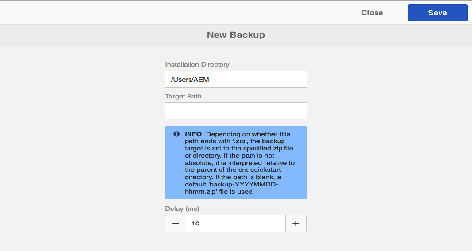

# 備份和還原{#backup-and-restore}

在AEM中，有兩種方式可以備份和還原儲存庫內容：

* 您可以建立儲存庫的外部備份並將其儲存在安全位置。 如果儲存庫被分解，您可以將其還原到上一個狀態。
* 您可以建立儲存庫內容的內部版本。 這些版本與內容一起儲存在儲存庫中，因此您可以快速恢復已更改或刪除的節點和樹。

## 一般 {#general}

此處介紹的方法適用於系統備份和恢復。

如果您需要備份和／或恢復丟失的少量內容，則不一定需要恢復系統：

* 您可以透過套件從其他系統擷取資料
* 或者，在臨時系統上恢復備份，建立內容包並將其部署到缺少此內容的系統上。

如需詳細資訊，請參 [閱下方的Package Backup](/help/sites-administering/backup-and-restore.md#package-backup) 。

## 計時 {#timing}

請勿與資料儲存廢棄項目收集並行運行備份，因為這可能會損害兩個進程的結果。

## 離線備份 {#offline-backup}

您隨時都可以執行離線備份。 這需要AEM停機，但與線上備份相比，在所需時間方面會相當有效。

在大多數情況下，您將使用檔案系統快照建立儲存的只讀副本。 要建立離線備份，請執行以下步驟：

* 停止應用程式
* 建立快照備份
* 啟動應用程式

由於快照備份通常只需幾秒鐘，因此整個停機時間不到幾分鐘。

## 線上備份 {#online-backup}

此備份方法會建立整個儲存庫的備份，包括部署在其下的任何應用程式，例如AEM。 備份包括內容、版本歷史記錄、配置、軟體、修補程式、自定義應用程式、日誌檔案、搜索索引等。 如果您使用群集，並且共用資料夾是的子目錄 `crx-quickstart` （物理上或使用軟連結），則共用目錄也將備份。

您可以在以後恢復整個儲存庫（和任何應用程式）。

此方法作為「熱」或「聯機」備份運行，因此可在儲存庫運行時執行。 因此，在備份運行時，儲存庫可用。 此方法適用於預設的基於Tar儲存的儲存庫實例。

建立備份時，您有以下選項：

* 使用AEM的整合備份工具備份至目錄。
* 使用檔案系統快照備份到目錄

無論如何，備份都會建立儲存庫的映像（或快照）。 然後，系統備份代理應該注意將此映像實際傳輸到專用備份系統（磁帶機）。

>[!NOTE]
>
>如果AEM線上備份功能用於具有自訂Blobstore設定的AEM例項，建議您將資料存放區路徑設定為位於「 `crx-quickstart`」目錄外，並個別備份資料存放區。

>[!CAUTION]
>
>聯機備份僅備份檔案系統。 如果將儲存庫內容和／或儲存庫檔案儲存在資料庫中，則該資料庫需要單獨備份。 如果您正將AEM與MongoDB搭配使用，請參閱說明如何使用 [MongoDB原生備份工具的檔案](https://docs.mongodb.org/manual/tutorial/backup-with-mongodump/)。

### AEM Online Backup {#aem-online-backup}

儲存庫的聯機備份允許您建立、下載和刪除備份檔案。 它是「熱」或「聯機」備份功能，因此可以在儲存庫正常使用讀寫模式時執行。

>[!CAUTION]
>
>請勿與Datastore Garbage Collection或Revision Cleanup同時執 [行AEM](/help/sites-administering/data-store-garbage-collection.md)[行線上備份](/help/sites-deploying/revision-cleanup.md#how-to-run-offline-revision-cleanup)。 它將對系統效能產生負面影響。

啟動備份時，可以指定 **目標路徑** 和／或 **延遲**。

**目標路徑** ：備份檔案通常保存在存放快速啟動jar檔案(.jar)的資料夾的父資料夾中。 例如，如果您的AEM jar檔案位於/InstallationKits/AEM下，則會在/InstallationKits下產生備份。 您也可以指定目標至您選擇的位置。

如果 **TargetPath是目錄** ，則會在此目錄中建立儲存庫映像。 如果同一目錄被多次（或始終）用於儲存備份，

* 在TargetPath中相應修改了儲存庫中修改的檔案
* 刪除的儲存庫中的檔案將在TargetPath中刪除
* 在儲存庫中建立的檔案是在TargetPath中建立的

>[!NOTE]
>
>如果 **TargetPath** 設定為副檔名為 **.zip**，則儲存庫將備份到臨時目錄，然後壓縮此臨時目錄的內容並將其儲存在ZIP檔案中。
>
>這種做法不受歡迎，因為
>
>* 在備份過程中需要額外的磁碟儲存（臨時目錄加上zip檔案）
>* 壓縮過程由儲存庫完成，並可能影響其效能。
>* 它延遲了備份過程。
>* 最高可配備Java 1.6 java的ZIP檔案僅能建立4 GB的大小。
>
>
如果您需要建立ZIP作為備份格式，則應備份到目錄，然後使用壓縮程式建立zip檔案。

**延遲** ：表示延遲時間（以毫秒為單位），因此不會影響儲存庫效能。 預設情況下，儲存庫備份以全速運行。 您可以放慢建立聯機備份的速度，這樣不會減慢其他任務的速度。

使用非常大的延遲時，請確保線上備份不需要超過24小時。 如果備份包含，請放棄此備份，因為它可能不包含所有二進位檔案。
延遲1毫秒通常導致10%的CPU使用量，而延遲10毫秒通常導致3%的CPU使用量。 總延遲（秒）的估計如下：儲存庫大小(MB)、延遲（毫秒）、延遲除以2（如果使用了zip選項）或4（備份到目錄時）。 這意味著，備份到200 MB儲存庫的目錄，延遲1毫秒，備份時間將增加約50秒。

>[!NOTE]
>
>如需 [此程式的內部詳細資訊，請參閱](#how-aem-online-backup-works) 「AEM Online Backup的運作方式」。

要建立備份：

1. 以管理員身分登入AEM。

1. 轉到「 **工具——操作——備份」。**
1. 按一下&#x200B;**「建立」**。備份控制台將開啟。

   

1. 在備份控制台上，指定「目 **[標路徑](#aem-online-backup)**」和**[「延遲」](#aem-online-backup)**。

   

   >[!NOTE]
   >
   >此外，備份控制台還可使用：
   >
   >
   >` https://<*hostname*>:<*port-number*>/libs/granite/backup/content/admin.html`

1. 按一下 **保存**，進度欄將指示備份的進度。

   >[!NOTE]
   >
   >您隨 **時可以取** 消正在運行的備份。

1. 備份完成後，zip檔案將列在備份窗口中。

   

   >[!NOTE]
   >
   >不再需要的備份檔案可以使用控制台刪除。 在左窗格中選擇備份檔案，然後按一下「刪 **除」**。

   >[!NOTE]
   >
   >如果已備份到目錄：備份程式完成後，AEM將不會寫入目標目錄。

### 自動化AEM線上備份 {#automating-aem-online-backup}

如果可能，應在系統上負載很少時運行聯機備份，例如在上午。

使用或HTTP客戶端可以自 `wget` 動執 `curl` 行備份。 以下顯示了如何使用捲曲自動備份的示例。

#### 備份到預設目標目錄 {#backing-up-to-the-default-target-directory}

>[!CAUTION]
>
>在以下示例中，命令中的各 `curl` 種參數可能需要為實例配置；例如，主機名( `localhost`)、埠( `4502`)、管理密碼( `xyz`)和檔案名( `backup.zip`)。

```shell
curl -u admin:admin -X POST http://localhost:4502/system/console/jmx/com.adobe.granite:type=Repository/op/startBackup/java.lang.String?target=backup.zip
```

備份檔案／目錄是在包含資料夾的資料夾的父資料夾中的伺服器上建立的( `crx-quickstart` 與使用瀏覽器建立備份時相同)。 例如，如果您已將AEM安裝在目錄中， `/InstallationKits/crx-quickstart/`則會在目錄中建立備 `/InstallationKits` 份。

curl命令會立即返回，因此您必須監視此目錄，以查看zip檔案準備就緒的時間。 在建立備份時，可以看到臨時目錄（其名稱基於最終zip檔案的名稱），最後將壓縮此名稱。 例如：

* 產生的zip檔案名稱： `backup.zip`
* 臨時目錄的名稱： `backup.f4d5.temp`

#### 備份到非預設目標目錄 {#backing-up-to-a-non-default-target-directory}

通常，備份檔案／目錄是在包含該資料夾的資料夾的父資料夾中在伺服器上創 `crx-quickstart` 建的。

如果要將備份（按任一排序）保存到不同位置，可以在命令中為參數設定 `target` 絕對路 `curl` 徑「」。

例如，要在目錄 `backupJune.zip` 中生成 `/Backups/2012`:

```shell
curl -u admin:admin -X POST http://localhost:4502/system/console/jmx/com.adobe.granite:type=Repository/op/startBackup/java.lang.String?target=/Backups/2012/backupJune.zip"
```

>[!CAUTION]
>
>使用其他應用程式伺服器（如JBoss）時，聯機備份可能無法如預期般工作，因為目標目錄不可寫。 在此情況下，請聯絡支援。

>[!NOTE]
>
>也可以使用AEM提 [供的MBean觸發備份](/help/sites-administering/jmx-console.md)。

### 檔案系統快照備份 {#filesystem-snapshot-backup}

此處介紹的過程特別適用於大型儲存庫。

>[!NOTE]
>
>如果要使用此備份方法，系統必須支援檔案系統快照。 例如，對於Linux ，這意味著您的檔案系統應放在邏輯卷上。

1. 在上部署檔案系統AEM的快照。

1. 裝載檔案系統快照。
1. 執行備份並卸載快照。

### AEM Online backup的運作方式 {#how-aem-online-backup-works}

AEM Online Backup由一系列內部動作組成，以確保所備份資料和所建立備份檔案的完整性。 以下列出感興趣的人。

線上備份使用下列演算法：

1. 建立zip檔案時，第一步是建立或查找目標目錄。

   * 如果備份到zip檔案，則會建立臨時目錄。 目錄名以開頭 `backup.` ，結尾為 `.temp`;例如 `backup.f4d3.temp`。
   * 如果備份到目錄，則使用目標路徑中指定的名稱。 可以使用現有目錄，否則將建立新目錄。

      啟動備份時， `backupInProgress.txt` 目標目錄中將建立一個名為的空檔案。 備份完成後，此檔案將被刪除。

1. 這些檔案將從源目錄複製到目標目錄（或建立zip檔案時的臨時目錄）。 在資料儲存之前複製段儲存區，以避免儲存庫損壞。 建立備份時，將忽略索引和快取資料。 因此，備份中不 `crx-quickstart/repository/cache` 包括 `crx-quickstart/repository/index` 來自和的資料。 建立zip檔案時，進程的進度條指示符介於0% - 70%之間，如果沒有建立zip檔案，則為0% - 100%。

1. 如果備份到預先存在的目錄，則目標目錄中的「舊」檔案將被刪除。 舊檔案是源目錄中不存在的檔案。

檔案將分四個階段複製到目標目錄：

1. 在第一個複製階段（建立zip檔案時，進度指示器為0% - 63% ，如果沒有建立zip檔案，則為0% - 90%），在儲存庫正常運行時，會複製所有檔案。 該過程分為兩個階段：

   * 階段A —— 除資料儲存（延遲）外，所有內容都被複製。
   * 階段B —— 僅複製資料儲存（延遲）。

1. 在第二個複製階段（建立zip檔案時的進度指示符為63% - 65.8%，如果未建立zip檔案，則為90% - 94%），僅複製自第一個複製階段開始以來在源目錄中建立或修改的檔案。 根據儲存庫的活動情況，這可能範圍從完全沒有檔案到大量檔案（因為第一個檔案複製階段通常需要很長時間）。 複製過程類似於第一階段（具有延遲的階段A和階段B）。
1. 在第三個複製階段（建立zip檔案時進度指示器為65.8% - 68.6%，如果沒有建立zip檔案時為94% - 98%），僅複製自第二個複製階段開始以來在源目錄中建立或修改的檔案。 根據儲存庫的活動，可能沒有要複製的檔案，或者只有很少的檔案（因為第二個檔案複製階段通常很快）。 複製過程類似於第二階段——階段A和階段B，但沒有延遲。
1. 檔案複製階段1到3在儲存庫運行時同時完成。 僅複製自啟動第三個複製階段以來在源目錄中建立或修改的檔案。 根據儲存庫的活動，可能沒有要複製的檔案，或者很少的檔案數（因為第二個檔案複製階段通常非常快）。 建立zip檔案時的進度指標為68.6% - 70%；如果沒有建立zip檔案，則為98% - 100%。 復製程式類似於第三階段。
1. 視目標而定：

   * 如果指定了zip檔案，則現在會從臨時目錄建立此檔案。 進度指標70%-100%。 然後將刪除臨時目錄。
   * 如果目標是目錄，則會刪除名為的空 `backupInProgress.txt` 檔案以指示備份已完成。

## 恢復備份 {#restoring-the-backup}

可以按如下方式恢復備份：

* 如果執行檔案系統快照備份，則只需恢復系統映像即可。
* 如果您將備份建立為zip檔案，只需將新檔案夾中的內容解壓縮，然後從該位置啟動AEM。

## 包備份 {#package-backup}

若要備份和還原內容，您可以使用其中一個「套件管理員」，該管理員使用「內容套件」格式來備份和還原內容。 「包管理器」在定義和管理包方面提供了更大的靈活性。

如需這些個別內容封裝格式的功能與權衡的詳細資訊，請參 [閱How to Work With Packages](/help/sites-administering/package-manager.md)。

### 備份範圍 {#scope-of-backup}

當您使用「封裝管理員」或「內容拉鍊」備份節點時，CRX會儲存下列資訊：

* 所選樹下的儲存庫內容。
* 用於備份內容的節點類型定義。
* 用於您備份內容的命名空間定義。

備份時，AEM會遺失下列資訊：

* 版本記錄。

