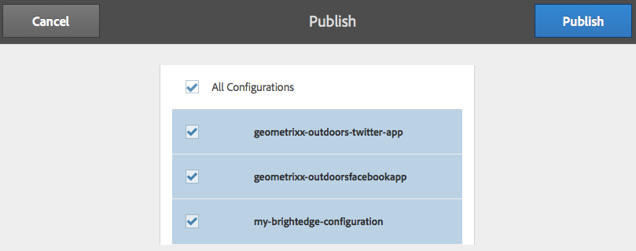

# 與BrightEdge Content Optimizer整合{#integrating-with-brightedge-content-optimizer}

建立BrightEdge雲端設定，讓AEM可以使用BrightEdge帳戶的認證進行連線。 如果您使用多個帳戶，則可以建立多個設定。

當您建立設定時，可以指定標題。 標題應具有描述性，好讓使用者可將設定與BrightEdge帳戶建立關聯。 當頁面作者或管理員將網頁與BrightEdge帳戶關聯時，此標題會顯示在下拉式清單中。

1. 在導軌上，按一下「工具>作業>雲端>雲端服務」。
1. 按一下「BrightEdge Content Optimizer」區段中出現的連結。 是否已建立BrightEdge組態，會決定連結文字：

   * 立即配置：當未建立配置時，將顯示此連結。
   * 顯示配置：建立一個或多個配置後，將顯示此連結。
   

1. 如果按一下「Show Configurations（顯示配置）」 ，請按一下「Available Configurations（可用配置）」旁邊的+連結。
1. 鍵入配置的標題。 （可選）鍵入用於將配置儲存在儲存庫中的節點的名稱。 按一下「建立」。
1. 在「BrightEdge Content Optimizer Configuration」（BrightEdge內容優化程式配置）對話框中，鍵入BrightEdge帳戶的用戶名和密碼，然後按一下「確定」。

## 編輯BrightEdge組態 {#editing-a-brightedge-configuration}

視需要修改BrightEdge組態的使用者名稱和密碼。 這些修改會影響使用此設定的所有頁面。

1. 在導軌上，按一下「工具>作業>雲端>雲端服務」。
1. 在BrightEdge Content Optimizer區段中，按一下「顯示設定」。

   

1. 按一下要編輯的配置的名稱。
1. 按一下「編輯」、修改屬性值，然後按一下「確定」。

## 將頁面與BrightEdge組態關聯 {#associating-pages-with-a-brightedge-configuration}

將頁面與BrightEdge組態關聯，以傳送頁面資料至BrightEdge服務進行分析。 將頁面與配置關聯時，子頁面繼承關聯。 通常，您會將網站的首頁建立關聯，讓所有頁面的資料都傳送至BrightEdge。

1. 開啟傳統網站主控台。 ([http://localhost:4502/siteadmin#/content](http://localhost:4502/siteadmin#/content))
1. 在「網站」樹狀結構中，選取包含您要與BrightEdge組態建立關聯之頁面的資料夾或頁面。
1. 在頁面清單中，以滑鼠右鍵按一下頁面以設定，然後按一下「屬性」。
1. 在「雲端服務」標籤上，按一下「新增服務」按鈕，然後在「雲端服務」對話方塊中選取「BrightEdge Content Optimizer」，然後按一下「確定」。
1. 在「BrightEdge內容最佳化程式」清單中，選取要與頁面建立關聯的BrightEdge組態，然後按一下「確定」。

   

## 啟動BrightEdge配置 {#activating-a-brightedge-configuration}

啟動BrightEdge組態，將它複製至發佈執行個體，並讓發佈頁面與BrightEdge服務互動。

1. 在邊欄上，按一下「網站」，然後瀏覽並選取您與BrightEdge組態關聯的頁面。
1. 按一下或點選「發佈」圖示，然後按一下或點選「發佈」。

   

1. 在出現的配置清單中，確保已選擇您的BrightEdge配置，然後按一下「發佈」。

   

