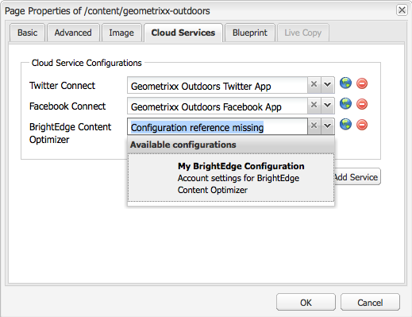
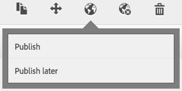

# 與BrightEdge Content Optimizer整合{#integrating-with-brightedge-content-optimizer}

建立BrightEdge雲配置，以便AEM使用BrightEdge帳戶的憑據進行連接。 如果使用多個帳戶，則可以建立多個配置。

建立配置時，指定標題。 標題應具有描述性，以便用戶可以將配置與BrightEdge帳戶關聯。 當頁面作者或管理員將網頁與BrightEdge帳戶關聯時，此標題將顯示在下拉清單中。

1. 在滑軌上，按一下「工具」>「操作」>「雲」>「Cloud Services」。
1. 按一下「BrightEdge內容優化程式」部分中顯示的連結。 是否已建立BrightEdge配置確定連結文本：

   * 立即配置：未建立配置時，將顯示此連結。
   * 顯示配置：建立一個或多個配置時，將顯示此連結。

   

1. 如果按一下了「顯示配置」，請按一下「可用配置」旁的+連結。
1. 鍵入配置的標題。 （可選）鍵入用於在儲存庫中儲存配置的節點的名稱。 按一下建立。
1. 在「BrightEdge內容優化程式配置」對話框中，鍵入BrightEdge帳戶的用戶名和密碼，然後按一下「確定」。

## 編輯BrightEdge配置 {#editing-a-brightedge-configuration}

根據需要修改BrightEdge配置的用戶名和密碼。 這些修改會影響使用配置的所有頁面。

1. 在滑軌上，按一下「工具」>「操作」>「雲」>「Cloud Services」。
1. 在「BrightEdge內容優化程式」部分，按一下「顯示配置」。

   

1. 按一下要編輯的配置的名稱。
1. 按一下編輯，修改屬性值，然後按一下確定。

## 將頁面與BrightEdge配置關聯 {#associating-pages-with-a-brightedge-configuration}

將頁面與BrightEdge配置關聯，以將頁面資料發送到BrightEdge服務進行分析。 將頁面與配置關聯時，子頁面將繼承關聯。 通常，您會關聯站點的首頁，以便所有頁面的資料都發送到BrightEdge。

1. 開啟經典網站控制台。 ([http://localhost:4502/siteadmin#/content](http://localhost:4502/siteadmin#/content))
1. 在「網站」樹中，選擇包含要與BrightEdge配置關聯的頁面的資料夾或頁面。
1. 在頁面清單中，按一下右鍵要配置的頁面，然後按一下「屬性」。
1. 在「Cloud Services」頁籤上，按一下「添加服務」按鈕，然後在「Cloud Services」對話框中選擇「BrightEdge內容優化程式」，然後按一下「確定」。
1. 在「BrightEdge內容優化程式」清單中，選擇要與頁面關聯的BrightEdge配置，然後按一下「確定」。

   

## 激活BrightEdge配置 {#activating-a-brightedge-configuration}

激活BrightEdge配置，以在發佈實例上複製該配置，並使發佈的頁面能夠與BrightEdge服務交互。

1. 在滑軌上，按一下「站點」，然後瀏覽並選擇與BrightEdge配置關聯的頁面。
1. 按一下或點擊「發佈」表徵圖，然後按一下或點擊「發佈」。

   

1. 在出現的配置清單中，確保已選擇BrightEdge配置，然後按一下「發佈」。

   
