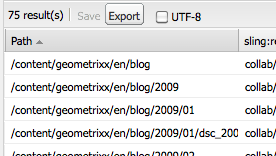

# 批量編輯器{#the-bulk-editor}

當不需要視覺化頁面內容時，「批量編輯器」可讓您進行非常有效率的編輯，因為它可讓您：

* 搜尋（並顯示）多個頁面的內容；這是使用GQL（Google查詢語言）完成的
* 直接在批量編輯器中編輯此內容
* 儲存變更（至原始頁面）
* 將此內容匯出至以Tab分隔(.tsv)的試算表檔案

>[!NOTE]
>
>您也可以將內容導入儲存庫，但預設情況下，批量編輯器將禁用此功能，如「工具」控制台 **中** 。

本節介紹如何使用工具控制台中的批量編 **輯器** 。 通常，管理員會使用大量編輯器來搜尋和編輯多個項目。 通過使用GQL查詢填充表，然後選擇要處理的內容項來完成此操作。 作者通常會將批量編輯器當做可透過產品清單元件存取的自訂批量編輯器應用 [程式的一部分](/help/sites-authoring/default-components.md#productlist) 。

>[!CAUTION]
>
>AEM 6.4 [中取代了Classic UI](/help/release-notes/deprecated-removed-features.md) ,Bulk Editor也已過時，因此Adobe不打算進一步增強Bulk Editor。

## 批量編輯器的示例使用案例 {#example-use-case-for-the-bulk-editor}

例如，如果您需要填寫特定調查之使用者的所有姓名和電子郵件地址，批量編輯器可提供該資訊，而您可將其匯出至試算表。

Geometrixx網站中包含了說明此使用案例的範例：

1. 導覽至「支 **援** 」頁面，然後導覽至「客 **戶服務滿意度調查** 」。
1. **編輯** 「表 **單開頭」段落** 。 **在對話方塊中，按一下「**&#x200B;進階&#x200B;**」標籤，展開「**&#x200B;動作設定&#x200B;**」，然後按一**&#x200B;下「檢視資料……」.

   

1. 批量編輯器是可完全自訂的。雖然在此範例中，批量編輯器不允許使用者編輯內容，但只允許使用者將資訊匯出至試算表。

   

## 如何使用批量編輯器 {#how-to-use-the-bulk-editor}

批量編輯器允許您：

* [根據查詢參數搜尋內容、在欄中顯示結果的指定屬性、編輯此內容並儲存變更](#searching-and-editing-content)
* [若要將此內容匯出至以標籤分隔的試算表](#exporting-content)

* [若要從以標籤分隔的試算表匯入內容](#importing-content)

### 搜尋和編輯內容 {#searching-and-editing-content}

若要使用批量編輯器同時編輯多個項目：

1. 在「工 **具** 」主控台中，按一下「 **Importers** 」檔案夾以展開它。
1. 連按兩下「大 **量編輯器** 」以開啟它。
1. 輸入您的選擇要求：

<table>
 <tbody>
  <tr>
   <td>欄位</td>
   <td>屬性</td>
  </tr>
  <tr>
   <td>根路徑</td>
   <td>指示批量編輯器搜索的根路徑。  例如， <code>/content/geometrixx/en</code>。 批量編輯器將搜索所有子節點。</td>
  </tr>
  <tr>
   <td>查詢參數</td>
   <td>使用GQL參數，輸入您希望批量編輯器在儲存庫中查找的搜索字串；例如， <code>type:Page</code> 尋找根路徑中的所有頁面， <code>text:professional</code> 尋找其中含有"professional"字詞的所有頁面， <code>"jcr:title":English</code> 並尋找所有以"English"為標題的頁面。 您只能搜尋字串。</td>
  </tr>
  <tr>
   <td>內容模式核取方塊</td>
   <td>選中此複選框可讀取搜索結果 <code>jcr:content</code> 子節點中的屬性（如果存在）。 僅用於頁面。 屬性名稱的前置詞為 <code>"jcr:content/"</code></td>
  </tr>
  <tr>
   <td>屬性/欄</td>
   <td>選擇要批量編輯器返回的屬性的複選框。 您選擇的屬性是結果窗格中的列標題。 預設情況下，節點路徑顯示在結果中。</td>
  </tr>
  <tr>
   <td>自訂屬性/欄</td>
   <td>輸入未列在「屬性／列」欄位中的任 <strong>何其他屬性</strong> 。 這些自訂屬性會出現在結果窗格中。 您可以使用逗號來分隔屬性，以新增多個屬性。 <i></i> 注意：如果您新增尚不存在的自訂屬性，AEM WCM會顯示空的儲存格。 修改空單元格並保存時，該屬性將添加到節點中。 新建立的屬性必須遵守節點類型約束和屬性名稱空間。</td>
  </tr>
 </tbody>
</table>

例如：

1. 按一 **下搜尋**。 批量編輯器顯示結果。
在上述範例中，所有符合您的搜尋准則的頁面都會傳回，並與請求的欄一起顯示。

   

1. 在儲存格中按兩下，以進行任何需要的變更。

   

1. 按一 **下「儲存** 」以儲存變更(編輯儲存格後 **** ,「儲存」按鈕就會啟動)。

   >[!CAUTION]
   >
   >您在此處所做的更改將寫入儲存庫內容；例如，路徑中參考的 **頁面**。

#### 其他GQL查詢參數 {#additional-gql-query-parameters}

* **** 路徑：僅搜索此路徑下的節點。 如果您使用路徑前置詞指定多個詞語，則只會考慮最後一個詞語。
* **** 類型：僅返回給定節點類型的節點。 這包括主要類型和混合類型。 您可以指定多個逗號分隔的節點類型。 GQL將返回屬於任何指定類型的節點。
* **** 訂單：按給定屬性排序結果。 您可以指定多個逗號分隔的屬性名稱。 若要依遞減順序排列結果，只需在屬性名稱前加上減號即可。 例如：order:-name。 使用加號會以升序傳回結果，這也是預設值。
* **** 限制：使用間隔限制結果數。 例如：限制：10..20請注意，間隔是以零為基礎，開始是包括的，結束是獨佔的。 您也可以指定開啟的間隔：limit:10.. 或限制：..20如果省略點，並且只指定一個值，則GQL最多將返回此數量的結果。 例如limit:10（將傳回前10個結果）

### 匯出內容 {#exporting-content}

您可能需要匯出內容並在Excel試算表中進行變更。 例如，您可能想要匯出郵寄清單，並直接在Excel中變更所有列出電話號碼的區號、新增其他線路等。

若要匯出內容：

1. 依搜尋和編輯內容中 [所述搜尋內容](#searching-and-editing-content)。
1. 按一 **下「匯出** 」，將變更匯出至以標籤分隔的Excel試算表。 AEM WCM會詢問您要將檔案下載至何處。

   >[!NOTE]
   >
   >依預設，變更會在 [Windows-1252](https://en.wikipedia.org/wiki/Windows-1252) （也稱為CP-1252）中編碼。 您可以勾選UTF-8以匯出UTF-8中的變更。

   

1. 選取位置並確認您要下載檔案。
1. 下載檔案後，您可以從試算表程式（例如Microsoft Excel）開啟它。 試算表程式會匯入檔案，並將它轉換為試算表格式。

   

### 匯入內容 {#importing-content}

預設情況下，在開啟批量編輯器時，導入功能將隱藏。 只要將參數新 `hib=false` 增至URL，就會在「批量編輯器」頁 **面上顯示** 「匯入」按鈕。 您可以從任何以Tab分隔的( `.tsv`)檔案匯入內容。 要使導入正常運行，列標題（第一行單元格）必須與要導入的表的列標題匹配。

>[!NOTE]
>
>當您重新匯入內容時，會清除這些節點的任何先前內容。 請小心不要覆寫重要資訊。

若要匯入內容：

1. 開啟大量編輯器。
1. 新增 `?hib=false` 至URL，例如：
   `https://localhost:4502/etc/importers/bulkeditor.html?hib=false`
1. 按一 **下匯入**。
1. 選擇文 `.tsv` 件。 資料將導入到儲存庫。