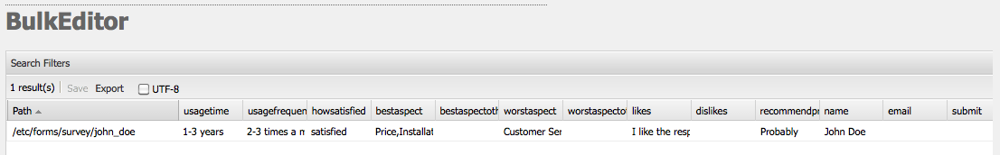

# 大量編輯器{#the-bulk-editor}

當不需要視覺化頁面內容時，大量編輯器可讓您進行非常有效的編輯，因為它可讓您：

* 從多個頁面搜尋（並顯示）內容；這是使用GQL(Google查詢語言)完成的
* 直接在批量編輯器中編輯此內容
* 儲存變更（至原始頁面）
* 將此內容匯出至以Tab分隔的(.tsv)試算表檔案

>[!NOTE]
>
>您也可以將內容匯入存放庫，但依預設，大量編輯器會停用此功能，如 **工具** 控制台。

本節說明如何使用 **工具** 控制台。 通常，管理員會使用大量編輯器來搜尋及編輯多個項目。 若要這麼做，請使用GQL查詢填入表格，然後選取要處理的內容項目。 作者通常會使用大量編輯器，作為可透過 [產品清單](/help/sites-authoring/default-components.md#productlist) 元件。

>[!CAUTION]
>
>使用 [淘汰傳統UI](/help/release-notes/deprecated-removed-features.md) 在AEM 6.4中，大量編輯器也已遭取代，因此Adobe不打算進一步增強大量編輯器。

## 大量編輯器的範例使用案例 {#example-use-case-for-the-bulk-editor}

例如，如果您需要填寫特定調查之使用者的所有名稱和電子郵件地址，批量編輯器可提供該資訊，並可將其匯出至試算表。

Geometrixx網站上包含了說明此使用案例的範例：

1. 導覽至 **支援** 頁面，然後傳至 **客戶服務滿意度** 調查。
1. **編輯** the **表單開始** 段落。 在對話方塊中，按一下 **進階** 頁簽，展開 **動作設定**，然後按一下 **查看資料……**.

   

1. 批量編輯器可完全自定義。雖然在此示例中，批量編輯器不允許用戶編輯內容，但只允許用戶將資訊導出到電子錶格。

   

## 如何使用大量編輯器 {#how-to-use-the-bulk-editor}

批量編輯器允許您：

* [根據查詢參數搜索內容、在列中顯示結果的指定屬性、編輯此內容並保存更改](#searching-and-editing-content)
* [若要將此內容匯出至以索引標籤分隔的試算表](#exporting-content)

* [從以索引標籤分隔的試算表匯入內容](#importing-content)

### 搜尋和編輯內容 {#searching-and-editing-content}

若要使用批量編輯器同時編輯多個項目：

1. 在 **工具** 主控台，按一下 **匯入工具** 資料夾以展開。
1. 按兩下 **大量編輯器** 來開啟它。
1. 輸入您的選擇要求：

<table>
 <tbody>
  <tr>
   <td>欄位</td>
   <td>屬性</td>
  </tr>
  <tr>
   <td>根路徑</td>
   <td>指示批量編輯器搜索的根路徑。  例如, <code>/content/geometrixx/en</code>. 批量編輯器會搜索所有子節點。</td>
  </tr>
  <tr>
   <td>查詢參數</td>
   <td>使用GQL參數，輸入要批量編輯器在儲存庫中查找的搜索字串；例如， <code>type:Page</code> 尋找根路徑中的所有頁面， <code>text:professional</code> 尋找所有含有「專業」字樣的頁面， <code>"jcr:title":English</code> 尋找標題為「英文」的所有頁面。 您只能搜尋字串。</td>
  </tr>
  <tr>
   <td>「內容模式」核取方塊</td>
   <td>選取此核取方塊以讀取 <code>jcr:content</code> 搜索結果的子節點（如果存在）。 僅用於頁面。 屬性名稱的前置詞為 <code>"jcr:content/"</code></td>
  </tr>
  <tr>
   <td>屬性/欄</td>
   <td>選取您要大量編輯器傳回之屬性的核取方塊。 所選屬性是結果窗格中的列標題。 依預設，節點路徑會顯示在結果中。</td>
  </tr>
  <tr>
   <td>自訂屬性/欄</td>
   <td>輸入未列於 <strong>屬性/欄</strong> 欄位。 這些自定義屬性會顯示在結果窗格中。 您可以使用逗號來分隔屬性，以新增多個屬性。 <i>注意：</i> 如果您新增尚不存在的自訂屬性，AEM WCM會顯示空白儲存格。 修改空白儲存格並儲存時，屬性會新增至節點。 新建立的屬性必須遵守節點類型約束和屬性命名空間。</td>
  </tr>
 </tbody>
</table>

例如：

1. 按一下 **搜尋**. 批量編輯器顯示結果。
在上述範例中，符合您搜尋准則的所有頁面都會傳回，並與請求的欄一起顯示。

   

1. 在儲存格中按兩下，以進行您需要的任何變更。

   

1. 按一下 **儲存** 儲存變更( **儲存** 按鈕（編輯儲存格後）。

   >[!CAUTION]
   >
   >您在此處所做的變更會寫入存放庫內容；例如， **路徑**.

#### 其他GQL查詢參數 {#additional-gql-query-parameters}

* **路徑：** 僅搜索此路徑下的節點。 如果您指定多個具有路徑前置詞的詞語，則只會考慮最後一個詞語。
* **類型：** 僅返回給定節點類型的節點。 這包括主要類型和混合類型。 您可以指定多個以逗號分隔的節點類型。 GQL將返回任何指定類型的節點。
* **訂購：** 按給定屬性排序結果。 您可以指定多個以逗號分隔的屬性名稱。 若要以降序排序結果，只需在屬性名稱前加上減號即可。 例如：order:-name。 使用加號會以升序傳回結果，這也是預設值。
* **限制：** 使用間隔來限制結果數。 例如：limit:10.20請注意，間隔為零，開始為包含，結束為獨佔。 您也可以指定開啟的間隔:limit:10.. 或限制：..20如果省略點，並且只指定一個值，則最多將返回此數量的結果。 例如，限制：10（將傳回前10個結果）

### 匯出內容 {#exporting-content}

您可能需要以Excel試算表匯出內容並進行變更。 例如，您可以直接在Excel中匯出郵件清單，並變更所有列出電話號碼的區號、新增其他行等。

要導出內容：

1. 搜尋內容，如 [搜尋和編輯內容](#searching-and-editing-content).
1. 按一下 **匯出** 將變更匯出至以索引標籤分隔的Excel試算表。 AEM WCM會詢問您要將檔案下載至何處。

   >[!NOTE]
   >
   >依預設，變更會編碼於 [Windows-1252](https://en.wikipedia.org/wiki/Windows-1252) （也稱為CP-1252）。 您可以檢查UTF-8以匯出UTF-8中的變更。

   

1. 選取位置並確認您要下載檔案。
1. 下載檔案後，您就可以從試算表程式開啟該檔案，例如Microsoft Excel。 試算表程式會匯入檔案，並轉換為試算表格式。

   

### 匯入內容 {#importing-content}

依預設，開啟批量編輯器時，匯入功能會隱藏。 只需新增參數 `hib=false` 到URL會顯示 **匯入** 按鈕。 您可以從任何以Tab分隔的( `.tsv`)檔案。 為了匯入正常運作，欄標題（儲存格的第一列）必須符合您要匯入之表格的欄標題。

>[!NOTE]
>
>重新匯入內容時，您會清除這些節點的任何先前內容。 小心不要覆寫重要資訊。

若要匯入內容：

1. 開啟大量編輯器。
1. 新增 `?hib=false` 至URL，例如：
   `https://localhost:4502/etc/importers/bulkeditor.html?hib=false`
1. 按一下 **匯入**.
1. 選取 `.tsv` 檔案。 資料會匯入存放庫。
