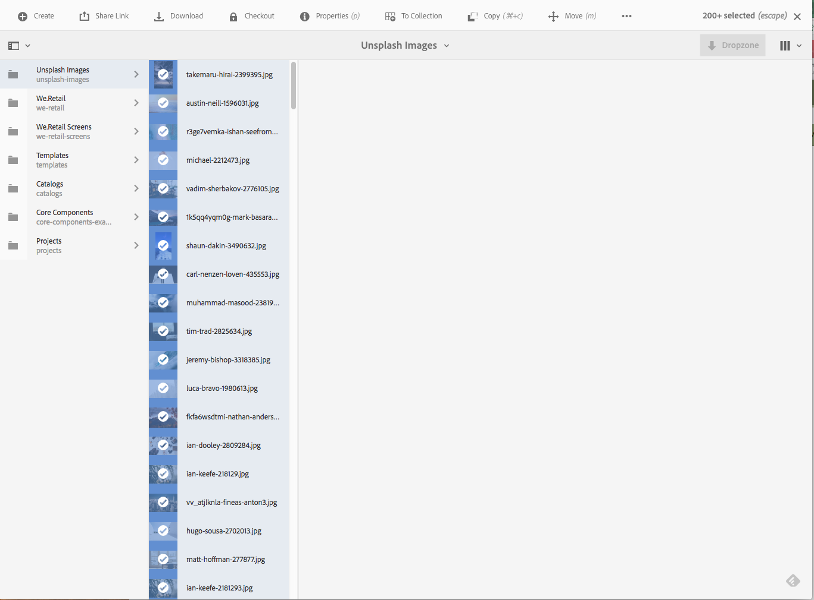
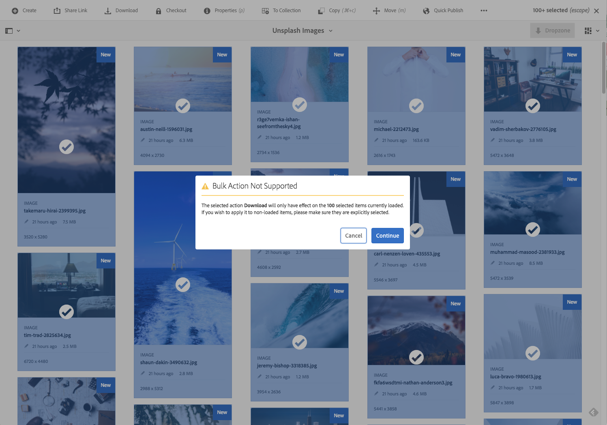

# 批量處理操作 {#bulk-processing-operations}

## 簡介 {#introduction}

使用最新版的AEM,「選取全部」按鈕已擴充至所有檢視：清單、欄和卡片檢視。 現在，「全選」按鈕會選取指定資料夾或系列中的所有內容，而不只是用戶端瀏覽器中載入和顯示的資產和頁面。

已為批量操作啟用關鍵操作：移 **動**、 **刪除****和複製**。 新的對話方塊可讓客戶知道批量處理無法執行的動作。

## How To Use {#how-to-use}

名為「全選 **** 」的新按鈕已新增至「卡片」、「清單」或「欄」檢視。 此按鈕可用於任何視圖中，以選擇資料集中的所有元素。

在舊版AEM中，選取範圍會限制在用戶端瀏覽器中載入的內容。 已引入此新變更，以避免對執行大量作業的元素數目產生混淆。

目前，批量處理已新增了3個作業：

* 移動
* 複製
* 刪除

未來將增加對更多操作的支援。
若要使用此功能，您必須導覽至您要在「頁面」或「資產」上執行大量作業的檔案夾或系列。

然後，選擇其中一個視圖，如下所示：

### 卡片檢視 {#card-view}

### 卡片檢視中的大量選取 {#bulk-selection-in-card-view}

使用右上角的「全選」按鈕，可大量 **選取資產** 或頁面：

 

### 清單檢視 {#list-view}

「清單檢視」也是如此：

### 清單檢視中的大量選取 {#bulk-selection-in-list-view}

在「清單檢視」中，使用「全 **選** 」按鈕，或使用左側的核取方塊進行大量選取。

 

### 欄檢視 {#column-view}

### 欄檢視中的大量選取 {#bulk-selection-in-column-view}

## 大量啟用的操作 {#bulk-enabled-operations}

在選擇後，可以執行以下三個批量啟用操作之一：移 **動**、復 **制** 或 **刪除**。

在這裡， **會對上述** 「資產」執行移動操作。 在任何檢視中，這會導致所有資產移至所選位置，而不只是螢幕上載入的資產。

對於未大量啟用的其他操作(如 **Download)** ，將顯示警告，僅聲明只有載入瀏覽器的元素才會包含在操作中。

