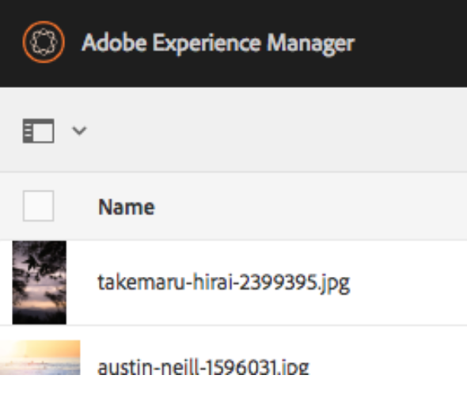

# 大量處理操作 {#bulk-processing-operations}

## 簡介 {#introduction}

使用最新版的AEM，「全選」按鈕已擴充至所有檢視：清單、欄和卡片檢視。 現在，「全部選取」按鈕會選取指定資料夾或集合中的所有內容，而不只是選取在用戶端瀏覽器中載入和顯示的資產和頁面。

已為批量操作啟用關鍵操作： **移動**, **刪除** 和 **複製**. 新的對話方塊可讓客戶知道大量處理無法使用的動作。

## 使用方法 {#how-to-use}

名為的新按鈕 **全選** 已新增至「卡片」、「清單」或「欄」檢視。 此按鈕可用於任何檢視，以選取資料集中的所有元素。

在舊版AEM中，選取的內容受限於用戶端瀏覽器中載入的內容。 已導入這項新變更，以避免對執行大量作業的元素數量產生混淆。

目前，批量處理已新增三個作業：

* 移動
* 複製
* 刪除

未來將增加對更多操作的支援。
若要使用此功能，您必須導覽至您要在「頁面」或「資產」上執行大量作業的資料夾或集合。

然後，選擇其中一個視圖，如下所示：

### 卡片檢視 {#card-view}

### 卡片檢視中的大量選取 {#bulk-selection-in-card-view}

您可以使用 **全選** 按鈕（右上）:

 

### 清單檢視 {#list-view}

「清單檢視」也同樣適用：

### 清單檢視中的大量選取項目 {#bulk-selection-in-list-view}

在清單檢視中，使用 **全選** 按鈕，或使用左側的複選框進行批量選擇。

 

### 欄檢視 {#column-view}

### 列視圖中的批量選擇 {#bulk-selection-in-column-view}

## 大量啟用的操作 {#bulk-enabled-operations}

選取後，可執行下列三個大量啟用動作之一： **移動**, **複製** 或 **刪除**.

這裡， **移動** 操作。 在任何檢視中，這會導致所有資產移至所選的位置，而不只是螢幕上載入的位置。

對於未大量啟用的其他操作，例如 **下載，** 系統會顯示警告，僅指出操作中只會包含在瀏覽器中載入的元素。

