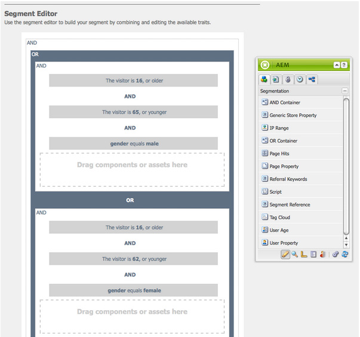

# 設定區段 {#configuring-segmentation}

>[!NOTE]
>
>本檔案涵蓋「用戶端內容」中使用的區段設定。 若要使用觸控UI設定區段與ContextHub，請參 [閱使用ContextHub設定區段](/help/sites-administering/segmentation.md)。

區段是建立促銷活動時的主要考量。 請參 [閱區段辭彙](/help/sites-authoring/segmentation-overview.md) ，以取得區段運作方式和關鍵詞語的相關資訊。

根據您已收集的網站訪客相關資訊以及您要達到的目標，您需要定義目標內容所需的區段和策略。

然後，這些區段會用來為訪客提供特定的目標內容。 此內容會保留在網 [站的](/help/sites-classic-ui-authoring/classic-personalization-campaigns.md) 「促銷活動」區段中。 此處定義的摘要頁面可以納入為任何頁面上的摘要段落，並定義專業內容適用的訪客區段。

AEM可讓您輕鬆建立和更新區段、預告和促銷活動。 它還允許您驗證定義的結果。

區段 **編輯器** ，可讓您輕鬆定義區段：

您可以 **編輯** ，以指定「標題 ****」、「說 **明** 」和「 **** Boost Refactor」。 使用側面，您可以新增 **AND** 和 **OR** 容器來定義區段邏輯 **，然後新增所需的區段特徵****** 來定義選擇標準。

## 提升系數 {#boost-factor}

每個區段都有 **Boost** 參數，用作加權系數；數字越大，表示區段將優先選取數字越低的區段。

* Minimum value: `0`
* Maximum value: `1000000`

## 區段邏輯 {#segment-logic}

下列邏輯容器是現成可用的，可讓您建構區段選擇的邏輯。 它們可從側腳拖曳至編輯器：

<table>
 <tbody>
  <tr>
   <td> AND 容器  </td>
   <td> 布林AND運算子。  </td>
  </tr>
  <tr>
   <td> OR 容器  </td>
   <td> 布林OR運算子。</td>
  </tr>
 </tbody>
</table>

## 區段特徵 {#segment-traits}

以下是現成可用的區段特徵；它們可從側腳拖曳至編輯器：

<table>
 <tbody>
  <tr>
   <td> IP 範圍  </td>
   <td>定義訪客可擁有的IP位址範圍。  </td>
  </tr>
  <tr>
   <td> 頁面點擊  </td>
   <td>請求頁面的頻率。   </td>
  </tr>
  <tr>
   <td> 頁面屬性  </td>
   <td>已瀏覽頁面的任何屬性。  </td>
  </tr>
  <tr>
   <td> 引用關鍵字  </td>
   <td>與反向連結網站資訊相符的關鍵字。   </td>
  </tr>
  <tr>
   <td> 指令碼</td>
   <td>要評估的Javascript運算式。  </td>
  </tr>
  <tr>
   <td> 區段引用   </td>
   <td>參考其他區段定義。  </td>
  </tr>
  <tr>
   <td> 標記雲  </td>
   <td>要與瀏覽之頁面中的標籤相符的標籤。  </td>
  </tr>
  <tr>
   <td> 使用者年齡  </td>
   <td>取自使用者設定檔。  </td>
  </tr>
  <tr>
   <td> 使用者屬性  </td>
   <td>使用者設定檔中提供的任何其他資訊。 </td>
  </tr>
 </tbody>
</table>

您可以使用布林運算子OR和AND(請參 [閱建立新區段](#creating-a-new-segment))來結合這些特性，以定義選取此區段的確切藍本。

當整個語句評估為true時，此段已解決。 若有多個區段適用，則也會使 **[用Boost](/help/sites-administering/campaign-segmentation.md#boost-factor)**factor。

>[!CAUTION]
>
>段編輯器不檢查任何循環參照。 例如，區段A會參照另一個區段B，反過來參照區段A。您必須確保區段不包含任何循環參照。

>[!NOTE]
>
>具有 **_i18n** 尾碼的屬性由個人化UI clientlib的一部分的指令碼設定。 所有UI相關的用戶端僅會載入作者，因為發佈時不需要UI。
>
>因此，在建立具有這些屬性的區段時，通常需要依賴 **browserFamily** ，而非 **browserFamily_i18n**。

### 建立新區段 {#creating-a-new-segment}

要定義新段，請執行以下操作：

1. 在邊欄中，選擇「工 **具>操作>配置」**。
1. 按一下左 **窗格中** 「區段」頁面，並導覽至所需位置。
1. 使用「 [區段](/help/sites-authoring/editing-content.md#creatinganewpage) 」範本建 **立新頁面** 。
1. 開啟新頁面以檢視區段編輯器：

   

1. **使用側腳或內容功能表(通常是滑鼠右鍵按一下，然後選取「**&#x200B;新增……」以開啟「插入新元件」視窗)以尋找所需的區段特徵。 然後拖曳至「 **區段編輯器** 」，它會顯示在預設 **的AND** 容器中。
1. 連按兩下新特徵以編輯特定參數；例如，滑鼠位置：

   

1. 按一 **下「確定** 」以儲存定義：
1. 您可以 **編輯** ，為段定義提供「 **標題****、說** 明 **[」和「](#boost-factor)**Boost Factor:

   

1. 視需要新增更多特徵。 您可以使用「區段邏輯」下 **的AND Container****和OR Container** 元件，來建立布林 **運算式**。 使用區段編輯器，您可以刪除不再需要的特徵或容器，或將它們拖曳至陳述式中的新位置。

### 使用AND和OR容器 {#using-and-and-or-containers}

您可以在AEM中建構複雜的區段。 瞭解以下幾個基本要點有幫助：

* 定義的頂層永遠是最初建立的AND容器；這無法變更，但對您的其餘區段定義沒有影響。
* 確保容器巢狀結構合理。 容器可以視為布林運算式的括弧。

以下範例用於選擇其中一個訪客：

男，16歲到65歲

或

16至62歲的女性

由於主運算子是OR，您必須從 **OR容器開始**。 在這裡，您有2個AND陳述式，每個陳述式都需要 **AND Container**，您可以將個別特徵加入其中。

## 測試區段的應用程式 {#testing-the-application-of-a-segment}

在定義區段後，您就可透過用戶端內容來測試潛 **[在結果](/help/sites-administering/client-context.md)**:

1. 選取要測試的區段。
1. 按 **[Ctrl-Alt-C](/help/sites-authoring/page-authoring.md#keyboardshortcuts)**，開啟「用戶端內容****」，其中顯示已收集的資料。 為了進行測試，您可 **以編輯** 某些值，或載 **入其他描述檔** ，以查看其影響。

1. 根據定義的特性，目前頁面的可用資料可能與區段定義不符。 相符的狀態會顯示在定義下方。

例如，簡單的區段定義可以根據使用者的年齡和性別。 載入特定描述檔會顯示區段已成功解決：

或者不：

>[!NOTE]
>
>所有特徵都會立即解決，不過大部分只會在頁面重新載入時變更。 對滑鼠位置的變更會立即顯示，因此在測試時非常實用。

此類測試也可以在內容頁面上，並搭配 **Teaser元件** 。

摘要段落上的滑鼠移過會顯示套用的區段，不論這些區段目前是否解析，以及選取目前摘要例項的原因：

### 使用您的區段 {#using-your-segment}

促銷活動中目前使用 [區段](/help/sites-classic-ui-authoring/classic-personalization-campaigns.md)。 它們可用來調整特定目標對象所看到的實際內容。 如需詳 [細資訊](/help/sites-authoring/segmentation-overview.md) ，請參閱瞭解區段。
