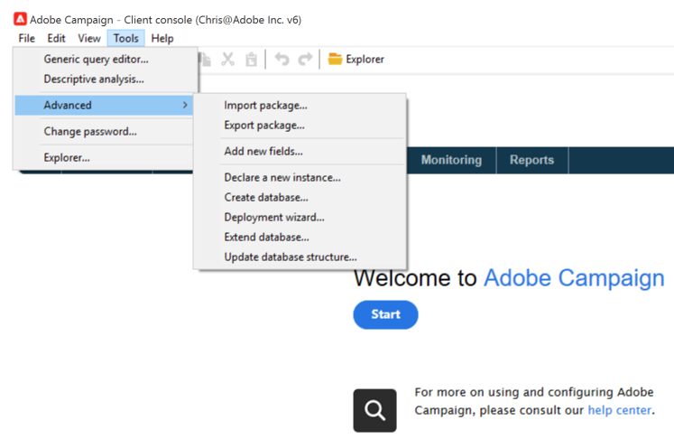

# 將AEM 6.5與Adobe Campaign Classic整合 {#integrating-campaign-classic}

將AEM與Adobe Campaign Classic (ACC)整合後，您可以直接在AEM中管理電子郵件傳送、內容和表單。 需要同時執行Adobe Campaign Classic和AEM的設定步驟，才能在解決方案之間啟用雙向通訊。

此整合可讓AEM和Adobe Campaign Classic獨立使用。 行銷人員可以在Adobe Campaign中建立行銷活動並使用目標定位，而內容建立人員則可以同時在AEM中設計內容。 透過整合，Adobe Campaign可針對在AEM中建立的行銷活動內容和設計進行目標定位和傳遞。

>[!INFO]
>
>本檔案詳細說明如何將Adobe Campaign Classic與AEM 6.5整合。如需其他Campaign整合，請參閱檔案 [整合AEM 6.5與Adobe Campaign。](campaign.md)

## 整合步驟 {#integration-steps}

AEM與Campaign的整合需要在這兩個解決方案中執行數個步驟。

1. [在Campaign中安裝AEM整合套件。](#install-package)
1. [在Campaign中為AEM建立運運算元](#create-operator)
1. [在AEM中設定Campaign整合](#campaign-integration)
1. [設定AEM Externalizer](#externalizer)
1. [在AEM中設定行銷活動 — 遠端使用者](#configure-user)
1. [在Campaign中設定AEM外部帳戶](#acc-setup)

本檔案將詳細介紹每一個步驟。

## 先決條件 {#prerequisites}

* Adobe Campaign Classic的管理員存取權
   * 若要執行整合，您需要運作中的Adobe Campaign Classic執行個體，包括已設定的資料庫。
   * 如果您需要更多有關如何設定Adobe Campaign Classic的詳細資訊，請參閱 [Adobe Campaign Classic檔案，](https://experienceleague.adobe.com/docs/campaign-classic/using/campaign-classic-home.html) 尤其是安裝及設定指南。
* AEM的管理員存取權

## 在Campaign中安裝AEM整合套件 {#install-package}

此 **AEM整合** Adobe Campaign中的套件包含連線至AEM所需的數個標準設定。

1. 以管理員身分，使用使用者端主控台登入Adobe Campaign執行個體。

1. 選取 **工具** > **進階** > **匯入封裝……**.

   

1. 按一下 **安裝標準套件** 然後按一下 **下一個**.

1. 檢查 **AEM整合** 封裝。

   

1. 按一下 **下一個**，然後 **開始** 以開始安裝。

   

1. 按一下 **關閉** 安裝完成時。

整合套件現已安裝。

## 在Campaign中建立AEM的運運算元 {#create-operator}

整合套件會自動建立 `aemserver` AEM用來連線至Adobe Campaign的運運算元。 您必須為此運運算元定義安全區域並設定其密碼。

1. 使用使用者端主控台，以管理員身分登入Adobe Campaign。

1. 選取 **工具** -> **瀏覽器** 功能表列中的。

1. 在總管中，導覽至 **管理** > **存取管理** > **運運算元** 節點。

1. 選取 `aemserver` 運運算元。

1. 在 **編輯** 標籤中，選取 **存取許可權** 子標籤，然後按一下 **編輯存取引數……** 連結。

   

1. 選取適當的安全區域，並視需要定義信任的IP遮罩。

1. 按一下「**儲存**」。

1. 登出Adobe Campaign使用者端。

1. 在Adobe Campaign伺服器的檔案系統上，導覽至Campaign安裝位置並編輯 `serverConf.xml` 以管理員身分建立檔案。 此檔案通常位於下列位置：
   * `C:\Program Files\Adobe\Adobe Campaign Classic v7\conf` 在Windows中。
   * `/usr/local/neolane/nl6/conf/eng` 在Linux中。

1. 搜尋 `securityZone` 並確保已為AEM運運算元的安全區域設定下列引數。

   * `allowHTTP="true"`
   * `sessionTokenOnly="true"`
   * `allowUserPassword="true"`。

1. 儲存檔案。

1. 請確定安全區域不會被 `config-<server name>.xml` 檔案。

   * 如果組態檔包含個別的安全區域設定，則變更 `allowUserPassword` 歸因至 `true`.

1. 如果您想要變更Adobe Campaign Classic伺服器連線埠，請取代 `8080` 與所需的連線埠。

   >[!CAUTION]
   >
   >依預設，運運算元沒有設定安全性區域。 若要讓AEM連線至Adobe Campaign，您必須選取區域，如先前步驟所述。
   >
   >Adobe強烈建議建立AEM專屬的安全區域，以避免任何安全性問題。 如需有關本主題的詳細資訊，請參閱 [Adobe Campaign Classic檔案。](https://experienceleague.adobe.com/docs/campaign-classic/using/installing-campaign-classic/additional-configurations/security-zones.html)

1. 在Campaign使用者端中，返回 `aemserver` 運運算元並選取 **一般** 標籤。

1. 按一下 **重設密碼……** 連結。

1. 指定密碼並將其儲存在安全位置以供將來使用。

1. 按一下 **確定** 儲存的密碼 `aemserver` 運運算元。

## 在AEM中設定Campaign整合 {#campaign-integration}

AEM使用 [您已在Campaign中設定的運運算元](#create-operator) 與Campaign通訊

1. 以管理員身分登入您的AEM編寫執行個體。

1. 從全域導覽側邊欄中，選取 **工具** > **Cloud Service** > **舊版Cloud Service** > **Adobe Campaign**，然後按一下 **立即設定**.

   

1. 在對話方塊中，輸入 **標題** 並按一下 **建立**.

   

1. 新視窗和對話方塊會開啟以編輯配置。 提供必要資訊。

   * **使用者名稱**  — 這是 [在上一步建立的Adobe Campaign AEM整合套件運運算元。](#create-operator) 預設為 `aemserver`.
   * **密碼**  — 這是的密碼 [在上一步建立的Adobe Campaign AEM整合套件運運算元。](#create-operator)
   * **API端點**  — 這是Adobe Campaign執行個體URL。

   

1. 選取 **連線至Adobe Campaign** 以驗證連線，然後按一下 **確定**.

AEM現在可以與Adobe Campaign通訊。

>[!NOTE]
>
>請確定您的Adobe Campaign伺服器可透過網際網路連線。 AEM無法存取私人網路。

## 設定復寫至AEM發佈執行個體 {#replication}

Campaign內容是由內容作者在AEM編寫執行個體上建立。 此例項通常僅供貴組織內部使用。 為了讓行銷活動的收件者可存取影像和資產等內容，您需要發佈該內容。

復寫代理程式負責將您的內容從AEM製作執行個體發佈至發佈執行個體，且必須設定為讓整合正常運作。 此步驟也是將某些編寫執行個體設定復寫至發佈執行個體所必需的。

若要設定從您的AEM編寫執行個體到發佈執行個體的復寫：

1. 以管理員身分登入您的AEM編寫執行個體。

1. 從全域導覽側邊欄中，選取 **工具** > **部署** > **復寫** > **作者上的代理程式**，然後點選或按一下 **預設代理程式（發佈）**.

   

1. 點選或按一下 **編輯** 然後選取 **傳輸** 標籤。

1. 設定 **URI** 欄位，取代預設值 `localhost` 具有AEM發佈執行個體IP位址的值。

   

1. 點選或按一下 **確定** 儲存代理程式設定的變更。

您已設定復寫至AEM發佈執行個體，以便行銷活動收件者可以存取您的內容。

>[!NOTE]
>
>如果您不想使用復寫URL，而是使用公開顯示的URL，您可以透過OSGi在下列組態設定中設定公開URL
>
>從全域導覽側邊欄中，選取 **工具** > **作業** > **網頁主控台** > **OSGi設定** 並搜尋 **AEM Campaign整合 — 設定**. 編輯設定並變更欄位 **公開URL** (`com.day.cq.mcm.campaign.impl.IntegrationConfigImpl#aem.mcm.campaign.publicUrl`)。

## 設定AEM Externalizer {#externalizer}

[外部化程式](/help/sites-developing/externalizer.md) 是AEM中的OSGi服務，可將資源路徑轉換為外部和絕對URL，這是AEM提供Campaign可使用的內容所必需的。 您必須加以設定，Campaign整合才能運作。

1. 以管理員身分登入AEM編寫執行個體。
1. 從全域導覽側邊欄中，選取 **工具** > **作業** > **網頁主控台** > **OSGi設定** 並搜尋 **Day CQ連結外部器**.
1. 根據預設，此欄位的最後一個專案 **網域** 欄位適用於發佈執行個體。 變更URL的預設值 `http://localhost:4503` 至您公開可用的發佈執行個體。

   

1. 點選或按一下&#x200B;**儲存**。

您已設定Externalizer，且Adobe Campaign現在可以存取您的內容。

>[!NOTE]
>
發佈執行個體必須可以從Adobe Campaign伺服器存取。 如果它指向 `localhost:4503` 或Adobe Campaign無法連線的其他伺服器，來自AEM的影像將不會顯示在Adobe Campaign主控台中。

## 在AEM中設定行銷活動遠端使用者 {#configure-user}

為了讓Campaign能夠與AEM通訊，您必須為 `campaign-remote` AEM位使用者。

1. 以管理員身分登入AEM。
1. 在主要導覽主控台上，按一下 **工具** 在左側邊欄中。
1. 然後按一下 **安全性** -> **使用者** 以開啟使用者管理主控台。
1. 找到 `campaign-remote` 使用者。
1. 選取 `campaign-remote` 使用者和點按 **屬性** 以編輯使用者。
1. 在 **編輯使用者設定** 視窗，按一下 **變更密碼**.
1. 為使用者提供新密碼，並將密碼記在安全位置以備將來使用。
1. 按一下 **儲存** 以儲存密碼變更。
1. 按一下 **儲存並關閉** 將變更儲存至 `campaign-remote` 使用者。

## 在Campaign中設定AEM外部帳戶 {#acc-setup}

時間 [安裝 **AEM整合** Campaign中的套件，](#install-package) 會為AEM建立外部帳戶。 透過設定此外部帳戶，Adobe Campaign可以連線至AEM，啟用解決方案之間的雙向通訊。

1. 使用使用者端主控台，以管理員身分登入Adobe Campaign。

1. 選取 **工具** -> **瀏覽器** 功能表列中的。

1. 在總管中，導覽至 **管理** > **Platform** > **外部帳戶** 節點。

   

1. 找到外部AEM帳戶。 預設為包含下列值：

   * **型別** - `AEM`
   * **標籤** - `AEM Instance`
   * **內部名稱** - `aemInstance`

1. 在 **一般** 標籤中，輸入您在 [設定行銷活動遠端使用者密碼](#set-campaign-remote-password) 步驟。

   * **伺服器** - AEM作者伺服器位址
      * AEM作者伺服器必須可從Adobe Campaign Classic伺服器例項存取。
      * 確定伺服器位址可以 **非** 以尾隨斜線結尾。
   * **帳戶**  — 根據預設，這是 `campaign-remote` 您在AEM中設定的使用者 [設定行銷活動遠端使用者密碼](#set-campaign-remote-password) 步驟。
   * **密碼**  — 此密碼與 `campaign-remote` 您在AEM中設定的使用者 [設定行銷活動遠端使用者密碼](#set-campaign-remote-password) 步驟。

1. 選取 **已啟用** 核取方塊。

1. 按一下「**儲存**」。

Adobe Campaign現在可以與AEM通訊。

## 後續步驟 {#next-steps}

在設定Adobe Campaign Classic和AEM後，整合現已完成。

您現在可以繼續使用，瞭解如何在Adobe Experience Manager中建立電子報 [本檔案。](/help/sites-authoring/campaign.md)
