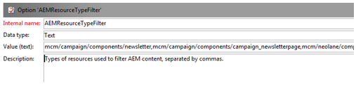
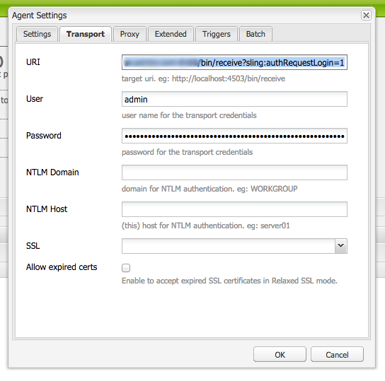

# 與Adobe Campaign Classic整合{#integrating-with-adobe-campaign-classic}

>[!NOTE]
>
>本檔案說明如何將AEM與內部部署解決方案Adobe Campaign Classic整合。 如果您使用Adobe Campaign Standard，請參閱[與Adobe Campaign Standard](/help/sites-administering/campaignstandard.md)整合，以取得這些指示。

Adobe Campaign可讓您直接在Adobe Experience Manager中管理電子郵件傳送內容和表單。

要同時使用這兩種解決方案，您必須先將它們配置為彼此連接。 這包括Adobe Campaign和Adobe Experience Manager中的設定步驟。 本檔案將詳細說明這些步驟。

在AEM中使用Adobe Campaign包括透過Adobe Campaign傳送電子郵件的功能，請參閱[使用Adobe Campaign](/help/sites-authoring/campaign.md)。 此外，還包含使用AEM頁面上的表單來控制資料。

此外，在將AEM與[Adobe Campaign](https://helpx.adobe.com/support/campaign/classic.html)整合時，可能會關注下列主題：

* [電子郵件範本的最佳做法](/help/sites-administering/best-practices-for-email-templates.md)
* [疑難排解您的Adobe Campaign整合](/help/sites-administering/troubleshooting-campaignintegration.md)

如果您要延伸與Adobe Campaign的整合，您可能想要查看下列頁面：

* [建立自訂擴充功能](/help/sites-developing/extending-campaign-extensions.md)
* [建立自訂表單映射](/help/sites-developing/extending-campaign-form-mapping.md)

## AEM和Adobe Campaign整合工作流程{#aem-and-adobe-campaign-integration-workflow}

本節說明建立促銷活動和傳送內容時，AEM和Adobe Campaign之間的典型工作流程。

典型的工作流涉及以下內容，並有詳細說明：

1. 開始建立您的促銷活動（在Adobe Campaign和AEM中）。
1. 在您連結內容和傳送之前，先在AEM中個人化您的內容，然後在Adobe Campaign中建立傳送。
1. 在Adobe Campaign中連結內容和傳送。

### 開始建立促銷活動{#start-building-your-campaign}

您隨時都可以開始建立促銷活動。 在您連結內容之前，AEM和AC是獨立的。這表示行銷人員可以在Adobe Campaign中開始建立其促銷活動和定位，而內容建立者則在AEM中進行設計。

### 在連結內容和傳送{#before-linking-content-and-delivery}之前

在連結內容並建立傳送機制之前，您必須先執行下列動作：

**在AEM中**

* 使用&#x200B;**Text &amp; Personalization**&#x200B;元件中的個人化欄位進行個人化

**在Adobe Campaign中**

* 建立類型&#x200B;**aemContent**&#x200B;的傳送

### 連結內容並設定傳送{#linking-content-and-setting-delivery}

在準備好連結和傳送的內容後，您就可精確決定連結內容的方式和位置。

所有這些步驟都在Adobe Campaign中完成。

1. 指定要使用的AEM例項。
1. 按一下「同步」按鈕，即可同步內容。
1. 開啟內容選擇器以挑選您的內容。

### 如果您是AEM {#if-you-are-new-to-aem}的新手

如果您是AEM的新手，您可能會發現下列連結有助於瞭解AEM:

* [啟動AEM](/help/sites-deploying/deploy.md)
* [瞭解複製代理](/help/sites-deploying/replication.md)
* [查找和使用日誌檔案](/help/sites-deploying/monitoring-and-maintaining.md#working-with-audit-records-and-log-files)
* [AEM平台簡介](/help/sites-deploying/platform.md)

## 設定Adobe Campaign {#configuring-adobe-campaign}

設定Adobe Campaign涉及下列事項：

1. 在Adobe Campaign中安裝AEM整合套件。
1. 設定外部帳戶。
1. 驗證AEMResourceTypeFilter是否已正確配置。

此外，您還可以進行進階設定，包括：

* 管理內容區塊
* 管理個人化欄位

請參閱[高級配置](#advanced-configurations)。

>[!NOTE]
>
>若要執行這些作業，您必須在Adobe Campaign中擁有&#x200B;**administration**&#x200B;角色。

### 必備條件 {#prerequisites}

請務必事先具備下列元素：

* [AEM製作實例](/help/sites-deploying/deploy.md#getting-started)
* [AEM發佈例項](/help/sites-deploying/deploy.md#author-and-publish-installs)
* [Adobe Campaign Classic實例](https://helpx.adobe.com/support/campaign/classic.html) -包括客戶端和伺服器
* Internet Explorer 11

>[!NOTE]
>
>如果您執行的版本早於Adobe Campaign Classic組建版本8640，請參閱[升級檔案](https://docs.campaign.adobe.com/doc/AC6.1/en/PRO_Updating_Adobe_Campaign_Upgrading.html)以取得詳細資訊。 請注意，客戶端和資料庫都必須升級到同一個版本。

>[!CAUTION]
>
>AEM與Adobe Campaign之間的整合功能若要正常運作，必須執行[「設定Adobe Campaign](#configuring-adobe-campaign)和[「設定Adobe Experience Manager](#configuring-adobe-experience-manager)」章節中詳述的操作。

### 安裝AEM Integration Package {#installing-the-aem-integration-package}

您必須在Adobe Campaign中安裝&#x200B;**AEM Integration**&#x200B;套件。 要執行此操作：

1. 前往您要與AEM連結的Adobe Campaign例項。
1. 選擇&#x200B;*工具* > *高級* > *導入包……*。

   

1. 按一下「安裝標準套件」，然後選取「**AEM Integration**&#x200B;套件」。****

   

1. 按一下&#x200B;**Next**，然後按一下&#x200B;**Start**。

   此套件包含&#x200B;**aemserver**&#x200B;運算子，將用來將AEM伺服器連線至Adobe Campaign。

   >[!CAUTION]
   >
   >預設情況下，未為此操作員配置安全區。 若要透過AEM連線至Adobe Campaign，您必須選取一個。
   >
   >在&#x200B;**serverConf.xml**&#x200B;檔案中，選取安全區域的&#x200B;**allowUserPassword**&#x200B;屬性必須設為&#x200B;**true**，以授權AEM透過登入／密碼連線Adobe Campaign。
   >
   >我們強烈建議建立專用於AEM的安全區，以避免任何安全性問題。 有關詳細資訊，請參閱[《安裝指南》](https://docs.campaign.adobe.com/doc/AC/en/INS_Additional_configurations_Configuring_Campaign_server.html)。

   

### 設定AEM外部帳戶{#configuring-an-aem-external-account}

您必須設定外部帳戶，以便將Adobe Campaign連線至您的AEM例項。

>[!NOTE]
>
>* 安裝&#x200B;**AEM Integration**&#x200B;套件時，會建立外部AEM帳戶。 您可以從AEM例項設定連線，或建立新的AEM例項。
>* 在AEM中，請確定您已設定促銷活動遠端使用者的密碼。 您必須設定此密碼，才能將Adobe Campaign與AEM連線。 以管理員身分登入，並在使用者管理主控台中搜尋campaign-remote使用者，然後按一下「設定密碼」**。**

>


若要設定外部AEM帳戶：

1. 轉至「**管理** > **平台** > **外部帳戶**」節點。
1. 建立新的外部帳戶，並選取&#x200B;**AEM**&#x200B;類型。
1. 輸入AEM製作例項的存取參數：伺服器位址，以及用來連線至此例項的ID和密碼。 促銷活動-api使用者帳戶密碼與您在AEM中設定密碼的促銷活動——遠端使用者相同。

   >[!NOTE]
   >
   >請確定伺服器位址的結尾為結尾斜線。 ****&#x200B;例如，輸入`https://yourserver:4502`而非`https://yourserver:4502/`

    

1. 請確定已選中&#x200B;**Enabled**&#x200B;複選框。

### 驗證AEMResourceTypeFilter選項{#verifying-the-aemresourcetypefilter-option}

**AEMResourceTypeFilter**&#x200B;選項可用來篩選可用於Adobe Campaign的AEM資源類型。 這可讓Adobe Campaign擷取專門設計為僅用於Adobe Campaign的AEM內容。

此選項應預先設定；不過，如果您變更此選項，可能會導致無法運作的整合。

要驗證&#x200B;**AEMResourceTypeFilter**&#x200B;選項是否已配置：

1. 前往&#x200B;**Platform** >**Options**。
1. 在&#x200B;**AEMResourceTypeFilter**&#x200B;選項中，檢查路徑是否正確。 此欄位必須包含值：

   **mcm/campaign/components/newsletter,mcm/campaign/components/campaign_newsletterpage,mcm/neolane/components/newsletter**

   或者在某些情況下，其值如下：

   **mcm/campaign/components/newsletter**

   

## 設定Adobe Experience Manager {#configuring-adobe-experience-manager}

若要設定AEM，您必須執行下列動作：

* 配置實例之間的複製。
* 透過雲端服務將AEM連線至Adobe Campaign。
* 設定外部化器。

### 在AEM實例{#configuring-replication-between-aem-instances}之間配置複製

從AEM製作例項建立的內容會先傳送至發佈例項。 您必須進行發佈，以便電子報中的影像可在發佈執行個體和電子報收件者使用。 因此，必須將複製代理設定為從AEM製作例項複製至AEM發佈例項。

>[!NOTE]
>
>如果您不想使用複製URL，但改用公開對應的URL，則可以在OSGi（**AEM logo** > **工具**&#x200B;圖示> **Operations**>>中的下列組態設定中設定&#x200B;**公開URL****Web Console** > **OSGi Configuration** > **AEM促銷活動整合- Configuration**）:
**公用URL:** com.day.cq.mcm.campaign.impl.IntegrationConfigImpl#aem.mcm.campaign.publicUrl

此步驟也是將特定編寫執行個體組態複製至發佈執行個體的必要步驟。

若要在AEM例項之間設定複製：

1. 在編寫實例中，選擇「**AEM logo**>**工具**&#x200B;表徵圖> **部署** > **複製** > **作者**&#x200B;上的代理」，然後按一下「預設代理」**...**

   

   >[!NOTE]
   在設定與Adobe Campaign的整合時，請避免使用localhost（這是AEM的本機副本），除非發佈和作者實例都位於同一部電腦上。

1. 點選或按一下「編輯&#x200B;****」，然後選取「傳輸&#x200B;**a3/>」標籤。**
1. 以IP位址或AEM發佈例項的位址取代&#x200B;**localhost**，以設定URI。

   

### 將AEM連線至Adobe Campaign {#connecting-aem-to-adobe-campaign}

您必須先建立兩個解決方案之間的連結，才能搭配使用AEM和Adobe Campaign。

1. 連線至您的AEM製作實例。
1. 選擇「**AEM logo** > **工具**&#x200B;圖示> **部署** > **雲端服務**」，然後在「Adobe Campaign」區段中選擇「立即設定&#x200B;**」。**

   

1. 輸入&#x200B;**Title**&#x200B;並按一下&#x200B;**Create**，或選擇您要連結至Adobe Campaign例項的現有設定，以建立新的設定。
1. 編輯設定，使其符合您Adobe Campaign例項的參數。

   * **使用者名稱**: **aemserver**,Adobe Campaign AEM整合套件運算子，用來建立兩個解決方案之間的連結。
   * **密碼**:Adobe Campaign aemserver運算子密碼。您可能必須直接在Adobe Campaign中重新指定此運算子的密碼。
   * **API端點**:Adobe Campaign例項URL。

1. 選擇「連線至Adobe Campaign **」，然後按一下「確定」。******

   

   >[!NOTE]
   在[建立電子郵件並發佈後，您必須將設定重新發佈至您的發佈例項。](/help/sites-authoring/campaign.md)

   

>[!NOTE]
如果連線失敗，請務必勾選下列項目：
* 使用Adobe Campaign例項(https)的安全連線時，可能會遇到憑證問題。 您必須將Adobe Campaign例項憑證新增至AEM例項JDK的&#x200B;**cacerts**&#x200B;檔案。
* 必須為Adobe Campaign中的[aemserver運算子](#connecting-aem-to-adobe-campaign)設定安全區。 此外，在&#x200B;**serverConf.xml**&#x200B;檔案中，安全區域的&#x200B;**allowUserPassword**&#x200B;屬性必須設為&#x200B;**true**，以授權使用登入／密碼模式將AEM連線至Adobe Campaign。

此外，請參閱[疑難排解您的AEM/Adobe Campaign整合](/help/sites-administering/troubleshooting-campaignintegration.md)。

### 配置外置式{#configuring-the-externalizer}

您必須在您的作者例項的AEM中，[設定externalizer](/help/sites-developing/externalizer.md)。 Externalizer是OSGi服務，可讓您將資源路徑轉換為外部和絕對URL。 此服務提供一個集中位置，以設定這些外部URL並建立這些URL。

有關一般說明，請參閱[配置externalizer](/help/sites-developing/externalizer.md)。 若是Adobe Campaign整合，請務必在`https://<host>:<port>/system/console/configMgr/com.day.cq.commons.impl.ExternalizerImpl`設定發佈伺服器，但不要指向`localhost:4503`，而是指向Adobe Campaign主控台可存取的伺服器。

如果指向`localhost:4503`或Adobe Campaign無法觸及的其他伺服器，您的影像將不會顯示在Adobe Campaign主控台上。


## 高級配置{#advanced-configurations}

您也可以執行一些高級配置，即：

* 管理個人化欄位和區塊。
* 停用個人化區塊。
* 管理目標擴充功能資料。

### 管理個人化欄位和區塊{#managing-personalization-fields-and-blocks}

在AEM中將個人化新增至電子郵件內容的可用欄位和區塊，由Adobe Campaign管理。

提供了預設清單，但可以修改。 您也可以新增或隱藏個人化欄位和區塊。

#### 新增個人化欄位{#adding-a-personalization-field}

若要將新的個人化欄位新增至現有的個人化欄位，您必須依下列方式擴充Adobe Campaign **nms:seedMember**&#x200B;架構：

>[!CAUTION]
您需要添加的欄位必須已通過收件人模式擴展(**nms:recipient**)添加。 如需詳細資訊，請參閱[Configuration](https://docs.campaign.adobe.com/doc/AC6.1/en/CFG_Editing_schemas_Editing_schemas.html)指南。

1. 前往Adobe Campaign導覽中的&#x200B;**管理** > **設定** > **資料結構**&#x200B;節點。
1. 選擇&#x200B;**新建**。

   

1. 在彈出窗口中，選擇&#x200B;**使用擴展模式**&#x200B;擴展表中的資料，然後按一下&#x200B;**Next**。

   

1. 輸入擴展方案的不同參數：

   * **架構**:選擇 **nms:** seedMemberschema。視窗中的其他欄位會自動完成。
   * **命名空間**:個人化延伸架構的命名空間。

1. 編輯架構的XML代碼，以指定要在其中添加的欄位。 有關在Adobe Campaign中擴充結構的詳細資訊，請參閱[設定指南](https://docs.campaign.adobe.com/doc/AC6.1/en/CFG_Editing_schemas_Extending_a_schema.html)。
1. 儲存您的架構，然後透過主控台中的&#x200B;**工具** > **進階** > **更新資料庫結構**&#x200B;功能表來更新Adobe Campaign資料庫結構。
1. 中斷連線，然後重新連線至Adobe Campaign主控台以儲存您所做的變更。 新欄位現在會出現在AEM中可用的個人化欄位清單中。

#### 範例 {#example}

要添加&#x200B;**註冊編號**&#x200B;欄位，您必須具有以下元素：

* **nms:recipient**&#x200B;架構副檔名&#x200B;**cus:recipient**&#x200B;包含：

```xml
<element desc="Recipient table (profiles)" img="nms:recipient.png" label="Recipients" labelSingular="Recipient" name="recipient">

  <attribute dataPolicy="smartCase" desc="Recipient registration number"
  label="Registration Number"
  length="50" name="registrationNumber" type="string"/>

</element>
```

**nms:seedMember**&#x200B;架構副檔名&#x200B;**cus:seedMember**&#x200B;包含：

```xml
<element desc="Seed to insert in the export files" img="nms:unknownad.png" label="Seed addresses" labelSingular="Seed" name="seedMember">

  <element name="custom_nms_recipient">
    <attribute name="registrationNumber"
    template="cus:recipient:recipient/@registrationNumber"/>
  </element>

</element>
```

**註冊編號**&#x200B;欄位現在是可用個人化欄位的一部分：


#### 隱藏個人化欄位{#hiding-a-personalization-field}

若要隱藏已可用的個人化欄位，您必須延伸Adobe Campaign **nms:seedMember**&#x200B;架構，如[新增個人化欄位](#adding-a-personalization-field)一節所述。 套用下列步驟：

1. 複製擴展模式（例如&#x200B;**cus:seedMember**）中&#x200B;**nms:seedMember**&#x200B;架構中要採用的欄位。
1. 將&#x200B;**advanced=&quot;true&quot;** XML屬性新增至欄位。 它不再出現在AEM中可用的個人化欄位清單中。

   例如，要隱藏&#x200B;**Middle Name**&#x200B;欄位，**cud:seedMember**&#x200B;模式必須包含以下元素：

   ```xml
   <element desc="Seed to insert in the export files" img="nms:unknownad.png" label="Seed addresses" labelSingular="Seed" name="seedMember">
   
     <element name="custom_nms_recipient">
       <attribute advanced="true" name="middleName"/>
     </element>
   
   </element>
   ```

### 停用個人化區塊{#deactivating-a-personalization-block}

要在可用區塊中停用個人化塊，請執行以下操作：

1. 前往Adobe Campaign導覽中的&#x200B;**資源** > **促銷活動管理** > **個人化區塊**&#x200B;節點。
1. 選取您要在AEM中停用的個人化區塊。
1. 清除自訂功能表&#x200B;**中的**&#x200B;可見核取方塊，並儲存您所做的變更。 Adobe Campaign中可用的個人化區塊清單中不會再顯示區塊。

   

### 管理目標擴展資料{#managing-target-extension-data}

您也可以插入目標擴充功能資料以個人化。 例如，Target擴充功能資料（又稱為「Target Data」）來自於在促銷活動工作流程中豐富或新增查詢中的資料。 有關詳細資訊，請參閱[建立查詢](https://docs.campaign.adobe.com/doc/AC/en/PTF_Creating_queries_About_queries_in_Campaign.html)和[豐富資料](https://docs.campaign.adobe.com/doc/AC/en/WKF_Use_cases_Enriching_data.html)部分。

>[!NOTE]
只有當AEM內容與Adobe Campaign傳送同步時，目標中的資料才可用。 請參閱「同步化在AEM中建立的內容與來自Adobe Campaign的傳送」。[](/help/sites-authoring/campaign.md#synchronizing-content-created-in-aem-with-a-delivery-from-adobe-campaign-classic)


