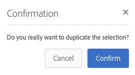

# 將AEM 6.5與Adobe Campaign Standard整合 {#integrating-with-adobe-campaign-standard}

將AEM 6.5與Adobe Campaign Standard (ACS)整合後，您可以直接在AEM中管理電子郵件傳送、內容和表單。 需要同時執行Adobe Campaign Standard和AEM中的設定步驟，才能在解決方案之間啟用雙向通訊。

此整合可讓AEM和Adobe Campaign Standard獨立使用。 行銷人員可以在Adobe Campaign中建立行銷活動並使用目標定位，而內容建立者則可以同時在AEM中設計內容。 透過整合，Adobe Campaign可鎖定在AEM中建立之行銷活動的內容和設計，並加以傳遞。

>[!INFO]
>
>本檔案詳細說明如何將Adobe Campaign Standard與AEM 6.5整合。如需其他Campaign整合，請參閱檔案 [整合AEM 6.5與Adobe Campaign。](campaign.md)

## 整合步驟 {#integration-steps}

設定AEM與Adobe Campaign Standard之間的整合需要在這兩個解決方案中執行許多步驟。

1. [設定 ](#aemserver-user)
1. [驗證 ](#resource-type-filter)
1. [在Campaign中建立AEM專屬電子郵件傳遞範本](#aem-email-delivery-template)
1. [在AEM中設定Campaign整合](#campaign-integration)
1. [設定復寫至AEM發佈執行個體的設定](#replication)
1. [設定AEM Externalizer](#externalizer)
1. [設定 ](#campaign-remote-user)
1. [在Campaign中設定AEM外部帳戶](#acc-external-user)

本檔案將詳細引導您完成每個步驟。

## 必備條件 {#prerequisites}

* Adobe Campaign Standard的管理員存取權
   * 如果您需要有關如何設定和配置Adobe Campaign Standard的更多詳細資訊，請參閱 [Adobe Campaign Standard檔案。](https://experienceleague.adobe.com/docs/campaign-standard/using/campaign-standard-home.html)
* AEM的管理員存取權

## 在Campaign中設定aemserver使用者 {#aemserver-user}

Adobe Campaign Standard預設會隨附 `aemserver` AEM用來連線至Adobe Campaign的使用者。 您必須為此使用者指派適當的安全群組，並設定其密碼。

1. 以管理員身分登入Adobe Campaign。

1. 點選或按一下功能表列左上方的Adobe Campaign標誌，以開啟全域導覽，然後選取 **管理** > **使用者與安全性** > **使用者** 導覽功能表中的。

1. 點選或按一下 `aemserver` 使用者控制檯中的使用者。

1. 確保 `aemserver` 至少會將使用者指派給具有角色的安全性群組 `deliveryPrepare` 指派給它。 依預設，群組 `Standard Users` 具有此角色。

   

1. 點選或按一下 **儲存** 以儲存變更。

您的 `aemserver` 使用者現在擁有必要的許可權，AEM才能使用它與Adobe Campaign通訊。

不過，在AEM可以使用之前 `aemserver` 使用者，必須設定其密碼。 這無法透過Adobe Campaign完成。 必須由Adobe支援工程師執行。 [請向Adobe客戶服務提出票證](https://experienceleague.adobe.com/?support-tab=home#support) 請求重設 `aemserver` 密碼。 取得Adobe客戶服務的密碼後，請將其儲存在安全位置。

## 驗證Campaign中的AEMResourceTypeFilter {#resource-type-filter}

此 `AEMResourceTypeFilter` 是Adobe Campaign中的選項，用來篩選可以在Adobe Campaign中使用的AEM資源。 由於AEM包含許多內容，此選項可作為篩選器，允許Adobe Campaign僅擷取專為Adobe Campaign使用而設計的型別的AEM內容。

此選項已預先設定。 不過，如果您已自訂AEM的Campaign元件，則可能需要更新。 若要驗證 `AEMResourceTypeFilter` 選項時，請按照以下步驟操作。

1. 以管理員身分登入Adobe Campaign。

1. 點選或按一下功能表列左上方的Adobe Campaign標誌，以開啟全域導覽，然後選取 **管理** > **應用程式設定** > **選項** 導覽功能表中的。

1. 點選或按一下 `AEMResourceTypeFilter` （在選項主控台中）。

1. 確認 `AEMResourceTypeFilter`. 路徑會以逗號分隔，預設包含：

   * `mcm/campaign/components/newsletter`
   * `mcm/campaign/components/campaign_newsletterpage`
   * `mcm/neolane/components/newsletter`

   

1. 點選或按一下 **儲存** 以儲存變更。

您的 `AEMResourceTypeFilter` 現已設定為從AEM擷取正確內容。

## 在Campaign中建立AEM專屬電子郵件傳遞範本 {#aem-email-delivery-template}

根據預設，AEM不會在Adobe Campaign的電子郵件範本中啟用。 您必須設定新的電子郵件傳遞範本，以使用AEM內容建立電子郵件。 若要建立AEM專屬的電子郵件傳遞範本，請按照下列步驟操作。

1. 以管理員身分登入Adobe Campaign。

1. 點選或按一下功能表列左上方的Adobe Campaign標誌，以開啟全域導覽，然後選取 **資源** > **範本** > **傳遞範本** 導覽功能表中的。

1. 在傳遞範本控制檯中，找到預設的電子郵件範本 **透過電子郵件（郵件）傳送** 並將滑鼠停留在代表該資訊卡的卡片（或線條）上，以顯示選項。 按一下 **重複元素**.

   

1. 在 **確認** 對話方塊，按一下 **確認** 以複製範本。

   

1. 範本編輯器隨即開啟，並顯示您的 **透過電子郵件（郵件）傳送** 範本。 按一下 **編輯屬性** 圖示加以檢視。

   

1. 在屬性視窗中，變更 **標籤** 描述新AEM範本的欄位。

1. 按一下 **內容** 標題以展開並選取 **Adobe Experience Manager** 在 **內容來源** 下拉式清單。

1. 如此可顯示 **Adobe Experience Manager帳戶** 欄位。 使用下拉式清單來選取 **Adobe Experience Manager執行個體(aemInstance)** 使用者。 這是AEM整合的預設外部使用者。

1. 按一下 **確認** 以儲存屬性的變更。

1. 在範本編輯器中，按一下 **儲存** 儲存您修改過的電子郵件範本復本，以與AEM搭配使用。

您現在已擁有可使用AEM內容的電子郵件範本。

## 在AEM中設定Campaign整合 {#campaign-integration}

AEM使用內建整合與Adobe Campaign通訊，並且 `aemserver` 您在Adobe Campaign中設定的使用者。 請依照下列步驟設定此整合。

1. 以管理員身分登入您的AEM編寫執行個體。

1. 從全域導覽側邊欄中，選取 **工具** > **Cloud Services** > **舊版Cloud Services** > **Adobe Campaign**，然後按一下 **立即設定**.

   

1. 在對話方塊中，輸入「 」，建立Campaign服務設定 **標題** 並按一下 **建立**.

   

1. 新視窗和對話方塊會開啟以編輯設定。 提供必要資訊。

   * **使用者名稱**  — 這是 [此 `aemserver` 您在上一步中設定的Adobe Campaign使用者。](#aemserver-user) 預設為 `aemserver`.
   * **密碼**  — 這是的密碼 [此 `aemserver` 您在上一步中向Adobe客戶服務請求的使用Adobe Campaign。](#aemserver-user)
   * **API端點**  — 這是Adobe Campaign執行個體URL。

   

1. 選取 **連線至Adobe Campaign** 驗證連線，然後按一下 **確定**.

AEM現在可以與Adobe Campaign通訊。

>[!NOTE]
>
>請確定您的Adobe Campaign伺服器可透過網際網路連線。 AEM無法存取私人網路。

## 設定復寫至AEM發佈執行個體的設定 {#replication}

Campaign內容是由內容作者在AEM編寫執行個體上建立。 此例項通常僅供貴組織內部使用。 為了讓行銷活動的收件者能夠存取影像和資產等內容，您需要發佈該內容。

復寫代理程式負責將您的內容從AEM製作執行個體發佈到發佈執行個體，且必須設定復寫代理程式，整合才能正常運作。 此步驟也是將某些編寫執行個體設定復寫到發佈執行個體所必需的。

若要設定從AEM編寫執行個體到發佈執行個體的復寫：

1. 以管理員身分登入您的AEM編寫執行個體。

1. 從全域導覽側邊欄中，選取 **工具** > **部署** > **復寫** > **作者上的代理**，然後點選或按一下 **預設代理程式（發佈）**.

   

1. 點選或按一下 **編輯** 然後選取 **傳輸** 標籤。

1. 設定 **URI** 欄位，取代預設值 `localhost` 值為AEM發佈執行個體的IP位址。

   

1. 點選或按一下 **確定** 以儲存代理程式設定的變更。

您已設定復寫至AEM發佈執行個體，讓您的行銷活動收件者可以存取您的內容。

>[!NOTE]
>
>如果您不想使用復寫URL，而是使用公開顯示的URL，您可以透過OSGi在下列組態設定中設定公開URL
>
>從全域導覽側邊欄中，選取 **工具** > **作業** > **網頁主控台** > **OSGi設定** 並搜尋 **AEM Campaign整合 — 設定**. 編輯設定並變更欄位 **公開URL** (`com.day.cq.mcm.campaign.impl.IntegrationConfigImpl#aem.mcm.campaign.publicUrl`)。

## 設定AEM Externalizer {#externalizer}

[外部化程式](/help/sites-developing/externalizer.md) 是AEM中的OSGi服務，可將資源路徑轉換為外部和絕對URL，這是AEM提供Campaign可使用的內容所必需的。 您必須加以設定，Campaign整合才能運作。

1. 以管理員身分登入AEM編寫執行個體。
1. 從全域導覽側邊欄中，選取 **工具** > **作業** > **網頁主控台** > **OSGi設定** 並搜尋 **Day CQ連結外部化器**.
1. 根據預設，最後一個專案位於 **網域** 欄位適用於發佈執行個體。 變更URL的預設值 `http://localhost:4503` 至公開可用的發佈執行個體。

   

1. 點選或按一下&#x200B;**儲存**。

您已設定Externalizer，Adobe Campaign現在可以存取您的內容。

>[!NOTE]
>
發佈執行個體必須可以從Adobe Campaign伺服器連線。 如果它指向 `localhost:4503` 或Adobe Campaign無法存取的其他伺服器，來自AEM的影像將不會顯示在Adobe Campaign主控台中。

## 在AEM中設定行銷活動 — 遠端使用者 {#campaign-remote-user}

就像您需要可供AEM用來與Adobe Campaign通訊的Adobe Campaign使用者一樣，Adobe Campaign也需要AEM中的使用者才能與AEM通訊。 根據預設，Campaign整合會建立 `campaign-remote` AEM中的使用者。 請依照下列步驟設定此使用者。

1. 以管理員身分登入AEM。
1. 在主要導覽主控台上，按一下 **工具** 在左側邊欄中。
1. 然後按一下 **安全性** > **使用者** 以開啟使用者管理主控台。
1. 找到 `campaign-remote` 使用者。
1. 選取 `campaign-remote` 使用者和點按 **屬性** 以編輯使用者。
1. 在 **編輯使用者設定** 視窗，按一下 **變更密碼**.
1. 為使用者提供新密碼，並將密碼記在安全位置以供日後使用。
1. 按一下 **儲存** 以儲存密碼變更。
1. 按一下 **儲存並關閉** 將變更儲存至 `campaign-remote` 使用者。

## 在Campaign中設定AEM外部帳戶 {#acc-external-user}

當您 [已建立AEM專屬的電子郵件傳遞範本，](#aem-email-delivery-template) 您指定範本應使用 `aemInstance` 與AEM通訊的外部帳戶。 若要啟用兩個解決方案之間的雙向通訊，您需要在Adobe Campaign中設定此帳戶。

1. 以管理員身分登入Adobe Campaign。

1. 點選或按一下功能表列左上方的Adobe Campaign標誌，以開啟全域導覽，然後選取 **管理** > **應用程式設定** > **外部帳戶** 導覽功能表中的。

1. 點選或按一下 **Adobe Experience Manager執行個體(aemInstance)** 使用者控制檯中的使用者。

1. 確保使用者具有 **Adobe Experience Manager** 作為 **型別**.

1. 在 **連線** 區段，定義下列欄位：

   1. 伺服器：這是您AEM編寫伺服器的URL。 此不應以斜線結尾。
   1. 帳戶：這是 `campaign-remote` 使用您 [先前在AEM中設定。](#campaign-remote-user)
   1. 密碼：這是的密碼 `campaign-remote`使用您 [先前在AEM中設定。](#campaign-remote-user)

   

1. 確保 **已啟用** 核取方塊已選取，然後按一下 **儲存** 以儲存變更。

恭喜！您已完成AEM與Adobe Campaign Standard之間的整合！

## 後續步驟 {#next-steps}

Adobe Campaign Classic和AEM都已設定完成，整合即可完成。

您現在可以繼續使用，瞭解如何在Adobe Experience Manager中建立電子報 [本檔案。](/help/sites-authoring/campaign.md)
