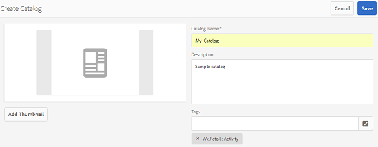

# Catalog Producer{#catalog-producer}

瞭解如何在AEM Assets中使用Catalog Producer，以使用您的數位資產產生產品型錄。

有了Adobe Experience Manager(AEM)Assets Catalog Producer，您就可以使用從InDesign應用程式匯入的InDesign範本，為品牌產品建立型錄。 若要匯入InDesign範本，請先將AEM Assets與InDesign伺服器整合。

## 與InDesign伺服器整合 {#integrating-with-indesign-server}

在整合程式中，設定 **DAM更新資產工作流程** ，此工作流程適合與InDesign整合。 此外，請為InDesign伺服器設定代理工作器。 如需詳細資訊，請 [參閱「整合AEM資產與InDesign Server」](/help/assets/indesign.md)。

>[!NOTE]
>
>您可以先從InDesign檔案產生InDesign範本，然後再將它們匯入AEM Assets。 如需詳細資訊，請 [參閱使用檔案和範本](https://helpx.adobe.com/indesign/using/files-templates.html)。
>
>您可以將InDesign範本中的元素對應至XML標籤。 在Catalog Producer中，當您將產品屬性與範本屬性對應時，映射的標籤會顯示為屬性。 若要瞭解InDesign檔案中的XML標籤，請參閱「 [標籤XML內容」](https://helpx.adobe.com/indesign/using/tagging-content-xml.html)。

>[!NOTE]
>
>只有InDesign檔案(.indd)是範本。 不支援副檔名為。indt的檔案。

## 建立目錄 {#creating-a-catalog}

Catalog Producer使用產品資訊管理(PIM)資料，以範本中顯示的XML屬性來對應產品屬性。 要建立目錄，請執行以下步驟：

1. 從「資產」使用者介面，點選／按一下 **AEM標誌**，然後前往「 **資產>目錄」**。
1. 在「目 **錄** 」頁面中，點選／按一下工具列中的「建立 **」，然後從清單中選** 取「目錄 **** 」。
1. 在「創 **建目錄** 」頁中，輸入目錄的名稱和說明（可選）並指定標籤（如果有）。 您也可以新增目錄的縮圖影像。

   

1. 點選／按一下「 **儲存**」。 確認對話框會通知目錄已建立。 點選／按一 **下「完成** 」以關閉對話方塊。
1. 若要開啟您建立的目錄，請從「目錄」頁麵點選／按 **一下** 。

   >[!NOTE]
   >
   >若要開啟目錄，您也可以點選／按一下上一步中提 **及的確認** 對話方塊中的「開啟」。

1. 若要將頁面新增至目錄，請點選／按一下工 **具列中的** 「建立」，然後選擇「 **新頁面** 」選項。
1. 從精靈中，為您的頁面選取InDesign範本。 然後點選／按「下 **一步**」。
1. 指定頁面的名稱和選用說明。 指定標籤（如果有）。
1. 點選／按一下工 **具列中** 的「建立」。 然後，點選／按一 **下對話方** 塊中的「開啟」。 產品的屬性會顯示在左窗格中。 InDesign範本的預先定義屬性會顯示在右窗格中。
1. 從左窗格，將產品屬性拖曳至InDesign範本屬性，並在它們之間建立對應。

   若要即時檢視頁面的顯示方式，請點選／按一下右窗格中的「 **預覽** 」標籤。

1. 若要建立更多頁面，請重複步驟6-9。 若要為其他產品建立類似頁面，請選取頁面，然後點選／按一下工具列中的「 **建立類似頁面** 」圖示。

   

   >[!NOTE]
   >
   >您只能為具有類似結構的產品建立類似頁面。

   點選／按一下「新增」圖示，從產品選擇器中選取產品，然後點選／按一下工 **具列中的** 「選取」。

   

1. 在工具列中，按一下／點選「 **建立**」。 點選／按一 **下「完成** 」以關閉對話方塊。 類似的頁面會包含在您的目錄中。
1. 若要將任何現有的InDesign檔案新增至目錄，請點選／按一下工具列中的「建 **立** 」，然後選擇「新 **增至現有頁面」選項** 。
1. 選取InDesign檔案，然後從工具列點選／按 **一下** 「新增」。 然後點選／按一下「 **確定** 」以關閉對話方塊。

   如果您在目錄頁面中參考的產品的中繼資料已變更，變更不會自動反映在目錄頁面中。 標示為「過 **時** 」的橫幅會出現在參考目錄頁面的產品影像上，指出參考產品的中繼資料並非最新。

   

   為確保產品影像反映最新的中繼資料變更，請在目錄主控台中選取頁面，然後從工具列按一下／點選 **更新頁面** 圖示。

   

   >[!NOTE]
   >
   >若要變更參考產品的中繼資料，請導覽至「產品」主控台(**AEM Logo** > **Commerce** > **Products**)，然後選取產品。 然後，按一下／點選工 **具列中的「檢視屬性** 」圖示，並在資產的「屬性」頁面中編輯中繼資料。

1. 若要重新排列目錄中的頁面，請點選／按一下工具列中的「 **建立** 」圖示，然後從選單選擇「 **合併** 」。 在精靈中，上方的轉盤可讓您拖曳頁面，以重新排序頁面。 您也可以移除頁面。

1. 點選／按「下 **一步**」。 若要將現有的InDesign檔案新增為封面，請點選／按一下「選擇封面頁 ******** 」方塊旁的「瀏覽」，並指定封面頁範本的路徑。
1. 點選／按一 **下「儲存**」，然後點選／按一下「 **完成** 」以關閉確認對話方塊。
在選取「完 **成** 」選項時，會開啟對話方塊，以選取是否要。pdf轉譯。
   如果選取「Acrobat(PDF)」選項，除了indesign轉譯外，也會在 **** /jcr:content/renditions中建立pdf轉譯。 您可以在下載對話方塊中選取「轉譯」核取方塊，以下載所有轉譯。

1. 若要為您建立的目錄產生預覽，請在「目錄」控制台中選取它 **，然後按一下工具列中的「** 預覽 **** 」圖示。

   

   在預覽中檢閱目錄中的頁面。 點選／按一 **下** 「關閉」以關閉預覽。

