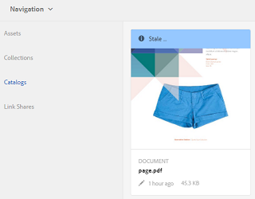

# 目錄製作者{#catalog-producer}

瞭解如何在AEM Assets中使用目錄製作程式，使用您的數位資產產生產品目錄。

使用Adobe Experience Manager (AEM) Assets Catalog Producer，您可以使用從InDesign應用程式匯入的InDesign範本，建立品牌產品的目錄。 若要匯入InDesign範本，請先將AEM Assets與InDesign伺服器整合。

## 與InDesign伺服器整合 {#integrating-with-indesign-server}

作為整合程式的一部分，請設定&#x200B;**DAM更新資產**&#x200B;工作流程，此工作流程適合與InDesign整合。 此外，請為InDesign伺服器設定Proxy Worker。 如需詳細資訊，請參閱[整合AEM Assets與InDesign Server](/help/assets/indesign.md)。

>[!NOTE]
>
>您可以先從InDesign檔案產生InDesign範本，然後再將其匯入AEM Assets。 如需詳細資訊，請參閱[使用檔案與範本](https://helpx.adobe.com/indesign/using/files-templates.html)。
>
>您可以將InDesign範本中的元素對應至XML標籤。 當您在「目錄製作程式」中將產品屬性與範本屬性對應時，對應的標籤會顯示為屬性。 若要瞭解InDesign檔案中的XML標籤，請參閱[標籤XML的內容](https://helpx.adobe.com/indesign/using/tagging-content-xml.html)。

>[!NOTE]
>
>只有InDesign檔案(.indd)被用作範本。 不支援副檔名為.indt的檔案。

## 建立目錄 {#creating-a-catalog}

目錄製作者使用產品資訊管理(PIM)資料，將產品屬性與範本中顯示的XML屬性對應。 若要建立目錄，請執行下列步驟：

1. 從Assets使用者介面，按一下&#x200B;**AEM標誌**，然後前往&#x200B;**Assets >目錄**。
1. 在&#x200B;**目錄**&#x200B;頁面中，按一下工具列中的&#x200B;**建立**，然後從清單中選取&#x200B;**目錄**。
1. 在&#x200B;**建立目錄**&#x200B;頁面中，輸入目錄的名稱和說明（選擇性），並指定標籤（如果有的話）。 您也可以為目錄新增縮圖影像。

   

1. 按一下「**儲存**」。確認對話方塊會通知目錄已建立。 按一下&#x200B;**完成**&#x200B;以關閉對話方塊。
1. 若要開啟您建立的目錄，請從&#x200B;**目錄**&#x200B;頁面按一下該目錄。

   >[!NOTE]
   >
   >若要開啟目錄，您也可以在上一步所述的確認對話方塊中按一下&#x200B;**開啟**。

1. 若要新增頁面至目錄，請按一下工具列中的[建立]，然後選擇[新增頁面]。********&#x200B;選項。
1. 從精靈中，選取頁面的InDesign範本。 然後，按一下&#x200B;**下一步**。
1. 指定頁面的名稱和選擇性說明。 指定標籤（如果有）。
1. 按一下工具列中的&#x200B;**建立**。 然後，從對話方塊按一下&#x200B;**開啟**。 產品的屬性會顯示在左窗格中。 InDesign範本的預定義屬性會出現在右窗格中。
1. 從左窗格，將產品屬性拖曳至InDesign範本屬性，並建立它們之間的對應。

   若要即時檢視頁面的顯示方式，請按一下右窗格上的&#x200B;**預覽**&#x200B;標籤。

1. 若要建立更多頁面，請重複步驟6-9。 若要為其他產品建立類似的頁面，請選取該頁面，然後從工具列按一下&#x200B;**建立類似的頁面**&#x200B;圖示。

   

   >[!NOTE]
   >
   >您只能為具有類似結構的產品建立類似頁面。

   按一下「新增」圖示，從產品選擇器選取產品，然後按一下工具列中的&#x200B;**選取**。

   

1. 從工具列中按一下&#x200B;**建立**。 按一下&#x200B;**完成**&#x200B;以關閉對話方塊。 類似頁面會包含在您的目錄中。
1. 若要新增任何現有的InDesign檔案至您的目錄，請從工具列按一下[建立]，然後選擇[新增至現有頁面] ****&#x200B;選項。****
1. 選取InDesign檔案，然後按一下工具列中的[新增]。 ****&#x200B;然後，按一下&#x200B;**確定**&#x200B;以關閉對話方塊。

   如果您在目錄頁面中參考的產品中繼資料已變更，這些變更不會自動反映在目錄頁面中。 在參考目錄頁面的產品影像上，會出現標示為&#x200B;**過時**&#x200B;的橫幅，表示參考的產品中繼資料不是最新的。

   

   若要確保產品影像反映最新的中繼資料變更，請在目錄主控台中選取頁面，然後按一下工具列中的&#x200B;**更新頁面**&#x200B;圖示。

   

   >[!NOTE]
   >
   >若要變更參考產品的中繼資料，請瀏覽至「產品」主控台(**AEM標誌** > **Commerce** > **產品**)，然後選取產品。 然後，按一下工具列中的&#x200B;**檢視屬性**&#x200B;圖示，並在資產的「屬性」頁面中編輯中繼資料。

1. 若要重新排列目錄中的頁面，請按一下工具列中的&#x200B;**建立**&#x200B;圖示，然後從功能表選擇&#x200B;**合併**。 在精靈中，頂端的轉盤可讓您拖曳頁面以重新排序頁面。 您也可以移除頁面。

1. 按一下「**下一步**」。若要新增現有的InDesign檔案做為封面頁，請按一下&#x200B;**選擇封面頁**&#x200B;方塊旁的&#x200B;**瀏覽**，並指定封面頁範本的路徑。
1. 按一下[儲存]****，然後按一下[完成]**關閉確認對話方塊。**&#x200B;選取&#x200B;**完成**選項時，會開啟對話方塊以選取您是否需要.pdf轉譯。
   
如果選取Acrobat(PDF)選項，則除了設計轉譯之外，還會在**/jcr：content/renditions**&#x200B;中建立PDF轉譯。 您可以選取下載對話方塊中的「轉譯」核取方塊來下載所有轉譯。

1. 若要為您建立的目錄產生預覽，請在&#x200B;**目錄**&#x200B;主控台中選取該目錄，然後按一下工具列中的&#x200B;**預覽**&#x200B;圖示。

   

   在預覽中檢閱目錄中的頁面。 按一下&#x200B;**關閉**&#x200B;以關閉預覽。
