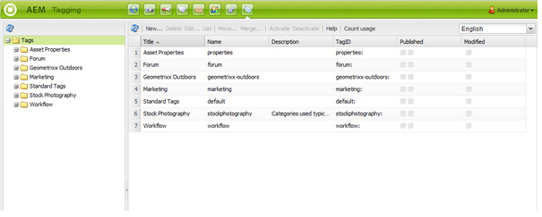

# 傳統UI標籤控制台{#classic-ui-tagging-console}

此部分用於傳統UI標籤控制台。

觸控最佳化UI標籤控制台就在 [這裡](/help/sites-administering/tags.md#tagging-console)。

若要存取傳統UI標籤主控台：

* 在作者上
* 以管理權限登入
* 瀏覽至控制台，例如， [https://localhost:4502/tagging](https://localhost:4502/tagging)

## 建立標籤和名稱空間 {#creating-tags-and-namespaces}

1. 視您從頭開始的層級而定，您可以使用「新增」建立標籤或命名空 **間**:

   如果您選取「 **標籤** 」，則可以建立命名空間：

   

   如果您選取命名空間(例如 **Demo**)，您可以在該命名空間中建立標籤：

   

1. 在這兩種情況下，請輸入

   * **Title**(*必要*)標籤的顯示標題。 雖然可以輸入任何字元，但建議不要使用下列特殊字元：

      * `colon (:)` -命名空間分隔字元
      * `forward slash (/)` -子標籤分隔字元
      如果輸入，將不顯示這些字元。

   * **名稱**(必&#x200B;*要*)標籤的節點名稱。

   * **說明**(*可選*)標籤的說明。

   * 選擇創 **建**

## 編輯標籤 {#editing-tags}

1. 在右窗格中，選取您要編輯的標籤。
1. 按一 **下編輯**。
1. 您可以修改「 **標題** 」和「 **說明」**。
1. 按一 **下「儲存** 」以關閉對話方塊。

## 刪除標籤 {#deleting-tags}

1. 在右窗格中，選取您要刪除的標籤。
1. 按一 **下刪除**。
1. 按一下 **是** ，關閉對話框。

   標籤不應再列出。

## 啟用和停用標籤 {#activating-and-deactivating-tags}

1. 在右窗格中，選取您要啟用（發佈）或停用（取消發佈）的命名空間或標籤。
1. 視需 **要按一下** 「啟 **用」或「停用** 」。

## 清單——顯示標籤被參考的位置 {#list-showing-where-tags-are-referenced}

**清單** (List)會開啟一個新視窗，顯示使用反白標籤的所有頁面路徑：

## 移動標籤 {#moving-tags}

為幫助標籤管理員和開發人員清理分類或更名標籤ID，可以將標籤移動到新位置：

1. 開啟「 **標籤** 」控制台。
1. **選取標籤，然後按一**&#x200B;下移動……在頂端工具列中（或在上下文選單中）。
1. 在「移 **動標籤** 」對話框中，定義：

   * **到**，即目標節點。
   * **更名為**，即新節點名。

1. 按一下 **移動**。

「移 **動標籤** 」對話框如下所示：

>[!NOTE]
>
>作者不應移動標籤或重新命名標籤ID。 必要時，作者只應 [變更標籤標題](#editing-tags)。

## 合併標籤 {#merging-tags}

當分類有重複項時，可使用合併標籤。 當標籤A合併到標籤B時，標籤A的所有頁面都將被標籤為標籤B，而標籤A不再可供作者使用。

要將標籤合併到另一個標籤中，請執行以下操作：

1. 開啟「 **標籤** 」控制台。
1. **選取標籤，然後按一**&#x200B;下合併……在頂端工具列中（或在上下文選單中）。
1. 在「合 **並標籤** 」對話方塊中，定義：

   * **到**，目標節點。

1. 按一下 **合併**。

「合 **並標籤** 」對話框如下所示：

## 計算標籤的使用 {#counting-usage-of-tags}

若要查看標籤的使用次數：

1. 開啟「 **標籤** 」控制台。
1. 按一 **下頂端工具列** 中的「計算使用情形」:列計數顯示結果。

## 管理不同語言的標籤 {#managing-tags-in-different-languages}

標籤 `title`的可選屬性可翻譯成多種語言。 接著 `titles` 可根據使用者語言或頁面語言來顯示標籤。

### 定義多種語言的標籤標題 {#defining-tag-titles-in-multiple-languages}

下列程式說明如何將標 `title`簽Animals轉 **譯** 為英文、德文和法文：

1. 前往「標 **記** 」主控台。
1. 編輯「標籤 **> Stock Photography** 」下方的「Animals **」標籤******。
1. 以下列語言添加翻譯：

   * **英文**:動物
   * **德文**:蒂埃
   * **法文**:阿尼莫

1. 儲存變更。

對話方塊的外觀如下：

「標籤」控制台使用用戶語言設定，因此對於「動物」標籤，在用戶屬性中將語言設定為法文的用戶將顯示「Animaux」。

若要新增語言至對話方塊，請參閱「為開發人員加上標籤」區段中的「將新 [語言新增至編輯標籤對話方](/help/sites-developing/building.md#adding-a-new-language-to-the-edit-tag-dialog) 塊」一節 **** 。

### 在頁面屬性中以指定語言顯示標籤標題 {#displaying-tag-titles-in-page-properties-in-a-specified-language}

依預設，頁面 `titles`屬性中的標籤會以頁面語言顯示。 頁面屬性中的標籤對話方塊有一個語言欄位，可讓標籤以不 `titles`同的語言顯示。 下列程式說明如何以法文顯 `titles`示標籤：

1. 請參閱上一節，將法文翻譯新增至「標 **簽** > Stock Photography **** 」(標籤 **>圖**&#x200B;庫攝影)下的Animals。
1. 在 **Geometrixx網站的英文分支中，開啟** 「產品」頁面的 **頁面屬性** 。
1. 開啟「 **標籤／關鍵字****** 」對話方塊（透過選取「標籤／關鍵字」顯示區域右側的下拉式選單），並從右下角的下拉式選單中選取法文語言。
1. 使用向左向右鍵捲動，直到能夠選取「 **Stock攝影」索引標籤**

   選取 **Animals** (**Animaux**)標籤，並在對話方塊外選取以關閉它，然後將標籤新增至頁面屬性。

   

依預設，「頁面屬性」對話方塊會根 `titles`據頁面語言顯示標籤。

一般而言，如果頁面語言可用，則標籤的語言會取自頁面語言。 當在其 [ 他情況下( `tag`](/help/sites-developing/building.md#tagging-on-the-client-side) 例如在表單或對話方塊中)使用介面工具集時，標籤語言會依據內容而定。

>[!NOTE]
>
>標準頁面元件中的標籤雲和中繼關鍵字會根據頁面語 `titles`言（若有的話）使用本地化的標籤。