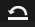
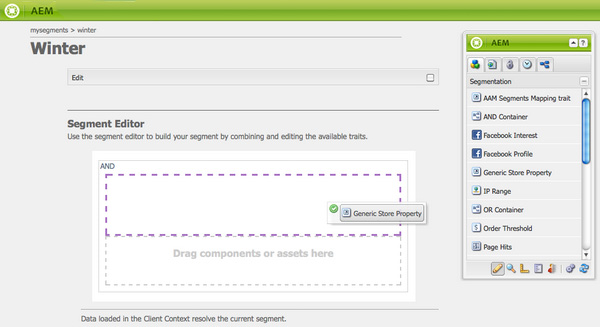

# ClientContext{#client-context}

>[!NOTE]
>
>ContextHub已取代用戶端內容。 如需詳細資訊，請參閱相關 [的設定](/help/sites-administering/contexthub-config.md) 和開 [發人](/help/sites-developing/contexthub.md) 員檔案。

「用戶端內容」是一種機制，可提供您目前頁面和訪客的特定資訊。 可使用 **Ctrl-Alt-c** (windows)或 **control-option-c** (Mac)開啟：

在發佈和 [作者環境中，都會顯示](#propertiesavailableintheclientcontext) :

* 訪客；視您的例項而定，會要求或衍生特定資訊。
* 頁面標籤和目前訪客存取這些標籤的次數（當您將滑鼠移至特定標籤上方時，會顯示此點）。
* 頁面資訊。
* 有關技術環境的資訊；例如IP位址、瀏覽器和螢幕解析度。
* 目前已解決的任何區段。

圖示（僅在作者環境中提供）允許您配置客戶端上下文的詳細資訊：

* **編輯**：新頁面將會開啟，供您 [編輯、新增或移除描述檔屬性](#editingprofiledetails)。

* **載入**：您 [可從描述檔清單中選取，並載入您要測試的描述檔](#loading-a-new-user-profile) 。

* **重設**&#x200B;您可 [以將描述檔重設](#resetting-the-profile-to-the-current-user) 為目前使用者的描述檔。

## 可用的客戶端上下文元件 {#available-client-context-components}

「用戶端內容」可顯示下列屬性([視使用「編輯」選取的項目而定](#adding-a-property-component)):

**Surfer資訊** ：顯示下列用戶端資訊：

* IP位 **址**
* **用於** 搜尋引擎反向連結的關鍵字
* 使 **用的瀏覽** 器
* 使用 **的OS** （作業系統）
* 螢幕解析 **度**
* 滑鼠 **X位置**
* 滑鼠 **Y位置**

**活動串流** ：提供使用者在各種平台上的社交活動資訊；例如，AEM論壇、部落格、評分等。

**促銷活動** ：讓作者模擬促銷活動的特定體驗。 此元件會覆寫一般促銷活動解析度和體驗選擇，以啟用各種組合的測試。

促銷活動解決方案通常以促銷活動的優先順序屬性為基礎。 通常會根據區段來選取體驗。

**購物車** ：顯示購物車資訊，包括產品項目（標題、數量、價格格式化等）、已解決的促銷活動（標題、訊息等）和憑證（代碼、說明等）。

購物車作業商店也會使用ClientContextCartServlet通知伺服器已解決的促銷變更（根據區段變更）。

**通用商店** (Generic Store)是顯示商店內容的通用元件。 它是通用商店屬性元件的低階版本。

Generic Store必須設定JS轉譯器，以自訂方式顯示資料。

**通用商店屬性** ：顯示商店內容的通用元件。 它是Generic Store元件的更高級版本。

「一般商店屬性」元件包含預設轉譯器，列出已設定的屬性（連同縮圖）。

**地理位置** ：顯示用戶端的經緯度。 它使用HTML5地理位置API來查詢瀏覽器的目前位置。 這會導致快顯畫面顯示給訪客，瀏覽器會在此詢問訪客是否同意分享其位置。

當顯示在Context cloud中時，元件會使用Google API將地圖顯示為縮圖。 此元件受Google API使用限制 [約束](https://developers.google.com/maps/documentation/staticmaps/intro#Limits)。

>[!NOTE]
>
>在AEM 6.1中，Geolocation商店不再提供反向地理編碼功能。 因此，Geolocation商店不再擷取目前位置的詳細資訊，例如城市名稱或國家代碼。 使用此儲存資料的區段無法正常運作。 Geolocation商店僅包含位置的經緯度。

**JSONP Store** A component that displays content that is dependent on your installation.

JSONP標準是JSON的輔助工具，可允許規避相同的來源原則（使網頁應用程式無法與位於其他網域的伺服器通訊）。 它包括在函式呼叫中封裝JSON物件，以便能夠從其他網域載入 `<script>` 它（這是同一原始原則允許的例外）。

JSONP商店和其他商店一樣，但是它會載入來自其他網域的資訊，而不需要擁有目前網域上該資訊的代理程式。 請參閱「透過JSONP在 [用戶端內容中儲存資料」範例](/help/sites-administering/client-context.md#storing-data-in-client-context-via-jsonp)。

>[!NOTE]
>
>JSONP商店不會快取Cookie中的資訊，但會在每次載入頁面時擷取該資料。

**描述檔資料** ：顯示在使用者描述檔中收集的資訊。 例如，性別、年齡、電子郵件地址等。

**已解析的區段** ：顯示目前解析的區段（通常取決於用戶端內容中顯示的其他資訊）。 這在設定促銷活動時很有意義。

例如，滑鼠當前是位於窗口的左側還是右側。 此區段主要用於測試，因為您可立即看到變更。

**社交圖** ：顯示使用者朋友和追隨者的社交圖。

>[!NOTE]
>
>目前，此示範功能依賴於我們示範使用者的設定檔節點上預先設定的資料集。 例如，請參閱：
>
>`/home/users/geometrixx/aparker@geometrixx.info/profile` =>朋友屬性

**Tag Cloud** Shows tags set on the current page and the goured whiring the site. 將滑鼠移至標籤上，會顯示目前使用者存取含有該特定標籤之頁面的次數。

>[!NOTE]
不會計入在已造訪頁面上顯示之DAM資產上設定的標籤。

**Technographics Store** This component is dependent on your installation.

**已檢視的產品** ：追蹤購物者已檢視的產品。 可查詢最近檢視的產品，或最近檢視的產品，而該產品尚未在購物車中。

此會話儲存沒有預設的客戶端上下文元件。

如需詳細資訊，請參 [閱用戶端內容](/help/sites-developing/client-context.md)。

>[!NOTE]
「頁面資料」不再以預設元件的形式出現在用戶端內容中。 如果需要，可以通過編輯客戶機上下文、添加 **Generic Store Properties** （通用商店屬性）元件來添加此內容，然後將其配置為將 **Store定義為**`pagedata`。

## 變更用戶端內容設定檔 {#changing-the-client-context-profile}

「客戶端上下文」允許您交互更改詳細資訊：

* 變更「用戶端內容」中使用的描述檔可讓您查看不同使用者在目前頁面上看到的不同體驗。
* 除了變更使用者描述檔外，您也可以變更一些描述檔詳細資訊，以檢視不同條件下的頁面體驗差異。

### 載入新的使用者設定檔 {#loading-a-new-user-profile}

您可以透過下列任一方式變更描述檔：

* [使用載入圖示](#loading-a-new-visitor-profile-with-the-load-profile-icon)
* [使用選取滑桿](#loadinganewvisitorprofilewiththeselectionslider)

完成後，您可重 [設描述檔](#resetting-the-profile-to-the-current-user)。

#### 使用載入描述檔圖示載入新訪客描述檔 {#loading-a-new-visitor-profile-with-the-load-profile-icon}

1. 按一下「載入描述檔」圖示：

   

1. 這將開啟該對話框，您可以在此處選擇要載入的配置檔案：

   

1. 按一 **下「確定** 」以載入。

#### 使用選擇滑塊載入新用戶配置檔案 {#loading-a-new-user-profile-with-the-selection-slider}

您也可以使用選取滑桿選取描述檔：

1. 連按兩下代表目前使用者的圖示。 選取器將會開啟，使用箭頭來導覽並檢視可用的描述檔：

   

1. 按一下您要載入的描述檔。 載入詳細資料後，按一下選取器外部以關閉。

#### 將配置檔案重置為當前用戶 {#resetting-the-profile-to-the-current-user}

1. 使用重設圖示，將用戶端內容中的描述檔傳回至目前使用者的描述檔：

   

### 變更瀏覽器平台 {#changing-the-browser-platform}

1. 連按兩下代表瀏覽器平台的圖示。 選取器將會開啟，使用箭頭來導覽並檢視可用的平台／瀏覽器：

   

1. 按一下您要載入的平台瀏覽器。 載入詳細資料後，按一下選取器外部以關閉。

### 變更地理位置 {#changing-the-geolocation}

1. 連按兩下地理位置圖示。 將會開啟展開的地圖，您可在此處將標籤拖曳至新位置：

   

1. 按一下地圖外部以關閉。

### 變更標籤選擇 {#changing-the-tag-selection}

1. 連按兩下「用戶端內容」的「標籤雲端」區段。 對話方塊將會開啟，您可以在這裡選取標籤：

   

1. 按一下「確定」以載入「用戶端內容」。

## 編輯用戶端內容 {#editing-the-client-context}

編輯用戶端內容可用來設定（或重設）某些屬性的值、新增新屬性或移除不再需要的屬性。

### 編輯屬性詳細資訊 {#editing-property-details}

編輯用戶端內容可用來設定（或重設）特定屬性的值。 這可讓您測試特定藍本(對區段和促銷活動 [特別](/help/sites-administering/campaign-segmentation.md)[有用](/help/sites-classic-ui-authoring/classic-personalization-campaigns.md))。

### 添加屬性元件 {#adding-a-property-component}

在開啟 **ClientContext設計頁面後**，您也可以使用可用的元件來新增屬性(元件會列在側腳或從 **Insert New Component** 對話方塊中，這些元件會在 **Drag元件或此處的資產方塊上按兩下鍵後開啟)****** :

### 刪除屬性元件 {#removing-a-property-component}

在開啟ClientContext設計頁 **面後**，您也可以 **Remove** a property（如果不再需要）。 其中包括現成可用的屬性；如 **果已移除** ,「重設」將重建這些項目。

## 通過JSONP在客戶端上下文中儲存資料 {#storing-data-in-client-context-via-jsonp}

請依照此範例，使用JSONP Store內容儲存元件，將外部資料新增至「用戶端內容」。 然後，根據該資料的資訊建立區段。 此示例使用WIPmania.com提供的JSONP服務。 該服務根據Web客戶端的IP地址返回地理位置資訊。

此範例使用Geometrixx Outdoors範例網站來存取「用戶端內容」並測試建立的區段。 只要頁面已啟用「用戶端內容」，您就可以使用不同的網站。 (請參 [閱將用戶端內容新增至頁面](/help/sites-developing/client-context.md#adding-client-context-to-a-page)。)

### 添加JSONP儲存元件 {#add-the-jsonp-store-component}

將JSONP Store元件添加到Client Context中，並使用它檢索和儲存有關Web客戶端的地理位置資訊。

1. 在AEM作者例項上開啟Geometrixx Outdoors網站的英文首頁。 ([https://localhost:4502/content/geometrixx-outdoors/en.html](https://localhost:4502/content/geometrixx-outdoors/en.html))。
1. 要開啟「客戶端上下文」，請按Ctrl-Alt-c(windows)或control-option-c(Mac)。
1. 按一下「用戶端內容」頂端的編輯圖示，以開啟「用戶端內容設計器」。

   

1. 將JSONP Store元件拖動到Client Context。

   

1. 連按兩下元件以開啟編輯對話方塊。
1. 在「JSONP服務URL」方塊中，輸入下列URL，然後按一下「擷取商店」:

   `https://api.wipmania.com/jsonp?callback=${callback}`

   該元件調用JSONP服務並列出返回資料包含的所有屬性。 清單中的屬性是將可在用戶端內容中使用的屬性。

   

1. 按一下「確定」。
1. 返回Geometrixx Outdoors首頁並重新整理頁面。 Client Context現在包含來自JSONP store元件的資訊。

   

### 建立區段 {#create-the-segment}

使用您使用JSONP儲存元件建立的會話儲存中的資料。 區段會使用作業商店的緯度和目前日期來判斷是否是客戶所在位置的冬季時間。

1. 在網頁瀏覽器(`https://localhost:4502/miscadmin#/etc`)中開啟「工具」主控台。
1. 在資料夾樹狀結構中，按一下「工具／區段」資料夾，然後按一下「新增>新資料夾」。 指定下列屬性值，然後按一下「建立」:

   * 名稱：mysegments
   * 標題：我的區段

1. 選取「我的區段」檔案夾，然後按一下「新增>新增頁面」:

   1. 在「Title（標題）」中，鍵入Winter。
   1. 選取區段範本。
   1. 按一下「建立」。

1. 按一下右鍵「冬季」段，然後按一下「開啟」。
1. 將「一般商店屬性」拖曳至預設的AND容器。

   

1. 連按兩下元件以開啟編輯對話方塊，指定下列屬性值，然後按一下「確定」:

   * 商店：wipmania
   * 屬性名稱：緯度
   * 運算元：大於
   * 屬性值：30

1. 將指令碼元件拖曳至相同的AND容器，並開啟其編輯對話方塊。 新增下列指令碼，然後按一下「確定」:

   `3 < new Date().getMonth() < 12`

