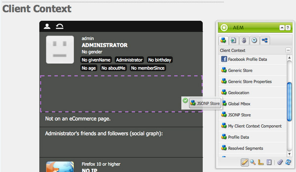
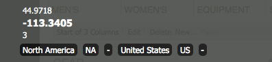

# ClientContext{#client-context}

>[!NOTE]
>
>客戶端上下文已被ContextHub取代。 有關詳細資訊，請參閱相關 [配置](/help/sites-developing/ch-configuring.md) 和 [開發者](/help/sites-developing/contexthub.md) 檔案。

「客戶端上下文」是一種機制，可為您提供有關當前頁面和訪問者的某些資訊。 可以使用 **Ctrl-Alt-c** （窗口）或 **控制選項 — c** (Mac):

在 [發佈和建立環境，它顯示資訊](#propertiesavailableintheclientcontext) 關於：

* 訪客；根據您的實例，會請求或派生某些資訊。
* 頁面標籤和當前訪問者訪問這些標籤的次數（當您將滑鼠移到特定標籤上時會顯示此資訊）。
* 頁面資訊。
* 技術環境資訊；如IP地址、瀏覽器和螢幕解析度。
* 當前已解析的任何段。

表徵圖（僅在作者環境中可用）允許您配置客戶端上下文的詳細資訊：

* **編輯**
將會開啟新頁面，以便 [編輯、添加或刪除配置檔案屬性](#editingprofiledetails)。

* **載入**
你可以 [從配置檔案清單中選擇並載入配置檔案](#loading-a-new-user-profile) 你想test。

* **重置**
你可以 [重置配置檔案](#resetting-the-profile-to-the-current-user) 到當前用戶。

## 可用的客戶端上下文元件 {#available-client-context-components}

客戶端上下文可顯示以下屬性([根據使用「編輯」選擇的內容](#adding-a-property-component)):

**衝浪資訊** 顯示以下客戶端資訊：

* 這樣 **IP地址**
* **關鍵字** 用於搜索引擎引用
* 這樣 **瀏覽器** 正在使用
* 這樣 **作業系統** （正在使用的作業系統）
* 螢幕 **決議**
* 這樣 **滑鼠X** 位置
* 這樣 **滑鼠Y** 位置

**活動流** 這提供了用戶在各種平台上的社交活動資訊；例如，論AEM壇、部落格、評級等。

**活動** 允許作者模擬市場活動的特定體驗。 此元件替代了常規的市場活動解決方案和經驗選擇，以便能夠測試各種組合。

市場活動解決通常基於市場活動的優先屬性。 通常根據分割來選擇經驗。

**購物車** 顯示購物車資訊，包括產品條目（標題、數量、價格格式化等）、已解決促銷（標題、消息等） 和憑證（代碼、說明等）。

購物車會話儲存還使用ClientContextCartServlet向伺服器通知已解決的升級更改（基於分段更改）。

**一般儲存** 是顯示儲存內容的通用元件。 它是通用儲存屬性元件的低級版本。

通用儲存必須配置JS呈現器，該呈現器將以自定義方式顯示資料。

**常規儲存屬性** 是顯示儲存內容的通用元件。 它是通用儲存元件的更高級版本。

「通用儲存屬性」元件包括一個預設呈現器，它列出了配置的屬性（連同縮略圖）。

**地理位置** 顯示客戶端的經緯度。 它使用HTML5地理位置API查詢瀏覽器的當前位置。 這會導致向訪問者顯示一個彈出窗口，瀏覽器會詢問他們是否同意共用其位置。

在上下文雲中顯示時，元件使用GoogleAPI將映射顯示為縮略圖。 該元件受GoogleAPI約束 [使用限制](https://developers.google.com/maps/documentation/staticmaps/intro#Limits)。

>[!NOTE]
>
>在AEM6.1中，Geolocation儲存不再提供反向地理編碼功能。 因此，Geolocation儲存不再檢索有關當前位置的詳細資訊，如城市名稱或國家/地區代碼。 使用此儲存資料的段無法正常工作。 地理位置儲存區只包含某個位置的經緯度。

**JSONP商店** 顯示與安裝相關的內容的元件。

JSONP標準是對JSON的補充，它允許規避相同的源策略（使Web應用無法與位於另一個域上的伺服器通信）。 它包括在函式調用中包裝JSON對象，以便能夠將其作為 `<script>` 從另一個域（允許對同一源策略執行異常）。

JSONP儲存區與任何其他儲存區一樣，但它載入來自另一個域的資訊，而無需在當前域上擁有該資訊的代理。 請參閱中的示例 [通過JSONP在客戶端上下文中儲存資料](/help/sites-administering/client-context.md#storing-data-in-client-context-via-jsonp)。

>[!NOTE]
>
>JSONP儲存不快取Cookie中的資訊，而是在每個頁載入時檢索該資料。

**配置檔案資料** 顯示在用戶配置檔案中收集的資訊。 例如，性別、年齡、電子郵件地址等。

**已解析的段** 顯示當前解析的段（通常取決於客戶端上下文中顯示的其他資訊）。 這在配置市場活動時很有意義。

例如，滑鼠當前是位於窗口的左手部分還是右手部分上。 此分段主要用於測試，因為可立即看到更改。

**社會圖** 顯示用戶好友和關注者的社交圖表。

>[!NOTE]
>
>當前，這是一個演示功能，它依賴於我們演示用戶配置檔案節點上的預配置資料集。 例如，請參見：
>
>`/home/users/geometrixx/aparker@geometrixx.info/profile` =>朋友屬性

**標籤雲** 顯示在當前頁面上設定的標籤以及在瀏覽站點時收集的標籤。 將滑鼠移到標籤上顯示當前用戶訪問包含該特定標籤的頁面的次數。

>[!NOTE]
將不計算在訪問的頁面上顯示的DAM資產上設定的標籤。

**Technographics商店** 此元件取決於您的安裝。

**已查看產品** 跟蹤購物者查看的產品。 可以查詢最近查看的產品或尚未在購物車中的最近查看的產品。

此會話儲存沒有預設的客戶端上下文元件。

有關其他資訊，請參見 [客戶端上下文詳細資訊](/help/sites-developing/client-context.md)。

>[!NOTE]
頁面資料不再作為預設元件存在於客戶端上下文中。 如果需要，可以通過編輯客戶端上下文和添加 **常規儲存屬性** 元件，然後配置它以定義 **儲存** 如 `pagedata`。

## 更改客戶端上下文配置檔案 {#changing-the-client-context-profile}

客戶端上下文允許您交互更改詳細資訊：

* 更改在客戶端上下文中使用的配置檔案允許您查看不同用戶在當前頁面中看到的不同體驗。
* 除了更改用戶配置檔案外，您還可以更改一些配置檔案詳細資訊，以查看在不同條件下頁面體驗的不同。

### 載入新用戶配置檔案 {#loading-a-new-user-profile}

您可以通過以下任一方式更改配置檔案：

* [使用「載入」表徵圖](#loading-a-new-visitor-profile-with-the-load-profile-icon)
* [使用選擇滑塊](#loadinganewvisitorprofilewiththeselectionslider)

完成後，您可以 [重置配置檔案](#resetting-the-profile-to-the-current-user)。

#### 使用「載入配置檔案」表徵圖載入新訪問者配置檔案 {#loading-a-new-visitor-profile-with-the-load-profile-icon}

1. 按一下「載入配置檔案」(Load Profile)表徵圖：

   

1. 這將開啟對話框，您可以在此處選擇要載入的配置檔案：

   

1. 按一下 **確定** 裝入。

#### 使用選擇滑塊載入新用戶配置檔案 {#loading-a-new-user-profile-with-the-selection-slider}

也可以使用選擇滑塊選取配置檔案：

1. 按兩下表示當前用戶的表徵圖。 選擇器將開啟，使用箭頭導航並查看可用的配置檔案：

   

1. 按一下要載入的配置檔案。 載入詳細資訊後，按一下選擇器外部關閉。

#### 將配置檔案重置為當前用戶 {#resetting-the-profile-to-the-current-user}

1. 使用重置表徵圖將客戶端上下文中的配置檔案返回到當前用戶的配置檔案：

   

### 更改瀏覽器平台 {#changing-the-browser-platform}

1. 按兩下表示瀏覽器平台的表徵圖。 選擇器將開啟，使用箭頭導航並查看可用的平台/瀏覽器：

   

1. 按一下要載入的平台瀏覽器。 載入詳細資訊後，按一下選擇器外部關閉。

### 更改地理位置 {#changing-the-geolocation}

1. 按兩下地理位置表徵圖。 將開啟展開的映射，您可以在此處將標籤拖動到新位置：

   

1. 在映射外按一下以關閉。

### 更改標籤選擇 {#changing-the-tag-selection}

1. 按兩下「客戶端上下文」的「標籤雲」部分。 該對話框將開啟，您可以在此處選擇標籤：

   

1. 按一下「確定」(OK)以載入到「客戶端上下文」(Client Context)中。

## 編輯客戶端上下文 {#editing-the-client-context}

編輯客戶端上下文可用於設定（或重置）某些屬性的值、添加新屬性或刪除不再需要的屬性。

### 編輯屬性詳細資訊 {#editing-property-details}

編輯客戶端上下文可用於設定（或重置）某些屬性的值。 這允許您test特定方案(對於 [分割](/help/sites-administering/campaign-segmentation.md) 和 [活動](/help/sites-classic-ui-authoring/classic-personalization-campaigns.md))。

### 添加屬性元件 {#adding-a-property-component}

開啟後 **ClientContext設計頁**，也 **添加** 使用可用元件(元件列在側腳上或從 **插入新元件** 在 **將元件或資產拖到此處** ):

### 刪除屬性元件 {#removing-a-property-component}

開啟後 **ClientContext設計頁**，也 **刪除** 屬性（如果不再需要）。 這包括出廠時提供的屬性； **重置** 如果它們被移除，將恢復。

## 通過JSONP在客戶端上下文中儲存資料 {#storing-data-in-client-context-via-jsonp}

請按照此示例使用JSONP儲存上下文儲存元件將外部資料添加到客戶端上下文。 然後，基於來自該資料的資訊建立段。 該示例使用WIPmania.com提供的JSONP服務。 該服務基於Web客戶端的IP地址返回地理位置資訊。

此示例使用Geometrixx Outdoors示例網站訪問客戶端上下文並test建立的段。 只要該頁啟用了「客戶端上下文」，您就可以使用其他網站。 (請參閱 [將客戶端上下文添加到頁面](/help/sites-developing/client-context.md#adding-client-context-to-a-page)。)

### 添加JSONP儲存元件 {#add-the-jsonp-store-component}

將JSONP儲存元件添加到客戶端上下文，並使用它檢索和儲存有關Web客戶端的地理位置資訊。

1. 開啟作者實例上的Geometrixx Outdoors網站的英AEM語首頁。 ([https://localhost:4502/content/geometrixx-outdoors/en.html](https://localhost:4502/content/geometrixx-outdoors/en.html))。
1. 要開啟客戶端上下文，請按Ctrl-Alt-c（窗口）或control-option-c(Mac)。
1. 按一下「客戶端上下文」頂部的編輯表徵圖以開啟「客戶端上下文設計器」。

   

1. 將JSONP儲存元件拖到客戶端上下文。

   

1. 按兩下元件以開啟編輯對話框。
1. 在「JSONP服務URL」框中，輸入以下URL，然後按一下「提取儲存」：

   `https://api.wipmania.com/jsonp?callback=${callback}`

   該元件調用JSONP服務並列出返回的資料包含的所有屬性。 清單中的屬性是那些在客戶端上下文中可用的屬性。

   

1. 按一下「確定」。
1. 返回Geometrixx Outdoors首頁並刷新頁面。 客戶端上下文現在包括來自JSONP儲存元件的資訊。

   

### 建立段 {#create-the-segment}

使用您使用JSONP儲存元件建立的會話儲存中的資料。 該段使用會話儲存的緯度和當前日期來確定是否是客戶機位置的冬季時間。

1. 在Web瀏覽器中開啟「工具」控制台(`https://localhost:4502/miscadmin#/etc`)。
1. 在資料夾樹中，按一下「工具」/「分段」資料夾，然後按一下「新建」>「新建資料夾」。 指定以下屬性值，然後按一下建立：

   * 名稱：my片段
   * 標題：我的段

1. 選擇「我的段」資料夾，然後按一下「新建」>「新建頁」：

   1. 在「Title（標題）」中，鍵入Winter。
   1. 選擇段模板。
   1. 按一下建立。

1. 按一下右鍵「Winter（冬季）」段，然後按一下「Open（開啟）」。
1. 將「一般儲存」屬性拖到預設的AND容器中。

   

1. 按兩下元件以開啟編輯對話框，指定以下屬性值，然後按一下確定：

   * 商店：維曼尼亞
   * 屬性名稱：緯度
   * 運算子：大於
   * 屬性值：30

1. 將指令碼元件拖到同一AND容器，然後開啟其編輯對話框。 添加以下指令碼，然後按一下「確定」：

   `3 < new Date().getMonth() < 12`
