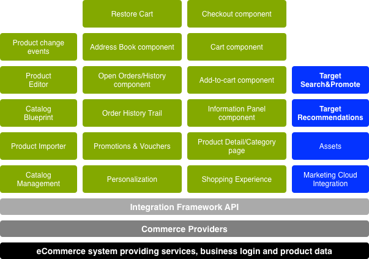

# 概念{#concepts}

整合框架提供了以下機制和元件：

* 連線至電子商務引擎
* 將資料拉入AEM
* 顯示資料並收集購物者的回應
* 返回事務處理詳細資訊
* 從兩個系統搜索資料

這表示：

* 購物者可註冊併購物，毋需等待。
* 購物者可立即檢視價格變動。
* 您可視需要新增產品。

>[!NOTE]
>
>電子商務架構可與下列項目搭配使用：
>
>* [馬根托](https://www.adobe.io/apis/experiencecloud/commerce-integration-framework/integrations.html#!AdobeDocs/commerce-cif-documentation/master/integrations/02-AEM-Magento.md)
>* [SAP Commerce Cloud](/help/sites-administering/sap-commerce-cloud.md)
>* [Salesforce Commerce Cloud](https://github.com/adobe/commerce-salesforce)
>

>[!CAUTION]
>
>電 [子商務整合架構](https://www.adobe.com/solutions/web-experience-management/commerce.html) 是AEM附加元件。
>
>您的銷售代表將可以根據適當的引擎提供完整的詳細資料。

>[!CAUTION]
>
>該框架為您自己的項目提供了基本要求。
>
>為了配合您的規格調整架構，一律需要進行一定量的開發工作。

>[!CAUTION]
>
>標準AEM安裝包含一般AEM(JCR)電子商務實作。
>
>這目前僅供展示之用，或根據您的需求做為自訂實作的基礎。

為了最佳化運作，AEM和電子商務引擎都將重心放在自己的專業領域。 資訊在兩者之間即時傳輸；例如：

* AEM可以：

   * 請求：

      * 來自電子商務引擎的產品資訊。
   * 提供：

      * 使用者檢視產品資訊、購物車和結帳。
      * 將購物車和結帳資訊匯入電子商務引擎。
      * 搜尋引擎最佳化(SEO)。
      * 社群功能。
      * 非結構化行銷互動。

* 電子商務引擎可以：

   * 提供：

      * 來自資料庫的產品資訊。
      * 產品變型管理。
      * 訂單管理。
      * ERP（企業資源規劃）。
      * 在產品資訊中搜尋。
   * 程序:

      * 購物車。
      * 結帳。
      * 訂單履行。

>[!NOTE]
>
>具體細節將取決於電子商務引擎和項目實施。

提供許多現成可用的AEM元件，以使用整合層。 目前，這些項目包括：

* 產品資訊
* 購物車
* 結帳
* 我的帳戶

也提供各種搜尋選項。

## 建築 {#architecture}

整合架構提供API、一系列元件來說明功能，以及數種擴充功能，以提供連線方法的範例：

此架構可讓您存取下列功能：

### 實施 {#implementations}

AEM eCommerce是透過電子商務引擎實作：

* 電子商務整合架構可讓您輕鬆將電子商務引擎與AEM整合。 建立電子商務引擎的目的是控制產品資料、購物車、結帳和訂單履行，而AEM則控制資料顯示和行銷活動。

>[!NOTE]
>
>標準AEM安裝包含一般AEM(JCR)電子商務實作。
>
>這目前僅供展示之用，或根據您的需求做為自訂實作的基礎。
>
>AEM eCommerce在AEM中使用以JCR為基礎的一般開發實作為：
>
>* AEM原生的獨立電子商務範例，以說明API的使用。 這可用來控制產品資料、購物車和結帳，並結合現有的資料顯示和行銷活動。 在此例中，產品資料庫會儲存在AEM(Adobe的 [JCR實作](https://docs.adobe.com/content/docs/en/spec/jcr/2.0/index.html))原生的儲存庫中。
   >  標準AEM安裝包含一般電子商務實 [作的基本概念](/help/sites-administering/generic.md)。
>

### 商務提供者 {#commerce-providers}

將資料從商務引擎匯入AEM電子商務網站時，會使用商務提供者來提供資料給進口商。 一個商務供應商可支援多個進口商。

商務提供者是自訂的AEM代碼，可用於：

* 後端商務引擎介面
* 在JCR儲存庫上實施商務系統

AEM目前提供兩個商務提供者範例：

* one for geometrixx-hybris
* geometrixx-generic(JCR)的另一個

雖然專案通常需要開發其專屬的自訂商務提供者，以針對其PIM和產品資料架構。

>[!NOTE]
>
>Geometrixx匯入器使用CSV檔案；其實施上方的注釋中，有接受的架構說明（允許自訂屬性）。

ProductServicesManager [(透過](https://helpx.adobe.com/experience-manager/6-5/sites/developing/using/reference-materials/javadoc/com/adobe/cq/commerce/pim/api/ProductServicesManager.html) OSGi [)維護](/help/sites-deploying/configuring.md#osgi-configuration-settings)ProductImporter和  CatalogBlueprintImporter介面的實作清單。 這些列在匯入工具精靈的 **Importer/Commerce Provider** (使用屬性 `commerceProvider` 作為名稱)下拉式欄位中。

當從下拉式清單中提供特定的匯入工具／商務提供者時，必須在下列任一欄位中定義它需要的任何補充資料（視匯入工具類型而定）:

* `/apps/commerce/gui/content/catalogs/importblueprintswizard/importers`
* `/apps/commerce/gui/content/products/importproductswizard/importers`

適當資料夾下的資 `importers` 料夾必須符合匯入工具名稱；例如：

* `.../importproductswizard/importers/geometrixx/.content.xml`

源導入檔案的格式由導入程式定義。 或者，匯入工具可建立與商務引擎的連線（例如WebDAV或http）。

## 角色 {#roles}

整合系統適合以下角色來維護資料：

* 產品資訊管理(PIM)用戶維護：

   * 產品資訊。
   * 分類、分類、核准。
   * 與數位資產管理互動。
   * 定價——通常這是來自ERP系統，並未在商務系統中明確維護。

* 作者／行銷經理，負責：

   * 所有通道的行銷內容。
   * 促銷活動.
   * 憑單.
   * 促銷活動.

* 衝浪者／購物者：

   * 檢視您的產品資訊。
   * 將項目放入購物車。
   * 檢查他們的訂單。
   * 預期訂單履行。

雖然實際位置可能取決於您的實作；例如，一般或具有電子商務引擎：

## 產品 {#products}

### 產品資料與行銷資料 {#product-data-versus-marketing-data}

#### 結構與行銷類別 {#structural-versus-marketing-categories}

如果可區分下列兩個類別，則可讓您以有意義的結構（節點樹狀結構）來建立清楚的URL，因此非常接 `cq:Page` 近傳統的AEM內容管理):

* *結構*類別

   定義產品 *的類別樹*;例如：

   `/products/mens/shoes/sneakers`

* *行銷類別*

   產品可以屬於 *的所有其他類別*;例如：

   `/special-offers/christmas/shoes`)

### 產品資料 {#product-data}

若要描述並管理您的產品，您會想要掌握有關產品的各種資訊。

產品資料可以：

* 直接維護於AEM（一般）。
* 維護，並在AEM中提供。

   視需要同步或直接 [存取](#catalog-maintenance-data-synchronization) ，視資料類型而定；例如，每次頁面請求時，都會從電子商務引擎擷取高波動性和關鍵性資料，例如產品價格，以確保這些資料永遠是最新的。

在這兩種情況下，當產品資料已輸入／匯入至AEM時，可從「產品」主控台 **檢視** 。 在此，產品的資訊卡和清單檢視會顯示下列資訊：

* 影像
* SKU代碼
* 上次修改時間

### 產品的系列品種 {#product-variants}

有關變型的適當產品資訊，也可保存。 例如，對於可用顏色不同的服裝項目，會保留為變體：

### 產品屬性 {#product-attributes}

每個產品的個別屬性可能取決於所使用的電子商務引擎和您的AEM實作。 在檢視產品頁面和／或編輯產品資訊時，這些功能（視情況而定）可供使用，其中可包括：

* **影像**

   產品的影像。

* **標題**

   產品名稱。

* **說明**

   產品的文本說明。

* **標記**

   用於分組相關產品的標籤。

* **預設資產類別**

   資產的預設類別。

* **ERP 資料**

   企業資源規劃(ERP)資訊。

   * **SKU**

      庫存單位(SKU)資訊。

   * **彩色**
   * **大小**
   * **價格**

      產品的單價。

* **摘要**

   產品功能的摘要。

* **功能**

   產品功能的更完整細節。

### 產品資產 {#product-assets}

可針對個別產品保留資產選擇。 通常包括影像和視訊。

## 目錄 {#catalogs}

目錄將產品資料分組在一起，以方便管理，並讓購物者呈現。 目錄通常根據語言、地理區域、品牌、季節、嗜好、體育等屬性來建構。

### 目錄結構 {#catalog-structure}

#### 多語言型錄 {#catalogs-in-multiple-languages}

AEM支援多種語言的產品內容。 在請求資料時，整合架構會從目前的樹狀結構中擷取語言(例如， `en_US` 下方的頁 `/content/geometrixx-outdoors/en_US`面)。

對於多語言商店，您可以個別匯入每種語言樹的目錄(或透過 [MSM](/help/sites-administering/msm.md))。

#### 多品牌型錄 {#catalogs-for-multiple-brands}

和語言一樣，大型跨國公司也需要迎合多種品牌需求。

#### 依標籤的型錄 {#catalogs-by-tags}

標籤也可用來將產品群組在目錄中。 這些可用於更動態的型錄，例如季節性選件。

### 目錄設定（初始匯入） {#catalog-setup-initial-import}

視您的實作而定，您可以從以下位置將基本型錄所需的產品資料匯入AEM:

* a CSV檔案（適用於一般實作）
* eCommerce引擎

### 目錄維護（資料同步） {#catalog-maintenance-data-synchronization}

產品資料的進一步變更將不可避免：

* 對於一般實作，可使用產品編輯器來管 [理這些](/help/sites-administering/generic.md#editing-product-information)
* 使用電子 [商務引擎時，必須同步變更](#data-synchronization-with-an-ecommerce-engine-ongoing)

#### 使用電子商務引擎進行資料同步（正在進行中） {#data-synchronization-with-an-ecommerce-engine-ongoing}

初次匯入後，您的產品資料變更是不可避免的。

當使用電子商務引擎時，產品資料會在那裡維護，而且需要在AEM中提供。 進行更新時，需要同步此產品資料。

這可視資料類型而定：

* 週期 [同步與更改的資料饋送一起使用](/help/sites-developing/sap-commerce-cloud.md#product-synchronization-and-publishing)。

   除此之外，您還可以為快速更新選擇特定更新。

* 從商務引擎中針對每個頁面請求擷取高度波動的資料（例如價格資訊），以確保其永遠是最新的。

### 型錄——效能與縮放 {#catalogs-performance-and-scaling}

從電子商務引擎(PIM)匯入大量產品（通常超過100,000個）的大型型錄，會因為節點數目龐大而影響系統。 如果產品有相關資產（例如產品影像），它也會拖慢製作執行個體的速度。 這是因為這些資產的後處理需要耗用CPU和記憶體。

您可以選擇多種策略來解決這些問題：

* [區隔](#bucketing) -以迎合大量節點的需求
* [將資產後處理卸載到專用實例](#offload-asset-post-processing-to-a-dedicated-instance)
* [僅匯入產品資料](#only-import-product-data)
* [導入調節和批處理保存](#import-throttling-and-batch-saves)
* [效能測試](#performance-testing)
* [效能——其他](#performance-miscellaneous)

#### 行銷 {#bucketing}

如果JCR節點有許多直接子節點（如1000個以上），則需要儲存段（虛擬資料夾）以確保效能不受影響。 匯入時會根據演算法產生這些項目。

這些儲存區採用虛擬資料夾的形式，這些資料夾會引入您的目錄結構，但可加以設定，使它們在公用URL中不明顯。

#### 將資產後處理卸載到專用實例 {#offload-asset-post-processing-to-a-dedicated-instance}

此案例包括設定兩個作者例項：

1. 主作者實例

   從PIM匯入產品資料，資產路徑的後置處理會停用。

1. 專用DAM作者實例

   從PIM匯入和後處理產品資產，然後將這些資產複製回主作者實例以供使用。

#### 僅匯入產品資料 {#only-import-product-data}

若產品不含要匯入的資產（影像），您可以匯入產品資料，而不受資產後期處理的影響。

<!--delete
#### Import Throttling and Batch Saves {#import-throttling-and-batch-saves}

[Import throttling](/help/sites-deploying/scaling.md#import-throttling) and [batch saves](/help/sites-deploying/scaling.md#batch-saves) are two general [scaling](/help/sites-deploying/scaling.md) mechanisms that can help when importing large volumes of data.-->

#### 效能測試 {#performance-testing}

AEM eCommerce實作必須考慮效能測試：

* 作者環境：

   背景（例如匯入）活動可與一般使用者活動（例如頁面編輯）同時發生，即使前端效能（一般而言）具有較高的優先順序，線上作者看到的不良效能也會導致無法阻止上線決策的困擾。

* 出版物環境：

   複製是確保內容快速可靠地發佈的關鍵過程。 這可能會受作者對要發佈的內容進行分組的方式影響。

* 前端：

   前端和快取失效的混合可能導致效能意外。 測試有助於避免這些問題。

請注意，此效能測試需要您對目標的瞭解和分析：

* 內容卷

   * 資產
   * 本地化的I18ned產品和SKU

* 使用者活動：

   * Bulk Edition
   * 大量出版物
   * 密集搜尋請求

* 背景程式

   * 導入
   * 同步更新（例如定價）

* 維護要求（備份、Tar PM優化、資料儲存廢棄項目收集等）

#### 效能——其他 {#performance-miscellaneous}

對於所有實施，可以牢記以下幾點：

* 由於產品、庫存單位和類別可能很多，請盡量使用最少的節點來建立內容模型。

   您擁有的節點越多，您的內容就越有彈性（例如parsys）。 但是，一切都是權衡取捨，在控制（例如）30K產品時，您是否需要個別的彈性（依預設）?

* 盡可能避免重複（請參閱本地化），或者，當您這麼做時，請考慮您的複製將導致多少節點。
* 請盡量嘗試標籤您的內容，以準備查詢最佳化。

   例如：

   `/content/products/france/fr/shoe/reebok/pump/46 SKU`

   每個內容層級應有一個標籤（例如國家、語言、類別、品牌、產品）。 搜索

   `//element(*,my:Sku)[@country=’france’ and @language=’fr’`

   和

   `@category=’shoe’ and @brand=’reebok’ and @product=’pump’]`

   比搜索要快得多

   `/jcr:root/content/france/fr/shoe/reebok/pump/element(*,my:Sku)`

* 在您的技術堆疊中，規劃非常工廠化的內容存取模型和服務。 這是一般的最佳實務，但更重要的是，在最佳化階段，她會新增應用程式快取，以供經常讀取的資料使用（而且您不想填入套件快取）。

   例如，屬性管理通常是快取的最佳候選項，因為它與透過產品匯入更新的資料有關。
* 考慮使用 [代理頁](/help/sites-administering/concepts.md#proxy-pages)。

### 目錄部分頁 {#catalog-section-pages}

目錄部分提供您，例如：

* 類別簡介（影像和／或文字）;這也可用於橫幅和廣告廣告，以推廣特殊優惠
* 連結至該類別中的個別產品
* 連結至其他類別

### 產品頁面 {#product-pages}

產品頁面提供個別產品的完整資訊。 還反映了動態更新；例如，在電子商務引擎上註冊的價格變更。

產品頁面是使用產品元件的 **AEM頁** ;例如，在「商務產 **品」範本中** :

產品元件提供：

* 一般產品資訊；包括文字和影像。
* 定價；這通常會在每次顯示／重新整理頁面時從電子商務引擎擷取。
* 產品變型資訊；例如，顏色和大小。

此資訊可讓購物者在將商品新增至購物籃時選擇下列項目：

* 顏色和大小變體
* 數量

#### 產品著陸頁面 {#product-landing-pages}

這些是AEM頁面，主要提供靜態資訊；例如，簡介和概述，其中包含基礎產品頁面的連結。

### 產品元件 {#product-component}

您可 **以將Product** 元件新增至任何具有父頁面的頁面，而父頁面會傳遞所需的中繼資料(亦即至和 `cartPage` 的路徑 `cartObject`)。 在展示網站Geometrixx Outdoors中，這是由提供 `UserInfo.jsp`。

您也 **可以根據您的個別需求，自訂Product** 元件。

### 代理頁 {#proxy-pages}

代理頁用於簡化儲存庫的結構並優化大型目錄的儲存。

建立目錄時，每個產品會使用10個節點，因為它可為每個產品提供個別的元件，您可在AEM中更新和自訂。 如果您的目錄包含數百或甚至數千種產品，就會有大量節點成為問題。 若要避免任何問題，您可以使用Proxy頁面建立目錄。

代理頁使用雙節點結構( `cq:Page` 和 `jcr:content`)，其中不包含任何實際的產品內容。 內容是在要求時，透過參考產品資料和範本頁面來產生。

然而，這是一種取捨。 您將無法在AEM中自訂產品資訊，因此會使用標準範本（為您的網站定義）。

>[!NOTE]
>
>如果匯入沒有代理頁面的大型目錄，將不會遇到任何問題。
>
>您可以隨時從一種方法轉換為另一種方法。 您也可以轉換目錄的子區段。

## 促銷與憑單 {#promotions-and-vouchers}

### 憑單 {#vouchers}

憑單是一種經過嘗試和測試的提供折扣的方法，可吸引購物者購買和／或獎勵客戶的忠誠度。

* 憑單供應：

   * 優惠券代碼（由購物者輸入到購物車中）。
   * 優惠券標籤（在購物者將其輸入購物車後顯示）。
   * 促銷路徑（用來定義憑證套用的動作）。

* 外部商務引擎也可以提供憑單。

在AEM中：

* 優惠券是使用網站主控台建立／編輯的頁面型元件。
* 憑 **單元** :

   * 憑證管理的轉譯器；這會顯示購物車中目前的任何憑單。
   * 用於管理（添加／刪除）憑單的編輯對話框（表單）。
   * 在購物車中新增／移除憑單所需的動作。

* 憑單沒有自己的開／關日期／時間，但使用其父促銷活動。

>[!NOTE]
>
>AEM使用詞語 **Voucher**，這是詞語Coupon的同 **義詞**。

### 促銷活動 {#promotions}

促銷活動和憑證可讓您瞭解以下情形：

* 公司為員工提供自訂價格，這是一份手工製作的使用者清單。
* 長期客戶可享有所有訂單的折扣。
* 在明確定義的時段內提供的售價。
* 當客戶先前的訂單超過特定金額時，客戶會收到優惠券。
* 購買 *product-X* （配對產品）的客 *戶可享有Product-Y* （配對產品）折扣。

促銷通常不是由產品資訊經理維護，而是由行銷經理維護：

* 促銷是使用網站主控台建立／編輯的頁面型元件。 ``
* 促銷提供：

   * 優先順序
   * 促銷處理常式路徑

* 您可以將促銷活動連結至促銷活動，以定義其開／關日期／時間。
* 您可以將促銷活動與體驗連結，以定義其細分。
* 與體驗無關的促銷活動不會自行引發，但仍可以透過優惠券引發。
* 升級元件包含：

   * 促銷管理的轉譯者和對話方塊
   * 子元件，用於渲染和編輯特定於升級處理程式的配置參數

在AEM中，促銷活動也整合在「促銷活動 [管理」中](/help/sites-authoring/personalization.md):

* 促銷 [活動](/help/sites-authoring/personalization.md) ，指定開啟／關閉時間
* [促銷](/help/sites-authoring/personalization.md) 活動中的體驗 ** ，可用來根據對應的受眾群體，將資產（預告頁面、促銷等）分組

促銷活動可以在體驗中或直接在促銷活動中進行：

* 如果促銷活動是在體驗中持有，則可自動套用至觀眾區段。

   例如，在geometrixx-outdoors範例網站中，促銷：

   `/content/campaigns/geometrixx-outdoors/big-spender/ordervalueover100/free-shipping`

   在體驗中，因此每當區段( `ordervalueover100`)解析時，會自動觸發。

* 如果促銷活動未顯示在體驗中（僅在促銷活動中），則無法自動套用至對象。 不過，如果購物者在購物車中輸入優惠券，而該優惠券參照促銷活動，則仍可以引發此優惠券。

   例如，促銷：

   `/content/campaigns/geometrixx-outdoors/article/10-bucks-off`

   不在體驗之外，因此絕不會自動觸發(即：根據區段)。 但是，這是由憑證引用的，這些憑證可在文章促銷活動中的數個體驗中找到。 將這些憑單代碼輸入購物車將導致促銷觸發。

>[!NOTE]
>
>[Hybris促銷](https://www.hybris.com/modules/promotion) 和  Hybris憑證涵蓋影響購物車和與定價相關的一切。 促銷特定行銷內容（例如橫幅等）不屬於Hybris促銷。

## 個性化 {#personalization}

### 客戶註冊和帳戶 {#customer-registration-and-accounts}

當購物者註冊時，帳戶詳細資訊必須在AEM和電子商務引擎之間同步。 敏感資料是獨立保存的，但個人檔案是共用的：

確切的機制可以取決於情境：

1. 用戶帳戶存在於兩個系統中：

   1. 不需執行任何動作。

1. 使用者帳戶僅存在於AEM:

   1. 使用者將會在電子商務引擎中建立，其帳戶ID和隨機密碼會儲存在AEM中。
   1. 隨機密碼是必要的，因為AEM會嘗試在第一次呼叫時登入電子商務引擎（例如，當請求產品頁面且電子商務引擎參考價格時）。 由於這會在AEM登入後發生，因此密碼無法使用。

1. 使用者帳戶僅存在於電子商務引擎中：

   1. 帳戶將會在AEM中建立，並使用相同的帳戶ID和密碼。

使用電子商務引擎時，AEM僅會儲存帳戶ID和密碼（選擇性地是使用者群組）。 所有其他資訊都儲存在電子商務引擎中。

>[!NOTE]
>
>使用電子商務引擎時，您需要確保為登入AEM例項的使用者建立的帳戶會複製（例如透過工作流程）至與該引擎通訊的任何其他AEM例項。
>
>否則，這些其他AEM例項也會嘗試為引擎中的相同使用者建立帳戶。 這些動作會因來自引 `DuplicateUidException` 擎而失敗。

### 客戶註冊 {#customer-sign-up}

購物者必須註冊才能存取購物車。 這需要註冊（建立帳戶），才能建立客戶專屬帳戶。

>[!NOTE]
>
>也支援匿名購物車和結帳。

### 客戶登入 {#customer-sign-in}

註冊後，購物者可以使用其帳戶登入，以便追蹤其動作並履行訂單。

### 單一登入 {#single-sign-on}

提供單一登入(SSO)，讓作者在AEM和電子商務系統中都已知，而不需登入兩次。

### myAccount {#myaccount}

來自電子商務引擎的交易資料會與購物者的個人資訊結合。 AEM使用部分此資料做為描述檔資料。 表單在AEM中的動作會將資訊寫回電子商務引擎。

有一個頁面可讓您輕鬆管理帳戶資訊。 您可以按一下幾何 **特里xx頁面頂端的「我的帳戶」** ，或導覽至以存取帳戶 `/content/geometrixx-outdoors/en/user/account.html`。

### 通訊錄 {#address-book}

您的網站需要儲存一系列的地址；包括傳送、帳單和替代地址。 您可以根據預設位址格式，使用表單來實作，或使用AEM提供的通訊錄元件。

此通訊簿元件允許您：

* 編輯帳簿中的地址
* 從帳簿中選擇地址作為發運地址
* 從帳簿中選擇帳務地址

您可以選擇預設的地址。

可通過按一下「Address Book（地址簿）」或瀏覽 **至「My Account** （我的帳戶）」頁面訪問地址簿元件 ****`/content/geometrixx-outdoors/en/user/account/address-book.html`。

**您可以按一**&#x200B;下新增地址……在地址簿中添加新地址。 它會開啟一個表格，您可以填寫，然後按一下「新增 **地址」**。

>[!NOTE]
>
>您可以在通訊簿中輸入幾個地址。

當您結帳購物車時，會使用通訊錄：

地址保存在下面 `user_home/profile/addresses`。
例如，若是Alison Parker，則位於/home/users/geometrixx/aparker@geometrixx.info/profile/addresses下

您可以選擇想要的預設地址，這些資訊會保存在購物者的個人檔案中，而不是包含在地址中。 配置檔案屬 `address.default` 性與選定值地址的路徑一起設定。

### 客戶專屬定價 {#customer-specific-pricing}

電子商務引擎會使用內容（實質上是購物者資訊）來判斷其持有的價格，然後將正確的資訊提供回AEM。

## 購物車與訂購 {#shopping-cart-and-orders}

當購物者瀏覽產品頁面並選取項目，將其放入購物車中時。 當他們繼續結帳時，可以下訂單。

### 匿名購物者 {#anonymous-shoppers}

匿名客戶可以：

* 檢視產品
* 將產品新增至購物車
* 執行結帳以下單

>[!NOTE]
>
>在結帳前，可能需要執行個體位址資訊的設定或客戶註冊。

### 註冊購物者 {#registered-shoppers}

註冊客戶可以：

* 登入其帳戶
* 檢視產品
* 將產品新增至購物車
* 執行結帳以下單
* 檢視及追蹤先前的訂單

### 購物車內容概觀 {#shopping-cart-content-overview}

購物車提供：

* 所選項目概覽
* 連結至所選項目的產品頁面
* 能夠：

   * 更新個別項目的數量
   * 移除個別項目

購物車會根據所使用的引擎進行儲存：

* AEM一般會將購物車儲存在Cookie中。
* 某些電子商務引擎可將購物車儲存在作業中。

無論是哪一種情況，項目都會在購物車中（而且可以還原），而且登入／登出（但僅限在相同的機器／瀏覽器上）。 例如：

* 瀏覽 `anonymous` 並新增產品至購物車
* 登入為 `Allison Parker` -她的購物車空
* 將產品新增至購物車
* 登出——購物車會顯示 `anonymous`

* 重新登入 `Allison Parker` -她的產品已復原

>[!NOTE]
>
>匿名購物車只能在同一台機器／瀏覽器上還原。

>[!NOTE]
>
>不建議使用帳戶測試還原購物車內容， `admin` 因為這可能與 `admin` 電子商務引擎的帳戶（例如hybris）衝突。

>[!NOTE]
>
>可以將hybris配置為在定義的時間段後刪除暫掛購物車。

在結帳之前，價格變更會在發生時反映（在兩個系統中）。

### 訂單資訊 {#order-information}

根據您在電子商務引擎或AEM中持有的訂單相關實作資訊，AEM會轉譯此資訊。

會儲存各種資訊，其中包括：

* **訂單 ID**

   訂單的參考編號。

* **已下單**

   下單的日期。

* **狀態**

   訂單狀態；例如，「已發運」。

* **貨幣**

   訂單的貨幣。

* **內容項目**

   排序項目清單。

* **小計**

   訂購物料的總成本。

* **稅金**

   訂單上任何應繳稅款的金額。

* **送貨**

   運費。

* **總計**

   訂單的總價值；訂購的物品，稅金和垃圾。

* **帳單地址**

   發票應傳送的地址。

* **付款 Token**

   付款方式。

* **付款狀態**

   付款狀態。

* **送貨地址**

   貨物應運抵的地址。

* **送貨方法**

   運輸方式；例如陸地、海洋或空氣。

* **追蹤編號**

   發運公司使用的任何追蹤編號。

* **追蹤連結**

   用於在發運時跟蹤訂單的連結。

>[!NOTE]
>
>建立順序精靈中使用的欄位取決於是否有針對位置定義的觸控最佳化支架。 在通用範例中，您可在以下網址找到：
>`/etc/scaffolding/geometrixx-outdoors/order/jcr:content/cq:dialog`

在AEM中持有訂單時，「訂單控制台」會針對每筆訂單顯示下列項目：

* 購物車中的項目數
* 訂單的總值
* 下訂單時
* 狀態

### 訂單追蹤 {#order-tracking}

下單後，購物者通常會返回：

* 檢查訂單狀態
* 從訂單中移除產品
* 將產品新增至訂單

在收到訂單傳送後，購物者可能也會想要檢視一段時間內的訂單記錄。

訂單履行和追蹤通常由電子商務引擎管理。 AEM可以使用「訂單歷史記錄」元件來顯示資訊，其中顯示所有相關詳細資訊，包括套用的憑單和促銷。 例如：

## 結帳 {#checkout}

結帳是透過標準AEM表單實作。 這可讓行銷經理自訂行銷內容的體驗。

然後，電子商務會透過AEM表單的輸入來管理結帳程式。

### 付款安全性 {#payment-security}

付款詳細資訊（包括信用卡資訊）通常由電子商務引擎管理。 AEM會將此類交易資訊轉送至引擎（從此處轉送至付款處理服務）。

支付卡行業(PCI)符合性可達成。

### 訂單確認 {#confirmation-of-order}

訂單會在螢幕上確認，並可透過訂單追蹤 [來追蹤](#order-tracking)。

## 搜尋 {#search-features}

由於AEM使用產品的標準頁面，因此您可以使用標準搜尋元件來建立搜尋頁面。

如果您需要更徹底的實施，您可以：

* 使用您所需的功能擴充預設搜尋元件。
* 在您的搜尋方法中實 `CommerceService` 作，然後在搜尋頁面上使用電子商務搜尋元件。

使用電子商務引擎時，電子商務搜尋API可在電子商務引擎解決方案中完整實作，因此您可以使用現成可用的電子商務搜尋元件。 多面搜索允許您搜索JCR和／或引擎：

