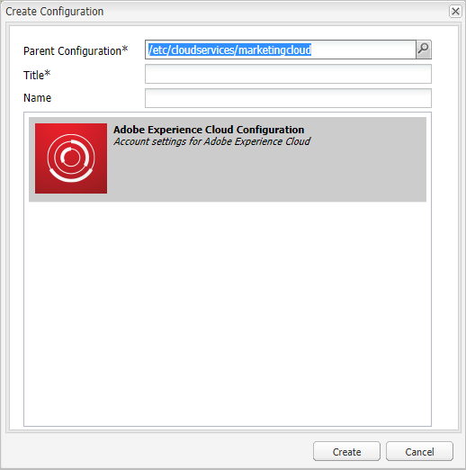

# 設定AEM Assets與Experience Cloud的整合 {#configure-aem-assets-integration-with-experience-cloud-and-creative-cloud}

如果您是Adobe Experience Cloud客戶，可以將Adobe Experience Manager Assets內的資產與Adobe Creative Cloud同步，反之亦然。 您也可以將資產與Experience Cloud同步，反之亦然。 您可以透過 [!DNL Adobe I/O]. 更新的名稱 [!DNL Adobe Marketing Cloud] is [!DNL Adobe Experience Cloud].

設定此整合的工作流程為：

1. 在中建立驗證 [!DNL Adobe I/O] 使用公用閘道並取得應用程式ID。
1. 使用應用程式ID在您的AEM Assets例項上建立設定檔。
1. 使用此設定來同步您的資產。

在後端，AEM伺服器會透過閘道驗證您的設定檔，然後在Assets和Experience Cloud之間同步資料。

>[!NOTE]
>
>此功能已於 [!DNL Assets]. 在中查找替換項 [AEM與Creative Cloud整合最佳實務](/help/assets/aem-cc-integration-best-practices.md). 如果你有任何疑問， [聯絡Adobe客戶支援](https://www.adobe.com/tw/account/sign-in.supportportal.html).

<!-- Hiding this for now via cqdoc-16834.

>[!NOTE]
>
>Sharing assets between Adobe Experience Cloud and Adobe Creative Cloud requires administrator privileges on the AEM instance.
-->

## 建立應用程式 {#create-an-application}

1. 登入以存取Adobe Developer閘道介面 [https://legacy-oauth.cloud.adobe.io](https://legacy-oauth.cloud.adobe.io/).

   >[!NOTE]
   >
   >建立應用程式ID需要管理員權限。

1. 從左窗格導覽至 **[!UICONTROL 開發人員工具]** > **[!UICONTROL 應用程式]** 查看應用程式清單。
1. 按一下 **[!UICONTROL 新增]**  來建立應用程式。
1. 從 **[!UICONTROL 客戶端憑據]** 清單，選擇 **[!UICONTROL 服務帳戶（JWT斷言）]**，此為伺服器對伺服器驗證的通訊服務。

   

1. 指定應用程式的名稱和可選說明。
1. 從 **[!UICONTROL 組織]** 清單中，選取您要同步資產的組織。
1. 從 **[!UICONTROL 範圍]** 清單，選擇 **[!UICONTROL dam-read]**, **[!UICONTROL dam-sync]**, **[!UICONTROL dam-write]**，和 **[!UICONTROL cc-share]**.
1. 按一下&#x200B;**[!UICONTROL 建立]**。訊息會通知應用程式已建立。

   

1. 複製 **[!UICONTROL 應用程式ID]** 為新應用程式生成的。

   >[!CAUTION]
   >
   >請確定您不會不慎複製 **[!UICONTROL 應用程式密碼]** 而非 **[!UICONTROL 應用程式ID]**.

## 新增設定至Experience Cloud {#add-a-new-configuration}

1. 按一下您本機AEM Assets執行個體使用者介面上的AEM標誌，並導覽至 **[!UICONTROL 工具]** > **[!UICONTROL Cloud Services]** > **[!UICONTROL 舊版Cloud Services]**.

1. 找出 **[!UICONTROL Adobe Experience Cloud]** 服務。 如果沒有任何設定，請按一下 **[!UICONTROL 立即配置]**. 如果存在配置，請按一下 **[!UICONTROL 顯示配置]** 按一下 `+` 新增配置。

   >[!NOTE]
   >
   >使用具有組織管理員權限的Adobe ID帳戶。

1. 在 **[!UICONTROL 建立配置]** 對話框，指定新配置的標題和名稱，然後按一下 **[!UICONTROL 建立]**.

   

1. 在 **[!UICONTROL 租用戶URL]** 欄位，指定AEM Assets的URL。 過去，如果URL定義為 `https://<tenant_id>.marketing.adobe.com`，請變更為 `https://<tenant_id>.experiencecloud.adobe.com`.

   1. 導覽至「 **工具 > 雲端服務 >舊 版雲端服務」**。在Adobe Experience Cloud底下，按一下 **顯示配置**.
   1. 選取要編輯的現有設定。 編輯設定並取代 `marketing.adobe.com` to `experiencecloud.adobe.com`.
   1. 儲存設定。測試MAC同步復寫代理。

1. 在 **[!UICONTROL 用戶端ID]** 欄位中，在程式結尾貼上您複製的應用程式ID [建立應用程式](#create-an-application).

   

1. 在 **[!UICONTROL 同步]** 選取 **[!UICONTROL 已啟用]** 要啟用同步，請按一下 **[!UICONTROL 確定]**. 如果您選取 **停用**，同步會以單一方向運作。

1. 在設定頁面中，按一下 **[!UICONTROL 顯示公開金鑰]** 顯示為執行個體產生的公開金鑰。 或者，按一下 **[!UICONTROL 下載OAuth閘道的公開金鑰]** 下載包含公開金鑰的檔案。 接著，開啟檔案以顯示公開金鑰。

## 啟用同步 {#enable-synchronization}

1. 使用程式最後一個步驟中提及的下列其中一個方法來顯示公開金鑰 [新增設定至Experience Cloud](#add-a-new-configuration). 按一下 **[!UICONTROL 顯示公開金鑰]**.

1. 複製公開金鑰並貼到 **[!UICONTROL 公開金鑰]** 在中建立的應用程式的配置介面欄位 [建立應用程式](#create-an-application).

   

1. 按一下 **[!UICONTROL 更新]**. 立即將資產與AEM Assets例項同步。

## 測試同步 {#test-the-synchronization}

1. 按一下您本機AEM Assets執行個體使用者介面上的AEM標誌，並導覽至 **[!UICONTROL 工具]**> **[!UICONTROL 部署]**> **[!UICONTROL 復寫]**查找為同步建立的複製配置檔案。
1. 在 **[!UICONTROL 復寫]** 頁面，按一下 **[!UICONTROL 作者代理]**.
1. 從設定檔清單中，按一下貴組織的預設復寫設定檔以開啟它。
1. 在對話方塊中，按一下 **[!UICONTROL 測試連線]**.

   

1. 當復寫結束時，在測試結果結尾處檢查是否有成功訊息。

## 新增使用者至Experience Cloud {#add-users-to-experience-cloud}

1. 使用管理員憑證登入Experience Cloud。
1. 從滑軌，轉到 **[!UICONTROL 管理]** 然後按一下 **[!UICONTROL 啟動Enterprise Dashboard]**.
1. 在邊欄中，按一下 **[!UICONTROL 使用者]** 開啟 **[!UICONTROL 使用者管理]** 頁面。
1. 在工具列中，按一下 **新增** .
1. 新增一或多個使用者，讓您能夠與Creative Cloud共用資產。

<!-- TBD: Check.
   >[!NOTE]
   >
   >Only the users that you add to Experience Cloud can share assets from AEM Assets to Creative Cloud.

-->

## 在AEM Assets和Experience Cloud之間交換資產 {#exchange-assets-between-aem-and-experience-cloud}

1. 登入AEM Assets。
1. 在「資產」主控台中，建立資料夾並上傳一些資產至該資料夾。 例如，建立資料夾 **mc-demo** 上傳資產。
1. 選取資料夾，然後按一下 **共用** .
1. 從功能表選取 **[!UICONTROL Adobe Experience Cloud]** 和按一下 **[!UICONTROL 共用]**. 訊息會通知資料夾已與Experience Cloud共用。

   >[!NOTE]
   >
   >共用類型的「資產」資料夾 `sling:OrderedFolder`，不支援在Adobe Experience Cloud中共用。 如果要共用資料夾，在AEM Assets中建立資料夾時，請勿選取 **[!UICONTROL 已訂購]** 選項。

1. 重新整理AEM Assets使用者介面。 您在本機AEM Assets執行個體的Assets控制台中建立的資料夾會複製到Experience Cloud使用者介面。 上傳至AEM Assets中資料夾的資產，會在AEM伺服器處理後顯示在Experience Cloud中資料夾的復本中。
1. 您也可以上傳Experience Cloud中資料夾複製副本中的資產。 處理完資產後，資產會顯示在AEM Assets的共用資料夾中。

<!-- Removing as per PM guidance via https://jira.corp.adobe.com/browse/CQDOC-16834?focusedCommentId=22881523&page=com.atlassian.jira.plugin.system.issuetabpanels:comment-tabpanel#comment-22881523.

## Exchange assets between AEM Assets and Creative Cloud {#exchange-assets-between-aem-assets-and-creative-cloud}

>[!CAUTION]
>
>The AEM to Creative Cloud Folder Sharing feature is deprecated. Customers are strongly advised to use newer capabilities, like [Adobe Asset Link](https://helpx.adobe.com/enterprise/using/adobe-asset-link.html) or [AEM desktop app](https://helpx.adobe.com/experience-manager/desktop-app/aem-desktop-app.html). Learn more in [AEM and Creative Cloud Integration Best Practices](/help/assets/aem-cc-integration-best-practices.md).

AEM Assets lets you share folders containing assets with Adobe Creative Cloud users.

1. In the Assets console, select the folder to share with Creative Cloud.
1. From the toolbar, click **[!UICONTROL Share]** .
1. From the list, select the **[!UICONTROL Adobe Creative Cloud]** option.

   >[!NOTE]
   >
   >The options are available for users with read permissions on the root. Users must have the required permission to access the replication agent information of Marketing Cloud.

1. In the **[!UICONTROL Creative Cloud Sharing]** page, add the user to share the folder with and choose a role for the user. Click **[!UICONTROL Save]** and click **[!UICONTROL OK]**.

1. Log on to Creative Cloud with the credentials of the user you shared the folder with. The shared folder is available in Creative Cloud.

The AEM Assets-Marketing Cloud synchronization is designed in a way that the user machine instance from where the asset is uploaded retains the right to modify the asset. Only these changes are propagated to the other instance.

For example, if an asset is uploaded from an AEM Assets (on premises) instance, the changes to the asset from this instance are propagated to the Marketing Cloud instance. However, the changes done from the Marketing Cloud instance to the same asset aren’t propagated to the AEM instance and vice versa for asset uploaded from Marketing Cloud.
-->

>[!MORELIKETHIS]
>
>* [資產與Creative Cloud整合最佳實務](/help/assets/aem-cc-integration-best-practices.md)

