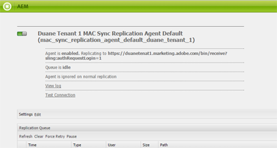

# 設定AEM Assets與Experience Cloud的整合 {#configure-aem-assets-integration-with-experience-cloud-and-creative-cloud}

如果您是Adobe Experience Cloud客戶，則可以將Adobe Experience Manager Assets中的資產與Adobe Creative Cloud同步，反之亦然。 您也可以將資產與Experience Cloud同步，反之亦然。 您可以透過[!DNL Adobe I/O]設定此同步處理。 [!DNL Adobe Marketing Cloud]的更新名稱是[!DNL Adobe Experience Cloud]。

設定此整合的工作流程為：

1. 使用公用閘道在[!DNL Adobe I/O]中建立驗證，並取得應用程式識別碼。
1. 使用應用程式ID在您的AEM Assets執行個體上建立設定檔。
1. 使用此設定來同步您的資產。

在後端，AEM伺服器會與閘道驗證您的設定檔，然後在Assets和Experience Cloud之間同步資料。

>[!NOTE]
>
>[!DNL Assets]已棄用此功能。 在[AEM和Creative Cloud整合最佳實務](/help/assets/aem-cc-integration-best-practices.md)中尋找替代專案。 若您有任何疑問，請[聯絡Adobe客戶支援](https://www.adobe.com/tw/account/sign-in.supportportal.html)。

<!-- Hiding this for now via cqdoc-16834.

>[!NOTE]
>
>Sharing assets between Adobe Experience Cloud and Adobe Creative Cloud requires administrator privileges on the AEM instance.
-->

## 建立應用程式 {#create-an-application}

1. 在[https://legacy-oauth.cloud.adobe.io](https://legacy-oauth.cloud.adobe.io/)登入，以存取Adobe Developer閘道介面。

   >[!NOTE]
   >
   >您需要管理員許可權才能建立應用程式ID。

1. 從左窗格，瀏覽至&#x200B;**[!UICONTROL 開發人員工具]** > **[!UICONTROL 應用程式]**&#x200B;以檢視應用程式清單。
1. 按一下&#x200B;**[!UICONTROL 新增]** 以建立應用程式。
1. 從&#x200B;**[!UICONTROL 使用者端認證]**&#x200B;清單中，選取&#x200B;**[!UICONTROL 服務帳戶（JWT宣告）]**，這是伺服器間通訊服務，用於伺服器驗證。

   

1. 指定應用程式的名稱和選擇性說明。
1. 從&#x200B;**[!UICONTROL 組織]**&#x200B;清單中，選取您要同步資產的組織。
1. 從&#x200B;**[!UICONTROL 領域]**&#x200B;清單中，選取&#x200B;**[!UICONTROL dam-read]**、**[!UICONTROL dam-sync]**、**[!UICONTROL dam-write]**&#x200B;和&#x200B;**[!UICONTROL cc-share]**。
1. 按一下「**[!UICONTROL 建立]**」。訊息會通知已建立應用程式。

   

1. 復製為新應用程式產生的&#x200B;**[!UICONTROL 應用程式識別碼]**。

   >[!CAUTION]
   >
   >請確定您不會不慎複製&#x200B;**[!UICONTROL 應用程式密碼]**，而非&#x200B;**[!UICONTROL 應用程式識別碼]**。

## 新增設定至Experience Cloud {#add-a-new-configuration}

1. 按一下本機AEM Assets執行個體使用者介面上的AEM標誌，並導覽至&#x200B;**[!UICONTROL 工具]** > **[!UICONTROL Cloud Service]** > **[!UICONTROL 舊版Cloud Service]**。

1. 找到&#x200B;**[!UICONTROL Adobe Experience Cloud]**&#x200B;服務。 如果沒有任何組態，請按一下[立即設定] ****。 如果組態存在，請按一下[顯示組態] ****，然後按一下[顯示組態] `+`以新增組態。

   >[!NOTE]
   >
   >使用具有組織管理員許可權的Adobe ID帳戶。

1. 在&#x200B;**[!UICONTROL 建立設定]**&#x200B;對話方塊中，指定新設定的標題和名稱，然後按一下&#x200B;**[!UICONTROL 建立]**。

   

1. 在&#x200B;**[!UICONTROL 租使用者URL]**&#x200B;欄位中，指定AEM Assets的URL。 在過去，如果URL定義為`https://<tenant_id>.marketing.adobe.com`，請將其變更為`https://<tenant_id>.experiencecloud.adobe.com`。

   1. 導覽至&#x200B;**工具>Cloud Service>舊版Cloud Service**。 在Adobe Experience Cloud底下，按一下&#x200B;**顯示組態**。
   1. 選取要編輯的現有設定。 編輯設定並將`marketing.adobe.com`取代為`experiencecloud.adobe.com`。
   1. 儲存設定。 測試MAC同步復寫代理。

1. 在&#x200B;**[!UICONTROL 使用者端識別碼]**&#x200B;欄位中，貼上您在程式[建立應用程式](#create-an-application)結尾複製的應用程式識別碼。

   

1. 在「**[!UICONTROL 同步化]**」下，選取「**[!UICONTROL 已啟用]**」以啟用同步化，然後按一下「**[!UICONTROL 確定]**」。 如果您選取&#x200B;**已停用**，同步化會以單一方向運作。

1. 從設定頁面，按一下&#x200B;**[!UICONTROL 顯示公開金鑰]**&#x200B;以顯示針對您的執行個體產生的公開金鑰。 或者，按一下&#x200B;**[!UICONTROL 下載OAuth閘道的公開金鑰]**&#x200B;以下載包含公開金鑰的檔案。 然後，開啟檔案以顯示公開金鑰。

## 啟用同步 {#enable-synchronization}

1. 使用程式[新增組態至Experience Cloud](#add-a-new-configuration)的最後一步中所提及的下列方法之一來顯示公開金鑰。 按一下&#x200B;**[!UICONTROL 顯示公開金鑰]**。

1. 複製公開金鑰並將其貼到您在[建立應用程式](#create-an-application)中建立之應用程式組態介面的&#x200B;**[!UICONTROL 公開金鑰]**&#x200B;欄位中。

   

1. 按一下&#x200B;**[!UICONTROL 更新]**。 立即將您的資產與AEM Assets執行個體同步。

## 測試同步 {#test-the-synchronization}

1. 按一下本機AEM Assets執行個體使用者介面上的AEM標誌，並導覽至&#x200B;**[!UICONTROL 工具]**> **[!UICONTROL 部署]**> **[!UICONTROL 復寫]**，以找出為同步處理所建立的復寫設定檔。
1. 在&#x200B;**[!UICONTROL 復寫]**&#x200B;頁面上，按一下作者上的&#x200B;**[!UICONTROL 代理程式]**。
1. 從設定檔清單中，按一下您組織的預設復寫設定檔以開啟它。
1. 在對話方塊中，按一下&#x200B;**[!UICONTROL 測試連線]**。

   

1. 復寫回覆完成時，請在測試結果結束時檢查成功訊息。

## 將使用者新增至Experience Cloud {#add-users-to-experience-cloud}

1. 使用系統管理員認證登入Experience Cloud。
1. 從導軌移至&#x200B;**[!UICONTROL 管理]**，然後按一下&#x200B;**[!UICONTROL 啟動Enterprise Dashboard]**。
1. 從邊欄中，按一下&#x200B;**[!UICONTROL 使用者]**&#x200B;以開啟&#x200B;**[!UICONTROL 使用者管理]**&#x200B;頁面。
1. 在工具列中按一下&#x200B;**新增** 。
1. 新增一或多個使用者，讓您提供與Creative Cloud共用資產的能力。

<!-- TBD: Check.
   >[!NOTE]
   >
   >Only the users that you add to Experience Cloud can share assets from AEM Assets to Creative Cloud.

-->

## 在AEM Assets和Experience Cloud之間交換資產 {#exchange-assets-between-aem-and-experience-cloud}

1. 登入AEM Assets。
1. 在Assets主控台中，建立資料夾並上傳部分資產至該資料夾。 例如，建立資料夾&#x200B;**mc-demo**&#x200B;並上傳資產至該資料夾。
1. 選取資料夾並按一下&#x200B;**共用** 。
1. 從功能表中選取&#x200B;**[!UICONTROL Adobe Experience Cloud]**，然後按一下&#x200B;**[!UICONTROL 共用]**。 訊息會通知與Experience Cloud共用資料夾。

   >[!NOTE]
   >
   >在Adobe Experience Cloud中共用內容中不支援共用型別`sling:OrderedFolder`的Assets資料夾。 如果您想要共用資料夾，在AEM Assets中建立資料夾時，請勿選取&#x200B;**[!UICONTROL 已訂購]**&#x200B;選項。

1. 重新整理AEM Assets使用者介面。 您在本機AEM Assets執行個體的Assets主控台中建立的資料夾，會複製到Experience Cloud使用者介面。 上傳至AEM Assets資料夾的資產會由AEM伺服器處理後，顯示在Experience Cloud資料夾副本中。
1. 您也可以在Experience Cloud中，上傳資料夾復寫復本中的資產。 處理之後，資產會顯示在AEM Assets的共用資料夾中。

<!-- Removing as per PM guidance via https://jira.corp.adobe.com/browse/CQDOC-16834?focusedCommentId=22881523&page=com.atlassian.jira.plugin.system.issuetabpanels:comment-tabpanel#comment-22881523.

## Exchange assets between AEM Assets and Creative Cloud {#exchange-assets-between-aem-assets-and-creative-cloud}

>[!CAUTION]
>
>The AEM to Creative Cloud Folder Sharing feature is deprecated. Customers are strongly advised to use newer capabilities, like [Adobe Asset Link](https://helpx.adobe.com/enterprise/using/adobe-asset-link.html) or [AEM desktop app](https://helpx.adobe.com/experience-manager/desktop-app/aem-desktop-app.html). Learn more in [AEM and Creative Cloud Integration Best Practices](/help/assets/aem-cc-integration-best-practices.md).

AEM Assets lets you share folders containing assets with Adobe Creative Cloud users.

1. In the Assets console, select the folder to share with Creative Cloud.
1. From the toolbar, click **[!UICONTROL Share]** .
1. From the list, select the **[!UICONTROL Adobe Creative Cloud]** option.

   >[!NOTE]
   >
   >The options are available for users with read permissions on the root. Users must have the required permission to access the replication agent information of Marketing Cloud.

1. In the **[!UICONTROL Creative Cloud Sharing]** page, add the user to share the folder with and choose a role for the user. Click **[!UICONTROL Save]** and click **[!UICONTROL OK]**.

1. Log on to Creative Cloud with the credentials of the user you shared the folder with. The shared folder is available in Creative Cloud.

The AEM Assets-Marketing Cloud synchronization is designed in a way that the user machine instance from where the asset is uploaded retains the right to modify the asset. Only these changes are propagated to the other instance.

For example, if an asset is uploaded from an AEM Assets (on premises) instance, the changes to the asset from this instance are propagated to the Marketing Cloud instance. However, the changes done from the Marketing Cloud instance to the same asset aren’t propagated to the AEM instance and conversely for asset uploaded from Marketing Cloud.
-->

>[!MORELIKETHIS]
>
>* [Assets與Creative Cloud整合最佳實務](/help/assets/aem-cc-integration-best-practices.md)
