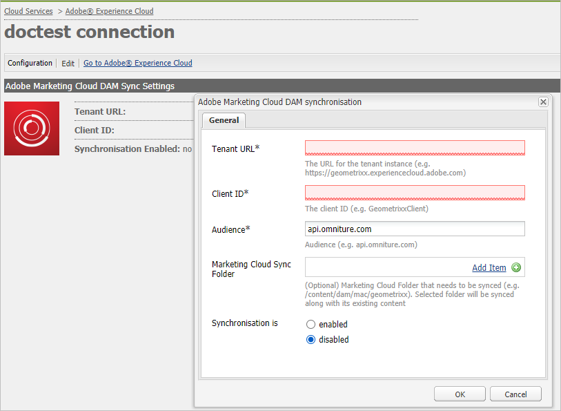

# 設定AEM Assets與Experience Cloud和Creative Cloud的整合{#configure-aem-assets-integration-with-experience-cloud-and-creative-cloud}

如果您是Adobe Experience Cloud客戶，您可以將Adobe Experience Manager Assets中的資產與Adobe Creative Cloud同步，反之亦然。 您也可以將資產與Experience Cloud同步，反之亦然。 可以通過[!DNL Adobe I/O]設定此同步。

設定此整合的工作流程為：

1. 使用公用閘道在[!DNL Adobe I/O]中建立驗證，並取得應用程式ID。
1. 使用應用程式ID在您的AEM Assets例項上建立描述檔。
1. 使用此設定，將AEM Assets中的資產與Creative Cloud同步。

在後端，AEM伺服器會使用閘道驗證您的個人檔案，然後同步AEM Assets和Experience Cloud之間的資料。

>[!CAUTION]
>
>AEM Assets中已停用「AEM到Creative Cloud資料夾共用」功能。 進一步瞭解並尋找[AEM和Creative Cloud整合最佳實務](/help/assets/aem-cc-integration-best-practices.md)中的替代項目。

整合AEM Assets和Creative Cloud時的資料流程

>[!NOTE]
>
>在Adobe Experience Cloud和Adobe Creative Cloud之間共用資產需要AEM例項的管理員權限。

>[!CAUTION]
>
>Adobe Marketing Cloud已重新命名為Adobe Experience Cloud。 以下程式仍提及Marketing Cloud，以反映目前的介面。 這些提及將於稍後日期變更。

## 建立應用程式{#create-an-application}

1. 登入[https://legacy-oauth.cloud.adobe.io](https://legacy-oauth.cloud.adobe.io/)以存取Adobe開發人員閘道介面。

   >[!NOTE]
   >
   >您需要有管理員權限才能建立應用程式ID。

1. 從左窗格，導覽至「開發人員工具&#x200B;**[!UICONTROL >**[!UICONTROL &#x200B;應用程式&#x200B;]**」，以檢視應用程式清單。]**
1. 按一下「**[!UICONTROL 新增]** 」以建立應用程式。
1. 從&#x200B;**[!UICONTROL 客戶端憑據]**&#x200B;清單中，選擇&#x200B;**[!UICONTROL 服務帳戶（JWT斷言）]** ，該服務是用於伺服器身份驗證的伺服器到伺服器通信服務。

   

1. 指定應用程式的名稱和選用說明。
1. 從&#x200B;**[!UICONTROL 組織]**&#x200B;清單中，選擇要同步資產的組織。
1. 從&#x200B;**[!UICONTROL Scope]**&#x200B;清單中，選擇&#x200B;**[!UICONTROL dam-read]**、**[!UICONTROL dam-sync]**、**[!UICONTROL dam-write]**&#x200B;和&#x200B;**[!UICONTROL cc-share]**。
1. 按一下&#x200B;**[!UICONTROL 建立]**。訊息會通知應用程式已建立。

   

1. 複製為新應用程式生成的&#x200B;**[!UICONTROL 應用程式ID]**。

   >[!CAUTION]
   >
   >請確定您不會不慎複製&#x200B;**[!UICONTROL 應用程式密碼]**，而非&#x200B;**[!UICONTROL 應用程式ID]**。

## 新增設定至Marketing Cloud {#add-a-new-configuration-to-marketing-cloud}

1. 按一下您本機AEM Assets例項使用者介面上的AEM標誌，並導覽至&#x200B;**[!UICONTROL 工具]** > **[!UICONTROL 雲端服務]** > **[!UICONTROL 舊版雲端服務]**。

1. 找到&#x200B;**[!UICONTROL Adobe Marketing Cloud]**&#x200B;服務。 如果不存在配置，請按一下「立即配置」。 ****&#x200B;如果配置存在，請按一下「顯示配置」 **[!UICONTROL ，然後按一下「`+` 」添加新配置。]**

   >[!NOTE]
   >
   >使用具有組織管理員權限的Adobe ID帳戶。

1. 在&#x200B;**[!UICONTROL 建立配置]**&#x200B;對話框中，指定新配置的標題和名稱，然後按一下&#x200B;**[!UICONTROL 建立]**。

   

1. 在&#x200B;**[!UICONTROL 租用戶URL]**&#x200B;欄位中，指定AEM資產的URL。

   >[!CAUTION]
   >
   >由於重新品牌化，如果您將租用戶URL輸入為`https://<tenant_id>.marketing.adobe.com`，則需將其變更為`https://<tenant_id>.experiencecloud.adobe.com.`。若要這麼做，請遵循下列步驟：
   >
   >1. 導覽至「 **工具 > 雲端服務 >舊 版雲端服務」**。
   1. 在Adobe Marketing Cloud下，按一下「顯示設定」。****
   1. 選取設定AEM-MAC-CC同步時建立的設定。
   1. 編輯cloudservice設定，並將「租用戶URL」欄位中的&#x200B;**marketing.adobe.com**&#x200B;取代為&#x200B;**experiencecloud.adobe.com**。
   1. 儲存設定。
   1. 測試Mac-sync複製代理。

1. 在&#x200B;**[!UICONTROL 客戶端ID]**&#x200B;欄位中，將您在[過程](/help/sites-administering/configure-assets-cc-integration.md#create-an-application)結束時複製的應用程式ID貼上到中。

   

1. 在&#x200B;**[!UICONTROL Synchronization]**&#x200B;下，選擇&#x200B;**[!UICONTROL Enabled]**&#x200B;啟用同步，然後按一下&#x200B;**[!UICONTROL OK]**。

   >[!NOTE]
   如果選擇&#x200B;**disabled** ，同步將沿單個方向運行。

1. 在配置頁中，按一下「顯示公共密鑰」**[!UICONTROL 以顯示為實例生成的公共密鑰。]**&#x200B;或者，按一下「下載OAuth閘道的公開金鑰」，下載包含公開金鑰的檔案。 ****&#x200B;然後，開啟檔案以顯示公開金鑰。

## 啟用同步{#enable-synchronization}

1. 使用程式[新增設定至Marketing Cloud](/help/sites-administering/configure-assets-cc-integration.md#add-a-new-configuration-to-marketing-cloud)最後一步中提及的下列其中一種方法來顯示公開金鑰。 按一下「顯示公鑰」。****

   

1. 複製公開密鑰並將其貼上到您在[建立應用程式](/help/sites-administering/configure-assets-cc-integration.md#create-an-application)中建立的應用程式的配置介面的&#x200B;**[!UICONTROL Public Key]**&#x200B;欄位中。

   

1. 按一下&#x200B;**[!UICONTROL Update]**。 立即將您的資產與AEM Assets例項同步。

## 測試同步{#test-the-synchronization}

1. 按一下您本機AEM Assets例項使用者介面上的AEM標誌，並導覽至&#x200B;**[!UICONTROL Tools]****[!UICONTROL Deployment]** **[!UICONTROL Replication]**，以找出為同步建立的複製設定檔。
1. 在&#x200B;**[!UICONTROL 複製]**&#x200B;頁上，按一下&#x200B;**[!UICONTROL 作者上的代理]**。
1. 從配置檔案清單中，按一下組織的預設複製配置檔案以將其開啟。
1. 在對話框中，按一下&#x200B;**[!UICONTROL 測試連接]**。

   

1. 當複製剩餘時間完成時，在測試結果結束時檢查成功消息。

## 新增使用者至Marketing Cloud {#add-users-to-marketing-cloud}

1. 使用管理員認證登入Marketing Cloud。
1. 從滑軌轉至「**[!UICONTROL 管理]**」，然後按一下／點選「啟動Enterprise Dashboard ]**」。**[!UICONTROL 
1. 從邊欄按一下「**[!UICONTROL 使用者]**」以開啟「使用者管理&#x200B;]**」頁面。**[!UICONTROL 
1. 在工具列中按一下／點選&#x200B;**Add** 。
1. 新增一或多個您想要提供與Creative Cloud共用資產的使用者。

   >[!NOTE]
   只有您新增至Marketing Cloud的使用者可以將AEM Assets中的資產共用至Creative Cloud。

## 在AEM Assets和Marketing Cloud之間交換資產{#exchange-assets-between-aem-assets-and-marketing-cloud}

1. 登入AEM Assets。
1. 在「資產」主控台中，建立資料夾並上傳部分資產至該資料夾。 例如，建立資料夾&#x200B;**mc-demo**&#x200B;並上傳資產至它。
1. 選擇該資料夾，然後按一下&#x200B;**Share** 。
1. 從功能表中，選擇&#x200B;**[!UICONTROL Adobe Marketing Cloud]**，然後按一下&#x200B;**[!UICONTROL Share]**。 訊息會通知資料夾已與Marketing Cloud共用。

   

   >[!NOTE]
   在Adobe Marketing Cloud中共用類型`sling:OrderedFolder`的「資產」檔案夾不受支援。 如果您想要共用資料夾，在AEM Assets中建立資料夾時，請勿選取&#x200B;**[!UICONTROL Ordered]**&#x200B;選項。

1. 重新整理AEM Assets使用者介面。 您在本機AEM Assets例項的「資產」主控台中建立的檔案夾會複製至Marketing Cloud UI。 您上傳至「AEM資產」中檔案夾的資產，會在AEM伺服器處理後，顯示在Marketing Cloud中檔案夾的復本中。
1. 您也可以在Marketing Cloud資料夾的複製副本中上傳資產。 處理完資產後，資產就會出現在AEM Assets的共用資料夾中。

## 在AEM Assets和Creative Cloud之間交換資產{#exchange-assets-between-aem-assets-and-creative-cloud}

>[!CAUTION]
「AEM到Creative Cloud資料夾共用」功能已過時。 強烈建議客戶使用較新的功能，例如[Adobe Asset Link](https://helpx.adobe.com/tw/enterprise/using/adobe-asset-link.html)或[AEM案頭應用程式](https://helpx.adobe.com/experience-manager/desktop-app/aem-desktop-app.html)。 進一步瞭解[AEM和Creative Cloud整合最佳實務](/help/assets/aem-cc-integration-best-practices.md)。

AEM Assets可讓您與Adobe Creative Cloud使用者共用包含資產的檔案夾。

1. 在「資產」主控台中，選取要與Creative Cloud共用的檔案夾。
1. 在工具列中，按一下「共用&#x200B;**** 」。
1. 從清單中，選取&#x200B;**[!UICONTROL Adobe Creative Cloud]**&#x200B;選項。

   >[!NOTE]
   這些選項適用於具有根目錄讀取權限的用戶。 使用者必須擁有存取Marketing Cloud複製代理資訊的必要權限。

1. 在&#x200B;**[!UICONTROL Creative Cloud共用]**&#x200B;頁面中，新增使用者以共用資料夾，並為使用者選擇角色。 按一下&#x200B;**[!UICONTROL 保存]** ，然後按一下&#x200B;**[!UICONTROL 確定]**。

1. 使用您共用資料夾之使用者的認證登入Creative Cloud。 共用資料夾可在Creative Cloud中使用。

AEM Assets-Marketing Cloud同步的設計方式，是讓上傳資產的使用者機器例項保留修改資產的權利。 只有這些更改才會傳播到另一個實例。

例如，如果資產是從AEM Assets（內部）例項上傳，則來自此例項的資產變更會傳播至Marketing Cloud例項。 不過，從Marketing Cloud例項對相同資產所做的變更不會傳播至AEM例項，從Marketing Cloud上傳的資產也會傳播至AEM例項。

>[!MORELIKETHIS]
* [AEM與Creative Cloud整合最佳實務](/help/assets/aem-cc-integration-best-practices.md)
* [AEM到Creative Cloud資料夾分享最佳實務](/help/assets/aem-cc-folder-sharing-best-practices.md)

