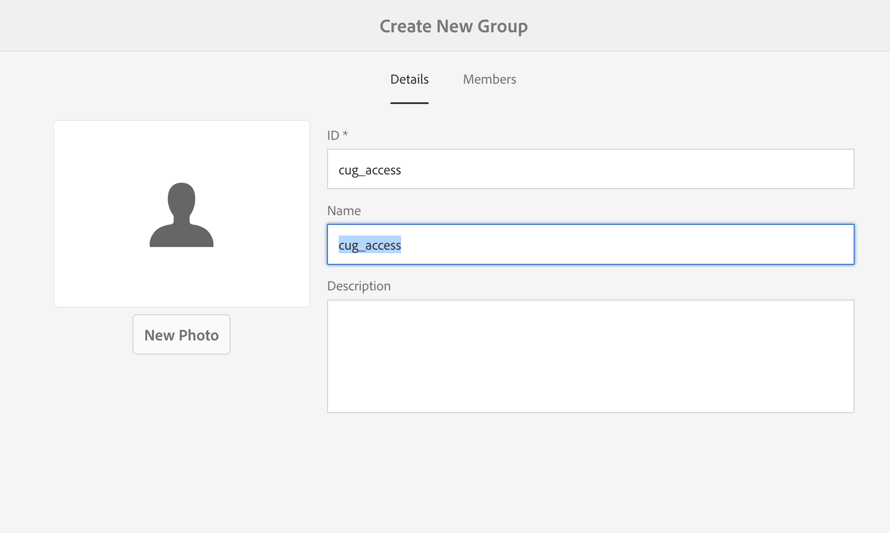

# 建立已關閉的用戶組{#creating-a-closed-user-group}

已關閉的使用者群組(CUG)可用來限制對已發佈網際網路網站中特定頁面的存取。 這些頁面需要指派的成員登入並提供安全憑證。

若要在您的網站中設定此區域，請：

* [建立實際關閉的用戶組並分配成員](#creating-the-user-group-to-be-used)。

* [將此群組套用至所](#applying-your-closed-user-group-to-content-pages) 需頁面，並選取（或建立）登入頁面供CUG成員使用；也會在套用CUG至內容頁面時指定。

* [建立連結，以某種形式連結至保護區內的至少一個頁面](#linking-to-the-realm)，否則將無法顯示。
* [配置](#configure-dispatcher-for-cugs) Dispatcherif正在使用。

>[!CAUTION]
>
>在建立封閉使用者群組時，一律應考量效能。
>
>雖然CUG中的使用者和群組數目不受限制，但頁面上的大量CUG可能會降低演算效能。
>
>執行效能測試時，應始終考慮CUG的影響。

## 建立要使用的用戶組{#creating-the-user-group-to-be-used}

要建立已關閉的用戶組，請執行以下操作：

1. 從自畫面移至&#x200B;**工具- Security&lt;a1/AEM>。**

   >[!NOTE]
   >
   >有關建立和配置用戶和組的完整資訊，請參閱[管理用戶和組](/help/sites-administering/security.md#managing-users-and-groups)。

1. 從下一螢幕中選擇&#x200B;**Groups**&#x200B;卡。

   

1. 按右上角的&#x200B;**Create**&#x200B;按鈕以建立新群組。
1. 命名新群組；例如，`cug_access`。

   

1. 轉到&#x200B;**成員**&#x200B;頁籤，並將所需用戶分配給此組。

   

1. 啟動您指派給CUG的任何使用者；在這種情況下，`cug_access`的所有成員。
1. 啟動關閉的使用者群組，以便在發佈環境中使用；在此範例中，`cug_access`。

## 將已關閉的使用者群組套用至內容頁面{#applying-your-closed-user-group-to-content-pages}

要將CUG應用於頁面：

1. 導覽至您要指派給CUG之受限制區段的根頁面。
1. 按一下頁面的縮圖，然後按一下頂端面板中的&#x200B;**屬性**，以選取頁面。

   

1. 在以下窗口中，轉至&#x200B;**Advanced**&#x200B;頁籤。
1. 向下捲動並啟用&#x200B;**Authentication Requirement**&#x200B;區段中的複選框。

1. 在下面添加配置路徑，然後按保存。
1. 接著，前往「**權限**」標籤，然後按「編輯已關閉的使用者群組&#x200B;**」按鈕。**

   

   >[注意!]
   >
   > 請注意，「權限」標籤中的CUG無法從「藍圖中即時拷貝」展開。 設定即時副本時，請針對此進行規劃。
   >
   > 如需詳細資訊，請參閱[本頁](closed-user-groups.md#aem-livecopy)。

1. 在以下窗口中查找並添加CUG —— 在此情況下，添加名為&#x200B;**cug_access**&#x200B;的組。 最後，按&#x200B;**Save**。
1. 按一下&#x200B;**Enabled**&#x200B;可定義此頁（和任何子頁）屬於CUG。
1. 指定群組成員將使用的&#x200B;**登入頁面**;例如：

   `/content/geometrixx/en/toolbar/login.html`

   如果保留為空白，則使用標準登入頁面。

1. 添加&#x200B;**已允許的組**。 使用+可新增群組或——可移除。 僅允許這些群組的成員登入並存取頁面。
1. 如果需要，請指派&#x200B;**Realm**（頁組的名稱）。 留空將使用頁面標題。
1. 按一下&#x200B;**確定**&#x200B;保存規範。

如需有關發佈環境中的設定檔以及提供登入和登出表單的資訊，請參閱[Identity Management](/help/sites-administering/identity-management.md)。

## 連結到領域{#linking-to-the-realm}

由於匿名使用者看不到任何CUG領域連結的目標，所以連結檢查程式會移除這些連結。

為避免此問題，建議您建立指向「CUG領域」內頁面的未受保護重新導向頁面。 然後，在不引起連結檢查器任何問題的情況下呈現導航條目。 只有在實際存取重新導向頁面時，使用者才會在CUG領域內重新導向——成功提供其登入認證後。

## 配置CUG的Dispatcher {#configure-dispatcher-for-cugs}

如果您使用Dispatcher，則需要定義具有以下屬性的Dispatcher群：

* [virtualhosts](https://helpx.adobe.com/experience-manager/dispatcher/using/dispatcher-configuration.html#identifying-virtual-hosts-virtualhosts):與CUG所套用之頁面的路徑相符。
* \sessionmanagement:請參閱以下內容。
* [快取](https://helpx.adobe.com/experience-manager/dispatcher/using/dispatcher-configuration.html#configuring-the-dispatcher-cache-cache):專用於CUG所應用檔案的快取目錄。

### 為CUG配置Dispatcher Session Management {#configuring-dispatcher-session-management-for-cugs}

在dispatcher.any檔案](https://helpx.adobe.com/experience-manager/dispatcher/using/dispatcher-configuration.html#enabling-secure-sessions-sessionmanagement)中為CUG配置[會話管理。 在CUG頁面要求存取時使用的驗證處理常式，會決定您如何設定工作階段管理。

```xml
/sessionmanagement
    ...
    /header "Cookie:login-token"
    ...
```

>[!NOTE]
>
>當Dispatcher群啟用會話管理時，群處理的所有頁面都不會進行快取。 若要快取CUG以外的頁面，請在dispatcher.any中建立第二個群
>處理非CUG頁面。

1. 通過定義`/directory`配置[/sessionmanagement](https://helpx.adobe.com/experience-manager/dispatcher/using/dispatcher-configuration.html#enabling-secure-sessions-sessionmanagement);例如：

   ```xml
   /sessionmanagement
     {
     /directory "/usr/local/apache/.sessions"
     ...
     }
   ```

1. 將[/allowAuthorized](https://helpx.adobe.com/experience-manager/dispatcher/using/dispatcher-configuration.html#caching-when-authentication-is-used)設為`0`。
