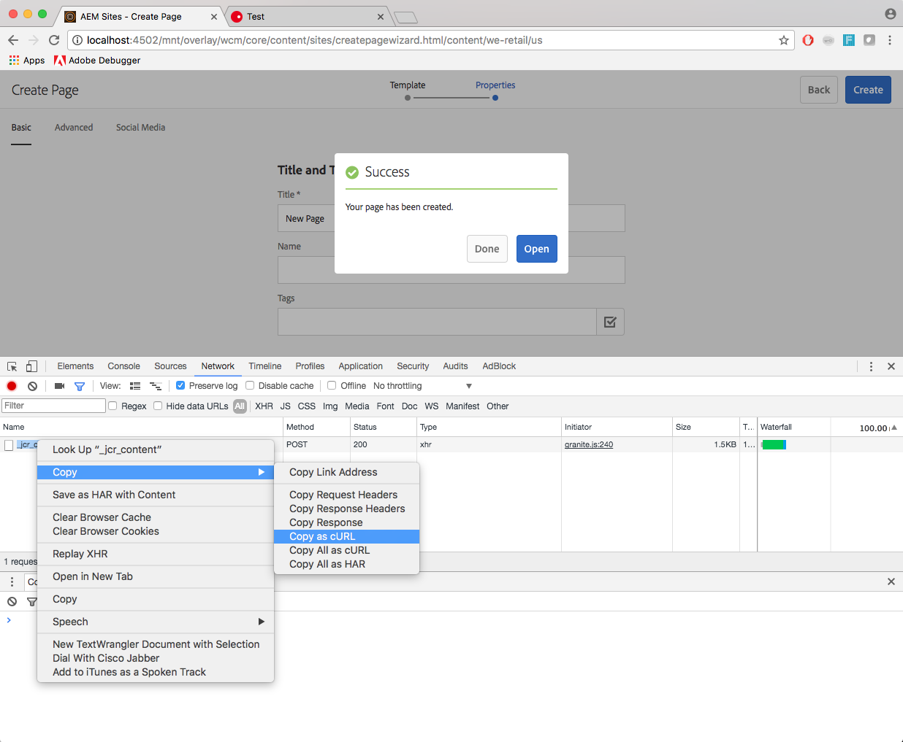

# 使用 cURL 搭配 AEM{#using-curl-with-aem}

管理員通常需要自動執行或簡化任何系統中的常見任務。 例如，在AEM中，管理使用者、安裝套件和管理OSGi套件組合是平常必須完成的工作。

由於AEM建置所在之Sling架構的RESTful性質，大部分工作都可使用URL呼叫來完成。 cURL可用來執行這類URL呼叫，可做為AEM管理員的實用工具。

## 什麼是cURL {#what-is-curl}

cURL是用來執行URL操作的開放原始碼命令列工具。 它支援廣泛的網際網路通訊協定，包括HTTP、HTTPS、FTP、FTPS、SCP、SFTP、TFTP、LDAP、DAP、DICT、TELNET、檔案、IMAP、POP3、SMTP和RTSP。

cURL是使用URL語法取得或傳送資料的成熟且廣泛使用的工具，最初於1997年發行。 cURL這個名稱原本的意思是「參閱URL」。

由於AEM建置所在之Sling架構的RESTful性質，大部分工作可以簡化為URL呼叫，而透過cURL執行。 [內容操控工作](/help/sites-administering/curl.md#common-content-manipulation-aem-curl-commands) （例如啟用頁面），以及開始工作流程和[操作工作](/help/sites-administering/curl.md#common-operational-aem-curl-commands) （例如封裝管理及管理使用者）可以使用cURL自動執行。 此外，您還可以[針對AEM中的大多數工作，建立您自己的cURL](/help/sites-administering/curl.md#building-a-curl-ready-aem-command)命令。

>[!NOTE]
>
>透過cURL執行的任何AEM命令，必須如同AEM的任何使用者一樣獲得授權。 使用cURL執行AEM命令時，會考量所有ACL和存取許可權。

## 正在下載cURL {#downloading-curl}

cURL 是macOS和一些Linux發行版的標準部分。 但是，它適用於大多數作系統。 最新的下載可以在 https://curl.haxx.se/download.html](https://curl.haxx.se/download.html) 找到[。

cURL 的源存放庫也可以在 GitHub 上找到。

## 建置cURL就緒的AEM命令 {#building-a-curl-ready-aem-command}

cURL命令可建置供AEM中的大部分作業使用，例如觸發工作流程、檢查OSGi設定、觸發JMX命令、建立復寫代理等等。

若要尋找特定操作所需的確切命令，您必須在執行AEM命令時，使用瀏覽器中的開發人員工具來擷取伺服器的POST呼叫。

以下步驟介紹如何使用在鉻黃瀏覽器中創建新頁面來執行此作。

1. 準備好要在 AEM 內叫用的動作。 在本例中，我們已經處理到建立頁面精靈&#x200B;**的末尾**，但尚未按兩下&#x200B;**建立**。

   

1. 開始開發人員工具，然後選擇“ **網络** ”標籤。 在清除主控台之前，按下保留 **日誌** 選項。

   

1. 按兩下建立中的&#x200B;**建立**&#x200B;頁面&#x200B;****&#x200B;精靈以實際創建工作流程。
1. 右鍵按兩下生成的POST作，然後選擇複製&#x200B;****>**複製為 cURL**。

   

1. 將 cURL 命令複製到文本編輯者並從命令中刪除所有標頭（開始（ `-H` 下圖中以藍色突出顯示）並添加正確的身份驗證參數，例如 `-u <user>:<password>`。

   

1. 透過命令列執行cURL命令並檢視回應。

   

## 常見的AEM cURL操作命令 {#common-operational-aem-curl-commands}

以下是常見管理和作業任務的AEM cURL命令清單。

>[!NOTE]
>
>下列範例假設AEM正在連線埠`4502`上的`localhost`上執行，並使用密碼為`admin`的使用者`admin`。 其他的命令預留位置設定在角括弧中。

### 封裝管理 {#package-management}

#### 列出所有已安裝的封裝

```shell
curl -u <user>:<password> http://<host>:<port>/crx/packmgr/service.jsp?cmd=ls
```

#### 建立封裝 {#create-a-package}

```shell
curl -u <user>:<password> -X POST http://localhost:4502/crx/packmgr/service/.json/etc/packages/mycontent.zip?cmd=create -d packageName=<name> -d groupName=<name>
```

#### 預覽套件 {#preview-a-package}

```shell
curl -u <user>:<password> -X POST http://localhost:4502/crx/packmgr/service/.json/etc/packages/mycontent.zip?cmd=preview
```

#### 列出封裝內容 {#list-package-content}

```shell
curl -u <user>:<password> -X POST http://localhost:4502/crx/packmgr/service/console.html/etc/packages/mycontent.zip?cmd=contents
```

#### 建立封裝 {#build-a-package}

```shell
curl -X POST http://localhost:4502/crx/packmgr/service/.json/etc/packages/mycontent.zip?cmd=build
```

#### 將包折行 {#rewrap-a-package}

```shell
curl -u <user>:<password> -X POST http://localhost:4502/crx/packmgr/service/.json/etc/packages/mycontent.zip?cmd=rewrap
```

#### 重新命名套裝 {#rename-a-package}

```shell
curl -u <user>:<password> -X POST -Fname=<New Name> http://localhost:4502/etc/packages/<Group Name>/<Package Name>.zip/jcr:content/vlt:definition
```

#### 上傳封裝 {#upload-a-package}

```shell
curl -u <user>:<password> -F cmd=upload -F force=true -F package=@test.zip http://localhost:4502/crx/packmgr/service/.json
```

#### 安裝套裝 {#install-a-package}

```shell
curl -u <user>:<password> -F cmd=install http://localhost:4502/crx/packmgr/service/.json/etc/packages/my_packages/test.zip
```

#### 卸載套裝 {#uninstall-a-package}

```shell
curl -u <user>:<password> -F cmd=uninstall http://localhost:4502/crx/packmgr/service/.json/etc/packages/my_packages/test.zip
```

#### 刪除套裝 {#delete-a-package}

```shell
curl -u <user>:<password> -F cmd=delete http://localhost:4502/crx/packmgr/service/.json/etc/packages/my_packages/test.zip
```

#### 下載套件 {#download-a-package}

```shell
curl -u <user>:<password> http://localhost:4502/etc/packages/my_packages/test.zip
```

#### 復寫封裝 {#replicate-a-package}

```shell
curl -u <user>:<password> -X POST http://localhost:4502/crx/packmgr/service/.json/etc/packages/my_packages/test.zip?cmd=replicate
```

### 使用者管理 {#user-management}

#### 建立新使用者 {#create-a-new-user}

```shell
curl -u <user>:<password> -FcreateUser= -FauthorizableId=hashim -Frep:password=hashim http://localhost:4502/libs/granite/security/post/authorizables
```

#### 建立新群組 {#create-a-new-group}

```shell
curl -u <user>:<password> -FcreateGroup=group1 -FauthorizableId=testGroup1 http://localhost:4502/libs/granite/security/post/authorizables
```

#### 將屬性新增至現有使用者 {#add-a-property-to-an-existing-user}

```shell
curl -u <user>:<password> -Fprofile/age=25 http://localhost:4502/home/users/h/hashim.rw.html
```

#### 使用設定檔建立使用者 {#create-a-user-with-a-profile}

```shell
curl -u <user>:<password> -FcreateUser=testuser -FauthorizableId=hashimkhan -Frep:password=hashimkhan -Fprofile/gender=male http://localhost:4502/libs/granite/security/post/authorizables
```

#### 建立新使用者作為群組成員 {#create-a-new-user-as-a-member-of-a-group}

```shell
curl -u <user>:<password> -FcreateUser=testuser -FauthorizableId=testuser -Frep:password=abc123 -Fmembership=contributor http://localhost:4502/libs/granite/security/post/authorizables
```

#### 新增使用者至群組 {#add-a-user-to-a-group}

```shell
curl -u <user>:<password> -FaddMembers=testuser1 http://localhost:4502/home/groups/t/testGroup.rw.html
```

#### 從群組移除使用者 {#remove-a-user-from-a-group}

```shell
curl -u <user>:<password> -FremoveMembers=testuser1 http://localhost:4502/home/groups/t/testGroup.rw.html
```

#### 設定使用者的群組成員身份 {#set-a-user-s-group-membership}

```shell
curl -u <user>:<password> -Fmembership=contributor -Fmembership=testgroup http://localhost:4502/home/users/t/testuser.rw.html
```

#### 刪除使用者 {#delete-a-user}

```shell
curl -u <user>:<password> -FdeleteAuthorizable= http://localhost:4502/home/users/t/testuser
```

#### 刪除群組 {#delete-a-group}

```shell
curl -u <user>:<password> -FdeleteAuthorizable= http://localhost:4502/home/groups/t/testGroup
```

### 備份 {#backup}

有關詳細資訊，請參閱 [備份和還原](/help/sites-administering/backup-and-restore.md#automating-aem-online-backup) 。

### osgi {#osgi}

#### 啟動套件組合 {#starting-a-bundle}

```shell
curl -u <user>:<password> -Faction=start http://localhost:4502/system/console/bundles/<bundle-name>
```

#### 停止套件組合 {#stopping-a-bundle}

```shell
curl -u <user>:<password> -Faction=stop http://localhost:4502/system/console/bundles/<bundle-name>
```

### Dispatcher {#dispatcher}

#### 使快取失效 {#invalidate-the-cache}

```shell
curl -H "CQ-Action: Activate" -H "CQ-Handle: /content/test-site/" -H "CQ-Path: /content/test-site/" -H "Content-Length: 0" -H "Content-Type: application/octet-stream" http://localhost:4502/dispatcher/invalidate.cache
```

#### 逐出緩存 {#evict-the-cache}

```shell
curl -H "CQ-Action: Deactivate" -H "CQ-Handle: /content/test-site/" -H "CQ-Path: /content/test-site/" -H "Content-Length: 0" -H "Content-Type: application/octet-stream" http://localhost:4502/dispatcher/invalidate.cache
```

### 複寫代理 {#replication-agent}

#### 檢查代理程式的狀態 {#check-the-status-of-an-agent}

```shell
curl -u <user>:<password> "http://localhost:4502/etc/replication/agents.author/publish/jcr:content.queue.json?agent=publish"
http://localhost:4502/etc/replication/agents.author/publish/jcr:content.queue.json?agent=publish
```

#### 刪除代理程式 {#delete-an-agent}

```shell
curl -X DELETE http://localhost:4502/etc/replication/agents.author/replication99 -u <user>:<password>
```

#### 建立代理程式 {#create-an-agent}

```shell
curl -u <user>:<password> -F "jcr:primaryType=cq:Page" -F "jcr:content/jcr:title=new-replication" -F "jcr:content/sling:resourceType=/libs/cq/replication/components/agent" -F "jcr:content/template=/libs/cq/replication/templates/agent" -F "jcr:content/transportUri=http://localhost:4503/bin/receive?sling:authRequestLogin=1" -F "jcr:content/transportUser=admin" -F "jcr:content/transportPassword={DES}8aadb625ced91ac483390ebc10640cdf"http://localhost:4502/etc/replication/agents.author/replication99
```

#### 暫停代理程式 {#pause-an-agent}

```shell
curl -u <user>:<password> -F "cmd=pause" -F "name=publish"  http://localhost:4502/etc/replication/agents.author/publish/jcr:content.queue.json
```

#### 清除代理佇列 {#clear-an-agent-queue}

```shell
curl -u <user>:<password> -F "cmd=clear" -F "name=publish"  http://localhost:4502/etc/replication/agents.author/publish/jcr:content.queue.json
```

### Communities {#communities}

#### 指派和撤銷徽章 {#assign-and-revoke-badges}

如需詳細資訊，請參閱[社群評分和預算](/help/communities/implementing-scoring.md#assign-and-revoke-badges)。

如需詳細資訊，請參閱[評分和徽章要點](/help/communities/configure-scoring.md#example-setup)。

#### MSRP重新索引 {#msrp-reindexing}

有關詳細資訊，請參閱 [MSRP - MongoDB 儲存資源提供程式](/help/communities/msrp.md#running-msrp-reindex-tool-using-curl-command) 。

### 安全性 {#security}

#### 啟用和停用CRX DE Lite {#enabling-and-disabling-crx-de-lite}

有關詳細資訊，請參閱 [在 AEM](/help/sites-administering/enabling-crxde-lite.md) 中啟用 CRXDE Lite。

### 資料存放庫廢棄項目收集 {#data-store-garbage-collection}

有關詳細資訊，請參閱 [數據存儲廢棄專案收集](/help/sites-administering/data-store-garbage-collection.md#automating-data-store-garbage-collection) 。

### Analytics和 Target 整合 {#analytics-and-target-integration}

如需詳細資訊，請參閱 [選擇加入Adobe Analytics與Adobe Target](/help/sites-administering/opt-in.md#configuring-the-setup-and-provisioning-via-script) 。

### 單一登錄 {#single-sign-on}

#### 傳送測試標題 {#send-test-header}

有關詳細資訊，請參閱 [單一登錄](/help/sites-deploying/single-sign-on.md) 。

## 常見的內容操作AEM cURL命令 {#common-content-manipulation-aem-curl-commands}

以下是內容操作的AEM cURL命令清單。

>[!NOTE]
>
>下列範例假設AEM正在連線埠`4502`上的`localhost`上執行，並使用密碼為`admin`的使用者`admin`。 其他的命令預留位置設定在角括弧中。

### 頁面管理 {#page-management}

#### 頁面啟用 {#page-activation}

```shell
curl -u <user>:<password> -X POST -F path="/content/path/to/page" -F cmd="activate" http://localhost:4502/bin/replicate.json
```

#### 頁面停用 {#page-deactivation}

```shell
curl -u <user>:<password> -X POST -F path="/content/path/to/page" -F cmd="deactivate" http://localhost:4502/bin/replicate.json
```

#### 樹狀結構Activation {#tree-activation}

```shell
curl -u <user>:<password> -F cmd=activate -F ignoredeactivated=true -F onlymodified=true -F path=/content/geometrixx http://localhost:4502/etc/replication/treeactivation.html
```

#### 鎖定頁面 {#lock-page}

```shell
curl -u <user>:<password> -X POST -F cmd="lockPage" -F path="/content/path/to/page" -F "_charset_"="utf-8" http://localhost:4502/bin/wcmcommand
```

#### 解鎖頁面 {#unlock-page}

```shell
curl -u <user>:<password> -X POST -F cmd="unlockPage" -F path="/content/path/to/page" -F "_charset_"="utf-8" http://localhost:4502/bin/wcmcommand
```

#### 複製頁面 {#copy-page}

```shell
curl -u <user>:<password> -F cmd=copyPage -F destParentPath=/path/to/destination/parent -F srcPath=/path/to/source/location http://localhost:4502/bin/wcmcommand
```

### 如何執行淺層轉出 {#shallow-rollout}

使用 AEM 作為Cloud Service時，在某些情況下，您可能需要在不傳播其子頁面的情況下轉出單個特定頁面。 如果配置不正確，用於轉出頁面的典型 curl 命令可能會無意中包含子頁面。 本節介紹如何調整 curl 命令以實現指定頁面的淺轉出並排除任何其他子页面。

若要執行淺層轉出，追隨以下步驟：

1. 通過將參數從更改為 `type=deep` `type=page`來修改現有 curl 命令。
1. 對 curl 命令使用以下語法：

```shell
curl -H "Authorization: Bearer <token>" "https://<instance-url>/bin/asynccommand" \
   -d type=page \
   -d operation=asyncRollout \
   -d cmd=rollout \
   -d path="/content/<your-path>"
```

此外，檢查下列專案：

1. 請確定您將`<token>`取代為您的實際授權權杖，並將`<instance-url>`取代為您的特定執行個體URL。
1. 將`/content/<your-path>`取代為您要轉出之特定頁面的路徑。

透過設定`type=page`，命令僅鎖定指定的頁面，不包括任何子頁面。 因此，此設定可讓您精確控制內容部署，確保只有預期的變更會傳播到各個環境。 此外，此調整也會在選取個別頁面時，與透過AEM GUI管理轉出的方式一致。

### 工作流程 {#workflows}

如需詳細資訊，請參閱[以程式設計方式與工作流程互動](/help/sites-developing/workflows-program-interaction.md)。

### Sling內容 {#sling-content}

#### 建立資料夾 {#create-a-folder}

```shell
curl -u <user>:<password> -F jcr:primaryType=sling:Folder http://localhost:4502/etc/test
```

#### 刪除節點 {#delete-a-node}

```shell
curl -u <user>:<password> -F :operation=delete http://localhost:4502/etc/test/test.properties
```

#### 移動節點 {#move-a-node}

```shell
curl -u <user>:<password> -F":operation=move" -F":applyTo=/sourceurl"  -F":dest=/target/parenturl/" https://localhost:4502/content
```

#### 複製節點 {#copy-a-node}

```shell
curl -u <user>:<password> -F":operation=copy" -F":applyTo=/sourceurl"  -F":dest=/target/parenturl/" https://localhost:4502/content
```

#### 使用 Sling PostServlet 上載檔案 {#upload-files-using-sling-postservlet}

```shell
curl -u <user>:<password> -F"*=@test.properties"  http://localhost:4502/etc/test
```

#### 使用 Sling PostServlet 上載檔案並指定節點名稱 {#upload-files-using-sling-postservlet-and-specifying-node-name}

```shell
curl -u <user>:<password> -F"test2.properties=@test.properties"  http://localhost:4502/etc/test
```

#### 上載檔案指定內容類型 {#upload-files-specifying-a-content-type}

```shell
curl -u <user>:<password> -F "*=@test.properties;type=text/plain" http://localhost:4502/etc/test
```

### 資產縱 {#asset-manipulation}

如需詳細資訊，請參閱[Assets HTTP API](/help/assets/mac-api-assets.md)。
