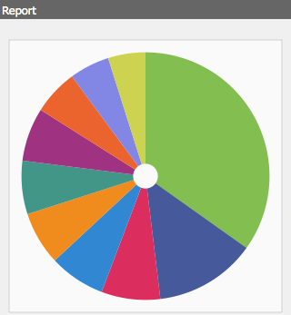

# 控制面板{#dashboards}

使用AEM時，您可以管理許多不同類型的內容（例如頁面、資產）。 AEM控制面板提供簡單易用且可自訂的方式，來定義可顯示整合資料的頁面。

>[!NOTE]
>
>AEM控制面板是根據每個使用者建立，因此使用者只能存取其自己的控制面板。
>
>但是，[控制面板範本](#creating-a-dashboard-template)可用來共用通用配置和控制面板配置。


## 管理控制面板{#administering-dashboards}

### 建立控制面板{#creating-a-dashboard}

若要建立新控制面板，請繼續如下：

1. 在&#x200B;**工具**&#x200B;區段中，按一下&#x200B;**配置控制台**。
1. 在樹中，按兩下&#x200B;**儀表板**。
1. 按一下「**新儀表板**」。
1. 鍵入&#x200B;**Title**（例如我的儀表板）和&#x200B;**Name**。
1. 按一下&#x200B;**建立**。

### 複製控制面板{#cloning-a-dashboard}

您可能想要有多個控制面板，以便從不同檢視快速查看您內容的相關資訊。 為協助您建立新控制面板，AEM提供複製功能，可用來複製現有控制面板。 若要複製控制面板，請繼續如下：

1. 在&#x200B;**工具**&#x200B;區段中，按一下&#x200B;**配置控制台**。

1. 在樹中，按一下&#x200B;**Dashboard**。
1. 按一下您要複製的控制面板。

1. 按一下&#x200B;**Clone**。

1. 輸入新控制面板的&#x200B;**名稱**。

### 移除控制面板{#removing-a-dashboard}

1. 在&#x200B;**工具**&#x200B;區段中，按一下&#x200B;**配置控制台**。

1. 在樹中，按一下&#x200B;**Dashboard**。
1. 按一下您要刪除的控制面板。

1. 按一下&#x200B;**Remove**。

1. 按一下「**是**」進行確認。

## 控制面板元件{#dashboard-components}

### 概覽 {#overview}

控制面板元件只有一般[AEM元件](/help/sites-developing/developing-components-samples.md)。 本節說明AEM隨附的報表元件。

### Web Analytics報表元件{#web-analytics-reporting-components}

AEM隨附一組元件，可呈現[SiteCatalyst](/help/sites-administering/adobeanalytics.md)資料的多個量度。 這些元件會列在&#x200B;**Dashboard**&#x200B;區段下的Sidekick中。

每個報表元件至少提供三個索引標籤：

* **基本**:包含主要設定。

* **報表：** 包含每個報表的特定設定。
* **樣式**:包含樣式配置，如圖表大小和邊距。

報表元件會以預設設定初始化，協助您快速設定控制面板。

#### 基本配置{#basic-configuration}

**Basic**&#x200B;頁簽提供對以下配置項的訪問：

**** 標題控制面板上顯示的標題。

**請** 求類型請求資料的方式。

**SiteCatalyst設定（選用）** 您要用來連線至SiteCatalyst的設定。若未提供，則假設設定是在控制面板頁面上設定（透過頁面屬性）。

**報表套裝ID（選用）** 您要用來產生圖形的SiteCatalyst報表套裝。

#### 報表配置{#report-configuration}

若要顯示Web統計資料，您必須定義要傳送之資料的日期範圍。 **Report**&#x200B;索引標籤提供兩個欄位來定義該範圍。

>[!NOTE]
>
>設定大的日期範圍可能會降低控制面板的回應速度。

**從** Bassolute或資料擷取的相對日期。

**Date** ToAbsolute或資料擷取的相對日期。

每個元件也定義特定設定。

#### 超時報表 {#overtime-report}


**X** 軸的日期粒度時間單位（例如日、小時）。

**** 量度您要顯示的事件清單。

**** 元素：劃分圖表中量度資料的元素清單。

#### 排名清單報表 {#ranked-list-report}


**** 元素：劃分圖表中量度資料的元素。

**** 量度您要顯示的事件。

**否. 排名在前的項目數**&#x200B;報表顯示的項目數。

#### 排名報表 {#ranked-report}


**** 量度您要顯示的事件。

**** 元素：劃分圖表中量度資料的元素。

#### 主要網站區域報表 {#top-site-section-report}

此元件會依據下列組態顯示圖形，顯示網站較常被瀏覽的區段。


**否. 排名在前的項目數**&#x200B;報表中顯示的區段數。

#### 趨勢報表 {#trended-report}



**X** 軸的日期粒度時間單位（例如日、小時）。

**** 量度您要顯示的事件。

**** 元素：劃分圖表中量度資料的元素。

## 擴展儀表板{#extending-dashboard}

### 概覽 {#overview-1}

控制面板是一般頁面(`cq:Page`)，因此，任何元件都可用來組合控制面板。

預設元件組`Dashboard`包含預設在範本上啟用的分析報告元件。

### 建立控制面板範本{#creating-a-dashboard-template}

範本定義新控制面板的預設內容。 您可以使用數個範本來建立不同類型的控制面板。

控制面板範本的建立方式與其他頁面範本相同，但儲存在`/libs/cq/dashboards/templates/`下。 請參閱[建立內容頁面範本](/help/sites-developing/website.md#creating-the-contentpage-template)區段。

>[!NOTE]
>
>控制面板範本會在使用者之間共用。

### 開發儀表板元件{#developing-a-dashboard-component}

開發控制面板元件包含建立一般的AEM元件。 本節說明顯示前10名貢獻者的元件範例。


排名最前的製作元件儲存在`/apps/geometrixx-outdoors/components/reporting`的存放庫中，且由下列組成：

1. 讀取jcr資料並定義`html`預留位置的`jsp`檔案。

1. 包含一個`js`檔案的用戶端程式庫，該檔案會擷取並排序資料，然後填入`html`預留位置。


在`geout.reporting.topauthors` [Client Library](/help/sites-developing/clientlibs.md)中，將下列Javascript檔案定義為元件本身的子項。

[QueryBuilder](/help/sites-developing/querybuilder-api.md)用於查詢儲存庫以讀取`cq:AuditEvent`節點。 查詢結果是JSON物件，可從中擷取作者貢獻。

#### top_authors.js {#top-authors-js}

```
$.ajax({
  url: "/bin/querybuilder.json",
  cache: false,
  data: {
       "orderby": "cq:time",
       "orderby.sort": "desc",
       "p.hits": "full",
       "p.limit": 100,
       "path": "/var/audit/com.day.cq.wcm.core.page/",
       "type": "cq:AuditEvent"
   },
  dataType: "json"
}).done(function( res ) {
    var authors = {};
    // from JSON to Object
    for(var r in res.hits) {
        var userId = res.hits[r].userId;
        if(userId == undefined) {
            continue;
        }
        var auth = authors[userId] || {userId : userId};
        auth.contrib = (auth.contrib || 0) +1;

        authors[userId] = auth;
    }

    // order by contribution
    var orderedByContrib = [];
    for(var a in authors) {
        orderedByContrib.push(authors[a]);
    }
    orderedByContrib.sort(function(a,b){return b.contrib - a.contrib});

    // produce the list
    for (var i=0, tot=orderedByContrib.length; i < tot; i++) {
        var current = orderedByContrib[i];
        $("<div> #" + (i + 1) +" "+ current.userId + " (" + current.contrib +" contrib.)</div>").appendTo("#authors-list");

    }
});
```

`JSP`同時包含`global.jsp`和`clientlib`。

#### top_authors.jsp {#top-authors-jsp}

```java
<%@page session="false" contentType="text/html; charset=utf-8" %><%
%><%
%><%@include file="/libs/foundation/global.jsp" %><%
%>
<ui:includeClientLib categories="geout.reporting.topauthors" />
<%
String reportletTitle = properties.get("title", "Top Authors");
%>
<html>
     <h3><%=xssAPI.encodeForHTML(reportletTitle) %></h3>
     <div id="authors-list"></div>
</html>
```
