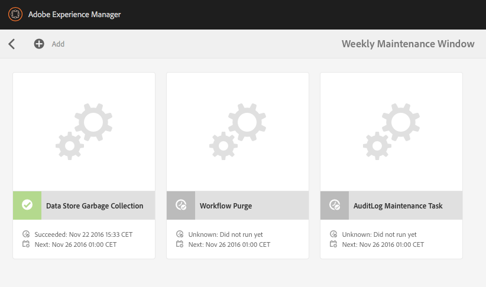

# 資料存放庫廢棄項目收集 {#data-store-garbage-collection}

當移除常規WCM資產時，可以從節點層次中移除對基礎資料儲存記錄的引用，但資料儲存記錄本身保持。 這個未參考的資料儲存記錄會變成不需要保留的「廢棄項目」。 在存在大量廢棄資產的情況下，通過刪除這些資產來保留空間並優化備份和檔案系統維護效能是有益的。

大部分情況下，WCM應用程式會收集資訊，但刪除資訊的頻率卻差不多。 雖然會新增新影像，甚至取代舊版，但版本控制系統仍會保留舊版影像，並支援視需要回復。 因此，我們認為添加到系統中的大部分內容都被有效永久儲存。 那麼，我們可能要清理的儲存庫中「垃圾」的典型來源是什麼？

AEM會將儲存庫當做許多內部和內部管理活動的儲存空間：

* 建立和下載的套件
* 為發佈複製建立的臨時檔案
* 工作流程負載
* 在DAM演算期間暫時建立的資產

當這些臨時對象中的任何一個都足夠大，需要在資料儲存中儲存，並且當對象最終被淘汰時，資料儲存記錄本身將保持為「垃圾」。 在典型的WCM作者／發佈應用程式中，這類最大的廢棄項目來源通常是發佈啟動程式。 當資料複製至「發佈」時，如果資料是先以名為「Durbo」的有效資料格式收集並儲存在下方的儲存庫中，則會收集到資料 `/var/replication/data`。 資料包通常大於資料儲存的關鍵大小閾值，因此最終儲存為資料儲存記錄。 複製完成後，中的節點將被刪 `/var/replication/data` 除，但資料儲存記錄仍保持為「廢棄項」。

可恢復垃圾的另一個來源是包。 與其他所有內容一樣，包資料儲存在儲存庫中，因此儲存在資料儲存中的包大於4KB。 在開發項目過程中或在維護系統的同時，可以多次構建和重建包，每個構建都生成新的資料儲存記錄，同時將先前構建的記錄保存。

## 資料儲存廢棄項目收集的運作方式？ {#how-does-data-store-garbage-collection-work}

如果資料庫已配置外部資料存放區，資料存放 [區廢棄項目收集會自動執行](/help/sites-administering/data-store-garbage-collection.md#automating-data-store-garbage-collection) ，做為「每週維護」視窗的一部分。 系統管理員也可 [以視需要手動執行資料儲存廢棄項目收集](#running-data-store-garbage-collection) 。 一般建議定期執行資料儲存廢棄項目收集，但在規劃資料儲存廢棄項目收集時應考量下列因素：

* 資料儲存廢棄項目收集需要時間，而且可能會影響效能，因此應據以規劃。
* 刪除資料儲存廢棄記錄不會影響正常效能，因此這不是效能優化。
* 如果不考慮儲存利用率和備份時間等相關因素，則資料儲存垃圾回收可能會安全延遲。

資料儲存廢棄項目收集器首先在進程開始時記下當前時間戳。 然後使用多通標籤／掃描圖樣算法進行收集。

在第一階段，資料儲存廢棄項目收集器執行對所有儲存庫內容的全面遍歷。 對於每個對資料儲存記錄有引用的內容對象，它將檔案定位在檔案系統中，執行元資料更新——修改「上次修改的」或MTIME屬性。 此時，此階段所存取的檔案會比初始基準時間戳記更新。

在第二階段，資料儲存廢棄項目收集器以與「查找」基本相同的方式遍歷資料儲存的物理目錄結構。 它檢查了檔案的「上次修改」或MTIME屬性，並做出以下決定：

* 如果MTIME比初始基準時間戳記更新，則檔案會在第一階段找到，或是在收集程式進行期間新增至儲存庫的全新檔案。 在其中一種情況下，記錄被視為活動，且檔案不得刪除。
* 如果MTIME早於初始基準時間戳記，則該檔案不是主動參考的檔案，並視為可移除廢棄項目。

此方法適用於具有專用資料儲存的單個節點。 但是，資料儲存可能是共用的，如果這意味著不檢查來自其他儲存庫的資料儲存記錄的潛在活動即時引用，並且可能錯誤地刪除活動引用的檔案。 在規劃任何廢棄項目收集之前，系統管理員必須先瞭解資料儲存的共用性質，而且只有在得知資料儲存並未共用時，才能使用簡單的內建資料儲存廢棄項目收集程式。

>[!NOTE]
>
>在叢集或共用資料存放區設定（使用Mongo或區段Tar）中執行廢棄項目收集時，記錄檔可能會顯示有關無法刪除特定點滴ID的警告。 這是因為在先前廢棄項目收集中刪除的blob ID被其他沒有ID刪除資訊的群集或共用節點重新錯誤引用。 因此，在執行廢棄項目收集時，當嘗試刪除上次執行中已刪除的ID時，它會記錄警告。 此行為不會影響效能或功能。

## Running Data Store Garbage Collection {#running-data-store-garbage-collection}

根據執行AEM的資料存放區設定，執行資料存放區廢棄項目收集有三種方式：

1. Via [Revision Cleanup](/help/sites-deploying/revision-cleanup.md) —— 一種廢棄項目收集機制，通常用於節點儲存清理。

1. 透過 [資料存放區廢棄項目收集](/help/sites-administering/data-store-garbage-collection.md#running-data-store-garbage-collection-via-the-operations-dashboard) -可在「作業控制面板」上使用的廢棄項目收集機制，它專用於外部資料存放區。
1. 透過 [JMX主控台](/help/sites-administering/jmx-console.md)。

如果TarMK同時用作節點儲存和資料儲存，則「修訂清除」可用於對節點儲存和資料儲存進行垃圾回收。 但是，如果已設定外部資料存放區（例如檔案系統資料存放區），則資料存放區廢棄項目收集必須與「修訂清除」分開明確觸發。 資料存放區廢棄項目收集可透過「作業控制面板」或JMX主控台觸發。

下表顯示AEM 6中所有支援的資料存放區部署所需使用的資料存放區廢棄項目收集類型：

<table>
 <tbody>
  <tr>
   <td><strong>節點存放區</strong><br /> </td>
   <td><strong>資料儲存</strong></td>
   <td><strong>廢棄項目收集機制</strong><br /> </td>
  </tr>
  <tr>
   <td>TarMK</td>
   <td>TarMK</td>
   <td>修訂清除（二進位檔與區段存放區內）</td>
  </tr>
  <tr>
   <td>TarMK</td>
   <td>外部檔案系統</td>
   <td><p>透過「作業控制面板」的「資料儲存廢棄項目收集」工作</p> <p>JMX主控台</p> </td>
  </tr>
  <tr>
   <td>MongoDB</td>
   <td>MongoDB</td>
   <td><p>透過「作業控制面板」的「資料儲存廢棄項目收集」工作</p> <p>JMX主控台</p> </td>
  </tr>
  <tr>
   <td>MongoDB</td>
   <td>外部檔案系統</td>
   <td><p>透過「作業控制面板」的「資料儲存廢棄項目收集」工作</p> <p>JMX主控台</p> </td>
  </tr>
 </tbody>
</table>

### 透過「作業控制面板」執行Data Store廢棄項目收集 {#running-data-store-garbage-collection-via-the-operations-dashboard}

內建的「每週維護」視窗可透過 [Operations Dashboard](/help/sites-administering/operations-dashboard.md)，包含內建工作，可在週日1點觸發Data Store Garbage Collection。

如果您需要在此時間以外執行資料儲存廢棄項目收集，則可透過「作業控制面板」手動觸發。

在運行資料儲存廢棄項收集之前，您應檢查當時是否沒有運行任何備份。

1. 通過導航開啟「操 **作控制** 板」 -> **Tools** -> **Operations** - **** Maintenance Alignment。
1. 按一下或點選「 **Weekly Maintenance Window**」。

   

1. 選取「 **Data Store Garbage Collection** 」工作，然後按一下或點選「 **Run** 」圖示。

   

1. 資料儲存廢棄項目收集會執行，其狀態會顯示在控制面板中。

   

>[!NOTE]
>
>只有在您已設定外部檔案資料存放區時，才會顯示「資料存放區廢棄項目收集」工作。 如需 [如何設定檔案資料儲存區的詳細資訊](/help/sites-deploying/data-store-config.md#file-data-store) ，請參閱「在AEM 6中設定節點儲存區和資料儲存區」。

### 透過JMX主控台執行Data Store Garbage Collection {#running-data-store-garbage-collection-via-the-jmx-console}

本節內容是關於透過JMX主控台手動執行資料儲存廢棄項目收集。 如果您的安裝是在沒有外部資料存放區的情況下設定，則這不適用於您的安裝。 請參閱維護儲存庫下如何運行修訂清 [除的說明](/help/sites-deploying/storage-elements-in-aem-6.md#maintaining-the-repository)。

>[!NOTE]
>
>如果您使用外部資料存放區執行TarMK，則必須先執行修訂清除，才能使廢棄項目收集生效。

若要執行廢棄項目收集：

1. 在Apache Felix OSGi Management console中，選中「 **Main** 」（主）頁籤，然後從以 **下菜單中選擇** JMX。
1. 接著，搜索並按一下 **Repository Manager** MBean(或轉至 `https://<host>:<port>/system/console/jmx/org.apache.jackrabbit.oak%3Aname%3Drepository+manager%2Ctype%3DRepositoryManagement`)。
1. 按一 **下startDataStoreGC(boolean markOnly)**。
1. 如果需要`true`，請為參 `markOnly` 數輸入&quot;&quot;:

   | **選項** | **說明** |
   |---|---|
   | 布林markOnly | 設定為true，在標籤和掃描操作中僅標籤參照而不進行掃描。 當基礎BlobStore在多個不同儲存庫之間共用時，將使用此模式。 對於所有其他情況，請將其設為false以執行完全廢棄項目收集。 |

1. 按一 **下叫用**。 CRX會執行廢棄項目收集，並指出其完成時間。

>[!NOTE]
>
>資料存放區廢棄項目收集不會收集在過去24小時內刪除的檔案。

>[!NOTE]
>
>只有在您配置了外部檔案資料儲存時，才會啟動資料儲存廢棄項目收集任務。 如果尚未配置外部檔案資料儲存，則任務將在調用後返回 `Cannot perform operation: no service of type BlobGCMBean found` 消息。 如需 [如何設定檔案資料儲存區的詳細資訊](/help/sites-deploying/data-store-config.md#file-data-store) ，請參閱「在AEM 6中設定節點儲存區和資料儲存區」。

## Automating Data Store Garbage Collection {#automating-data-store-garbage-collection}

如果可能，應在系統負載較小時（例如在早上）執行資料儲存廢棄項目收集。

內建的「每週維護」視窗可透過 [Operations Dashboard](/help/sites-administering/operations-dashboard.md)，包含內建工作，可在週日1點觸發Data Store Garbage Collection。 您還應檢查此時是否未運行任何備份。 視需要透過控制面板自訂維護視窗的開始。

>[!NOTE]
>
>不同時運行它的原因是，舊（和未使用）資料儲存檔案也得到備份，因此如果需要回滾到舊修訂，則二進位檔案仍在備份中。

如果您不想在「作業儀表板」的「每週維護」視窗中執行資料儲存廢棄項目收集，也可以使用wget或curl HTTP用戶端自動執行。 以下是如何使用curl自動備份的示例：

>[!CAUTION]
>
>在以下示例中， `curl` 可能需要為實例配置各種參數；例如，實際資料 `localhost`存放廢棄項目收集的主機名稱()、埠( `4502`)、管理密碼( `xyz`)和各種參數。

以下是透過命令列叫用資料儲存廢棄項目收集的curl命令範例：

```shell
curl -u admin:admin -X POST --data markOnly=true  https://localhost:4503/system/console/jmx/org.apache.jackrabbit.oak"%"3Aname"%"3Drepository+manager"%"2Ctype"%"3DRepositoryManagement/op/startDataStoreGC/boolean
```

curl命令會立即返回。

## 檢查資料儲存一致性 {#checking-data-store-consistency}

資料存放區一致性檢查會報告遺失但仍被參考的資料存放區二進位檔案。 要啟動一致性檢查，請執行以下步驟：

1. 前往JMX主控台。 如需如何使用JMX主控台的詳細資訊，請參 [閱本文](/help/sites-administering/jmx-console.md#using-the-jmx-console)。
1. 搜尋 **BlobGarbageCollection** Mbean，然後按一下。
1. 按一下 `checkConsistency()` 連結。

一致性檢查完成後，將顯示報告為缺少的二進位檔案數。 如果數字大於0，請查看以了 `error.log` 解有關缺少二進位檔案的詳細資訊。

以下是如何在記錄檔中報告遺失二進位檔案的範例：

```xml
11:32:39.673 INFO [main] MarkSweepGarbageCollector.java:600 Consistency check found [1] missing blobs
```

```xml
11:32:39.673 WARN [main] MarkSweepGarbageCollector.java:602 Consistency check failure intheblob store : DataStore backed BlobStore [org.apache.jackrabbit.oak.plugins.blob.datastore.OakFileDataStore], check missing candidates in file /tmp/gcworkdir-1467352959243/gccand-1467352959243
```

