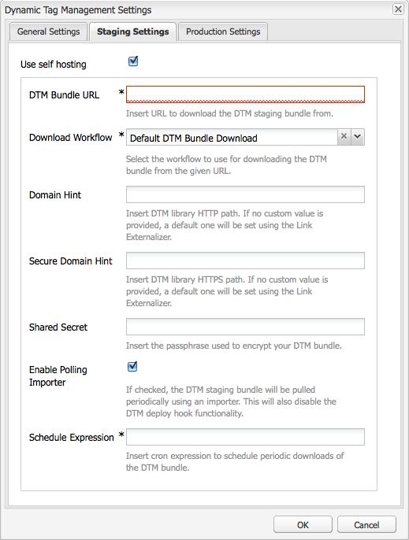

# 整合Adobe Dynamic Tag Management {#integrating-with-adobe-dynamic-tag-management}

將[AdobeDynamic Tag Management](https://business.adobe.com/products/experience-platform/adobe-experience-platform.html)與AEM整合，以便您可以使用您的Dynamic Tag Management Web屬性追蹤AEM網站。 Dynamic Tag Management可讓行銷人員管理用於收集資料的標籤，並在所有數位行銷系統間散發資料。 例如，使用Dynamic Tag Management來收集AEM網站的使用量資料，並散發資料，以便在Adobe Analytics或Adobe Target中進行分析。

整合之前，請先建立追蹤AEM網站網域的Dynamic Tag Management [Web屬性](https://microsite.omniture.com/t2/help/en_US/dtm/#Web_Properties)。 必須設定Web屬性的[託管選項](https://microsite.omniture.com/t2/help/en_US/dtm/#Hosting__Embed_Tab)，以便您可以設定AEM來存取Dynamic Tag Management程式庫。

設定整合後，對動態Tag Management部署工具和規則的變更不需要您在AEM中變更動態Tag Management設定。 AEM會自動使用這些變更。

>[!NOTE]
>
>如果您使用DTM搭配自訂Proxy設定，請同時設定HTTP使用者端Proxy設定，因為AEM的某些功能使用3.x API，而其他部分則使用4.x API：
>
>* 3.x已使用[http://localhost:4502/system/console/configMgr/com.day.commons.httpclient](http://localhost:4502/system/console/configMgr/com.day.commons.httpclient)設定
>* 4.x已使用[http://localhost:4502/system/console/configMgr/org.apache.http.proxyconfigurator](http://localhost:4502/system/console/configMgr/org.apache.http.proxyconfigurator)設定
>

## 部署選項 {#deployment-options}

下列部署選項會影響與Dynamic Tag Management整合的設定。

### Dynamic Tag Management託管 {#dynamic-tag-management-hosting}

AEM支援在雲端中託管或在AEM上託管的動態Tag Management。

* 雲端託管： Dynamic Tag Management JavaScript程式庫儲存在雲端中，您的AEM頁面會直接參照這些程式庫。
* AEM託管：動態Tag Management產生JavaScript程式庫。 AEM使用工作流程模型來取得及安裝程式庫。

您的實施作業使用的託管型別會決定您執行的一些設定與實施作業。 如需託管選項的相關資訊，請參閱Dynamic Tag Management說明中的[託管 — 內嵌標籤](https://microsite.omniture.com/t2/help/en_US/dtm/#Hosting__Embed_Tab)。

### 測試和生產程式庫 {#staging-and-production-library}

決定您的AEM編寫執行個體是使用動態Tag Management測試版或生產程式碼。

通常您的作者執行個體會使用動態Tag Management測試程式庫，而生產執行個體則會使用生產程式庫。 此案例可讓您使用作者例項來測試未核准的動態Tag Management設定。

如有需要，您的作者執行個體可以使用生產環境程式庫。 網頁瀏覽器外掛程式可讓您在程式庫為雲端託管時，切換使用中繼程式庫以進行測試。

### 使用動態Tag Management部署勾點 {#using-the-dynamic-tag-management-deployment-hook}

當AEM代管Dynamic Tag Management程式庫時，您可以使用Dynamic Tag Management部署勾點服務，自動將程式庫更新推播至AEM。 若對程式庫進行變更(例如編輯Dynamic Tag Management Web屬性屬性)，則會推送程式庫更新。

若要使用部署勾點，動態Tag Management必須能夠連線至託管程式庫的AEM執行個體。 [啟用Dynamic Tag Management伺服器的AEM](/help/sites-administering/dtm.md#enabling-access-for-the-deployment-hook-service)存取權。

在某些情況下，無法連線AEM，例如當AEM位於防火牆後面時。 在這些情況下，您可以使用AEM輪詢匯入工具選項，定期擷取程式庫。 cron作業運算式會指定程式庫下載的排程。

## 啟用部署鉤點服務的存取權 {#enabling-access-for-the-deployment-hook-service}

啟用Dynamic Tag Management部署勾點服務以存取AEM，讓該服務可以更新AEM託管的程式庫。 指定視需要更新中繼及生產程式庫的動態Tag Management伺服器的IP位址：

* 正在暫存： `107.21.99.31`
* 生產： `23.23.225.112`和`204.236.240.48`

使用[網頁主控台](/help/sites-deploying/configuring-osgi.md#osgi-configuration-with-the-web-console)或[`sling:OsgiConfig`](/help/sites-deploying/configuring-osgi.md#osgi-configuration-in-the-repository)節點執行設定：

* 在Web主控台中，使用設定頁面上的AdobeDTM部署勾點設定專案。
* 對於OSGi設定，服務PID為`com.adobe.cq.dtm.impl.servlets.DTMDeployHookServlet`。

下表說明要設定的特性。

| Web主控台屬性 | OSGi屬性 | 說明 |
|---|---|---|
| 分段DTM IP白名單 | `dtm.staging.ip.whitelist` | 更新中繼程式庫的動態Tag Management伺服器的IP位址。 |
| 生產DTM IP白名單 | `dtm.production.ip.whitelist` | 更新生產環境程式庫的動態Tag Management伺服器的IP位址。 |

## 建立動態Tag Management設定 {#creating-the-dynamic-tag-management-configuration}

建立雲端設定，讓AEM執行個體能夠使用Dynamic Tag Management進行驗證，並與您的Web屬性互動。

>[!NOTE]
>
>當您的DTM Web屬性包含Adobe Analytics工具，而且您也使用[Content Insight](/help/sites-authoring/content-insights.md)時，請避免在頁面上包含兩個Adobe Analytics追蹤程式碼。 在您的[Adobe Analytics Cloud設定](/help/sites-administering/adobeanalytics-connect.md#configuring-the-connection-to-adobe-analytics)中，選取「不要包含追蹤代碼」選項。

### 一般設定 {#general-settings}

<table>
 <tbody>
  <tr>
   <th>屬性</th>
   <th>說明</th>
  </tr>
  <tr>
   <td>API Token</td>
   <td>Dynamic Tag Management使用者帳戶的API Token屬性值。 AEM使用此屬性來驗證動態Tag Management。</td>
  </tr>
  <tr>
   <td>公司</td>
   <td>與您登入ID相關聯的公司。</td>
  </tr>
  <tr>
   <td>屬性</td>
   <td>您為管理AEM網站標籤而建立的Web屬性名稱。</td>
  </tr>
  <tr>
   <td>加入有關作者的生產代碼</td>
   <td>
選取此選項，好讓AEM作者和發佈執行個體使用動態Tag Management程式庫的生產版本。 
 
若未選取此選項，測試設定會套用至製作執行個體，而生產設定則套用至發佈執行個體。
 </td>
  </tr>
 </tbody>
</table>

### 自行託管屬性 — 測試和生產 {#self-hosting-properties-staging-and-production}

下列動態Tag Management設定的屬性可讓AEM主控動態Tag Management程式庫。 屬性可讓AEM下載及安裝程式庫。 您可以視需要自動更新程式庫，以確保其能反映動態Tag Management管理應用程式中所做的任何變更。

有些屬性會使用您從Dynamic Tag Management Web屬性「內嵌」標籤的「程式庫下載」區段取得的值。 如需詳細資訊，請參閱Dynamic Tag Management說明中的[程式庫下載](https://microsite.omniture.com/t2/help/en_US/dtm/#Library_Download)。

>[!NOTE]
>
>當您在AEM上託管Dynamic Tag Management套件組合時，必須先在Dynamic Tag Management中啟用程式庫下載功能，才能建立設定。 此外，必須啟用Akamai，因為Akamai提供可供下載的資料庫。

在AEM上託管Dynamic Tag Management程式庫時，AEM會根據您的設定自動設定Web屬性的部分屬性。 請參閱下表的說明。

<table>
 <tbody>
  <tr>
   <th>屬性</th>
   <th>說明</th>
  </tr>
  <tr>
   <td>使用自行託管</td>
   <td>選取當您在AEM上託管動態Tag Management程式庫檔案時。 選取此選項會導致此表格中的其他屬性出現。</td>
  </tr>
  <tr>
   <td>DTM 組合包 URL</td>
   <td>用於下載Dynamic Tag Management程式庫的URL。 請前往Dynamic Tag Management程式庫下載頁面的「下載URL」區段，取得此值。 基於安全理由，此值必須手動設定。</td>
  </tr>
  <tr>
   <td>下載工作流程</td>
   <td>
用於下載和安裝Dynamic Tag Management程式庫的工作流程模型。 預設模式為「預設DTM組合包下載」。 除非您已建立自訂模型，否則請使用此模型。
 
預設下載工作流程會在下載程式庫時自動啟動。
 </td>
  </tr>
  <tr>
   <td>網域提示</td>
   <td>
（選用）代管Dynamic Tag Management程式庫的AEM伺服器網域。 指定一個值，以便您可以覆寫為<a href="/help/sites-developing/externalizer.md">Day CQ Link Externalizer服務</a>設定的預設網域。
 
當連線至動態Tag Management時，AEM會使用此值來設定動態Tag Management Web屬性的測試HTTP路徑或程式庫下載屬性的生產HTTP路徑。
 </td>
  </tr>
  <tr>
   <td>安全網域提示</td>
   <td>
（選用）透過HTTPS託管Dynamic Tag Management程式庫的AEM伺服器網域。 指定一個值，以便您可以覆寫為<a href="/help/sites-developing/externalizer.md">Day CQ Link Externalizer服務</a>設定的預設網域。
 
當連線至動態Tag Management時，AEM會使用此值來設定動態Tag Management Web屬性的測試HTTPS路徑或程式庫下載屬性的生產HTTPS路徑。
 </td>
  </tr>
  <tr>
   <td>共用機密</td>
   <td>
（選用）用來解密下載的共用機密。 從Dynamic Tag Management之「程式庫下載」頁面的「共用機密」欄位取得此值。
 
<strong>注意：</strong>您必須在安裝AEM的電腦上安裝OpenSSL程式庫，讓AEM可以解密下載的程式庫。
 </td>
  </tr>
  <tr>
   <td>啟用 Polling Importer</td>
   <td>
（選用）選取以定期下載及安裝動態Tag Management程式庫，確保您使用更新版本。 選取後，Dynamic Tag Management不會將HTTPPOST要求傳送至部署勾點URL。
 
AEM會自動為Dynamic Tag Management Web屬性設定程式庫下載屬性的部署勾點URL屬性。 選取後，屬性會設定為沒有值。 若未選取，屬性會以您動態Tag Management設定的URL進行設定。
 
當Dynamic Tag Management部署勾點無法連線至AEM (例如AEM位於防火牆後)時，啟用輪詢匯入工具。
 </td>
  </tr>
  <tr>
   <td>排程運算式</td>
   <td>（顯示，在選取「啟用Polling Importer」時為必要。） 控制何時下載Dynamic Tag Management程式庫的cron運算式。</td>
  </tr>
 </tbody>
</table>

### 雲端託管屬性 — 測試和生產 {#cloud-hosting-properties-staging-and-production}

當動態標籤設定是雲端託管時，您可以為動態Tag Management設定設定下列屬性。

<table>
 <tbody>
  <tr>
   <th>屬性</th>
   <th>說明</th>
  </tr>
  <tr>
   <td>使用自行託管</td>
   <td>當動態Tag Management程式庫檔案託管於雲端時，請清除此選項。</td>
  </tr>
  <tr>
   <td>頁首程式碼</td>
   <td>
從您主機的Dynamic Tag Management取得的測試頁首程式碼。 此值會在您連線至動態Tag Management時自動填入。
 
 若要在動態Tag Management中檢視程式碼，請按一下內嵌標籤，然後按一下主機名稱。 展開頁首程式碼區段，然後視需要按一下複製測試內嵌程式碼的內嵌程式碼或生產內嵌程式碼區域。
 </td>
  </tr>
  <tr>
   <td>頁尾程式碼</td>
   <td>
從您主機的Dynamic Tag Management取得的測試頁尾代碼。 此值會在您連線至動態Tag Management時自動填入。
 
若要在動態Tag Management中檢視程式碼，請按一下內嵌標籤，然後按一下主機名稱。 展開頁尾程式碼區段，然後視需要按一下複製預備內嵌程式碼的內嵌程式碼或生產內嵌程式碼區域。
 </td>
  </tr>
 </tbody>
</table>

下列程式使用觸控最佳化UI來設定與Dynamic Tag Management的整合。

1. 在邊欄上，按一下「工具>作業>雲端>Cloud Service」 。
1. 在「動態Tag Management」區域中，會出現下列其中一個新增設定的連結：

   * 如果您是新增的第一個組態，請按一下「立即設定」 。
   * 按一下「顯示組態」，然後按一下「可用組態」旁的+連結（如果已經建立一個或多個組態）。

   

1. 輸入設定的標題，然後按一下「建立」。
1. 在「API權杖」欄位中，輸入動態Tag Management使用者帳戶的「API權杖」屬性值。

   若要取得API Token的值，請聯絡DTM Client Care。

   >[!NOTE]
   >
   >Dynamic Tag Management使用者明確要求之前，API權杖不會過期。

   

1. 按一下「連線至DTM」。 AEM會使用Dynamic Tag Management進行驗證，並擷取您的帳戶相關聯的公司清單。
1. 選取公司，然後選取您要用來追蹤AEM網站的屬性。
1. 如果您在製作例項上使用測試程式碼，請取消選取「在製作例項上包含生產程式碼」 。
1. 視需要提供暫存設定標籤和生產設定標籤上的屬性值，然後按一下確定。

## 手動下載Dynamic Tag Management資料庫 {#manually-downloading-the-dynamic-tag-management-library}

手動下載Dynamic Tag Management程式庫，以立即在AEM上更新。 例如，如果您想要在輪詢匯入工具排程自動下載程式庫之前測試更新的程式庫，請手動下載。

1. 在邊欄上，按一下「工具>作業>雲端>Cloud Service」 。
1. 在動態Tag Management區域中，按一下顯示設定，然後按一下您的設定。
1. 在「測試設定」區域或「生產設定」區域中，按一下「觸發下載工作流程」按鈕以下載和部署程式庫套件。

   

>[!NOTE]
>
>下載的檔案儲存在`/etc/clientlibs/dtm/my config/companyID/propertyID/servertype`下。
>
>下列專案是直接從您的[DTM組態](#creating-the-dynamic-tag-management-configuration)中取得。
>
>* `myconfig`
>* `companyID`
>* `propertyID`
>* `servertype`
>

## 將動態Tag Management設定與您的網站建立關聯 {#associating-a-dynamic-tag-management-configuration-with-your-site}

將您的動態Tag Management設定與網站頁面建立關聯，以便AEM將所需指令碼新增至頁面。 將網站的根頁面與設定建立關聯。 該頁面的所有子系都會繼承關聯。 如有必要，您可以在子項頁面上覆寫關聯。

使用以下程式，將頁面及其子系與Dynamic Tag Management設定建立關聯。

1. 在傳統UI中開啟網站的根頁面。
1. 使用Sidekick開啟頁面屬性。
1. 在Cloud Service標籤上，按一下新增服務，選取動態Tag Management，然後按一下確定。

   

1. 使用Dynamic Tag Management下拉式功能表選取您的設定，然後按一下「確定」。

請使用下列程式來覆寫頁面的繼承組態關聯。 覆寫會影響頁面和所有頁面子代。

1. 在傳統UI中開啟頁面。
1. 使用Sidekick開啟頁面屬性。
1. 在「Cloud Service」標籤上，按一下「繼承自」屬性旁的掛鎖圖示，然後在確認對話方塊中按一下「是」。

   

1. 移除或選取其他動態Tag Management設定，然後按一下「確定」。
