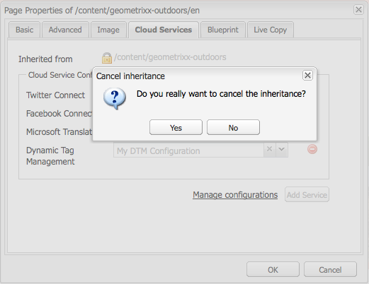

# 與Adobe動態標籤管理整合 {#integrating-with-adobe-dynamic-tag-management}

將 [Adobe動態標籤管理與AEM整合](https://www.adobe.com/solutions/digital-marketing/dynamic-tag-management.html) ，讓您可以使用動態標籤管理網頁屬性來追蹤AEM網站。 動態標籤管理可讓行銷人員管理收集資料的標籤，並跨數位行銷系統分發資料。 例如，使用「動態標籤管理」收集AEM網站的使用資料，並在Adobe Analytics或Adobe Target中分發資料以進行分析。

在整合之前，您必須建立動態標籤管 [理Web屬性](https://microsite.omniture.com/t2/help/en_US/dtm/#Web_Properties) ，以追蹤AEM網站的網域。 必 [須設定Web屬性的代管選項](https://microsite.omniture.com/t2/help/en_US/dtm/#Hosting__Embed_Tab) ，以便您能夠設定AEM以存取動態標籤管理程式庫。

在您設定整合後，變更動態標籤管理部署工具和規則不需要您在AEM中變更動態標籤管理設定。 AEM會自動使用這些變更。

>[!NOTE]
>
>如果您將DTM與自訂的Proxy設定搭配使用，您需要將HTTP Client proxy設定同時設定為AEM的某些功能是使用3.x API，而其他部分則使用4.x API:
>
>* 3.x已設定為 [http://localhost:4502/system/console/configMgr/com.day.commons.httpclient](http://localhost:4502/system/console/configMgr/com.day.commons.httpclient)
>* 4.x已設定為 [http://localhost:4502/system/console/configMgr/org.apache.http.proxyconfigurator](http://localhost:4502/system/console/configMgr/org.apache.http.proxyconfigurator)
>

## 部署選項 {#deployment-options}

下列部署選項會影響與動態標籤管理整合的設定。

### 動態標籤管理托管 {#dynamic-tag-management-hosting}

AEM支援在雲端托管或在AEM托管的動態標籤管理。

* 雲端托管：「動態標籤管理」Javascript程式庫會儲存在雲端，而您的AEM頁面會直接參照這些程式庫。
* AEM代管：動態標籤管理會產生javascript程式庫。 AEM使用工作流程模型來取得和安裝程式庫。

您的實作所使用的代管類型，會決定您執行的部分設定與實作工作。 如需代管選項的詳細資訊，請參 [閱動態標籤管理說明中的代管](https://microsite.omniture.com/t2/help/en_US/dtm/#Hosting__Embed_Tab) -內嵌標籤。

### 測試與生產程式庫 {#staging-and-production-library}

決定您的AEM作者實例是使用動態標籤管理測試或生產程式碼。

您的作者例項通常使用動態標籤管理測試程式庫，而生產例項則使用生產程式庫。 此藍本可讓您使用作者例項來測試未核准的動態標籤管理組態。

視需要，您的作者例項可以使用生產程式庫。 網頁瀏覽器外掛程式可讓您在雲端托管程式庫時，切換使用測試程式庫以進行測試。

### 使用動態標籤管理部署掛接 {#using-the-dynamic-tag-management-deployment-hook}

當AEM托管動態標籤管理程式庫時，您可以使用動態標籤管理部署掛接服務，自動將程式庫更新推送至AEM。 當對程式庫進行變更時（例如編輯動態標籤管理Web屬性時）會推送程式庫更新。

若要使用部署掛接，「動態標籤管理」必須能夠連線至裝載程式庫的AEM例項。 您必須 [啟用動態標籤管理伺服器的AEM](/help/sites-administering/dtm.md#enabling-access-for-the-deployment-hook-service) 存取權。

在某些情況下，AEM可能無法連線，例如當AEM位於防火牆後。 在這些情況下，您可以使用AEM輪詢匯入工具選項來定期擷取程式庫。 cron作業運算式指定程式庫下載的排程。

## 啟用部署掛接服務的訪問 {#enabling-access-for-the-deployment-hook-service}

啟用動態標籤管理部署掛接服務以存取AEM，讓服務可以更新AEM代管的程式庫。 指定動態標籤管理伺服器的IP位址，以視需要更新測試和生產程式庫：

* 分段: `107.21.99.31`
* 生產： `23.23.225.112` 和 `204.236.240.48`

使用 [Web Console或節點執行配](/help/sites-deploying/configuring-osgi.md#osgi-configuration-with-the-web-console)[`sling:OsgiConfig`](/help/sites-deploying/configuring-osgi.md#osgi-configuration-in-the-repository) 置：

* 在Web Console中，使用「設定」頁面上的「Adobe DTM部署掛接設定」項目。
* 對於OSGi配置，服務PID為 `com.adobe.cq.dtm.impl.servlets.DTMDeployHookServlet`。

下表說明要配置的屬性。

| Web控制台屬性 | OSGi屬性 | 說明 |
|---|---|---|
| 測試DTM IP白名單 | `dtm.staging.ip.whitelist` | 更新測試程式庫的動態標籤管理伺服器的IP位址。 |
| 生產DTM IP白名單 | `dtm.production.ip.whitelist` | 更新生產程式庫的動態標籤管理伺服器的IP位址。 |

## 建立動態標籤管理設定 {#creating-the-dynamic-tag-management-configuration}

建立雲端設定，讓AEM例項可以使用「動態標籤管理」進行驗證，並與您的Web屬性互動。

>[!NOTE]
>
>當您的DTM網頁屬性包含Adobe Analytics工具且您也在使用內容分析時，請避免在您的頁面上包含兩個Adobe Analytics追蹤 [代碼](/help/sites-authoring/content-insights.md)。 在您的 [Adobe Analytics雲端設定中](/help/sites-administering/adobeanalytics-connect.md#configuring-the-connection-to-adobe-analytics)，選取「不包含追蹤代碼」選項。

### 一般設定 {#general-settings}

<table>
 <tbody>
  <tr>
   <th>屬性</th>
   <th>說明</th>
  </tr>
  <tr>
   <td>API Token</td>
   <td>動態標籤管理使用者帳戶的API Token屬性值。 AEM使用此屬性來驗證動態標籤管理。</td>
  </tr>
  <tr>
   <td>公司</td>
   <td>您的登入ID所關聯的公司。</td>
  </tr>
  <tr>
   <td>屬性</td>
   <td>您為管理AEM網站的標籤而建立的Web屬性名稱。</td>
  </tr>
  <tr>
   <td>加入有關作者的生產代碼</td>
   <td>
選取這個選項可讓AEM作者和發佈例項使用動態標籤管理程式庫的生產版本。 
 
如果未選取此選項，「測試設定」會套用至作者例項，而「生產設定」會套用至發佈例項。
 </td>
  </tr>
 </tbody>
</table>

### 自行代管屬性——測試與生產 {#self-hosting-properties-staging-and-production}

「動態標籤管理」設定的下列屬性可讓AEM主控「動態標籤管理」程式庫。 屬性可讓AEM下載並安裝程式庫。 或者，您可以自動更新程式庫，以確保它們能反映動態標籤管理應用程式中所做的任何變更。

有些屬性會使用您從「動態標籤管理」Web屬性的「內嵌」標籤的「程式庫下載」區段中取得的值。 如需詳細資訊，請 [參閱動態標籤管理](https://microsite.omniture.com/t2/help/en_US/dtm/#Library_Download) 「說明」中的「程式庫下載」。

>[!NOTE]
>
>當您在AEM上代管動態標籤管理套裝時，必須先在動態標籤管理中啟用「程式庫下載」，才能建立設定。 此外，Akamai必須已啟用，因為Akamai提供程式庫以供下載。

在AEM上代管動態標籤管理程式庫時，AEM會根據您的設定自動設定Web屬性的某些屬性。 請參閱下表中的說明。

<table>
 <tbody>
  <tr>
   <th>屬性</th>
   <th>說明</th>
  </tr>
  <tr>
   <td>使用自行代管</td>
   <td>在AEM上托管動態標籤管理程式庫檔案時，請選取。 選擇此選項會導致此表中的其他屬性出現。</td>
  </tr>
  <tr>
   <td>DTM 組合包 URL</td>
   <td>用於下載動態標籤管理程式庫的URL。 從動態標籤管理的「程式庫下載」頁面的「下載URL」區段取得此值。 出於安全原因，必須手動配置此值。</td>
  </tr>
  <tr>
   <td>下載工作流程</td>
   <td>
用於下載和安裝動態標籤管理程式庫的工作流程模型。 預設模型為「預設DTM Bundle Download」（預設DTM Bundle下載）。 使用此模型，除非您已建立自訂模型。
 
請注意，預設的下載工作流程會在程式庫下載時自動啟動程式庫。
 </td>
  </tr>
  <tr>
   <td>網域提示</td>
   <td>
（選用）裝載動態標籤管理程式庫的AEM伺服器網域。 指定值以覆寫為 <a href="/help/sites-developing/externalizer.md">Day CQ Link Externalizer服務設定的預設網域</a>。
 
連線至「動態標籤管理」時，AEM會使用此值來設定「動態標籤管理」Web屬性的「程式庫下載」屬性的「測試HTTP路徑」或「生產HTTP路徑」。
 </td>
  </tr>
  <tr>
   <td>安全域提示</td>
   <td>
（選用）AEM伺服器的網域，此網域是透過HTTPS代管動態標籤管理程式庫。 指定值以覆寫為 <a href="/help/sites-developing/externalizer.md">Day CQ Link Externalizer服務設定的預設網域</a>。
 
連線至「動態標籤管理」時，AEM會使用此值來設定「動態標籤管理」Web屬性的「程式庫下載」屬性的「測試HTTPS路徑」或「生產HTTPS路徑」。
 </td>
  </tr>
  <tr>
   <td>共用機密</td>
   <td>
（選擇性）用於解密下載的共用機密。 從動態標籤管理的「程式庫下載」頁面的「共用密碼」欄位取得此值。
 
<strong></strong> 注意：您必須在安 <a href="https://www.openssl.org/docs/apps/openssl.html">裝AEM的電腦上安裝OpenSSL</a> Libraries，如此AEM才能解密下載的程式庫。
 </td>
  </tr>
  <tr>
   <td>啟用 Polling Importer</td>
   <td>
（可選）選擇定期下載並安裝動態標籤管理程式庫，以確保您使用的是更新版本。 選取後，動態標籤管理不會傳送HTTP POST要求至部署掛接URL。
 
AEM會自動設定「動態標籤管理」Web屬性的「程式庫下載」屬性的「部署掛接URL」屬性。 選中後，屬性將配置為無值。 未選取時，屬性會以動態標籤管理設定的URL來設定。
 
當「動態標籤管理」部署掛接無法連線至AEM時，例如當AEM位於防火牆後時，啟用輪詢匯入工具。
 </td>
  </tr>
  <tr>
   <td>排程運算式</td>
   <td>（當選取「啟用輪詢匯入工具」時，會顯示並為必要項目。）控制下載動態標籤管理程式庫時的cron運算式。</td>
  </tr>
 </tbody>
</table>

### 雲端代管屬性——測試與生產 {#cloud-hosting-properties-staging-and-production}

當雲端托管動態標籤設定時，您可為動態標籤管理設定設定下列屬性。

<table>
 <tbody>
  <tr>
   <th>屬性</th>
   <th>說明</th>
  </tr>
  <tr>
   <td>使用自行代管</td>
   <td>當雲端托管動態標籤管理程式庫檔案時，請清除此選項。</td>
  </tr>
  <tr>
   <td>頁首程式碼</td>
   <td>
從主機的動態標籤管理中取得的測試頁首代碼。 當您連線至動態標籤管理時，會自動填入此值。
 
 若要在「動態標籤管理」中查看代碼，請按一下「內嵌」標籤，然後按一下主機名稱。 展開「頁首代碼」區段，然後視需要按一下「測試內嵌代碼」或「生產內嵌代碼」區域的「複製內嵌代碼」。
 </td>
  </tr>
  <tr>
   <td>頁尾程式碼</td>
   <td>
從主機的動態標籤管理中取得的測試頁尾代碼。 當您連線至動態標籤管理時，會自動填入此值。
 
若要在「動態標籤管理」中查看代碼，請按一下「內嵌」標籤，然後按一下主機名稱。 展開「頁尾代碼」區段，然後視需要按一下「測試內嵌代碼」或「生產內嵌代碼」區域的「複製內嵌代碼」。
 </td>
  </tr>
 </tbody>
</table>

下列程式使用觸控最佳化UI來設定與動態標籤管理的整合。

1. 在導軌上，按一下「工具>作業>雲端>雲端服務」。
1. 在「動態標籤管理」區域中，會出現下列其中一個連結以新增設定：

   * 如果這是您新增的第一個設定，請按一下「立即設定」。
   * 如果已建立一個或多個配置，請按一下「顯示配置」，然後按一下「可用配置」旁邊的+連結。
   

1. 輸入設定的標題，然後按一下「建立」。
1. 在「API Token」欄位中，輸入動態標籤管理使用者帳戶的「API Token」屬性值。

   若要取得API Token的值，請連絡DTM客戶服務。

   >[!NOTE]
   >
   >API Token在動態標籤管理使用者明確要求之前不會過期。

   

1. 按一下「連線至DTM」。 AEM會與「動態標籤管理」驗證，並擷取您的帳戶所關聯的公司清單。
1. 選取「公司」，然後選取您用來追蹤AEM網站的「屬性」。
1. 如果您在作者例項上使用測試程式碼，請取消選取「在作者上包含生產程式碼」。
1. 視需要提供「測試設定」標籤和「生產設定」標籤上屬性的值，然後按一下「確定」。

## 手動下載動態標籤管理程式庫 {#manually-downloading-the-dynamic-tag-management-library}

手動下載動態標籤管理程式庫，以立即在AEM上更新。 例如，當您想在排程輪詢匯入工具自動下載程式庫之前測試更新的程式庫時，請手動下載。

1. 在導軌上，按一下「工具>作業>雲端>雲端服務」。
1. 在「動態標籤管理」區域中，按一下「顯示設定」，然後按一下您的設定。
1. 在「測試設定」區或「生產設定」區中，按一下「觸發下載工作流程」按鈕以下載和部署程式庫套件。

   

>[!NOTE]
>
>下載的檔案儲存在下方 `/etc/clientlibs/dtm/my config/companyID/propertyID/servertype`。
>
>以下是直接從您的 [DTM設定中取得](#creating-the-dynamic-tag-management-configuration)。
>
>* `myconfig`
>* `companyID`
>* `propertyID`
>* `servertype`
>

## 將動態標籤管理組態與您的網站建立關聯 {#associating-a-dynamic-tag-management-configuration-with-your-site}

將您的「動態標籤管理」設定與您網站的頁面建立關聯，讓AEM將必要的指令碼新增至頁面。 將您網站的根頁面與設定關聯。 該頁的所有子代都繼承關聯。 如果需要，您可以覆蓋子體頁面上的關聯。

請按下列步驟將頁面和子系與動態標籤管理組態建立關聯。

1. 在傳統UI中開啟您網站的根頁面。
1. 使用Sidekick開啟頁面屬性。
1. 在「雲端服務」標籤上，按一下「新增服務」，選取「動態標籤管理」，然後按一下「確定」。

   

1. 使用「動態標籤管理」下拉式功能表來選取您的設定，然後按一下「確定」。

使用以下過程覆蓋頁面繼承的配置關聯。 覆寫會影響頁面和所有頁面後代。

1. 在傳統UI中開啟頁面。
1. 使用Sidekick開啟頁面屬性。
1. 在「雲端服務」標籤上，按一下「繼承自」屬性旁的掛鎖圖示，然後在確認對話方塊中按一下「是」。

   

1. 移除或選取不同的動態標籤管理設定，然後按一下「確定」。

