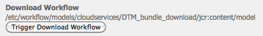

# 與AdobeDynamic Tag Management整合 {#integrating-with-adobe-dynamic-tag-management}

整合 [Adobe動態Tag Management](https://www.adobe.com/solutions/digital-marketing/dynamic-tag-management.html) 使用AEM，以便您能使用Dynamic Tag Management Web屬性來追蹤AEM網站。 動態Tag Management可讓行銷人員管理用於收集資料的標籤，以及在數位行銷系統間分發資料。 例如，使用Dynamic Tag Management收集AEM網站的使用資料，並在Adobe Analytics或Adobe Target中分發資料以進行分析。

整合之前，您需要建立動態Tag Management [web屬性](https://microsite.omniture.com/t2/help/en_US/dtm/#Web_Properties) 來追蹤您的AEM網站網域。 此 [托管選項](https://microsite.omniture.com/t2/help/en_US/dtm/#Hosting__Embed_Tab) 的Web屬性，以便您能設定AEM以存取動態Tag Management程式庫。

設定整合後，變更動態Tag Management部署工具和規則不需要您在AEM中變更動態Tag Management設定。 變更會自動可供AEM使用。

>[!NOTE]
>
>如果您使用DTM搭配自訂的代理設定，您需要設定兩個HTTP用戶端代理設定，因為AEM的某些功能使用3.x API，而有些則使用4.x API:
>
>* 3.x的設定 [http://localhost:4502/system/console/configMgr/com.day.commons.httpclient](http://localhost:4502/system/console/configMgr/com.day.commons.httpclient)
>* 4.x的設定 [http://localhost:4502/system/console/configMgr/org.apache.http.proxyconfigurator](http://localhost:4502/system/console/configMgr/org.apache.http.proxyconfigurator)
>

## 部署選項 {#deployment-options}

下列部署選項會影響與Dynamic Tag Management整合的設定。

### 動態Tag Management托管 {#dynamic-tag-management-hosting}

AEM支援在雲端中托管或在AEM上托管的Dynamic Tag Management。

* 雲端托管：動態Tag Management JavaScript程式庫儲存在雲端中，而AEM頁面會直接參照。
* AEM托管：動態Tag Management會產生JavaScript程式庫。 AEM使用工作流程模型來取得及安裝程式庫。

您的實作使用的托管類型會決定您執行的某些設定與實施工作。 如需托管選項的相關資訊，請參閱 [托管 — 內嵌標籤](https://microsite.omniture.com/t2/help/en_US/dtm/#Hosting__Embed_Tab) 在動態Tag Management說明中。

### 測試和生產程式庫 {#staging-and-production-library}

決定您的AEM製作例項使用動態Tag Management測試或生產代碼。

您的製作例項通常使用動態Tag Management測試程式庫，而生產例項則使用生產程式庫。 此情境可讓您使用製作例項來測試未核准的動態Tag Management設定。

如有需要，您的製作例項可以使用生產程式庫。 Web瀏覽器外掛程式可讓您在雲端托管程式庫時，切換使用中繼程式庫以進行測試。

### 使用動態Tag Management部署連結 {#using-the-dynamic-tag-management-deployment-hook}

當AEM托管動態Tag Management程式庫時，您可以使用動態Tag Management部署連結服務，自動將程式庫更新推送至AEM。 程式庫進行變更時(例如編輯動態Tag Management Web屬性時)會推送程式庫更新。

若要使用部署連結，動態Tag Management必須能連線至托管程式庫的AEM執行個體。 您必須 [啟用AEM存取](/help/sites-administering/dtm.md#enabling-access-for-the-deployment-hook-service) 動態Tag Management伺服器。

在某些情況下，AEM可能無法連線，例如AEM位於防火牆後時。 在這些情況下，您可以使用AEM輪詢匯入工具選項來定期擷取程式庫。 cron工作運算式會指定程式庫下載的排程。

## 啟用部署掛接服務的訪問 {#enabling-access-for-the-deployment-hook-service}

啟用動態Tag Management部署連結服務以存取AEM，讓服務可更新AEM托管的程式庫。 指定視需要更新測試和生產程式庫之動態Tag Management伺服器的IP位址：

* 分段: `107.21.99.31`
* 生產： `23.23.225.112` 和 `204.236.240.48`

使用 [Web主控台](/help/sites-deploying/configuring-osgi.md#osgi-configuration-with-the-web-console) 或 [`sling:OsgiConfig`](/help/sites-deploying/configuring-osgi.md#osgi-configuration-in-the-repository) 節點：

* 在Web主控台中，使用「設定」頁面上的「AdobeDTM部署連結設定」項目。
* 若為OSGi設定，服務PID為 `com.adobe.cq.dtm.impl.servlets.DTMDeployHookServlet`.

下表說明了要配置的屬性。

| Web控制台屬性 | OSGi屬性 | 說明 |
|---|---|---|
| 中繼DTM IP白名單 | `dtm.staging.ip.whitelist` | 更新中繼程式庫之動態Tag Management伺服器的IP位址。 |
| 生產DTM IP白名單 | `dtm.production.ip.whitelist` | 更新生產程式庫之動態Tag Management伺服器的IP位址。 |

## 建立動態Tag Management設定 {#creating-the-dynamic-tag-management-configuration}

建立雲端設定，讓AEM例項可以透過Dynamic Tag Management驗證，並與您的Web屬性互動。

>[!NOTE]
>
>當您的DTM Web屬性包含Adobe Analytics工具，且您也使用 [內容分析](/help/sites-authoring/content-insights.md). 在 [Adobe Analytics雲端組態](/help/sites-administering/adobeanalytics-connect.md#configuring-the-connection-to-adobe-analytics)，選取「不包含追蹤代碼」選項。

### 一般設定 {#general-settings}

<table>
 <tbody>
  <tr>
   <th>屬性</th>
   <th>說明</th>
  </tr>
  <tr>
   <td>API Token</td>
   <td>動態Tag Management使用者帳戶的API Token屬性值。 AEM使用此屬性來驗證Dynamic Tag Management。</td>
  </tr>
  <tr>
   <td>公司</td>
   <td>與您的登入ID相關聯的公司。</td>
  </tr>
  <tr>
   <td>屬性</td>
   <td>您為管理AEM網站的標籤而建立的Web屬性名稱。</td>
  </tr>
  <tr>
   <td>加入有關作者的生產代碼</td>
   <td>
選取此選項可讓AEM製作和發佈執行個體使用生產版的動態Tag Management程式庫。 
 
未選取此選項時，測試設定會套用至製作例項，而生產設定則套用至發佈例項。
 </td>
  </tr>
 </tbody>
</table>

### 自行托管屬性 — 測試和生產 {#self-hosting-properties-staging-and-production}

下列Dynamic Tag Management設定屬性可讓AEM托管Dynamic Tag Management程式庫。 屬性可讓AEM下載和安裝程式庫。 您可以視需要選擇自動更新程式庫，以確保它們反映在動態Tag Management管理應用程式中所做的任何變更。

有些屬性會使用您從Dynamic Tag Management Web屬性的「內嵌」標籤的「程式庫下載」區段中取得的值。 如需詳細資訊，請參閱 [程式庫下載](https://microsite.omniture.com/t2/help/en_US/dtm/#Library_Download) 在動態Tag Management說明中。

>[!NOTE]
>
>在AEM上托管動態Tag Management套件組合時，必須先在動態Tag Management中啟用「程式庫下載」，您才能建立設定。 此外，必須啟用Akamai，因為Akamai提供供下載的程式庫。

在AEM上托管動態Tag Management程式庫時，AEM會根據您的設定自動設定Web屬性的某些屬性。 請參閱下表中的說明。

<table>
 <tbody>
  <tr>
   <th>屬性</th>
   <th>說明</th>
  </tr>
  <tr>
   <td>使用自行托管</td>
   <td>選取何時在AEM上托管動態Tag Management程式庫檔案。 選擇此選項將導致此表中的其他屬性出現。</td>
  </tr>
  <tr>
   <td>DTM 組合包 URL</td>
   <td>用於下載動態Tag Management程式庫的URL。 從Dynamic Tag Management的「程式庫下載」頁面的「下載URL」區段取得此值。 基於安全原因，必須手動配置此值。</td>
  </tr>
  <tr>
   <td>下載工作流程</td>
   <td>
用於下載和安裝動態Tag Management程式庫的工作流程模型。 預設模型為預設DTM套件組合下載。 除非已建立自定義模型，否則使用此模型。
 
請注意，預設的下載工作流程會在程式庫下載後自動啟用。
 </td>
  </tr>
  <tr>
   <td>網域提示</td>
   <td>
（選用）托管Dynamic Tag Management程式庫之AEM伺服器的網域。 指定值以覆寫為 <a href="/help/sites-developing/externalizer.md">Day CQ Link Externalizer服務</a>.
 
連線至動態Tag Management時，AEM會使用此值來設定動態Tag Management Web屬性之程式庫下載屬性的測試HTTP路徑或生產HTTP路徑。
 </td>
  </tr>
  <tr>
   <td>安全域提示</td>
   <td>
（選用）透過HTTPS托管動態Tag Management程式庫的AEM伺服器網域。 指定值以覆寫為 <a href="/help/sites-developing/externalizer.md">Day CQ Link Externalizer服務</a>.
 
連線至動態Tag Management時，AEM會使用此值來設定動態Tag Management Web屬性之程式庫下載屬性的測試HTTPS路徑或生產HTTPS路徑。
 </td>
  </tr>
  <tr>
   <td>共用機密</td>
   <td>
（可選）用於解密下載的共用機密。 從Dynamic Tag Management的程式庫下載頁面的共用機密欄位取得此值。
 
<strong>注意：</strong> 您必須擁有 <a href="https://www.openssl.org/docs/apps/openssl.html">OpenSSL</a> 安裝在安裝AEM的電腦上的程式庫，讓AEM可以解密下載的程式庫。
 </td>
  </tr>
  <tr>
   <td>啟用 Polling Importer</td>
   <td>
（選用）選取定期下載及安裝動態Tag Management程式庫，以確保您使用的是更新的版本。 選取時，動態Tag Management不會傳送HTTPPOST要求至部署連結URL。
 
AEM會自動設定Dynamic Tag Management Web屬性之「程式庫下載」屬性的「部署連結URL」屬性。 選取時，屬性會設定為沒有值。 若未選取，則屬性會以您動態Tag Management設定的URL進行設定。
 
當Dynamic Tag Management部署連結無法連線至AEM時(例如AEM位於防火牆後)，請啟用輪詢匯入工具。
 </td>
  </tr>
  <tr>
   <td>排程運算式</td>
   <td>（當選取「啟用輪詢匯入工具」時，會顯示並為必要項目。） 控制下載動態標籤管理程式庫時的字元運算式。</td>
  </tr>
 </tbody>
</table>

### 雲端托管屬性 — 測試和生產 {#cloud-hosting-properties-staging-and-production}

雲端托管動態標籤設定時，您可為動態Tag Management設定配置設定下列屬性。

<table>
 <tbody>
  <tr>
   <th>屬性</th>
   <th>說明</th>
  </tr>
  <tr>
   <td>使用自行托管</td>
   <td>在雲端托管動態Tag Management程式庫檔案時，請清除此選項。</td>
  </tr>
  <tr>
   <td>頁首程式碼</td>
   <td>
從主機的Dynamic Tag Management取得用於測試的標題代碼。 當您連線至動態Tag Management時，會自動填入此值。
 
 若要在動態Tag Management中查看程式碼，請按一下「內嵌」標籤，然後按一下主機名稱。 展開「頁首代碼」區段，視需要按一下「測試內嵌代碼」或「生產內嵌代碼」區域的「複製內嵌代碼」 。
 </td>
  </tr>
  <tr>
   <td>頁尾程式碼</td>
   <td>
從主機的Dynamic Tag Management取得用於測試的頁尾代碼。 當您連線至動態Tag Management時，會自動填入此值。
 
若要在動態Tag Management中查看程式碼，請按一下「內嵌」標籤，然後按一下主機名稱。 展開「頁尾代碼」區段，視需要按一下「測試內嵌代碼」或「生產內嵌代碼」區域的「複製內嵌代碼」 。
 </td>
  </tr>
 </tbody>
</table>

下列程式使用觸控最佳化UI來設定與動態Tag Management的整合。

1. 在邊欄中，按一下「工具>作業>雲端>Cloud Services」。
1. 在動態Tag Management區域中，會顯示下列其中一個連結以新增設定：

   * 如果這是您新增的第一個設定，請按一下「立即設定」 。
   * 如果已建立一或多個設定，請按一下「顯示設定」 ，然後按一下「可用設定」旁的+連結。

   

1. 輸入配置的標題，然後按一下「建立」。
1. 在「API代號」欄位中，輸入Dynamic Tag Management使用者帳戶的API代號屬性值。

   若要取得API代號的值，請聯絡DTM客戶服務。

   >[!NOTE]
   >
   >在動態Tag Management使用者明確要求API代號之前，API代號不會過期。

   

1. 按一下連線至DTM。 AEM會與Dynamic Tag Management驗證，並擷取您帳戶關聯的公司清單。
1. 選取「公司」，然後選取您用來追蹤AEM網站的屬性。
1. 如果您在製作例項上使用測試代碼，請取消選取「在製作時包含生產代碼」 。
1. 視需要在「測試設定」標籤和「生產設定」標籤上提供屬性的值，然後按一下「確定」。

## 手動下載動態Tag Management程式庫 {#manually-downloading-the-dynamic-tag-management-library}

手動下載動態Tag Management程式庫，以在AEM上立即更新。 例如，當您想要在輪詢匯入工具排程自動下載程式庫之前測試更新的程式庫時，請手動下載。

1. 在邊欄中，按一下「工具>作業>雲端>Cloud Services」。
1. 在動態Tag Management區域中，按一下顯示設定，然後按一下您的設定。
1. 在「測試設定」區域或「生產設定」區域中，按一下「觸發下載工作流程」按鈕以下載並部署程式庫套件組合。

   

>[!NOTE]
>
>下載的檔案儲存在 `/etc/clientlibs/dtm/my config/companyID/propertyID/servertype`.
>
>以下內容會直接從您的 [DTM設定](#creating-the-dynamic-tag-management-configuration).
>
>* `myconfig`
>* `companyID`
>* `propertyID`
>* `servertype`
>

## 將動態Tag Management設定與您的網站相關聯 {#associating-a-dynamic-tag-management-configuration-with-your-site}

將您的Dynamic Tag Management設定與您網站的頁面建立關聯，以便AEM將必要的指令碼新增至頁面。 將網站的根頁面與設定相關聯。 該頁的所有子體將繼承關聯。 如果需要，可以覆蓋子體頁面上的關聯。

請依照下列步驟，將頁面和子系與動態Tag Management設定建立關聯。

1. 在傳統UI中開啟網站的根頁面。
1. 使用Sidekick開啟頁面屬性。
1. 在「Cloud Services」標籤中，按一下「新增服務」，選取「動態Tag Management」，然後按一下「確定」。

   

1. 使用動態Tag Management下拉式功能表來選取您的設定，然後按一下確定。

使用以下過程覆蓋頁的繼承配置關聯。 覆寫會影響頁面和所有頁面子系。

1. 在傳統UI中開啟頁面。
1. 使用Sidekick開啟頁面屬性。
1. 在「Cloud Services」頁簽上，按一下「繼承自」屬性旁的掛鎖表徵圖，然後在確認對話框中按一下「是」。

   

1. 移除或選取不同的動態Tag Management設定，然後按一下「確定」。
