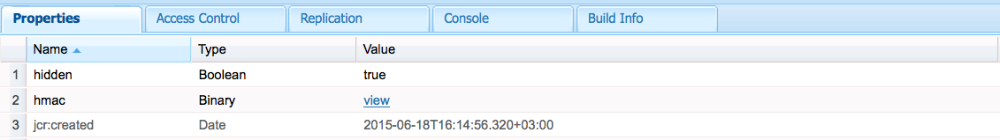

# 封裝的Token支援{#encapsulated-token-support}

## 簡介 {#introduction}

依預設，AEM會使用Token驗證處理常式來驗證每個請求。 但是，為了提供驗證請求，Token驗證處理常式要求存取每個請求的儲存庫。 這是因為Cookie用於維護驗證狀態。 從邏輯上講，狀態需要保存在儲存庫中，以驗證後續請求。 實際上，這意味著身份驗證機制是有狀態的。

這對於橫向延展性尤其重要。 在如下所示的發佈群等多執行個體設定中，無法以最佳方式達成負載平衡。 使用狀態驗證時，持續驗證狀態僅適用於第一次驗證使用者的例項。

以下列案例為例：

發佈實例1的用戶可能獲得驗證，但如果後續請求發佈實例2，該實例沒有持續的驗證狀態，因為該狀態保存在發佈實例1的儲存庫中，而發佈實例2有自己的儲存庫。

解決方案是在負載平衡器層級配置嚴格連線。 使用嚴格連線時，使用者一律會被導向至相同的發佈例項。 因此，無法實現真正最佳的負載平衡。

如果發佈例項無法使用，在該例項上驗證的所有使用者都將遺失其工作階段。 這是因為驗證Cookie需要存取儲存庫。

## 使用封裝令牌的無狀態身份驗證 {#stateless-authentication-with-the-encapsulated-token}

橫向調整能力的解決方案是使用AEM中新的封裝Token支援進行無狀態驗證。

Encapsulated Token是一種加密技術，可讓AEM安全地離線建立和驗證驗證資訊，而不需存取儲存庫。 如此，所有發佈例項都可能會發生驗證要求，而不需要嚴格連線。 它還具有提高驗證效能的優勢，因為無需對每個驗證請求訪問儲存庫。

您可在以下MongoMK作者和TarMK發佈例項的地理分佈部署中，瞭解其運作方式：

>[!NOTE]
>
>請注意，封裝的Token與驗證有關。 它可確保Cookie可以驗證，而不需存取儲存庫。 但是，用戶仍然需要存在於所有實例中，並且每個實例都可以訪問儲存在該用戶下的資訊。
>
>例如，如果在發佈實例1上建立了新用戶，由於封裝Token的工作方式，它將在發佈實例2上成功驗證。 如果使用者不存在於第二個發佈例項，請求仍無法成功。

## 設定封裝的Token {#configuring-the-encapsulated-token}

在設定封裝Token時，您需要考慮以下幾項：

1. 由於涉及密碼學，所有實例都需要有相同的HMAC密鑰。 自從AEM 6.3起，關鍵資料不再儲存在儲存庫中，而儲存在實際的檔案系統中。 考慮到這一點，複製密鑰的最佳方法是將密鑰從源實例的檔案系統複製到要複製密鑰的目標實例的檔案系統。 請參閱下方「複製HMAC金鑰」下的更多資訊。
1. 必須啟用封裝的Token。 這可以透過Web主控台完成。

### 複製HMAC密鑰 {#replicating-the-hmac-key}

HMAC密鑰以二進位屬性的形式存在 `/etc/key` 在儲存庫中。 您可以按其旁邊的檢視連 **結** ，分別下載它：

為了跨實例複製密鑰，您需要：

1. 存取AEM例項（通常為作者例項），其中包含要複製的關鍵材料；
1. 在本機 `com.adobe.granite.crypto.file` 檔案系統中找到該套件。 例如，在此路徑下：

   * &lt;author-aem-install-dir>/crx-quickstart/launchpad/felix/bundle21
   每個 `bundle.info` 資料夾內的檔案會識別包名稱。

1. 導覽至資料夾。 例如：

   * `<author-aem-install-dir>/crx-quickstart/launchpad/felix/bundle21/data`

1. 複製HMAC和主檔案。
1. 然後，前往您要複製HMAC金鑰的目標執行個體，並導覽至資料夾。 例如：

   * `<publish-aem-install-dir>/crx-quickstart/launchpad/felix/bundle21/data`

1. 貼上您先前複製的兩個檔案。
1. [如果目標實例已運行](/help/communities/deploy-communities.md#refresh-the-granite-crypto-bundle) ，請刷新加密包。

1. 對要將密鑰複製到的所有實例重複上述步驟。

#### 啟用封裝的Token {#enabling-the-encapsulated-token}

複製HMAC金鑰後，您就可以透過Web主控台啟用封裝的Token:

1. 將您的瀏覽器指向 `https://serveraddress:port/system/console/configMgr`
1. 尋找名為Day CRX Token驗證處 **理常式的項目** ，然後按一下。
1. 在以下窗口中，勾選「 **Enable encapsulated token support** （啟用封裝的Token支援）」框 **，然後按**「Save（保存）」。

