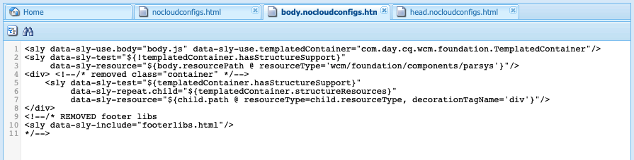

# 將體驗片段匯出到 Adobe Target{#exporting-experience-fragments-to-adobe-target}

>[!CAUTION]
>
>本頁的部分功能需要套用AEM 6.5.3.0 （或更新版本）。
>
>6.5.3.0:
>
>* **Externalizer網域** 現在可以選取。
>  **注意：** Externalizer網域僅與傳送至Target的體驗片段內容相關，與檢視選件內容之類的中繼資料無關。
>
>6.5.2.0:
>
>* 體驗片段可以匯出至以下任一個：
>
>   * 預設工作區。
>   * 在雲端設定中指定的已命名工作區。
>   * **注意：** 匯出至特定工作區需要Adobe Target Premium。
>
>* AEM必須是 [使用IMS與Adobe Target整合](/help/sites-administering/integration-target-ims.md).
>
>AEM 6.5.0.0和6.5.1.0：
>
>* AEM體驗片段會匯出至Adobe Target的預設工作區。
>* AEM必須根據下的指示與Adobe Target整合 [與Adobe Target整合](/help/sites-administering/target.md).

您可以匯出 [體驗片段](/help/sites-authoring/experience-fragments.md)，在Adobe Experience Manager (AEM)中建立，重新命名為Adobe Target (Target)。 然後，它們可以當做Target活動中的選件使用，以大規模測試並個人化體驗。

有三個格式選項可用於將體驗片段匯出至Adobe Target：

* HTML（預設）：支援網頁和混合式內容傳送
* JSON：支援Headless內容傳送
* HTML 和 JSON

AEM Experience Fragments可匯出至Adobe Target中的預設工作區，或匯出至Adobe Target的使用者定義工作區。 這是使用Adobe Developer主控台完成的，而AEM必須為此主控台 [使用IMS與Adobe Target整合](/help/sites-administering/integration-target-ims.md).

>[!NOTE]
>
>Adobe Target本身並不存在Adobe Target工作區。 它們是在Adobe IMS (Identity Management系統)中定義和管理的，然後使用Adobe Developer Console中的整合選取以供跨解決方案使用。

>[!NOTE]
>
>Adobe Target工作區可用來允許組織（群組）的成員僅建立和管理此組織的優惠方案和活動，而不會將存取權授與其他使用者。 例如，全球關注的國家特定組織。

>[!NOTE]
>
>如需詳細資訊，另請參閱：
>
>* [Adobe Target開發](https://developers.adobetarget.com/)
>* [核心元件 — 體驗片段](https://experienceleague.adobe.com/docs/experience-manager-core-components/using/wcm-components/experience-fragment.html)
>

## 必備條件 {#prerequisites}

>[!CAUTION]
>
>本頁的部分功能需要套用AEM 6.5.3.0。

需要執行各種動作：

1. 您必須 [使用IMS整合AEM與Adobe Target](/help/sites-administering/integration-target-ims.md).
2. 體驗片段會從AEM編寫執行個體匯出，因此您必須 [設定AEM連結外部化器](/help/sites-administering/target-requirements.md#configuring-the-aem-link-externalizer) 編寫執行個體上，以確保體驗片段中的任何參考資料都外部化，以便進行Web傳送。

   >[!NOTE]
   >
   >對於預設未涵蓋的連結重寫，請 [體驗片段連結重寫程式提供者](/help/sites-developing/experience-fragments.md#the-experience-fragment-link-rewriter-provider-html) 可用。 透過此專案，可以為您的執行個體開發自訂規則。

## 新增雲端設定 {#add-the-cloud-configuration}

在匯出片段之前，您必須新增 **雲端設定** 的 **Adobe Target** 至片段或資料夾。 這也可讓您：

* 指定要用於匯出的格式選項
* 選取Target工作區作為目的地
* 選取要重寫體驗片段中參考的外部化器網域（選用）

您可在以下位置選取所需選項： **頁面屬性** 所需資料夾和/或片段的URL名稱；必要時，會繼承規格。

1. 導覽至 **體驗片段** 主控台。

1. 開啟 **頁面屬性** 適當的資料夾或片段。

   >[!NOTE]
   >
   >如果您將雲端設定新增至體驗片段父資料夾，該設定會由所有子系繼承。
   >
   >
   >如果您將雲端設定新增至體驗片段本身，該設定會由所有變數繼承。

1. 選取 **Cloud Services** 標籤。

1. 下 **Cloud Service設定**，選取 **Adobe Target** 下拉式清單中的。

   >[!NOTE]
   >
   >可以自訂體驗片段選件的JSON格式。 若要這麼做，請定義客戶體驗片段元件，然後註明如何在元件Sling模型中匯出其屬性。
   >
   >請參閱核心元件：
   >
   >[核心元件 — 體驗片段](https://experienceleague.adobe.com/docs/experience-manager-core-components/using/wcm-components/experience-fragment.html)

   下 **Adobe Target** 選取：

   * 適當的設定
   * 所需的格式選項
   * Adobe Target工作區
   * 如有必要 — Externalizer網域

   >[!CAUTION]
   >
   >Externalizer網域是選用的。
   >
   >當您想要匯出的內容指向特定時，就會設定AEM Externalizer *發佈* 網域。 如需詳細資訊，請參閱 [設定AEM連結外部化器](/help/sites-administering/target-requirements.md#configuring-the-aem-link-externalizer).
   >
   >另請注意，外部化器網域僅與傳送至Target的體驗片段內容相關，與檢視選件內容之類的中繼資料無關。

   例如，針對資料夾：

   

1. **儲存並關閉**.

## 將體驗片段匯出至Adobe Target {#exporting-an-experience-fragment-to-adobe-target}

>[!CAUTION]
>
>對於媒體資產（例如影像），只會將參考匯出至Target。 資產本身仍會儲存在AEM Assets中，並從AEM發佈執行個體傳送。
>
>因此，在匯出至Target之前，必須發佈體驗片段以及所有相關資產。

若要將體驗片段從AEM匯出至Target （在指定雲端設定後）：

1. 導覽至體驗片段主控台。
1. 選取您要匯出至Target的體驗片段。

   >[!NOTE]
   >
   >它必須是體驗片段Web變數。

1. 點選/按一下 **匯出至Adobe Target**.

   >[!NOTE]
   >
   >如果體驗片段已匯出，請選取 **Adobe Target中的更新**.

1. 點選/按一下 **匯出而不發佈** 或 **發佈** 視需要。

   >[!NOTE]
   >
   >選取 **發佈** 立即發佈體驗片段並將其傳送到Target。

1. 點選/按一下 **確定** 在確認對話方塊中。

   您的體驗片段現在應該在Target中。

   >[!NOTE]
   >
   >[各種細節](/help/sites-authoring/experience-fragments.md#details-of-your-experience-fragment) 匯出的ID顯示在 **清單檢視** 控制檯和 **屬性**.

   >[!NOTE]
   >
   >在Adobe Target中檢視體驗片段時， *上次修改時間* 看到的日期是上次在AEM中修改片段的日期，而不是上次將片段匯出至Adobe Target的日期。

>[!NOTE]
>
>或者，您也可以使用下列檔案中的類似命令，從頁面編輯器執行匯出 [頁面資訊](/help/sites-authoring/author-environment-tools.md#page-information) 功能表。

## 在Adobe Target中使用您的體驗片段 {#using-your-experience-fragments-in-adobe-target}

執行上述工作後，體驗片段會顯示在Adobe Target的「選件」頁面上。 檢視 [特定Target檔案](https://experienceleague.adobe.com/docs/target/using/experiences/offers/aem-experience-fragments.html?lang=en) 以瞭解您可以達到的目的。

>[!NOTE]
>
>在Adobe Target中檢視體驗片段時， *上次修改時間* 看到的日期是上次在AEM中修改片段的日期，而不是上次將片段匯出至Adobe Target的日期。

## 刪除已匯出至Adobe Target的體驗片段 {#deleting-an-experience-fragment-already-exported-to-adobe-target}

刪除已匯出至Target的體驗片段，如果片段已用於Adobe Target的選件中，則可能會導致問題。 刪除片段會導致選件無法使用，因為AEM正在傳遞片段內容。

若要避免此類情況：

* 如果體驗片段目前未用於活動中，AEM可讓使用者刪除片段而不顯示警告訊息。
* 如果Adobe Target中的活動使用體驗片段，則會出現錯誤訊息，警告AEM使用者刪除片段對活動可能產生的後果。

  AEM中的錯誤訊息不會禁止使用者（強制）刪除體驗片段。 如果刪除體驗片段：

   * 具有AEM體驗片段的Target選件可能會顯示不良行為

      * 選件很可能仍會呈現，因為體驗片段HTML已推送至Target
      * 如果也在AEM中刪除了參照的資產，體驗片段中的任何參照都可能無法正常運作。

   * 由於體驗片段在AEM中不再存在，因此無法對體驗片段進行任何進一步修改。


## 從匯出至Target的體驗片段中移除ClientLibs {#removing-clientlibs-from-fragments-exported-target}

體驗片段包含完整的html標籤和所有必要的使用者端資料庫(CSS/JS)，以便呈現與體驗片段內容作者建立的片段完全相同的片段。 這是客製化設計。

在AEM所傳送的頁面上，搭配Adobe Target使用體驗片段選件時，「鎖定目標」頁面已包含所有必要的使用者端資料庫。 此外，也不需要體驗片段選件中的無關html (請參閱 [考量事項](#considerations))。

以下是體驗片段選件中html的偽範例：

```html
<!DOCTYPE>
<html>
   <head>
      <title>…</title>
      <!-- all of the client libraries (css/js) -->
      …
   </head>
   <body>
        <!--/* Actual XF Offer content would appear here... */-->
   </body>
</html>
```

概言之，AEM將體驗片段匯出至Adobe Target時，會使用數個額外的Sling選取器完成匯出作業。 例如，匯出的體驗片段的URL看起來可能像這樣(注意 `nocloudconfigs.atoffer`)：

* http://www.your-aem-instance.com/content/experience-fragments/my-offers/my-xf-offer.nocloudconfigs.atoffer.html

此 `nocloudconfigs` 選擇器是使用HTL定義的，可從以下位置複製以覆蓋：

* /libs/cq/experience-fragments/components/xfpage/nocloudconfigs.html

此 `atoffer` 選擇器的套用後處理使用 [Sling重寫程式](/help/sites-developing/experience-fragments.md#the-experience-fragment-link-rewriter-provider-html). 兩者皆可用來移除使用者端資料庫。

### 範例 {#example}

出於此處的目的，讓我們說明如何使用 `nocloudconfigs`.

>[!NOTE]
>
>另請參閱 [可編輯的範本](/help/sites-developing/templates.md#editable-templates) 以取得更多詳細資料。

#### 覆蓋 {#overlays}

在此特定範例中， [覆蓋](/help/sites-developing/overlays.md) 被包含將會移除使用者端程式庫 *和* 無關的html。 假設您已建立體驗片段範本型別。 需要從中複製的必要檔案 `/libs/cq/experience-fragments/components/xfpage/` 包括：

* `nocloudconfigs.html`
* `head.nocloudconfigs.html`
* `body.nocloudconfigs.html`

#### 範本型別覆蓋圖 {#template-type-overlays}

在此範例中，讓我們使用下列結構：


這些檔案的內容如下：

* `body.nocloudconfigs.html`

  

* `head.nocloudconfigs.html`

  

* `nocloudconfigs.html`

  

>[!NOTE]
>
>使用 `data-sly-unwrap` 若要移除body標籤，您需要 `nocloudconfigs.html`.

### 考量事項 {#considerations}

如果您需要使用Adobe Target中的體驗片段選件支援AEM網站和非AEM網站，您必須建立兩個體驗片段（兩種不同的範本型別）：

* 具有覆蓋圖以移除clientlibs/額外html的一個

* 沒有覆蓋的網域，因此包含必要的clientlibs