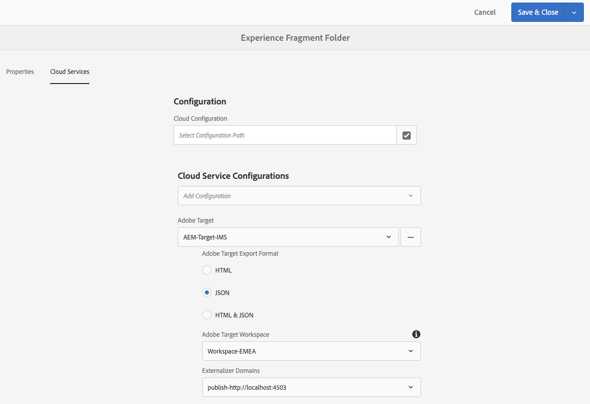

# 將體驗片段匯出至Adobe Target{#exporting-experience-fragments-to-adobe-target}

>[!CAUTION]
>
>本頁的某些功能需要應用程式AEM 6.5.3.0。
>
>6.5.3.0
>
>* **現在可以選取Externalizer** Domains。
>
>
6.5.2.0:
>
>* 體驗片段可匯出至下列其中一個：
   >   * 預設工作區。
   >   * 指定的工作區，在雲端設定中指定。
>* AEM必須 [使用Adobe I/O與Adobe Target整合](/help/sites-administering/integration-ims-adobe-io.md)。
>
>
AEM 6.5.0.0和6.5.1.0:
>
>* AEM體驗片段會匯出至Adobe target的預設工作區。
>* AEM必鬚根據「與Adobe Target整合」下的指示， [與Adobe Target整合](/help/sites-administering/target.md)。

您可以將 [在Adobe Experience Manager](/help/sites-authoring/experience-fragments.md)(AEM)中建立的Experience片段匯出至Adobe Target(Target)。 然後，您就可以在Target活動中將它們當做選件，以大規模測試和個人化體驗。

將體驗片段匯出至Adobe target有三種格式選項：

* HTML（預設）:支援網頁和混合式內容傳送
* JSON:支援無頭內容傳送
* HTML 和 JSON

AEM體驗片段可匯出至Adobe target的預設工作區，或匯出至Adobe target的使用者定義工作區。 這是透過Adobe I/O完成，AEM必須與Adobe Target [使用Adobe I/O整合](/help/sites-administering/integration-ims-adobe-io.md)。

>[!NOTE]
>
>Adobe target工作區不存在於Adobe Target本身。 這些應用程式在Adobe IMS(Identity Management System)中定義並管理，然後選取供使用Adobe I/O整合的解決方案使用。

>[!NOTE]
>
>Adobe Target工作區可用來允許組織（群組）的成員僅能建立和管理此組織的選件和活動；而不授予其他使用者存取權。 例如，全球關注的國家特定組織。

>[!NOTE]
>
>如需詳細資訊，請參閱：
>
>* [Adobe Target開發](https://www.adobe.io/apis/experiencecloud/target.html)
>* [核心元件——體驗片段](https://docs.adobe.com/content/help/en/experience-manager-core-components/using/components/experience-fragment.html)
>

## 必備條件 {#prerequisites}

>[!CAUTION]
>
>本頁的某些功能需要應用程式AEM 6.5.3.0。

需要執行各種動作：

1. 您必須 [使用Adobe I/O將AEM與Adobe Target整合](/help/sites-administering/integration-ims-adobe-io.md)。
2. 「體驗片段」是從AEM作者例項匯出，因此您必須在作者例項上設定 [AEM Link Externalizer](/help/sites-administering/target-requirements.md#configuring-the-aem-link-externalizer) ，以確保Experience Fragment中的任何參照都外部化，以便進行Web傳送。

   >[!NOTE]
   >
   >若為預設未涵蓋的連結重寫，則可使 [用「體驗片段連結重寫提供者](/help/sites-developing/experience-fragments.md#the-experience-fragment-link-rewriter-provider-html) 」。 透過此項功能，您可以針對實例開發自訂規則。

## 新增雲端設定 {#add-the-cloud-configuration}

在匯出片段之前，您需要將 **Adobe Target的Cloud Configuration** （雲端設定）新增至 **** 片段或資料夾。 這也可讓您：

* 指定用於導出的格式選項
* 選擇目標工作區作為目標
* 選取外部化器網域，以在體驗片段中重寫參照（選用）

在所需資料夾和／或片段的 **「頁面屬性** 」中可以選擇所需選項；規範將視需要繼承。

1. 導覽至 **Experience片段主控台** 。

1. 開啟 **適當資料夾** 或片段的頁面屬性。

   >[!NOTE]
   >
   >如果您將雲端設定新增至「體驗片段」父資料夾，則所有子資料夾都會繼承此設定。
   >
   >
   >如果您將雲端組態新增至Experience Fragment本身，則所有變數都會繼承組態。

1. 選擇「 **雲端服務** 」標籤。

1. 在「 **雲端服務設定**」下方，從下拉式清單中選取「 **Adobe Target** 」。

1. 
   >[!NOTE]
   >
   >可自訂體驗片段選件的JSON格式。 若要這麼做，請定義客戶體驗片段元件，然後註解如何在元件Sling Model中匯出其屬性。
   >
   >請參閱核心元件：
   >
   >[核心元件——體驗片段](https://docs.adobe.com/content/help/en/experience-manager-core-components/using/components/experience-fragment.html)

   在「 **Adobe Target** 」下方選取：

   * 適當的配置
   * 所需格式選項
   * Adobe target工作區
   * if required - externalizer網域
   >[!CAUTION]
   >
   >外部化器網域為選擇性。 當您想要匯出的內容指向特定發佈網域時，會設定AEM外 *部* 式。 如需詳細資訊，請 [參閱「設定AEM Link Externalizer](/help/sites-administering/target-requirements.md#configuring-the-aem-link-externalizer)」。

   例如，對於資料夾：

   

1. **儲存並關閉**.

## 將體驗片段匯出至Adobe Target {#exporting-an-experience-fragment-to-adobe-target}

>[!CAUTION]
>
>對於媒體資產（例如影像），只會將參考匯出至Target。 資產本身仍會儲存在AEM Assets中，並會從AEM發佈例項傳送。
>
>因此，必須先發佈包含所有相關資產的體驗片段，再匯出至Target。

若要將體驗片段從AEM匯出至Target（在指定雲端設定後）:

1. 導覽至體驗片段主控台。
1. 選取您要匯出至目標的體驗片段。

   >[!NOTE]
   >
   >它必須是體驗片段Web變數。

1. 點選／按一 **下「匯出至Adobe Target**」。

   >[!NOTE]
   >
   >如果體驗片段已匯出，請在Adobe Target中選 **取「更新」**。

1. 點選／按一 **下「匯出」，不需發佈** , **或視需要發佈** 。

   >[!NOTE]
   >
   >選取 **「發佈** 」會立即發佈體驗片段，並將它傳送至Target。

1. 點選／按一 **下確認** 對話方塊中的確定。

   您的體驗片段現在應該位於Target中。

   >[!NOTE]
   >
   >[在控制台](/help/sites-authoring/experience-fragments.md#details-of-your-experience-fragment) 和屬性的「清單檢視 **」中，可看到** 匯出的各種 **詳細資訊**。

   >[!NOTE]
   >
   >在Adobe target中檢視體驗片段時，所見的上次修改日期是片段在AEM中上次修改的日期，而不是片段上次匯出至Adobe Target的日期。 **

>[!NOTE]
>
>或者，您也可以使用「頁面資訊」功能表中的類似指令，從頁面編輯器 [執行匯出](/help/sites-authoring/author-environment-tools.md#page-information) 。

## 在Adobe target中使用您的體驗片段 {#using-your-experience-fragments-in-adobe-target}

執行前述工作後，體驗片段會顯示在Target的「選件」頁面上。 請檢視特定的Target [檔案](https://experiencecloud.adobe.com/resources/help/en_US/target/target/aem-experience-fragments.html) ，以瞭解您可在其中取得哪些成果。

>[!NOTE]
>
>在Adobe target中檢視體驗片段時，所見的上次修改日期是片段在AEM中上次修改的日期，而不是片段上次匯出至Adobe Target的日期。 **

## 刪除已匯出至Adobe target的體驗片段 {#deleting-an-experience-fragment-already-exported-to-adobe-target}

刪除已匯出至Target的體驗片段，如果該片段已用於Target中的選件，可能會造成問題。 當AEM傳送片段內容時，刪除片段會導致選件無法使用。

要避免這種情況：

* 如果「體驗片段」目前未用於活動，AEM可讓使用者刪除片段，而不會顯示警告訊息。
* 如果Target中的活動目前正在使用體驗片段，則會出現錯誤訊息，警告AEM使用者刪除片段對活動可能造成的後果。

   AEM中的錯誤訊息並未禁止使用者（強制）刪除「體驗片段」。 如果刪除體驗片段：

   * 含AEM體驗片段的Target選件可能會顯示不想要的行為

      * 當「體驗片段HTML」推送至Target時，選件仍可能會呈現
      * 如果在AEM中也刪除了參照的資產，「體驗片段」中的任何參照可能無法正常運作。
   * 當然，由於AEM中已不存在體驗片段，因此無法進一步修改體驗片段。