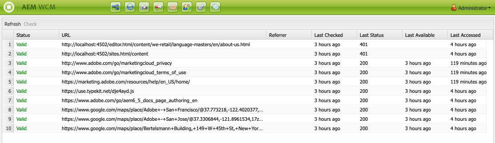

# 外部連結檢查器{#the-external-link-checker}

AEM中提供外部連結檢查程式。 連結檢查程式：

* 掃描所有內容頁面
* 生成所有有效和無效連結的清單
* 在個別內容頁面上將無效連結標示為原地中斷

## 如何驗證外部連結 {#how-to-validate-external-links}

要使用外部連結檢查器：

1. 使用 **導覽**，依序選 **擇工具**、 **網站**。
1. 選擇「 **外部連結檢查器**」，將生成所有外部連結的清單。
1. 在清單中選取特定連結，然後按一下「檢查 ****:

   

   顯示資訊：

   * **連結的狀態** （英文）
   * **URL**
   * **反向連結**
   * 自連結上次檢查( **驗證** )起的時間
   * 返回 **的最後狀態**

   * 連結上次可用的時 **間**
   * 上次訪問連結的 **時間**

1. 在個別內容頁面上，無效的連結會顯示為中斷：

   