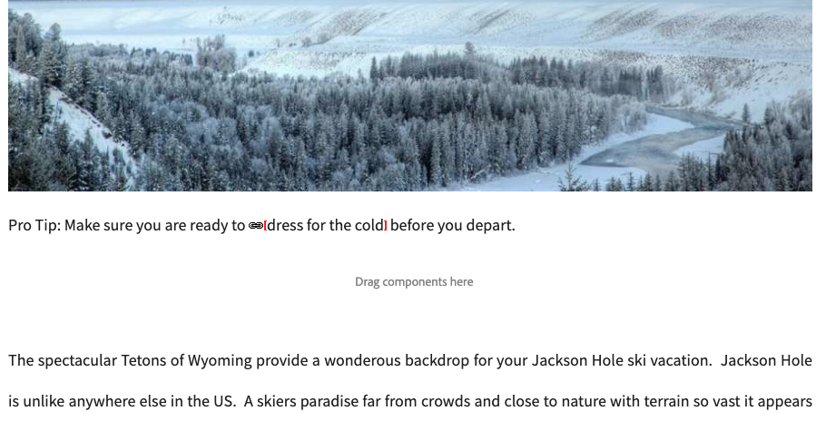

# 連結檢查器{#the-link-checker}

內容作者不必擔心要驗證其內容頁面中包含的每個連結。

「連結檢查程式」會自動協助內容作者處理其連結，包括：

* 在連結新增至內容時驗證連結
* 顯示內容中所有外部連結的清單
* 執行連結轉換

「連結檢查器」具有許多[配置選項](#configuring)，例如定義驗證內部、允許從驗證中忽略某些連結或連結路徑以及重寫連結重寫規則。

連結檢查器會驗證[內部連結](#internal)和[外部連結。](#external)

>[!NOTE]
>
>由於「連結檢查器」會檢查每個內容頁面的連結，因此「連結檢查器」可能會影響大型存放庫的效能。 在這種情況下，您可能需要[配置連結檢查器運行](#configuring)或[的頻率。](#disabling)

## 內部連結檢查 {#internal}

內部連結是AEM存放庫中其他內容的連結。 可使用RTE的路徑選擇器或自訂元件來新增內部連結。 例如：

* 您的頁面`/content/wknd/us/en/adventures/ski-touring.html`
* 在[文本元件中包含指向`/content/wknd/us/en/adventures/extreme-ironing.html`的連結。](https://experienceleague.adobe.com/docs/experience-manager-core-components/using/components/text.html)

內容作者新增內部連結至頁面時，就會立即驗證內部連結。 如果連結變成無效：

* 它會從發行者中移除。 連結的文字仍會保留，但連結本身會遭到移除。
* 在製作介面中會顯示為中斷的連結。

## 外部連結檢查 {#external}

外部連結是指向AEM存放庫外部內容的連結。 可使用RTE或自訂元件來新增外部連結。 例如：

* 您的頁面`/content/wknd/us/en/adventures/ski-touring.html`
* 在[文本元件中包含指向`https://bunwarmerthermalunderwear.com`的連結。](https://experienceleague.adobe.com/docs/experience-manager-core-components/using/components/text.html)

外部連結會透過語法和檢查其可用性來驗證。 此檢查會在可設定的內部非同步執行。 如果連結檢查器發現外部連結無效：

* 它會從發行者中移除。 連結的文字仍會保留，但連結本身會遭到移除。
* 在製作介面中會顯示為中斷的連結。

此外，[外部連結檢查器](#external-link-checker)介面還提供內容頁面上所有外部連結的概觀。

### 使用外部連結檢查器{#external-link-checker}

要使用外部連結檢查器：

1. 使用&#x200B;**Navigation**，選擇&#x200B;**Tools**，然後選擇&#x200B;**Sites**。
1. 選擇&#x200B;**外部連結檢查器**，並顯示所有外部連結的清單。

會顯示下列資訊：

* **狀態**  — 連結的驗證狀態，可以是下列其中一項：
   * **有效**  — 連結檢查器可以存取外部連結
   * **擱置中**  — 外部連結已新增至網站內容，但尚未通過連結檢查程式驗證
   * **無效**  — 連結檢查程式無法存取外部連結
* **URL**  — 外部連結
* **反向連結**  — 包含外部連結的內容頁面
   * 只有在已配置的情況下，才會填入[。](#configuring)
* **上次勾選**  — 上次連結檢查程式驗證外部連結的時間
   * 可配置檢查連結的頻率[。](#configuring)
* **上次狀態**  — 當「已勾選連結」上次勾選外部連結時，傳回的最後一個HTML狀態代碼
* **上次可用**  — 自連結檢查程式上次可用連結以來的時間
* **上次存取**  — 自上次在製作介面中存取含有外部連結的頁面以來的時間

您可以使用連結清單頂端的兩個按鈕來操控視窗的內容：

* **重新整理**  — 重新整理清單的內容
* **勾選**  — 勾選清單中選取的個別外部連結

### 外部連結檢查器的工作原理{#how-it-works}

外部連結檢查器雖然易於使用，但它依賴於許多服務並了解它們的工作方式，可幫助您了解如何[配置連結檢查器](#configuring)以滿足您的需求。

1. 每當內容作者儲存頁面的任何連結時，就會觸發事件處理常式。
1. 事件處理常式遍歷`/content`下的所有內容，並檢查是否有新的或更新的連結，並將它們添加到「連結檢查器」的快取中。
1. 然後， **Day CQ Link Checker Service**&#x200B;會定期執行以檢查快取中的條目，以獲取有效語法。
1. 經過語法驗證的連結隨後會出現在[外部連結檢查器](#external-link-checker)窗口中。 但是，它們將處於&#x200B;**Pending**&#x200B;狀態。
1. 然後， **Day CQ連結檢查程式任務**&#x200B;會定期執行，以透過進行GET呼叫來驗證連結。
1. 然後， **日CQ連結檢查器任務**&#x200B;將使用GET調用的結果更新「外部連結檢查器」窗口中的條目。

## 配置連結檢查器 {#configuring}

AEM中的「連結檢查程式」會自動立即可用。 不過，有許多OSGi設定可修改以變更其行為：

* **Day CQ Link Checker資訊儲存服務**  — 此服務會定義存放庫中連結檢查器快取的大小。
* **Day CQ連結檢查程式服務**  — 此服務會執行外部連結語法的非同步檢查。您可以定義檢查期間，以及檢查程式在其他選項中跳過哪些類型的連結。
* **日CQ連結檢查程式任務**  — 此服務會執行外部連結的GET驗證。它允許區間的不同定義，以檢查其他選項中的錯誤和良好連結。
* **Day CQ連結檢查程式轉換器**  — 允許根據使用者定義的規則集轉換連結。

有關如何更改OSGi設定的詳細資訊，請參閱文檔[OSGi配置設定](/help/sites-deploying/osgi-configuration-settings.md)。

## 禁用連結檢查器 {#disabling}

您可以選擇完全停用連結檢查程式。 若要這麼做：

1. 開啟OSGi主控台。
1. 編輯&#x200B;**Day CQ連結檢查器變壓器**
1. 勾選您要停用的選項：
   * **停用檢查**  — 停用連結驗證
   * **停用重新寫入**  — 停用連結轉換

>[!NOTE]
>
>如果您在開始建立內容後停用連結檢查，您仍可能在[外部連結檢查程式視窗](#external-link-checker)中看到項目，但這些項目將不再更新。
