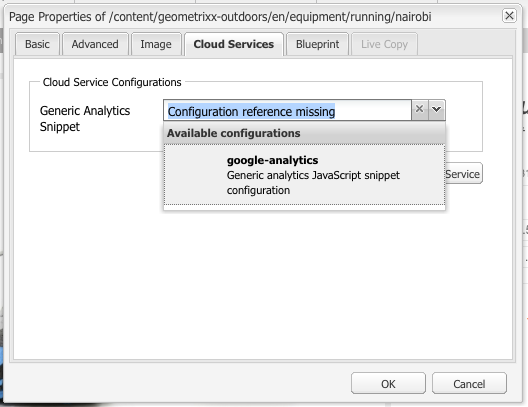

# Analytics與外部提供者 {#analytics-with-external-providers}

Analytics可為您提供網站使用方式的重要且有趣的資訊。

各種現成可用的配置可用於與適當的服務整合，例如：

* [Adobe Analytics](/help/sites-administering/adobeanalytics.md)
* [Adobe Target](/help/sites-administering/target.md)

您也可以設定您自己的一般分析 **程式碼片段例項** ，以定義新的服務設定。

然後，通過添加到網頁的代碼的小片段收集資訊。 例如：

>[!CAUTION]
>
>指令碼不得包含在標 `script` 記中。

```
var _gaq = _gaq || [];
_gaq.push(['_setAccount', 'UA-XXXXX-X']);
_gaq.push(['_trackPageview']);

(function() {
    var ga = document.createElement('script'); ga.type = 'text/javascript'; ga.async = true;
    ga.src = ('https:' == document.location.protocol ? 'https://ssl' : 'https://www') + '.google-analytics.com/ga.js';
    var s = document.getElementsByTagName('script')[0]; s.parentNode.insertBefore(ga, s);
})();
```

這些程式碼片段可讓您收集資料並產生報表。 收集的實際資料取決於提供者和使用的實際程式碼片段。 統計資料範例包括：

* 一段時間內有多少訪客
* 瀏覽的頁數
* 使用搜尋詞
* 著陸頁面

>[!CAUTION]
>
>Geometrixx-Outdoors示範網站的設定，讓「頁面屬性」中提供的屬性附加至對應指令碼的html原始碼(剛好在 `</html>` endtag的正上 `js` 方)。

>如果您自 `/apps` 己不繼承預設頁面元件( `/libs/foundation/components/page`)，您（或您的開發人員）必須確定已包含對應的指令碼，例如 `js``cq/cloudserviceconfigs/components/servicescomponents`，包括或使用類似機制。
>
>若沒有這項功能，則所有服務（一般、分析、目標等）都無法運作。

## 使用一般程式碼片段建立新服務 {#creating-a-new-service-with-a-generic-snippet}

對於基本配置：

1. 開啟「工 **具** 」主控台。
1. 從左窗格展開「 **雲端服務設定」**。
1. 連按兩下「 **一般分析程式碼片段** 」以開啟頁面：

   

1. 按一下+，使用對話方塊新增設定；至少指派一個名稱，例如google analytics:

   

1. 按一 **下「建立**」，程式碼片段對話方塊會立即開啟——將適當的javascript程式碼片段貼入欄位：

   

1. 按一 **下「確定** 」以儲存。

## 在頁面上使用您的新服務 {#using-your-new-service-on-pages}

已建立服務配置後，您現在需要配置所需的頁以使用它：

1. 導覽至頁面。
1. 開啟「 **Page Properties from sidekick** 」(頁面屬性 **)，然後** 開啟「Cloud Services」標籤。
1. 按一 **下「新增服務**」，然後選取所需的服務；例如，「 **一般分析程式碼片段**:

   

1. 按一 **下「確定** 」以儲存。
1. 您將會返回「雲端服 **務」標籤** 。 「 **一般分析程式碼片段** 」現在會隨訊息一併列出 `Configuration reference missing`。 使用下拉式清單來選擇您的特定服務例項；例如google-analytics:

   

1. 按一 **下「確定** 」以儲存。

   如果您檢視頁面的「頁面來源」，現在可以看到此程式碼片段。

   經過適當的時間後，您就可以檢視已收集的統計資料。

   >[!NOTE]
   如果配置附加到具有子頁面的頁面，則服務也由這些頁面繼承。
