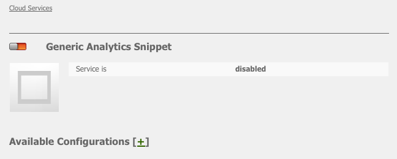

# Analytics與外部提供者 {#analytics-with-external-providers}

Analytics可提供您有關網站使用方式的重要且有趣的資訊。

各種現成可用的設定可與適當的服務整合，例如：

* [Adobe Analytics](/help/sites-administering/adobeanalytics.md)
* [Adobe Target](/help/sites-administering/target.md)

您也可以設定自己的例項， **一般Analytics程式碼片段** 定義新服務配置。

然後，通過添加到網頁的小代碼片段來收集資訊。 例如：

>[!CAUTION]
>
>指令碼不得括在 `script` 標籤。

```
var _gaq = _gaq || [];
_gaq.push(['_setAccount', 'UA-XXXXX-X']);
_gaq.push(['_trackPageview']);

(function() {
    var ga = document.createElement('script'); ga.type = 'text/javascript'; ga.async = true;
    ga.src = ('https:' == document.location.protocol ? 'https://ssl' : 'https://www') + '.google-analytics.com/ga.js';
    var s = document.getElementsByTagName('script')[0]; s.parentNode.insertBefore(ga, s);
})();
```

此類片段可讓您收集資料並產生報表。 收集的實際資料取決於提供者和使用的實際程式碼片段。 示例統計資訊包括：

* 一段時間內有多少訪客
* 瀏覽頁數
* 使用的搜尋詞
* 登陸頁面

>[!CAUTION]
>
>已設定「Geometrixx — 戶外」示範網站，讓「頁面屬性」中提供的屬性附加至html原始碼(位於 `</html>` endtag) `js` 指令碼。
>
>若您擁有 `/apps` 不繼承預設頁面元件( `/libs/foundation/components/page`)您（或您的開發人員）必須確定對應 `js` 包含指令碼，例如透過 `cq/cloudserviceconfigs/components/servicescomponents`，或使用類似的機制。
>
>若未這麼做，任何服務（一般、Analytics、Target等）都無法運作。

## 使用一般程式碼片段建立新服務 {#creating-a-new-service-with-a-generic-snippet}

對於基本配置：

1. 開啟 **工具** 控制台。
1. 從左窗格展開 **Cloud Services配置**.
1. 按兩下 **一般Analytics程式碼片段** 若要開啟頁面：

   

1. 按一下+ ，使用對話方塊新增設定；至少指派一個名稱，例如google analytics:

   

1. 按一下 **建立**，則會立即開啟「 」對話方塊 — 將適當的javascript程式碼片段貼入「 」欄位：

   

1. 按一下 **確定** 儲存。

## 在頁面上使用您的新服務 {#using-your-new-service-on-pages}

建立服務設定後，您現在需要設定所需頁面才能使用：

1. 導覽至頁面。
1. 開啟 **頁面屬性** 從sidekick，然後 **Cloud Services** 標籤。
1. 按一下 **添加服務**，然後選取所需服務；例如， **一般Analytics程式碼片段**:

   

1. 按一下 **確定** 儲存。
1. 您將會返回 **Cloud Services** 標籤。 此 **一般Analytics程式碼片段** 現在會與訊息一併列出 `Configuration reference missing`. 使用下拉式清單來選取您的特定服務執行個體；例如google-analytics:

   

1. 按一下 **確定** 儲存。

   如果您檢視頁面的「頁面來源」，現在便可檢視此程式碼片段。

   經過適當的時間段後，您將能夠檢視已收集的統計資料。

   >[!NOTE]
   >
   >如果設定附加至具有子頁面的頁面，則這些頁面也會繼承服務。
