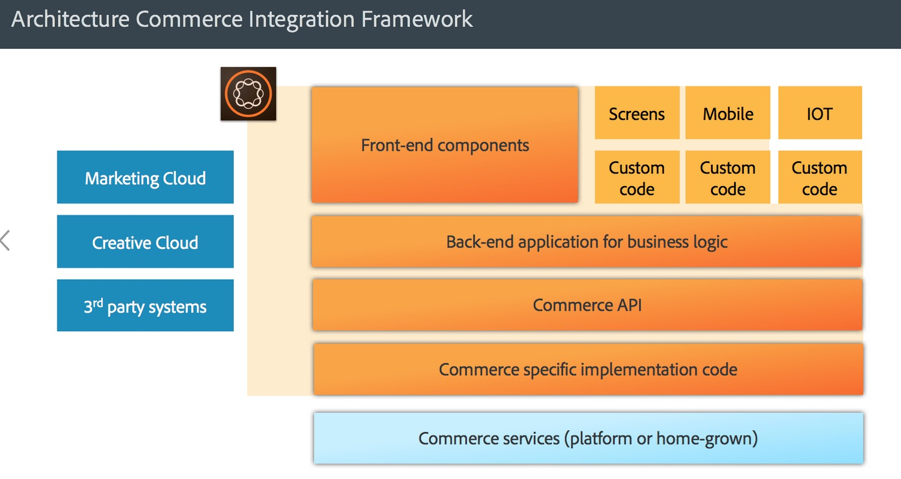

# AEM Commerce - GDPR整備{#aem-commerce-gdpr-readiness}

>[!IMPORTANT]
>
>以下各節以GDPR為例，但說明的詳細資料適用於所有資料保護和隱私權法規，例如GDPR和CCPA。

歐盟資料隱私權的一般資料保護規範於2018年5月起生效。 請參閱Adobe隱私權中心](https://business.adobe.com/privacy/general-data-protection-regulation.html)的[GDPR頁面。

>[!NOTE]
>
>如需詳細資訊，請參閱[AEM GDPR整備](/help/managing/data-protection-and-privacy.md)。

透過Adobe現成的Commerce整合，AEM成為體驗層，使用服務並將資料傳回至以Headless模式執行的客戶商務平台。

對於某些商務平台，Adobe會在AEM中儲存設定檔資訊( `/home/users`)和商務權杖（以登入商務平台）。 針對這些使用案例，請閱讀[處理AEM平台的GDPR要求](/help/sites-administering/handling-gdpr-requests-for-aem-platform.md)。

## 處理AEM Commerce的GDPR請求 {#handling-gdpr-requests-for-aem-commerce}

針對SalesforceCommerce Cloud整合，AEM Commerce不會儲存任何GDPR相關資訊。 將要求轉寄至[Salesforce Cloud](https://documentation.b2c.commercecloud.salesforce.com/DOC1/index.jsp)。

對於hybris和HCL WebSphere® Commerce整合，AEM中有些資料。 使用[AEM Platform GDPR指示](/help/sites-administering/handling-gdpr-requests-for-aem-platform.md)並考慮下列問題：

1. **我的資料儲存/使用於何處？**&#x200B;快取的使用者設定檔資訊，例如，名稱、商務使用者識別碼、權杖、密碼和位址資料，如AEM中所示。
1. **我該和誰共用包含的GDPR資料？** AEM Commerce中GDPR相關資料的任何更新都不會儲存（上述相關設定檔資訊除外），而是透過代理傳回至Commerce平台。
1. **如何刪除我的使用者資料**？ 在AEM中刪除使用者設定檔，並在商務平台上叫用使用者刪除。

>[!NOTE]
>
>請視需要檢視[hybris wiki](https://wiki.hybris.com/)或[HCL WebSphere® Commerce檔案](https://help.hcltechsw.com/commerce/index.html)。
