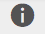
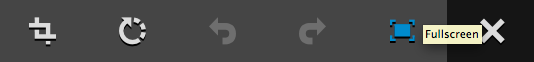
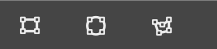
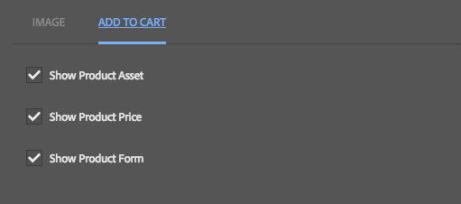
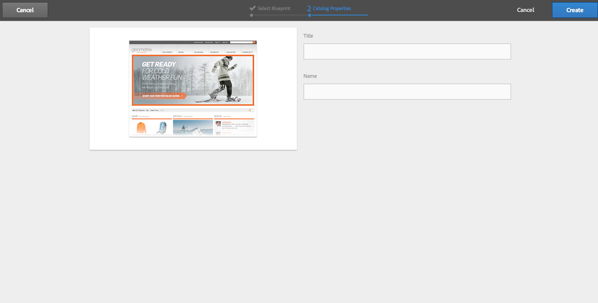

# 管理一般電子商務 {#administering-generic-ecommerce}

AEM一般解決方案提供管理存放在儲存庫中的商務資訊的方法（而非使用外部電子商務引擎）。 這包括：

* [產品](/help/sites-administering/concepts.md#products)
* [產品的系列品種](/help/sites-administering/concepts.md#product-variants)
* [目錄](/help/sites-administering/concepts.md#catalogs)
* [促銷活動](/help/sites-administering/concepts.md#promotions)
* [憑單](/help/sites-administering/concepts.md#vouchers)
* [訂購](/help/sites-administering/concepts.md#shopping-cart-and-orders)
* [代理頁](/help/sites-administering/concepts.md#proxy-pages)

>[!NOTE]
>
>標準AEM安裝包含一般AEM(JCR)電子商務實作。
>
>這目前僅供展示之用，或根據您的需求做為自訂實作的基礎。

## 產品與產品變數 {#products-and-product-variations}

>[!NOTE]
>
>下列程式適用於產品和產品變數。

在建立產品之前，您需要先定義支 [架](/help/sites-authoring/scaffolding.md)。 這可指定您定義產品及編輯方式所需的欄位。

每種不同的產品類型都需要一個支架。 適當的支架通過以下任一方法與產品相關聯：

* 路徑
* 產品可以參照腳手架

>[!NOTE]
>
>Geometrixx-Outdoors商店有單一產品類型（因此也有單一支架）:
>
>`/etc/scaffolding/geometrixx-outdoors`
>
>Geometrixx-Outdoors產品類型在上：
>
>`/etc/commerce/products/geometrixx-outdoors`
>
>您可以在任何位置建立新的產品定義，而不需進行任何其他設定。

### Importing Products {#importing-products}

#### 匯入產品——最佳化觸控式UI {#importing-products-touch-optimized-ui}

1. 透過商務導 **覽至** 「產品」 **主控台**。
1. 使用產 **品控制** 台導覽至所需位置。
1. 使用「 **匯入產品** 」圖示開啟精靈。

   

1. 指定：

   * **匯入工具**

      預設為特定商務提 [供者的匯入](/help/sites-administering/concepts.md#commerce-providers)工具 `Geometrixx`。

   * **來源**

      要導入的檔案；您可以使用瀏覽器來選擇檔案。

   * **增量匯入**

      指出這是否為增量匯入（而非完全匯入）。
   >[!NOTE]
   >
   >遞增匯入（範例geometrixx-outdoor匯入工具的）會在產品層級運作。
   >
   >可以定義自訂的匯入工具，以視需要運作。

1. 選擇 **下一步** ，導入產品時，將顯示已執行操作的日誌。

   >[!NOTE]
   >
   >產品將匯入或相對於目前位置。

   >[!NOTE]
   >
   >重複使 **用Next** 和 **Back** 會重複匯入產品定義。 但是，由於它們具有相同的SKU，因此僅會覆寫儲存庫中現有的資訊。

1. 選擇 **「完成** 」以關閉嚮導。

#### 匯入產品- Classic UI {#importing-products-classic-ui}

1. 使用工 **具控制** 台開啟 **「商務** 」檔案夾。
1. 按兩下以開啟「產品匯 **入工具」**:

   

1. 指定：

   * **存放區名稱**

      產品將匯入至：

      `/etc/commerce/products/<*store name*>/`

   * **商務提供程式**

      您的商務提供者 [的匯入工具](/help/sites-administering/concepts.md#commerce-providers);預設為Geometrixx。

   * **來源檔案**

      要導入的檔案的儲存庫中的位置。

   * **增量匯入**

      指出這是否為增量匯入（而非完全匯入）。

1. 按一下 **匯入產品**。

### 建立產品資訊 {#creating-product-information}

>[!NOTE]
>
>標準產品管理是基本的，因為Geometrixx-Outdoors產品集一直保持基本。 複雜性是以產品架構為 [基礎](/help/sites-authoring/scaffolding.md)，因此使用您自己的產品架構，就可進行更精密的編輯。

#### 建立產品資訊——最佳化觸控式使用者介面 {#creating-product-information-touch-optimized-ui}

1. 使用 **產品** (透過商 **務**)導覽至所需位置。
1. 使用「 **建立** 」圖示來選擇其中一項（視結構和位置而定）:

   * **建立產品**
   * **建立產品變數**
   

1. 嚮導將開啟。 使用「 **基本** 」(Basic **)和「產品」(** Product)頁籤輸 [入新產品或產品變型的產品屬性](/help/sites-administering/concepts.md#product-attributes) 。

   >[!NOTE]
   >
   >**標題** 和 **** SKU是建立產品或變型所需的最低值。

1. 選擇 **建立** ，保存資訊。

>[!NOTE]
>
>許多產品都提供多種顏色和／或尺寸。 您可從產品主控台管理基本產品及相關產品變體的 **資訊** 。
>
>產品及其變數會儲存為樹狀結構，產品資訊位於頂端，其下會有變數（此結構由UI強制執行）。

### 編輯產品資訊 {#editing-product-information}

>[!NOTE]
>
>Geometrixx-outdoors中的產品影像可從以下網址取得：
>
>`/etc/commerce/products/...`
>
>這表示預設情況下，調度程式將阻止它們 ，因此請根據需要進行配置。

#### 編輯產品資訊——最佳化觸控式UI {#editing-product-information-touch-optimized-ui}

1. 使用產 **品主控台** (透過 **商務**)導覽至您的產品資訊。
1. 使用下列任一項：

   * [快速動作](/help/sites-authoring/basic-handling.md#quick-actions)
   * [選擇模式](/help/sites-authoring/basic-handling.md#navigating-and-selection-mode)
   選取「檢 **視產品資料** 」圖示：

   

1. 將 [顯示產品](/help/sites-administering/concepts.md#product-attributes) 屬性。 使用 **「編輯** 」(Edit) **和「完成** 」(Done)進行任何更改。

### 顯示產品參考 {#showing-product-references}

#### 顯示產品參考——最佳化觸控式UI {#showing-product-references-touch-optimized-ui}

1. 使用產 **品主控台** (透過 **商務**)導覽至您的產品資訊。
1. 使用圖示開啟「參照」的次導軌：

   

1. 選擇所需產品——輔助導軌將更新以顯示可用的參考類型：

   

1. 按一下／點選參考類型（例如「產品頁面」）以展開清單。
1. 選擇特定參考以顯示選項：

   * 導覽至產品頁面
   * 編輯產品頁面
   

### Search for Products {#search-for-products}

1. 透過商務導 **覽至** 「產品」 **主控台**。
1. 使用圖示開啟「搜尋」的次要邊欄：

   

1. 您可使用數個Facet來搜尋產品。 搜索只能使用一個或多個刻面。 找到的產品將顯示：

   

1. 按一下／點選產品會開啟產品。 您也可以發佈或檢視產品資料。

#### 擴充搜尋 {#extending-search}

您可以使用CRXDE Lite修改現有Facet或新增Facet:

1. 導航到:

   `http://localhost:4502/crx/de/index.jsp#/libs/commerce/gui/content/products/aside/items/search/items/searchpanel/facets`

1. 例如，您可以修改產品搜尋頁面上將顯示的大小。 按一下節 `sizegroup` 點。
1. 按一下 `items` 節點，然後按一下 `propertypredicate` 節點。
1. 您可以修改 `propertyValues`。 例如，您可以新增XS、XXL或移除大小。
1. 按一 **下「全部儲存** 」，並導覽至產品搜尋頁面。 您的變更應該會出現。

### 多個資產 {#multiple-assets}

您可以在產品元件中新增多個資產，然後指定將顯示在產品頁面上的資產。

>[!NOTE]
>
>所有與多個資產相關的工作都可透過觸控最佳化UI完成。

#### 新增多個資產 {#adding-multiple-assets}

1. 透過商務導 **覽至** 「產品」 **主控台**。
1. 使用產 **品主控台** ，導覽至所需產品。

   >[!NOTE]
   >
   >你必須在產品層級，而不是在變型層級。

1. 點選／按一 **下「檢視產品資料** 」圖示，並使用選擇模式或快速動作。
1. 點選／按一下「編輯」圖示。
1. 捲動至 **新增**。

   

1. 點選／按一下「 **新增**」。 隨即出現新資產預留位置。
1. 點選／按一下**變更**會開啟一個對話方塊，讓您選擇資產。
1. 選取您要新增的資產。

   >[!NOTE]
   >
   >您可以選取的資產為 [資產](https://helpx.adobe.com/experience-manager/aem-previous-versions.html#assets)。

1. 點選／按一下「完成」圖示。

兩個資產現在會儲存在您的產品元件中。 您可以設定產品頁面上會顯示哪一個。 這適用於類別系統。 首先，您需要將類別新增至個別資產：

1. 點選／按一下「 **檢視產品資料」**。
1. 在資產 **下方輸入資產類別** ，例如 `cat1` 和 `cat2`。

   >[!NOTE]
   >
   >您也可以使用類別的標籤。

1. 點選／按一下「完成」圖示。 您現在必須 [開始](#rolling-out-a-catalog) 。

現在，您的資產在產品元件中有一個類別。 您可以設定在三個不同層級顯示的類別：

* [產品頁面](#product-page)
* [目錄](#catalog)
* [產品主控台](#products-console)

>[!NOTE]
>
>如果您未設定類別，第一個資產會顯示在產品頁面上。

選擇要顯示的影像的機制如下：

1. 驗證是否為「產品頁」設定了類別。
1. 如果沒有，請驗證是否為目錄設定了類別。
1. 否則，驗證是否為產品控制台設定了類別。

>[!NOTE]
>
>對於目錄層級和產品主控台層級，您必須首先展開變更，才能套用修改並在產品頁面上查看差異。

#### 產品頁面 {#product-page}

1. 導覽至您的產品頁面。
1. **編輯** product元件。
1. 輸入您 **選擇的影像類別** ( `cat1` 例如)。
1. 點選／按一下「 **完成**」。 頁面會重新整理，並應顯示正確的資產。

#### 目錄  {#catalog}

1. 導覽至您的目錄。
1. 點選／按一下「 **檢視屬性」**。
1. 點選／按一下「 **編輯**」。
1. 點選／按一下「 **資產** 」標籤。
1. 輸入所需的 **產品資產類別**。
1. 點選／按一下「 **完成**」。
1. [轉出](#rolling-out-a-catalog) ，您的變更。

#### 產品主控台 {#products-console}

1. 使用產 **品主控台** ，導覽至所需的產品。
1. 點選／按一下「 **檢視產品資料」**。
1. 點選／按一下「 **編輯**」。
1. 輸入預 **設資產類別**。
1. 點選／按一下「 **完成**」。
1. [轉出](#rolling-out-a-catalog) ，您的變更。

### 發佈／取消發佈產品資訊 {#publishing-unpublishing-product-information}

#### 發佈／取消發佈產品資訊——觸控最佳化UI {#publishing-unpublishing-product-information-touch-optimized-ui}

>[!NOTE]
>
>通常，產品資訊會透過參考其頁面發佈。 例如，在發佈參照產品Y的頁面X時，AEM會詢問您是否也要發佈產品Y。
>
>針對特殊情況，AEM也支援直接從產品資料發佈。

1. 使用產 **品主控台** (透過 **商務**)導覽至您的產品資訊。
1. 使用下列任一項：

   * [快速動作](/help/sites-authoring/basic-handling.md#quick-actions)
   * [選擇模式](/help/sites-authoring/basic-handling.md#navigating-and-selection-mode)
   視需要選 **取「發佈** 」或「 **取消發佈** 」圖示：

    

   產品資訊會視需要發佈或取消發佈。

### Product Feed {#product-feed}

Search&amp;Promote整合可讓您：

* 使用eCommerce API，獨立於基礎資料庫結構和商務平台。
* 運用Search&amp;Promote的「索引連接器」功能，以XML格式提供產品饋送。
* 運用Search&amp;Promote的「遠端控制」功能，執行產品饋送的隨選或排程要求
* 不同Search&amp;Promote帳戶的動態消息產生，設定為雲端服務設定。

如需詳細資訊，請閱 [讀產品摘要](/help/sites-administering/product-feed.md)。

### 產品更新的事件處理常式 {#event-handler-for-product-updates}

事件處理常式會在新增、修改或刪除產品時，以及新增、修改或刪除產品頁面時記錄事件。 有下列OSGi事件：

* `com/adobe/cq/commerce/pim/PRODUCT_ADDED`
* `com/adobe/cq/commerce/pim/PRODUCT_MODIFIED`
* `com/adobe/cq/commerce/pim/PRODUCT_DELETED`
* `com/adobe/cq/commerce/pim/PRODUCT_PAGE_ADDED`
* `com/adobe/cq/commerce/pim/PRODUCT_PAGE_MODIFIED`
* `com/adobe/cq/commerce/pim/PRODUCT_PAGE_DELETED`

對於事 `PRODUCT_*` 件，路徑指向中的基本產品 `/etc/commerce/products`。 對於事 `PRODUCT_PAGE_*` 件，路徑指向節 `cq:Page` 點。

您可在Web Console中的OSGI事件( `/system/console/events`)中查看，例如：

>[!NOTE]
>
>另請閱讀 [「AEM中的事件處理」](https://blogs.adobe.com/experiencedelivers/experience-management/event_handling_incq/)。 

### 包含新增至購物車連結的影像 {#image-with-add-to-cart-links}

「包含新增至購物車連結的影像」元件可讓您在影像上建立與產品連結的熱點，以快速將產品新增至購物車。

按一下熱點將開啟一個對話框，可讓您選擇產品的大小和數量。

1. 導覽至您要新增元件的頁面。
1. 將元件拖放至頁面中。
1. 從資產瀏覽器將影像拖放至元 [件中](/help/sites-authoring/author-environment-tools.md#assets-browser)。
1. 您可以:

   * 按一下元件，然後按一下「編輯」圖示
   * 按兩下滑鼠鍵，

1. 按一下全螢幕圖示。

   

1. 按一下「啟動地圖」圖示。

   

1. 按一下其中一個形狀圖示。

   

1. 根據需要修改和移動形狀。
1. 按一下形狀。
1. 按一下瀏覽圖示可開啟「資 [產選擇器」](../assets/search-assets.md#assetselector)。

   >[!NOTE]
   >
   >或者，您可以直接鍵入必須在產品層級而不是變型層級的產品路徑。

   

1. 按兩下確認圖示，然後按一下退出全螢幕。
1. 按一下元件旁頁面的某處。 頁面應會重新整理，您應會在影像上看到下列符號：

   

1. Switch to [preview](/help/sites-authoring/editing-content.md#previewingpagestouchoptimizedui) mode.
1. 按一下+熱點。 此時將開啟一個對話框，您可以在其中選擇在路徑中輸入的產品的大小和 **數量**。

   

1. 輸入大小和數量。
1. 按一下「新增至購物車」按鈕。 對話框關閉。
1. 導覽至您的購物車。 產品應該在這裡。

#### Configuration Options {#configuration-options}

您可以配置按一下熱點時對話框的外觀：

1. 按一下元件，然後按一下設定圖示。

   

1. 向下捲動. 「新增至購 **物車」標籤** 。

   

1. 按一 **下「新增至購物車**」。 您可以使用3個配置選項。

   

1. 按一下「完成」圖示。

## 目錄 {#catalogs}

### 生成目錄 {#generating-a-catalog}

#### 產生目錄——最佳化觸控式UI {#generating-a-catalog-touch-optimized-ui}

>[!NOTE]
>
>目錄將參照您的產品資料。

要生成目錄，請執行以下操作：

1. 開啟Sites主控台(例如 [http://localhost:4502/sites.html/content](http://localhost:4502/sites.html/content))。
1. 導覽至您要建立新頁面的位置。
1. 若要開啟選項清單，請使用「建 **立** 」圖示：

   

1. 從清單中選擇「 **建立目錄**」，將開啟「建立目錄」嚮導。

   

1. 導覽至所需的目錄藍圖。
1. 點選／按一 **下「選取** 」按鈕，點選／按一下所需的「目錄藍圖」。
1. 點選／按「下 **一步**」。

   

1. 鍵入 **Title** and **Name**。
1. 點選／按一下「建 **立** 」按鈕。 目錄即會建立，並開啟對話方塊。

   

1. 點選／按 **一下** 「完成」按鈕會帶您回到「網站」主控台，您將可在此檢視目錄。

   點選／按一 **下「開啟目錄** 」按鈕可開啟您的目錄(例如 `http://localhost:4502/editor.html/content/test-catalog.html`)。

#### 產生目錄——傳統UI {#generating-a-catalog-classic-ui}

>[!NOTE]
>
>目錄將參考您的產 [品資料](#products-and-product-variants)。

1. 使用「 **網站** 」主控台，導覽至您的「目 **錄藍圖**」，然後導覽至「基本目錄」。

   例如：

   `http://localhost:4502/siteadmin#/content/catalogs/geometrixx-outdoors/base-catalog`

1. 使用「章節Blueprint」範本 **建立新頁面** 。

   例如， `Swimwear`。

1. 開啟新頁 `Swimwear` 面，然後按一下「 **編輯Blueprint** 」以開啟「屬性 **」對話方塊，您可在其中設定「產** 品 **** 」選項。

   例如，開啟「標 **記／關鍵字** 」欄位以選取「活動」，然後從「Geometrixx-Outdoors」區段選取「游泳」。

1. 按一 **下「確定** 」以儲存您的屬性；範例產品會顯示在Blueprint頁 **面的「產品選擇條件** 」下。
1. 按一下「 **轉出變更……」**，選取「轉出」頁 **面和所有子頁面**，然後按一下「 **下一** 步」 ****&#x200B;然後「轉出」。 成功完成轉出後，「狀 **態** 」指標將顯示為綠色。
1. 您現在可以按一 **下「關閉** 」並檢查新目錄區段；例如，on和under:

   `http://localhost:4502/cf#/content/geometrixx-outdoors/en/swimwear.html`

1. 再次從Blueprint頁面按一下「 **編輯Blueprint** 」，然後在「屬性 **」對話方塊中開啟「** 產生的頁面 **** 」標籤。 在「橫幅」清單欄位中，選取您要顯示的影像；例如， `summer.jpg`
1. 按一 **下「確定** 」以儲存您的屬性；橫幅資訊會顯示在Blueprint頁面 **的「產品選擇條件** 」下。
1. 推出這些新變更。

### 推出目錄 {#rolling-out-a-catalog}

#### 推出目錄——最佳化觸控式UI {#rolling-out-a-catalog-touch-optimized-ui}

若要推出目錄：

1. 透過商務導 **覽至** 「目錄」 **主控台**。
1. 導覽至您要推出的目錄。
1. 使用下列任一項：

   * [快速動作](/help/sites-authoring/basic-handling.md#quick-actions)
   * [選擇模式](/help/sites-authoring/basic-handling.md#navigating-and-selection-mode)
   選取轉出 **變更圖示** :

   

1. 在精靈中，視需要設定轉出，然後點選／按一下轉出 **變更**。
1. 對話方塊隨即開啟。 當程式完成 **時點選** /按一下「完成」。

#### 推出目錄——傳統UI {#rolling-out-a-catalog-classic-ui}

若要推出目錄：

1. 導覽至您要推出的目錄。 例如：

   `http://localhost:4502/cf#/content/catalogs/geometrixx-outdoors/base-catalog.html`

1. 按一 **下轉出變更……**
1. 視需要設定轉出。
1. 按一下 **轉出**。

### Blueprint匯入工具 {#blueprint-importer}

#### Blueprint匯入工具——觸控最佳化的UI {#blueprint-importer-touch-optimized-ui}

1. 透過商務導 **覽至** 「目錄」 **主控台**。
1. 導覽至您要匯入目錄藍圖的位置。
1. 點選／按一下「匯 **入Blueprint** 」圖示。

   

1. 在精靈中，視需要選取「來源」，然後點選／按「下 **一步**」。

   

1. 匯入完成後，點選/ **按一下** 「完成」。

#### Blueprint匯入工具- Classic UI {#blueprint-importer-classic-ui}

1. 使用工 **具控制** 台，導覽至 **商務**。

   例如：

   `http://localhost:4502/miscadmin#/etc/commerce`

1. 開啟「目 **錄藍印匯入工具」**。
1. 視需要設定匯入。
1. 按一下「 **導入目錄藍圖**」。

## 促銷活動 {#promotions}

### 建立促銷 {#creating-a-promotion}

#### 建立促銷——傳統UI {#creating-a-promotion-classic-ui}

>[!NOTE]
>
>下列範例處理促銷活動中直接持 [有的促](/help/sites-classic-ui-authoring/classic-personalization-campaigns.md)銷活動，此為憑證。
>
>促銷活動也可以是促銷活 [動中](/help/sites-authoring/personalization.md) 的體驗。
>
>如需詳細資訊，請參 [閱促銷和憑單](#promotions-and-vouchers)。

1. 開啟您 **作者例項的** 「網站」主控台。
1. 在左窗格中，選取您所需的促銷 **活動**。
1. 按一下「 **New**」（新增） **，選擇「** Promotion **」（促銷）模板，然後為新優惠券指定「Title** (Title **)」(如果需要，請** 指定「Name Name」（名稱）)。
1. 按一下&#x200B;**「建立」**。新促銷頁面將顯示在右窗格中。

1. 編輯屬 **性** :

   * 開啟頁面，然後按一下「編輯」按鈕以開啟「屬性」對話框
   * **在「網站」主控台中選取頁面，然後使用內容選單（通常是滑鼠右鍵）來選取「**&#x200B;屬性……」並開啟屬性對話框
   視需要 **指定「促銷類型**」、「折 **扣類型」、「**&#x200B;折扣值 **** 」和任何其他欄位。

1. 按一 **下「確定** 」以儲存。

1. 您現在可以啟動促銷，讓購物者在發佈例項中看到促銷。

## 憑單 {#vouchers}

### 建立優惠券 {#creating-a-voucher}

#### 建立優惠券——傳統UI {#creating-a-voucher-classic-ui}

1. 開啟您 **作者例項的** 「網站」主控台。
1. 在左窗格中，選取您所需的促銷 **活動**。
1. 按一下 ****，選取「憑單 **」範本，然後為您的新憑單指定「** 標題 **」(如果需要****** 新增名稱)。
1. 按一下&#x200B;**「建立」**。新的優惠券頁面會顯示在右側窗格中。

1. 按兩下以開啟您的新優惠券頁面，然後按一下「 **編輯** 」以視需要設定資訊。
1. 按一 **下「確定** 」以儲存。

1. 您現在可以啟動優惠券，讓購物者可以在發佈實例的購物車中使用優惠券。

### 刪除憑單 {#removing-vouchers}

#### 刪除憑單——傳統UI {#removing-vouchers-classic-ui}

為了讓客戶無法使用優惠券，您可以：

* 停用優惠券——優惠券將保留在作者環境中，以便您稍後重新啟用。
* 完全刪除。

這兩個動作都可從網站主控 **台執行** 。

### 修改憑單 {#modifying-vouchers}

#### 修改憑單——傳統UI {#modifying-vouchers-classic-ui}

若要變更優惠券或促銷的屬性，您可以在網站主控台上按兩下優惠券或促銷的屬性，然 **後按** 「編 **輯」**。 儲存後，您應啟用變更，以便將變更推送至發佈例項。

### 將憑單新增至購物車 {#adding-vouchers-to-a-cart}

若要允許使用者將憑證新增至購物車，您可以使用內建的 **憑證** （商務類別）。 您必須將此項目新增至顯示購物車的相同頁面（但非必要）。 憑單元件只是用戶可以輸入憑單代碼的表單，而購物車元件實際上顯示了已申請的憑單及其折扣清單。

在示範網站(Geometrixx Outdoors - English)中，您可以在購物車頁面的實際購物車下方看到優惠券表單。

## 訂購 {#orders}

>[!NOTE]
>
>應該記住，現成可用的AEM不具備與訂購相關的標準功能所需的動作，例如退貨、更新訂單狀態、完成、產生包裝單。 主要是以技術預覽為目的。
>
>AEM中的一般訂單管理一直維持基本；嚮導中可用的欄位取決於腳手架：
>`/etc/scaffolding/geometrixx-outdoors/order/jcr:content/cq:dialog`
>
>如果您建立自訂的Scaffold，則可儲存更多訂單資訊。

>[!NOTE]
>
>訂單主控台會公開供應商訂單資訊，這些資訊從未發佈。
>
>客戶訂單資訊會保存在其首頁目錄中，並透過其帳戶的訂單記錄公開。 這些資訊會連同其他首頁目錄一起發佈。

### 建立訂單資訊 {#creating-order-information}

#### 建立訂單資訊——最佳化觸控式UI {#creating-order-information-touch-optimized-ui}

1. 使用訂 **單控制** 台瀏覽至所需位置。
1. 使用「建 **立** 」圖示選 **取「建立順序」**。

   

1. 嚮導將開啟。 使用Basic **、Content****、Payment****Payment** 和Tabs來 ****輸入新訂單履行資訊。

1. 選擇 **建立** ，保存資訊。

### 編輯訂單資訊 {#editing-order-information}

#### 編輯訂單資訊——最佳化觸控式使用者介面 {#editing-order-information-touch-optimized-ui}

1. 使用訂 **單控制** 台瀏覽至訂單。
1. 使用下列任一項：

   * [快速動作](/help/sites-authoring/basic-handling.md#quick-actions)
   * [選擇模式](/help/sites-authoring/basic-handling.md#navigating-and-selection-mode)
   選擇「查 **看訂單資料** 」表徵圖：

   

1. 將 [顯示訂單](/help/sites-administering/concepts.md#order-information) 資訊。 使用 **「編輯** 」(Edit) **和「完成** 」(Done)進行任何更改。

