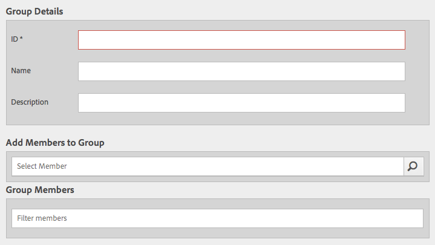

# 花崗岩操作 — 用戶和組管理{#granite-operations-user-and-group-administration}

當Granite採用JCR API規範的CRX Repository實現時，它擁有自己的用戶和組管理。

此等賬目為本集團財務報表之 [AEM帳戶](/help/sites-administering/security.md) 如果/當從Granite管理部門訪問帳戶時，將反映與Granite管理部門進行的任何帳戶更改 [用AEM戶控制台](/help/sites-administering/security.md#accessing-user-administration-with-the-security-console) (例如 `http://localhost:4502/useradmin`)。 從「用AEM戶」控制台，您還可以管理權限和其AEM他細節。

Granite用戶和組管理控制台均可從 **[工具](/help/sites-administering/tools-consoles.md)** 觸控優化用戶介面的控制台：

選擇 **用戶** 或 **組** 從工具控制台開啟相應的控制台。 在這兩種操作中，您都可以先使用按一下框，然後從工具欄執行操作，或通過下面的連結開啟帳戶詳細資訊 **名稱**。

* [用戶管理](#user-administration)

   

   的 **用戶** 控制台清單：

   * 用戶名
   * 用戶登錄名（帳戶名）
   * 已給帳戶的任何標題

* [組管理](#group-administration)

   

   的 **組** 控制台清單：

   * 組名
   * 組描述
   * 組中的用戶/組數

## 用戶管理 {#user-administration}

### 添加新用戶 {#adding-a-new-user}

1. 使用 **添加用戶** 表徵圖：

   

1. 的 **建立用戶** 將開啟窗體：

   

   在此，您可以輸入帳戶的用戶詳細資訊（大多數是標準的和不言自明的）:

   * **ID**

      這是用戶帳戶的唯一標識。 它是必需的，不能包含空格。

   * **電子郵件地址**
   * **密碼**

      密碼是必需的。

   * **重新鍵入密碼**

      這是必需的，因為確認密碼時需要它。

   * **名字**
   * **姓氏**
   * **電話號碼**
   * **職稱**
   * **街道**
   * **行動**
   * **城市**
   * **郵遞區號**
   * **國家/地區**
   * **狀態**
   * **標題**
   * **性別**
   * **關於**
   * **帳戶設定**

      * **狀態**
您可以將帳戶標籤為 
**活動** 或 **非活動**。
   * **相片**

      在這裡，您可以上傳照片以用作虛擬形象。

      接受的檔案類型: `.jpg .png .tif .gif`

      首選大小： `240x240px`

   * **新增使用者至群組**

      使用「選擇」下拉清單選擇用戶應是其成員的組。 選擇後，使用 **X** 的子菜單。

   * **群組**

      用戶當前是其成員的組清單。 使用 **X** 的子菜單。

1. 定義用戶帳戶使用時：

   * **取消** 中止註冊。
   * **保存** 完成註冊。 用戶帳戶的建立將通過消息確認。

### 編輯現有用戶 {#editing-an-existing-user}

1. 從用戶控制台中用戶名下的連結訪問用戶詳細資訊。

1. 您現在可以按照 [添加新用戶](#adding-a-new-user)。

1. 從用戶控制台中用戶名下的連結訪問用戶詳細資訊。

1. 您現在可以按照 [添加新用戶](#adding-a-new-user)。

### 更改現有用戶的密碼 {#changing-the-password-for-an-existing-user}

1. 從用戶控制台中用戶名下的連結訪問用戶詳細資訊。

1. 您現在可以按照 [添加新用戶](#adding-a-new-user)。 下 **帳戶設定** 有一個連結 **更改密碼**。

   

1. 的 **更改密碼** 對話框。 輸入並重新鍵入新密碼以及密碼。 使用 **確定** 確認更改。

   

   消息將確認密碼已更改。

### 快速組分配 {#quick-group-assignment}

1. 使用按一下框可標籤一個或多個用戶。
1. 使用 **組** 表徵圖：

   

   要開啟組選擇下拉清單：

   

1. 在選擇框中，您可以選擇或取消選擇用戶帳戶應屬於的組。

1. 分配或未分配組時，將根據需要使用：

   * **取消** 中止更改
   * **保存** 確認更改

### 刪除現有用戶詳細資訊 {#deleting-existing-user-details}

1. 使用按一下框可標籤一個或多個用戶。
1. 使用 **刪除** 表徵圖以刪除用戶詳細資訊：

   

1. 系統將要求您確認刪除，然後會顯示一條消息，確認實際刪除已發生。

## 組管理 {#group-administration}

### 添加新組 {#adding-a-new-group}

1. 使用「添加組」表徵圖：

   

1. 的 **建立組** 將開啟窗體：

   

   在此，您可以輸入組詳細資訊：

   * **ID**

      這是組的唯一標識符。 這是必需的，不能包含空格。

   * **名稱**

      組的名稱；它將顯示在組控制台中。

   * **說明**

      組的說明。

   * **新增成員到群組**

      使用「選擇」下拉清單選擇要添加到組的用戶。 選擇後，使用 **X** 的子菜單。

   * **群組成員**

      組中用戶的清單。 使用 **X** 的子菜單。

1. 定義組後，請使用：

   * **取消** 中止註冊。
   * **保存** 完成註冊。 將通過消息確認組的建立。

### 編輯現有組 {#editing-an-existing-group}

1. 從「組」控制台中組名稱下的連結訪問組詳細資訊。

1. 您現在可以編輯和保存詳細資訊，如 [添加新組](#adding-a-new-group)。

### 複製現有組 {#copying-an-existing-group}

1. 使用按一下框來標籤組。
1. 使用 **複製** 表徵圖以複製組詳細資訊：

   

1. 的 **編輯組設定** 開啟。

   組ID將與原始ID相同，但前置詞為 `Copy of`。 您必須編輯此項，因為ID不能包含空格。 所有其他細節都與原文相同。

   您現在可以編輯和保存詳細資訊，如 [添加新組](#adding-a-new-group)。

### 刪除現有組 {#deleting-an-existing-group}

1. 使用按一下框可標籤一個或多個組。
1. 使用 **刪除** 表徵圖以刪除組詳細資訊：

   

1. 系統將要求您確認刪除，然後會顯示一條消息，確認實際刪除已發生。
