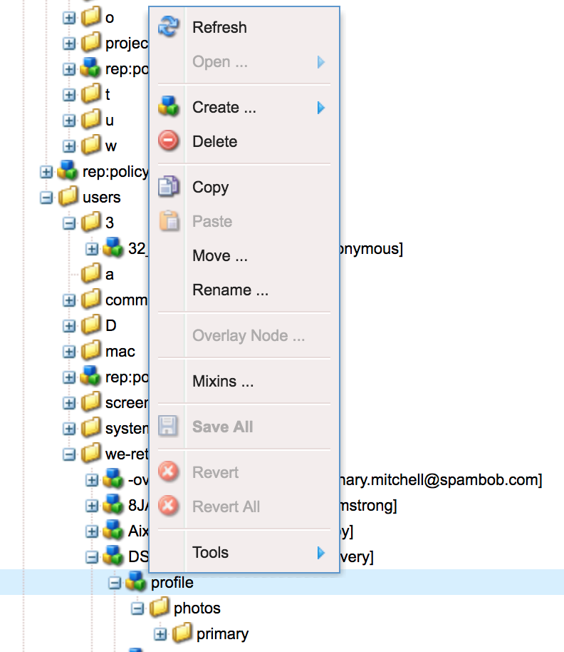

# 處理Adobe Experience Manager (AEM) Foundation的GDPR請求{#handling-gdpr-requests-for-the-aem-foundation}

>[!IMPORTANT]
>
>以下各節以GDPR為例，但說明的詳細資料適用於所有資料保護和隱私權法規，例如GDPR、CCPA等。

## AEM Foundation GDPR支援 {#aem-foundation-gdpr-support}

在AEM Foundation層級，儲存的個人資料是使用者設定檔。 因此，本文資訊主要說明如何存取和刪除使用者設定檔，以及分別說明GDPR存取和刪除請求。

## 存取使用者個人資料 {#accessing-a-user-profile}

### 手動步驟 {#manual-steps}

1. 瀏覽至，開啟「使用者管理」主控台 **[!UICONTROL 設定 — 安全性 — 使用者]** 或直接瀏覽至 `https://<serveraddress>:<serverport>/libs/granite/security/content/useradmin.html`

   

1. 然後，透過在頁面最上方的搜尋列中輸入名稱來搜尋相關使用者：

   

1. 最後，透過按一下使用者個人資料以將其開啟，然後檢查「**[!UICONTROL 詳細資料]**」標籤下方。

   

### HTTP API {#http-api}

如前所述，Adobe 提供用於存取使用者資料的 API，以促進自動化。有多種類型的 API 可供您使用：

**UserProperties API**

```shell
curl -u user:password http://localhost:4502/libs/granite/security/search/profile.userproperties.json\?authId\=cavery
```

**Sling API**

*探索使用者首頁：*

```xml
curl -g -u user:password 'http://localhost:4502/libs/granite/security/search/authorizables.json?query={"condition":[{"named":"cavery"}]}'
     {"authorizables":[{"type":"user","authorizableId_xss":"cavery","authorizableId":"cavery","name_xss":"Carlene Avery","name":"Carlene Avery","home":"/home/users/we-retail/DSCP-athB1NYLBXvdTuN"}],"total":1}
```

*正在擷取使用者資料*

使用上述命令傳回的 JSON 承載的 home 屬性中的節點路徑：

```shell
curl -u user:password  'http://localhost:4502/home/users/we-retail/DSCP-athB1NYLBXvdTuN/profile.-1.json'
```

```shell
curl -u user:password  'http://localhost:4502/home/users/we-retail/DSCP-athB1NYLBXvdTuN/profiles.-1.json'
```

## 停用使用者並刪除相關聯的個人資料 {#disabling-a-user-and-deleting-the-associated-profiles}

### 停用使用者 {#disable-user}

1. 如上所述，開啟「使用者管理」主控台並搜尋相關使用者。
1. 將滑鼠停留在使用者上，並按一下選取圖示。設定檔變成灰色，表示已選取它。

1. 在上層選單中按下「停用」按鈕以停用使用者：

   

1. 最後，確認動作：

   

   使用者介面會將設定檔卡片變灰並新增鎖定，藉此指出使用者已停用：

   

### 刪除使用者個人資料資訊 {#delete-user-profile-information}

1. 登入CRXDE Lite，然後搜尋 `[!UICONTROL userId]`：

   

1. 開啟位於下的使用者節點 `[!UICONTROL /home/users]` 依預設：

   

1. 刪除設定檔節點及其所有子節點。 設定檔節點有兩種格式，視AEM版本而定：

   1. 下的預設私人設定檔 `[!UICONTROL /profile]`
   1. `[!UICONTROL /profiles]`，適用於使用AEM 6.5建立的新設定檔。

   

### HTTP API {#http-api-1}

下列程式使用 `curl` 命令列工具，說明如何使用 **[!UICONTROL cavery]** `userId` 並刪除的設定檔 `cavery` 預設位置可用的預設值。

* *探索使用者首頁*

```shell
curl -g -u user:password 'http://localhost:4502/libs/granite/security/search/authorizables.json?query={"condition":[{"named":"cavery"}]}'
     {"authorizables":[{"type":"user","authorizableId_xss":"cavery","authorizableId":"cavery","name_xss":"Carlene Avery","name":"Carlene Avery","home":"/home/users/we-retail/DSCP-athB1NYLBXvdTuN"}],"total":1}
```

* *停用使用者*

使用上述命令傳回的 JSON 承載的 home 屬性中的節點路徑：

```shell
curl -X POST -u user:password -FdisableUser="describe the reasons for disabling this user (GDPR in this case)" 'http://localhost:4502/home/users/we-retail/DSCP-athB1NYLBXvdTuN.rw.userprops.html'
```

* *刪除使用者個人資料*

使用從帳戶探索命令傳回的 JSON 承載的 home 屬性的節點路徑和已知的現成個人資料節點位置：

```shell
curl -X POST -u user:password -H "Accept: application/json,**/**;q=0.9" -d ':operation=delete' 'http://localhost:4502/home/users/we-retail/DSCP-athB1NYLBXvdTuN/profile'
```

```shell
curl -X POST -u user:password -H "Accept: application/json,**/**;q=0.9" -d ':operation=delete' 'http://localhost:4502/home/users/we-retail/DSCP-athB1NYLBXvdTuN/profile'
```
