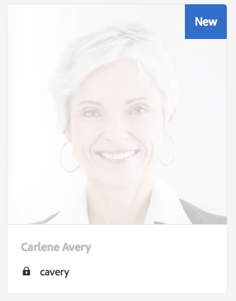

# 處理AEM Foundation的GDPR請求{#handling-gdpr-requests-for-the-aem-foundation}

>[!IMPORTANT]
>
>GDPR是以下各節中的範例，但涵蓋的詳細資訊適用於所有資料保護和隱私權法規；例如GDPR、CCPA等

## AEM Foundation GDPR支援 {#aem-foundation-gdpr-support}

在AEM Foundation層級，儲存的個人資料為使用者設定檔。 因此，本文的資訊主要說明如何存取和刪除使用者設定檔，以分別處理GDPR存取和刪除請求。

## 存取使用者設定檔 {#accessing-a-user-profile}

### 手動步驟 {#manual-steps}

1. 瀏覽至，開啟「使用者管理」主控台 **[!UICONTROL 設定 — 安全性 — 使用者]** 或直接瀏覽至 `https://<serveraddress>:<serverport>/libs/granite/security/content/useradmin.html`

   

1. 然後，在頁面頂端的搜尋列中輸入名稱，以搜尋有問題的使用者：

   

1. 最後，按一下使用者設定檔以開啟該使用者設定檔，然後核取 **[!UICONTROL 詳細資料]** 標籤。

   

### HTTP API {#http-api}

如前所述，Adobe提供存取使用者資料的API，以促進自動化。 您可以使用數種API:

**UserProperties API**

```shell
curl -u user:password http://localhost:4502/libs/granite/security/search/profile.userproperties.json\?authId\=cavery
```

**Sling API**

*探索使用者首頁：*

```xml
curl -g -u user:password 'http://localhost:4502/libs/granite/security/search/authorizables.json?query={"condition":[{"named":"cavery"}]}'
     {"authorizables":[{"type":"user","authorizableId_xss":"cavery","authorizableId":"cavery","name_xss":"Carlene Avery","name":"Carlene Avery","home":"/home/users/we-retail/DSCP-athB1NYLBXvdTuN"}],"total":1}
```

*擷取使用者資料*

使用從上述命令傳回之JSON裝載的home屬性中的節點路徑：

```shell
curl -u user:password  'http://localhost:4502/home/users/we-retail/DSCP-athB1NYLBXvdTuN/profile.-1.json'
```

```shell
curl -u user:password  'http://localhost:4502/home/users/we-retail/DSCP-athB1NYLBXvdTuN/profiles.-1.json'
```

## 禁用用戶和刪除關聯的配置檔案 {#disabling-a-user-and-deleting-the-associated-profiles}

### 禁用用戶 {#disable-user}

1. 開啟「使用者管理」主控台，並依上述說明搜尋有問題的使用者。
1. 將滑鼠指標暫留在使用者上，然後按一下選取圖示。 輪廓將變為灰色，表示已選中。

1. 按上方功能表中的「停用」按鈕以停用使用者：

   

1. 最後，確認動作：

   

   然後，使用者介面會移除並新增鎖定至設定檔卡片，以指出使用者已停用：

   

### 刪除用戶配置檔案資訊 {#delete-user-profile-information}

1. 登入CRXDE Lite，然後搜尋 `[!UICONTROL userId]`:

   

1. 開啟位於 `[!UICONTROL /home/users]` 依預設：

   

1. 刪除配置檔案節點及其所有子節點。 設定檔節點有兩種格式，視AEM版本而定：

   1. 底下的預設私人設定檔 `[!UICONTROL /profile]`
   1. `[!UICONTROL /profiles]`，適用於使用AEM 6.5建立的新設定檔。

   

### HTTP API {#http-api-1}

以下過程使用命 `curl` 令行工具說明如何禁用具有預設位置 **[!UICONTROL 的用]**`userId` 戶並刪除其配置檔案。

* *探索使用者首頁*

```shell
curl -g -u user:password 'http://localhost:4502/libs/granite/security/search/authorizables.json?query={"condition":[{"named":"cavery"}]}'
     {"authorizables":[{"type":"user","authorizableId_xss":"cavery","authorizableId":"cavery","name_xss":"Carlene Avery","name":"Carlene Avery","home":"/home/users/we-retail/DSCP-athB1NYLBXvdTuN"}],"total":1}
```

* *禁用用戶*

使用從上述命令傳回之JSON裝載的home屬性中的節點路徑：

```shell
curl -X POST -u user:password -FdisableUser="describe the reasons for disabling this user (GDPR in this case)" 'http://localhost:4502/home/users/we-retail/DSCP-athB1NYLBXvdTuN.rw.userprops.html'
```

* *刪除用戶配置檔案*

使用從帳戶探索命令傳回之JSON裝載的首頁屬性中的節點路徑，以及現成可用的設定檔節點位置：

```shell
curl -X POST -u user:password -H "Accept: application/json,**/**;q=0.9" -d ':operation=delete' 'http://localhost:4502/home/users/we-retail/DSCP-athB1NYLBXvdTuN/profile'
```

```shell
curl -X POST -u user:password -H "Accept: application/json,**/**;q=0.9" -d ':operation=delete' 'http://localhost:4502/home/users/we-retail/DSCP-athB1NYLBXvdTuN/profile'
```
