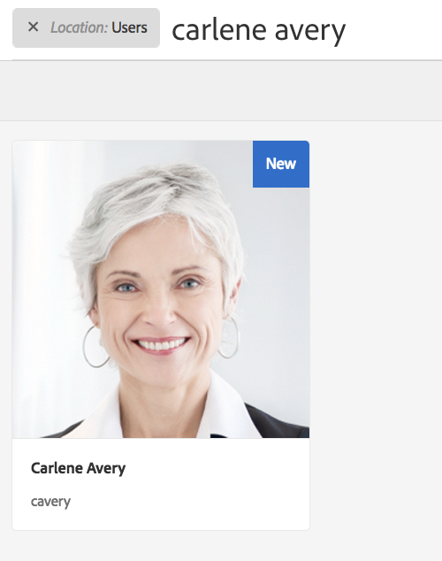

# 處理Foundation的GDPR請AEM求{#handling-gdpr-requests-for-the-aem-foundation}

>[!IMPORTANT]
>
>GDPR在以下各節中用作示例，但所涵蓋的詳細資訊適用於所有資料保護和隱私法規；如GDPR、CCPA等。

## 基AEM礎GDPR支援 {#aem-foundation-gdpr-support}

在基AEM礎級別，儲存的個人資料是用戶配置檔案。 因此，本文中的資訊主要涉及如何訪問和刪除用戶配置檔案，以分別處理GDPR訪問和刪除請求。

## 存取使用者個人資料 {#accessing-a-user-profile}

### 手動步驟 {#manual-steps}

1. 通過瀏覽以開啟用戶管理控制台 **[!UICONTROL 設定 — 安全 — 用戶]** 或直接瀏覽 `https://<serveraddress>:<serverport>/libs/granite/security/content/useradmin.html`

   

1. 然後，透過在頁面最上方的搜尋列中輸入名稱來搜尋相關使用者：

   

1. 最後，透過按一下使用者個人資料以將其開啟，然後檢查「**[!UICONTROL 詳細資料]**」標籤下方。

   

### HTTP API {#http-api}

如前所述，Adobe 提供用於存取使用者資料的 API，以促進自動化。有多種類型的 API 可供您使用：

**UserProperties API**

```shell
curl -u user:password http://localhost:4502/libs/granite/security/search/profile.userproperties.json\?authId\=cavery
```

**Sling API**

*探索使用者首頁：*

```xml
curl -g -u user:password 'http://localhost:4502/libs/granite/security/search/authorizables.json?query={"condition":[{"named":"cavery"}]}'
     {"authorizables":[{"type":"user","authorizableId_xss":"cavery","authorizableId":"cavery","name_xss":"Carlene Avery","name":"Carlene Avery","home":"/home/users/we-retail/DSCP-athB1NYLBXvdTuN"}],"total":1}
```

*正在檢索用戶資料*

使用上述命令傳回的 JSON 承載的 home 屬性中的節點路徑：

```shell
curl -u user:password  'http://localhost:4502/home/users/we-retail/DSCP-athB1NYLBXvdTuN/profile.-1.json'
```

```shell
curl -u user:password  'http://localhost:4502/home/users/we-retail/DSCP-athB1NYLBXvdTuN/profiles.-1.json'
```

## 停用使用者並刪除相關聯的個人資料 {#disabling-a-user-and-deleting-the-associated-profiles}

### 停用使用者 {#disable-user}

1. 如上所述，開啟「使用者管理」主控台並搜尋相關使用者。
1. 將滑鼠停留在使用者上，並按一下選取圖示。 設定檔將變成灰色，表示已選取它。

1. 在上層選單中按下「停用」按鈕以停用使用者：

   

1. 最後，確認操作：

   

   然後，用戶介面將指示用戶已通過擦除和向配置檔案卡添加鎖定來停用：

   

### 刪除使用者個人資料資訊 {#delete-user-profile-information}

1. 登錄到CRXDE Lite，然後搜索 `[!UICONTROL userId]`:

   

1. 開啟位於 `[!UICONTROL /home/users]` 預設：

   

1. 刪除配置檔案節點及其所有子節點。 配置檔案節點有兩種格式，具體取決於版AEM本：

   1. 預設專用配置檔案 `[!UICONTROL /profile]`
   1. `[!UICONTROL /profiles]`，用於使用6.5建立的AEM新配置檔案。

   

### HTTP API {#http-api-1}

以下程序使用 `curl` 命令列工具說明如何使用 **[!UICONTROL cavery]**`userId` 停用使用者並刪除她在預設位置可用的個人資料。

* *正在搜索用戶首頁*

```shell
curl -g -u user:password 'http://localhost:4502/libs/granite/security/search/authorizables.json?query={"condition":[{"named":"cavery"}]}'
     {"authorizables":[{"type":"user","authorizableId_xss":"cavery","authorizableId":"cavery","name_xss":"Carlene Avery","name":"Carlene Avery","home":"/home/users/we-retail/DSCP-athB1NYLBXvdTuN"}],"total":1}
```

* *禁用用戶*

使用上述命令傳回的 JSON 承載的 home 屬性中的節點路徑：

```shell
curl -X POST -u user:password -FdisableUser="describe the reasons for disabling this user (GDPR in this case)" 'http://localhost:4502/home/users/we-retail/DSCP-athB1NYLBXvdTuN.rw.userprops.html'
```

* *刪除使用者個人資料*

使用從帳戶探索命令傳回的 JSON 承載的 home 屬性的節點路徑和已知的現成個人資料節點位置：

```shell
curl -X POST -u user:password -H "Accept: application/json,**/**;q=0.9" -d ':operation=delete' 'http://localhost:4502/home/users/we-retail/DSCP-athB1NYLBXvdTuN/profile'
```

```shell
curl -X POST -u user:password -H "Accept: application/json,**/**;q=0.9" -d ':operation=delete' 'http://localhost:4502/home/users/we-retail/DSCP-athB1NYLBXvdTuN/profile'
```
