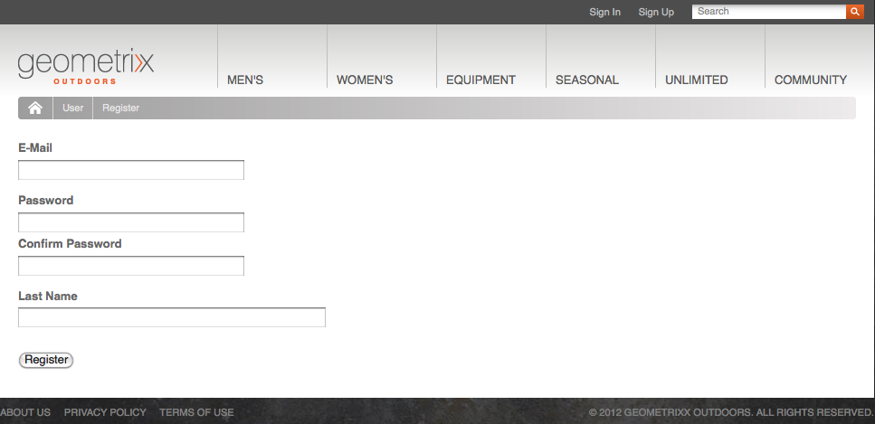
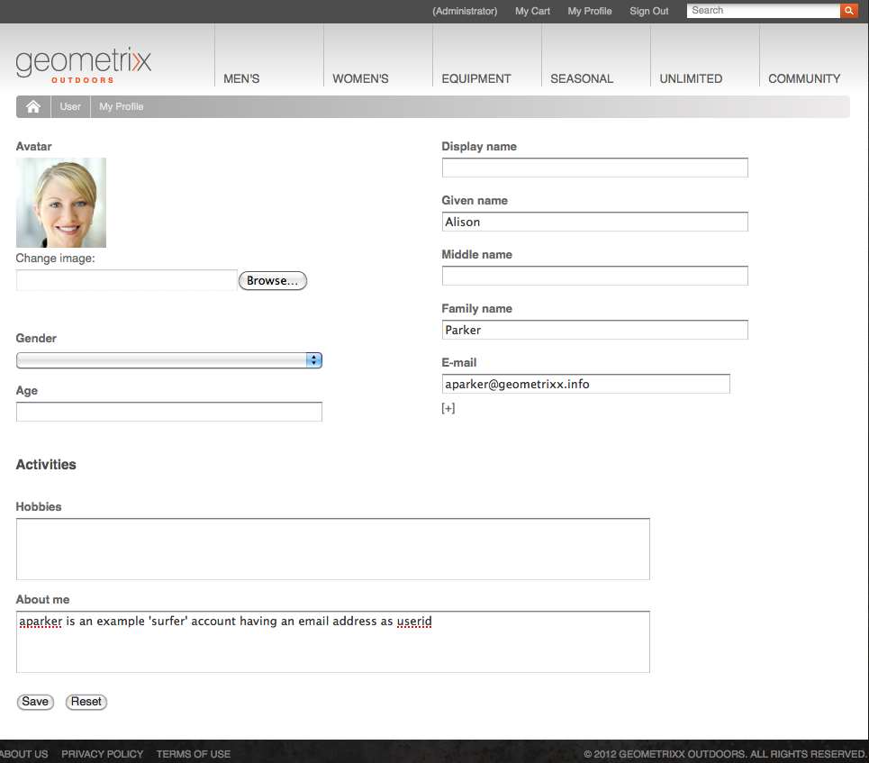
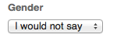

# Identity Management{#identity-management}

只有在您提供登入功能後，才能識別您網站的個別訪客。 您可能想要提供登入功能的原因有很多：

* [AEM Communities](/help/communities/overview.md)網站訪客必須登入才能將內容發佈至社群。
* [封閉使用者群組](/help/sites-administering/cug.md)

  您可能需要限制特定訪客對您網站（或其中部分）的存取權。

* [個人化](/help/sites-administering/personalization.md) 允許訪客設定存取您網站的特定方式。

登入（和登出）功能由提供 [帳戶與 **個人資料**](#profiles-and-user-accounts)，其中包含註冊訪客（使用者）的其他相關資訊。 註冊和授權的實際流程可能有所不同：

* 從網站自助註冊

  A [社群網站](/help/communities/sites-console.md) 可設定為允許訪客使用其Facebook或Twitter帳戶自我註冊或登入。

* 要求網站註冊

  對於封閉式使用者群組，您可以允許訪客要求註冊，但透過工作流程強制執行授權。

* 從作者環境註冊每個帳戶

  如果您的設定檔數量較少（無論如何都需要授權），您可以決定直接註冊每個設定檔。

為了讓訪客註冊，可使用一系列元件和表單來收集所需的身分識別資訊，然後收集其他（通常是選擇性的）設定檔資訊。 註冊之後，他們應該也能夠檢查並更新他們已提交的詳細資訊。

可設定或開發其他功能：

* 設定所需的任何反向復寫。
* 允許使用者藉由開發表單和工作流程來移除其設定檔。

>[!NOTE]
>
>設定檔中指定的資訊也可用於透過向使用者提供目標內容 [區段](/help/sites-administering/campaign-segmentation.md) 和 [行銷活動](/help/sites-classic-ui-authoring/classic-personalization-campaigns.md).

## 註冊Forms {#registration-forms}

A [表單](/help/sites-authoring/default-components.md#form-component) 可用來收集註冊資訊，然後產生新帳戶和設定檔。

例如，使用者可以使用Geometrixx頁面來請求新的設定檔
`http://localhost:4502/content/geometrixx-outdoors/en/user/register.html`



提交請求後，設定檔頁面會開啟，使用者可在其中提供個人詳細資訊。


新帳戶也會顯示在 [使用者主控台](/help/sites-administering/security.md).

## 登入 {#login}

登入元件可用來收集登入資訊，然後啟動登入程式。

這會為訪客提供以下標準欄位： **使用者名稱** 和 **密碼**，具有 **登入** 按鈕以在輸入認證時啟動登入程式。

例如，使用者可以使用「 」登入或建立帳戶 **登入** Geometrixx工具列上的選項，它會使用頁面：

`http://localhost:4502/content/geometrixx-outdoors/en/user/sign-in.html`


## 登出 {#logging-out}

由於有登入機制，因此也需要登出機制。 這可以用作 **登出** Geometrixx選項。

## 檢視和更新設定檔 {#viewing-and-updating-a-profile}

根據您的登錄檔格，訪客可能在他們的設定檔中擁有註冊資訊。 他們應該能夠在稍後階段檢視和/或更新此內容。 您可以使用類似的形式完成此操作；例如，在Geometrixx中：

```
http://localhost:4502/content/geometrixx-outdoors/en/user/profile.html
```

若要檢視設定檔的詳細資料，請按一下 **我的設定檔** 位於任何頁面的右上角；例如，使用 `admin` 帳戶：
`http://localhost:4502/home/users/a/admin/profile.form.html/content/geometrixx-outdoors/en/user/profile.html.`

您可以使用檢視其他設定檔 [使用者端內容](/help/sites-administering/client-context.md) （在作者環境中，並具有足夠的許可權）：

1. 開啟頁面；例如，Geometrixx頁面：

   `http://localhost:4502/cf#/content/geometrixx/en.html`

1. 按一下 **我的設定檔** 在右上角。 您將會看到目前帳戶的設定檔；例如，管理員。
1. 按下 **control-alt-C** 以開啟使用者端內容。
1. 在使用者端內容的左上角，按一下 **載入設定檔** 按鈕。

   

1. 從對話方塊視窗的下拉式清單中選取另一個設定檔；例如， **艾莉森·帕克**.
1. 按一下&#x200B;**「確定」**。
1. 再按一下 **我的設定檔**. 將以Alison的詳細資料更新表單。

   

1. 您現在可以使用 **編輯設定檔** 或 **變更密碼** 以更新詳細資料。

## 將欄位新增至設定檔定義 {#adding-fields-to-the-profile-definition}

您可以將欄位新增至設定檔定義。 例如，若要將「最喜愛的顏色」欄位新增至Geometrixx設定檔：

1. 從「網站」主控台導覽至「Geometrixx Outdoors網站>英文>使用者>我的設定檔」 。
1. 按兩下 **我的設定檔** 頁面以開啟它進行編輯。
1. 在 **元件** sidekick的標籤展開 **表單** 區段。
1. 拖曳 **下拉式清單** 從sidekick到表單，就在 **關於我** 欄位。
1. 按兩下 **下拉式清單** 元件以開啟設定對話方塊並輸入：

   * **元素名稱** - `favoriteColor`
   * **標題** - `Favorite Color`
   * **專案**  — 新增多種顏色作為專案

   按一下 **確定** 以儲存。

1. 關閉頁面並返回 **網站** 主控台並啟動「我的設定檔」頁面。

   下次檢視設定檔時，您可以選取最喜愛的顏色：

   

   此欄位將會儲存在 **設定檔** 相關使用者帳戶的區段：

   

## 設定檔狀態 {#profile-states}

有些使用案例需要知道使用者（或其設定檔）是否在 *特定狀態* 也可能不會。

這涉及在使用者設定檔中定義適當的屬性，其方式如下：

* 使用者可見及可存取
* 會為每個屬性定義兩種狀態
* 可讓您在定義的兩種狀態之間切換

這是透過下列專案完成的：

* [狀態提供者](#state-providers)

  管理特定屬性的兩個狀態，以及兩個狀態之間的轉變。

* [工作流程](#workflows)

  管理與狀態相關的動作。

可以定義多個狀態；例如，在Geometrixx中，這些狀態包括：

* 訂閱（或取消訂閱）電子報或評論對話串上的通知
* 新增和移除朋友的連線

### 狀態提供者 {#state-providers}

狀態提供者會管理相關屬性的目前狀態，以及兩個可能狀態之間的轉換。

狀態提供者會實作為元件，因此可針對您的專案進行自訂。 在Geometrixx中，這些功能包括：

* 取消訂閱/訂閱論壇主題
* 新增/移除朋友

### 工作流程 {#workflows}

狀態提供者可管理設定檔屬性及其狀態。

實作與狀態相關的動作需要工作流程。 例如，訂閱通知時，工作流程將處理實際的訂閱動作；取消訂閱通知時，工作流程將處理從訂閱清單中移除使用者的作業。

## 設定檔和使用者帳戶 {#profiles-and-user-accounts}

設定檔會儲存在內容存放庫中，做為[使用者帳戶](/help/sites-administering/user-group-ac-admin.md).

此設定檔位於 `/home/users/geometrixx`：


在標準安裝（製作或發佈）中，所有使用者都可讀取所有使用者的完整設定檔資訊。 每個人都是&quot;*內建群組會自動包含所有現有的使用者和群組。 無法編輯成員清單*「。

這些存取權由下列萬用字元ACL定義：

/home每個人都允許jcr：read rep：glob = &#42;/profile&#42;

這允許：

* 論壇、評論或部落格以顯示適當設定檔中的資訊（例如圖示或全名）
* geometrixx設定檔頁面的連結

如果這種存取權不適合您的安裝，您可以變更這些預設設定。

這項操作可透過以下方式完成： **[存取控制](/help/sites-administering/user-group-ac-admin.md#access-right-management)** 標籤：


## 設定檔元件 {#profile-components}

您也可以使用一系列設定檔元件來定義您網站的設定檔需求。

### 已檢查密碼欄位 {#checked-password-field}

此元件提供下列兩個欄位：

* 密碼的輸入
* 確認密碼已正確輸入的檢查。

使用預設設定時，元件將顯示如下：


### 設定檔頭像相片 {#profile-avatar-photo}

此元件為使用者提供選取和上傳頭像像片檔案的機制。


### 設定檔詳細名稱 {#profile-detailed-name}

此元件可讓使用者輸入詳細名稱。


### 設定檔性別 {#profile-gender}

此元件可讓使用者輸入其性別。


