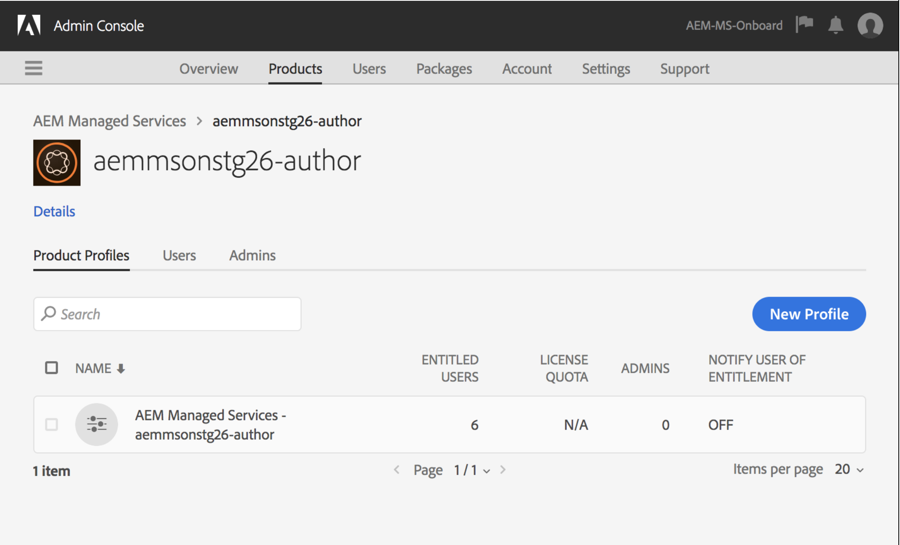

# AdobeIMS身份驗證和[!DNL Admin Console]支援AEMManaged Services{#adobe-ims-authentication-and-admin-console-support-for-aem-managed-services}

>[!NOTE]
>
>請注意，此功能僅適用於Adobe Managed Services客戶。

## 簡介 {#introduction}

AEM AEM 6.4.3.0為&#x200B;**Managed Services&lt;a2/AEM>客戶提供了對實例和基於AdobeIMS(Identity Management系統)的身份驗證的[!DNL Admin Console]支援**

登AEM入[!DNL Admin Console]可讓Managed Services客AEM戶在一個主控台中管理所有Experience Cloud使用者。 「使用者」和「群組」可指派給與例項相AEM關的產品設定檔，讓他們登入特定例項。

## 重要焦點 {#key-highlights}

* AEMIMS驗證支援僅適用於AEM作者、管理員或開發人員，不適用於客戶網站（如網站訪客）的外部使用者
* [!DNL Admin Console]將將Managed ServicesAEM客戶表示為IMS組織，其實例表示為產品上下文。 客戶系統和產品管理員將能夠管理例項的存取權
* AEMManaged Services將使用[!DNL Admin Console]同步客戶拓撲。 在[!DNL Admin Console]中，每個實AEM例將有一個「Managed Services產品上下文」實例。
* [!DNL Admin Console]中的產品設定檔將決定使用者可存取的例項
* 支援使用客戶自己的SAML 2相容身分提供者的同盟驗證
* 僅支援Enterprise ID或Federated ID（針對客戶單一登入），不支援個人AdobeID。
* [!DNL User Management] (在Adobe [!DNL Admin Console]中)將繼續歸客戶管理員所有。

## 架構 {#architecture}

IMS驗證是使用OAuth協定在與AdobeIMSAEM端點之間運作的。 一旦將使用者新增至IMS並擁有Adobe身分識別後，他們就可以使用IMS憑證登AEM入Managed Services例項。

使用者登入流程如下所示，使用者將被重新導向至IMS，並可選擇地重新導向至客戶IDP以進行SSO驗證，然後重新導向AEM至。

## 如何設定{#how-to-set-up}

### 將組織上線至[!DNL Admin Console] {#onboarding-organizations-to-admin-console}

客戶上線至[!DNL Admin Console]是使用AdobeIMS進行驗證的先決條件AEM。

首先，客戶應在AdobeIMS中布建組織。 Adobe企業客戶在[Adobe [!DNL Admin Console]](https://helpx.adobe.com/tw/enterprise/using/admin-console.html)中表示為IMS組織。

AEMManaged Services客戶應已布建組織，而作為IMS布建的一部分，[!DNL Admin Console]中將提供客戶例項，以管理使用者權益和存取權。

AMS和客戶將攜手合作，將使用者驗證移轉至IMS，讓每個客戶都能完成工作流程。

一旦客戶以IMS組織形式存在，而AMS完成為IMS布建客戶時，此為所需組態工作流程的摘要：

1. 指定的系統管理員會收到登入[!DNL Admin Console]的邀請
1. 系統管理員聲明網域，以確認網域的所有權（在此範例中為acme.com）
1. 系統管理員設定用戶目錄
1. 系統管理員在[!DNL Admin Console]中設定身分提供者(IDP)以進行SSO設定。
1. 管AEM理員會照常管理本機群組、權限和權限。 請參閱使用者和群組同步

>[!NOTE]
>
>有關「AdobeIdentity Management基礎知識」（包括IDP配置）的詳細資訊，請參閱本頁文章[。](https://helpx.adobe.com/tw/enterprise/using/set-up-identity.html)
>
>如需企業管理與[!DNL Admin Console]的詳細資訊，請參閱文章[本頁](https://helpx.adobe.com/tw/enterprise/managing/user-guide.html)。

### 將用戶引導到[!DNL Admin Console] {#onboarding-users-to-the-admin-console}

根據客戶的規模及其偏好設定，有三種方式可讓使用者上線：

1. 在[!DNL Admin Console]中手動建立用戶和組
1. 為使用者上傳CSV檔案
1. 從客戶的企業Active Directory同步用戶和組。

#### 通過[!DNL Admin Console] UI {#manual-addition-through-admin-console-ui}手動添加

您可以在[!DNL Admin Console] UI中手動建立使用者和群組。 如果沒有大量使用者可管理，則可使用此方法。 例如，少於50位使用AEM者。

如果客戶已使用此方法管理其他Adobe產品，例如Analytics、Target或Creative Cloud應用程式，也可以手動建立使用者。

#### [!DNL Admin Console] UI {#file-upload-in-the-admin-console-ui}中的檔案上傳

為方便使用者建立，可上傳CSV檔案以大量新增使用者：

#### 使用者同步工具 {#user-sync-tool}

用戶同步工具（簡稱UST）使企業客戶能夠使用Active Directory或其他經測試的OpenLDAP目錄服務建立或管理Adobe用戶。 目標用戶是IT Identity Administrators（Enterprise Directory和系統管理員），他們將能夠安裝和配置此工具。 開放原始碼工具可自訂，讓客戶可讓開發人員修改它以符合其特定需求。

當使用者同步執行時，會從組織的Active Directory（或任何其他相容的資料來源）擷取使用者清單，並與[!DNL Admin Console]中的使用者清單進行比較。 接著會呼叫Adobe[!DNL User Management] API，讓[!DNL Admin Console]與組織的目錄同步。 改變流程完全是單向的；在[!DNL Admin Console]中所做的任何編輯都不會推送至目錄。

此工具可讓系統管理員將客戶目錄中的使用者群組與[!DNL Admin Console]中的產品設定和使用者群組對應，而新的UST版本也允許在[!DNL Admin Console]中動態建立使用者群組。

若要設定「使用者同步」，組織需先透過與 [[!DNL User Management]  API](https://www.adobe.io/apis/cloudplatform/usermanagement/docs/setup.html) 相同的使用方式，建立一組憑證。

用戶同步通過AdobeGithub儲存庫分發，位於以下位置：

[https://github.com/adobe-apiplatform/user-sync.py/releases/latest](https://github.com/adobe-apiplatform/user-sync.py/releases/latest)

請注意，2.4RC1搶鮮版已提供動態群組建立支援，您可在以下網址找到：[https://github.com/adobe-apiplatform/user-sync.py/releases/tag/v2.4rc1](https://github.com/adobe-apiplatform/user-sync.py/releases/tag/v2.4rc1)

此版本的主要功能是動態映射[!DNL Admin Console]中使用者成員資格的新LDAP群組，以及建立動態使用者群組。

有關新群組功能的詳細資訊，請參閱：

[https://github.com/adobe-apiplatform/user-sync.py/blob/v2/docs/en/user-manual/advanced_configuration](https://github.com/adobe-apiplatform/user-sync.py/blob/v2/docs/en/user-manual/advanced_configuration.md#additional-group-options)

>[!NOTE]
>
>有關用戶同步工具的詳細資訊，請參閱[文檔頁](https://adobe-apiplatform.github.io/user-sync.py/en/)。
>
>
>用戶同步工具需要使用[此處](https://adobe-apiplatform.github.io/umapi-documentation/en/UM_Authentication.html)所述的過程註冊為Adobe I/O客戶端UMAPI。
>
>您可在[這裡](https://www.adobe.io/apis/cloudplatform/console.html)找到Adobe I/O控制台文檔。
>
>
>此[位置](https://www.adobe.io/apis/cloudplatform/umapi-new.html)涵蓋了用戶同步工具使用的[!DNL User Management] API。

>[!NOTE]
>
>IMSAEM設定將由Adobe Managed Services團隊處理。 但是，客戶管理員可依其需求（例如「自動群組成員資格」或「群組對應」）來修改它。 IMS用戶端也將由您的Managed Services團隊註冊。

## 使用方式 {#how-to-use}

### 在[!DNL Admin Console] {#managing-products-and-user-access-in-admin-console}中管理產品和用戶訪問

當客戶產品管理員登入[!DNL Admin Console]時，他們會看到多個「AEMManaged Services產品內容」例項，如下所示：

在此示例中，組織&#x200B;*AEM-MS-Onboard*&#x200B;具有32個實例，這些實例跨越不同的拓撲和環境，如Stage、Prod等。

可以檢查實例詳細資訊以標識實例：

在每個「產品內容」例項下，都會有相關聯的產品設定檔。 此產品設定檔用於指派使用者和群組的存取權。

在此產品設定檔下新增的任何使用者和群組都可以登入該例項，如下列範例所示：

### 登入AEM{#logging-into-aem}

#### 本地管理員登錄{#local-admin-login}

可AEM以繼續支援管理員使用者的本機登入，因為登入畫面有選項可在本機登入：

#### IMS 登入 {#ims-based-login}

若是其他使用者，在例項上設定 IMS 後，即可使用 IMS 登入。用戶將首先按一下&#x200B;**使用Adobe**&#x200B;登錄按鈕，如下所示：

然後，會將其重新導向至IMS登入畫面，並輸入其認證：

如果在初始[!DNL Admin Console]設定期間設定了同盟IDP，則會將使用者重新導向至客戶IDP以進行SSO。

IDP為Okta，在以下範例中：

驗證完成後，系統會將使用者重新導向回 AEM 並登入：

### 遷移現有用戶{#migrating-existing-users}

對於使AEM用另一種驗證方法且正在移轉至IMS的現有實例，需要移轉步驟。

儲存庫中的現AEM有使用者（透過LDAP或SAML在本機產生）可移轉至IMS，做為使用者移轉公用程式的IDP。

此公用程式將由您的AMS團隊執行，作為IMS布建的一部分。

### 管理{#managing-permissions-and-acls-in-aem}中AEM的權限和ACL

訪問控制和權限將繼續在中進行管理AEM，這可以通過將來自IMS的用戶組(如下例中的AEM-GRP-008)和定義權限和訪問控制的本地組分開來實現。 與IMS同步的使用者群組可指派給本機群組並繼承權限。

以下範例中，我們會示範將同步的群組新增至本機 *Dam_Users* 群組。

在此，[!DNL Admin Console]中也將用戶分配給了幾個組。 （請注意，使用使用者同步工具或在本機建立使用者和群組可從LDAP同步，請參閱上述&#x200B;[!DNL Admin Console]**的「上線使用者」一節）。**

>[!NOTE]
>
>使用者登入執行個體時，使用者群組才會同步。

使用者屬於 IMS 中的下列群組：

使用者登入後，系統會同步其群組成員資格，如下所示：

在中AEM，從IMS同步的使用者群組可以新增為現有本機群組的成員，例如DAM使用者。

如下所示，*AEM-GRP_008*&#x200B;組繼承了DAM用戶的權限和權限。 這是管理同步群組權限的有效方式，也常用於LDAP驗證方法。

