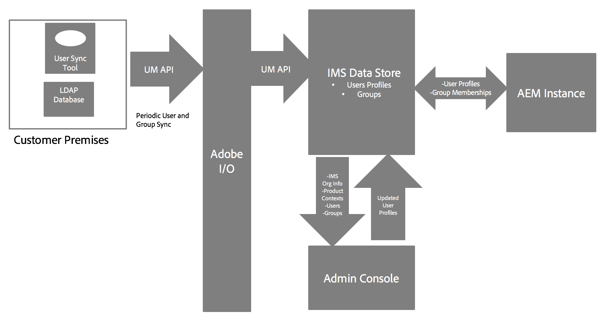
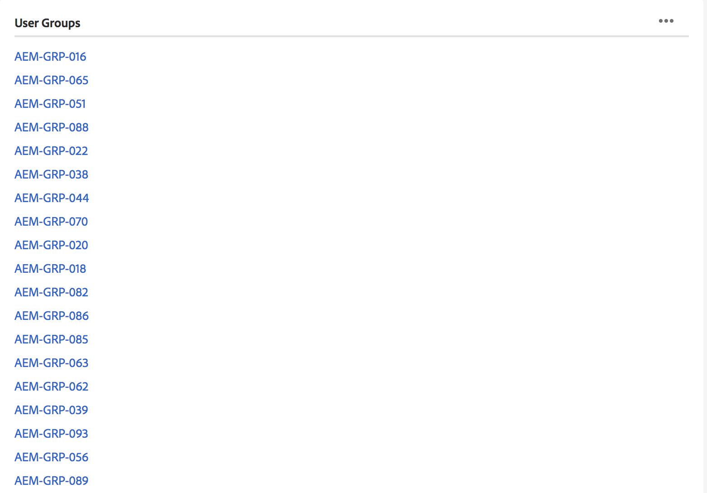

# AEM Managed services的Adobe IMS驗證和管理控制台支援 {#adobe-ims-authentication-and-admin-console-support-for-aem-managed-services}

>[!NOTE]
>
>請注意，此功能僅適用於Adobe Managed services客戶。

## 簡介 {#introduction}

AEM 6.4.3.0針對 **AEM Managed services客戶推出Admin Console支援AEM例項和Adobe IMS(Identity Management System)型驗證** 。

AEM登入Admin Console可讓AEM Managed services客戶在單一主控台中管理所有Experience cloud使用者。 「使用者」和「群組」可指派給與AEM例項關聯的產品設定檔，允許他們登入特定例項。

## 主要亮點 {#key-highlights}

* AEM IMS驗證支援僅適用於AEM作者、管理員或開發人員，不適用於客戶網站（如網站訪客）的外部使用者
* Admin Console會將AEM Managed services客戶代表為IMS組織，其例項則代表為產品內容。 客戶系統和產品管理員將能夠管理例項的存取權
* AEM Managed services將會將客戶拓撲與Admin Console同步。 在「管理控制台」中，每個例項都會有一個AEM Managed services產品內容例項。
* Admin Console中的產品設定檔將決定使用者可存取的例項
* 支援使用客戶自己的SAML 2相容身分提供者的同盟驗證
* 僅支援Enterprise ID或Federated ID（針對客戶單一登入），不支援個人Adobe ID。
* 使用者管理（在Adobe Admin Console中）仍由客戶管理員擁有。

## 建築 {#architecture}

IMS驗證可在AEM和Adobe IMS端點之間使用OAuth通訊協定運作。 當使用者新增至IMS並擁有Adobe Identity後，他們就可以使用IMS憑證登入AEM Managed services例項。

使用者登入流程如下所示，使用者將被重新導向至IMS，或選擇性地重新導向至客戶IDP進行SSO驗證，然後重新導向回AEM。

## 如何設定 {#how-to-set-up}

### 將組織上線至Admin Console {#onboarding-organizations-to-admin-console}

客戶上線至Admin console是使用Adobe IMS進行AEM驗證的先決條件。

首先，客戶應在Adobe IMS中布建組織。 Adobe企業客戶在 [Adobe Admin Console中以IMS組織的形式呈現](https://helpx.adobe.com/enterprise/using/admin-console.html)。

AEM Managed services客戶應已布建組織，而且作為IMS布建的一部分，客戶例項將會提供在Admin Console中，以管理使用者權益和存取權。

AMS和客戶將攜手合作，將使用者驗證移轉至IMS，讓每個客戶都能完成工作流程。

一旦客戶以IMS組織形式存在，而AMS完成為IMS布建客戶時，此為所需組態工作流程的摘要：

1. 指定的系統管理員會收到登入管理控制台的邀請
1. 系統管理員聲明網域，以確認網域的所有權（在此範例中為acme.com）
1. 系統管理員設定用戶目錄
1. 系統管理員會在管理控制台中設定身分提供者(IDP)，以進行SSO設定。
1. AEM管理員會照常管理本機群組、權限和權限。 請參閱使用者和群組同步

>[!NOTE]
>
>如需Adobe Identity Management Basics（包括IDP設定）的詳細資訊，請參閱本 [頁文章。](https://helpx.adobe.com/enterprise/using/set-up-identity.html)
>
>如需有關「企業管理」和「管理控制台」的詳細資訊，請參閱 [本頁文章](https://helpx.adobe.com/enterprise/managing/user-guide.html)。

### 將使用者上線至Admin Console {#onboarding-users-to-the-admin-console}

根據客戶的規模及其偏好設定，有三種方式可讓使用者上線：

1. 在管理控制台中手動建立使用者和群組
1. 為使用者上傳CSV檔案
1. 從客戶的企業Active Directory同步用戶和組。

#### 透過Admin Console UI手動新增 {#manual-addition-through-admin-console-ui}

使用者和群組可在「管理控制台」UI中手動建立。 如果沒有大量使用者可管理，則可使用此方法。 例如，少於50位AEM使用者。

如果客戶已使用此方法管理其他Adobe產品，例如Analytics、Target或Creative cloud應用程式，也可以手動建立使用者。

#### 管理控制台UI中的檔案上傳 {#file-upload-in-the-admin-console-ui}

為方便使用者建立，可上傳CSV檔案以大量新增使用者：

#### 使用者同步工具 {#user-sync-tool}

使用者同步工具（簡稱UST）可讓企業客戶使用Active Directory或其他經測試的OpenLDAP目錄服務來建立或管理Adobe使用者。 目標用戶是IT Identity Administrators（Enterprise Directory和系統管理員），他們將能夠安裝和配置此工具。 開放原始碼工具可自訂，讓客戶可讓開發人員修改它以符合其特定需求。

當使用者同步執行時，會從組織的Active Directory（或任何其他相容的資料來源）擷取使用者清單，並與管理控制台中的使用者清單進行比較。 接著會呼叫Adobe使用者管理API，讓Admin Console與組織的目錄同步。 改變流程完全是單向的；在「管理控制台」中所做的任何編輯都不會推送至目錄。

此工具可讓系統管理員將客戶目錄中的使用者群組與管理控制台中的產品設定和使用者群組對應，而新的UST版本也允許在管理控制台中動態建立使用者群組。

若要設定「使用者同步」，組織必須以使用「使用者管理API」的相同方式建立一 [組認證](https://www.adobe.io/apis/cloudplatform/usermanagement/docs/setup.html)。

使用者同步是透過Adobe Github存放庫在以下位置散發：

[https://github.com/adobe-apiplatform/user-sync.py/releases/latest](https://github.com/adobe-apiplatform/user-sync.py/releases/latest)

請注意，2.4RC1搶鮮版已提供動態群組建立支援，您可在以下網址找到： [https://github.com/adobe-apiplatform/user-sync.py/releases/tag/v2.4rc1](https://github.com/adobe-apiplatform/user-sync.py/releases/tag/v2.4rc1)

此版本的主要功能是在管理控制台中動態對應新的LDAP群組以取得使用者成員資格，以及建立動態使用者群組。

有關新群組功能的詳細資訊，請參閱：

[https://github.com/adobe-apiplatform/user-sync.py/blob/v2/docs/en/user-manual/advanced_configuration](https://github.com/adobe-apiplatform/user-sync.py/blob/v2/docs/en/user-manual/advanced_configuration.md#additional-group-options)

>[!NOTE]
>
>有關用戶同步工具的詳細資訊，請參閱文 [檔頁](https://adobe-apiplatform.github.io/user-sync.py/en/)。
>
>
>使用者同步工具必須依照此處所述的程式註冊為Adobe I/O用戶端UMAPI 。
>
>Adobe I/O Console檔案可在這裡找 [到](https://www.adobe.io/apis/cloudplatform/console.html)。
>
>
>使用者同步工具使用的使用者管理API會在此位置 [涵蓋](https://www.adobe.io/apis/cloudplatform/umapi-new.html)。

>[!NOTE]
>
>AEM IMS設定將由Adobe Managed services團隊處理。 但是，客戶管理員可依其需求（例如「自動群組成員資格」或「群組對應」）來修改它。 IMS用戶端也將由您的受管理服務團隊註冊。

## 如何使用 {#how-to-use}

### 在Admin Console中管理產品和使用者存取權 {#managing-products-and-user-access-in-admin-console}

當客戶產品管理員登入Admin Console時，他們將會看到AEM Managed Services產品內容的多個例項，如下所示：

在此示例中，組織 *AEM-MS-Onboard* 有32個實例，這些實例跨越不同的拓撲和環境，如Stage、Prod等。

可以檢查實例詳細資訊以標識實例：

在每個「產品內容」例項下，都會有相關聯的產品設定檔。 此產品設定檔用於指派使用者和群組的存取權。

在此產品設定檔下新增的任何使用者和群組都可以登入該例項，如下列範例所示：

### 登入AEM {#logging-into-aem}

#### 本機管理員登入 {#local-admin-login}

AEM可繼續支援管理員使用者的本機登入，因為登入畫面有選項可在本機登入：

#### 基於IMS的登錄 {#ims-based-login}

對於其他使用者，在例項上設定IMS後，就可使用以IMS為基礎的登入。 使用者會先按一下「使 **用Adobe登入」按鈕** ，如下所示：

然後，會將其重新導向至IMS登入畫面，並輸入其認證：

如果在初始Admin Console設定期間設定了同盟IDP，則會將使用者重新導向至客戶IDP以進行SSO。

IDP為Okta，在以下範例中：

驗證完成後，使用者會重新導向回AEM並登入：

### 移轉現有使用者 {#migrating-existing-users}

對於使用其他驗證方法且目前正在移轉至IMS的現有AEM例項，需要移轉步驟。

AEM儲存庫中的現有使用者（透過LDAP或SAML來源於本機）可以移轉至IMS，做為使用者移轉公用程式的IDP。

此公用程式將由您的AMS團隊執行，作為IMS布建的一部分。

### 管理AEM中的權限和ACL {#managing-permissions-and-acls-in-aem}

AEM將繼續管理存取控制和權限，這可透過將來自IMS的使用者群組（例如，下例中的AEM-GRP-008）與定義權限和存取控制的本機群組分開來達成。 與IMS同步的使用者群組可指派給本機群組並繼承權限。

在下列範例中，我們新增同步群組至本機 *Dam_Users* 群組做為範例。

在此，使用者也已指派至「管理控制台」中的幾個群組。 (請注意，使用者同步工具可從LDAP同步使用者和群組，或在本機建立，請參閱上述「 **Admin Console上線使用者** 」一節)。

&amp;ast；請注意，用戶只有在登錄到實例時，用戶組才會同步，對於擁有大量用戶和組的客戶，AMS可以運行組同步實用程式來預取組，以進行上述訪問控制和權限管理。

使用者是IMS中下列群組的一部分：

當使用者登入時，會同步其群組成員資格，如下所示：

在AEM中，從IMS同步的使用者群組可以新增為現有本機群組的成員，例如DAM使用者。

如下所示，群組 *AEM-GRP_008* 會繼承DAM使用者的權限和權限。 這是管理同步群組權限的有效方式，也常用於LDAP驗證方法。

