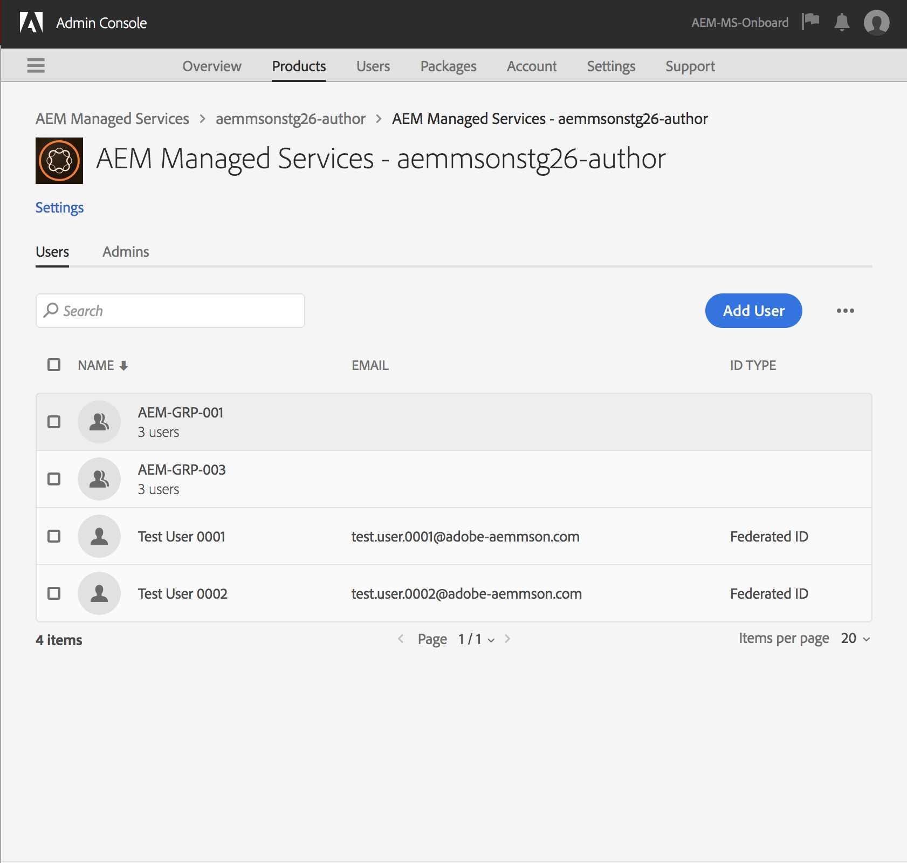

# Adobe IMS驗證和 [!DNL Admin Console] 支援AEM Managed Services {#adobe-ims-authentication-and-admin-console-support-for-aem-managed-services}

>[!NOTE]
>
>此功能僅適用於Adobe Managed Services客戶。

>[!NOTE]
>
>Adobe Experience Manager (AEM)目前不支援將群組指派給設定檔。 應單獨新增使用者。

## 簡介 {#introduction}

AEM 6.4.3.0引入 [!DNL Admin Console] 支援AEM執行個體和Adobe IMS (Identity Management System)驗證 **AEM Managed Services** 客戶。

AEM入門 [!DNL Admin Console] 可讓AEM Managed Services客戶在單一主控台中管理所有Experience Cloud使用者。 您可以將使用者指派給與AEM執行個體相關聯的產品設定檔，好讓他們登入特定執行個體。

## 重要焦點 {#key-highlights}

* AEM IMS驗證支援僅適用於AEM作者、管理員或開發人員，不適用於客戶網站的外部一般使用者，例如網站訪客
* 此 [!DNL Admin Console] 會將AEM Managed Services客戶表示為IMS組織，將其執行個體表示為產品內容。 客戶系統和產品管理員將能管理執行個體的存取權
* AEM Managed Services會將客戶拓撲與 [!DNL Admin Console]. 中每個執行個體會有一個AEM Managed Services產品內容執行個體 [!DNL Admin Console].
* 中的產品設定檔 [!DNL Admin Console] 將決定使用者可存取的執行個體
* 支援使用客戶自己的SAML 2相容身分提供者進行同盟驗證
* 僅支援Enterprise ID或Federated ID （適用於客戶單一登入），不支援個人AdobeID。
* [!DNL User Management] (Adobe中) [!DNL Admin Console])將繼續由客戶管理員擁有。

## 架構 {#architecture}

IMS驗證是透過在AEM和Adobe IMS端點之間使用OAuth通訊協定來運作。 使用者新增至IMS並擁有Adobe身分後，就能使用IMS憑證登入AEM Managed Services執行個體。

使用者登入流程如下所示，系統會將使用者重新導向至IMS，並可選擇重新導向至客戶IDP進行SSO驗證，然後重新導向回AEM。

## 如何設定 {#how-to-set-up}

### 將組織上線至 [!DNL Admin Console] {#onboarding-organizations-to-admin-console}

客戶入門至 [!DNL Admin Console] 是使用Adobe IMS進行AEM驗證的先決條件。

首先，客戶應在Adobe IMS中布建組織。 Adobe企業客戶在中表示為IMS組織 [Adobe [!DNL Admin Console]](https://helpx.adobe.com/tw/enterprise/using/admin-console.html).

AEM Managed Services客戶應先布建組織，而在IMS布建過程中，客戶例項將可在 [!DNL Admin Console] 用於管理使用者權益和存取權。

移至IMS進行使用者驗證將由AMS和客戶共同負責，每位客戶都有各自的工作流程要完成。

當客戶作為IMS組織存在且AMS完成布建客戶的IMS後，以下是所需的設定工作流程的摘要：

1. 指定的系統管理員會收到登入 [!DNL Admin Console]
1. 系統管理員宣告網域，以確認網域的所有權(在此範例中為acme.com)
1. 系統管理員設定使用者目錄
1. 系統管理員會於以下位置設定身分提供者(IDP)： [!DNL Admin Console] 用於SSO設定。
1. AEM管理員會照常管理本機群組、許可權和許可權。 請參閱使用者和群組同步

>[!NOTE]
>
>如需AdobeIdentity Management基本知識（包括IDP設定）的詳細資訊，請參閱文章 [此頁面。](https://helpx.adobe.com/tw/enterprise/using/set-up-identity.html)
>
>如需有關企業管理及資訊的詳細資訊， [!DNL Admin Console] 請參閱文章 [此頁面](https://helpx.adobe.com/tw/enterprise/managing/user-guide.html).

### 將使用者上線至 [!DNL Admin Console] {#onboarding-users-to-the-admin-console}

根據客戶的規模及偏好設定，有三種方式可吸引使用者：

1. 在中手動建立使用者和群組 [!DNL Admin Console]
1. 與使用者一起上傳CSV檔案
1. 從客戶的企業Active Directory同步使用者和群組。

#### 手動新增，透過 [!DNL Admin Console] UI {#manual-addition-through-admin-console-ui}

使用者與群組可在以下位置手動建立： [!DNL Admin Console] UI。 如果可供管理的使用者不多，則可使用此方法。 例如，少於50名AEM使用者。

如果客戶已使用此方法管理其他Adobe產品(例如Adobe Analytics、Adobe Target或Adobe Creative Cloud應用程式)，也可以手動建立使用者。

#### 檔案上傳位置 [!DNL Admin Console] UI {#file-upload-in-the-admin-console-ui}

為方便建立使用者，可上傳CSV檔案以大量新增使用者：

#### 使用者同步工具 {#user-sync-tool}

使用者同步工具（簡稱UST）可讓企業客戶建立或管理使用Active Directory或其他經過測試的OpenLDAP目錄服務的Adobe使用者。 目標使用者是IT身分管理員（企業目錄與系統管理員），他們能夠安裝及設定此工具。 開放原始碼工具可自訂，因此客戶可讓開發人員修改該工具，以符合其自身的特定需求。

當執行「使用者同步」時，它會從組織的Active Directory （或任何其他相容的資料來源）擷取使用者清單，並與 [!DNL Admin Console]. 然後它會呼叫Adobe [!DNL User Management] API讓您 [!DNL Admin Console] 與組織的目錄同步。 變更流程完全是單向的；任何在 [!DNL Admin Console] 不要推送至目錄。

此工具可讓系統管理員將客戶目錄中的使用者群組，與中的產品設定和使用者群組對應。 [!DNL Admin Console]，新的UST版本也允許在中動態建立使用者群組 [!DNL Admin Console].

若要設定「使用者同步」，組織需先透過與 [[!DNL User Management]  API](https://www.adobe.io/apis/cloudplatform/usermanagement/docs/setup.html) 相同的使用方式，建立一組憑證。

使用者同步會透過AdobeGithub存放庫分散於以下位置：

[https://github.com/adobe-apiplatform/user-sync.py/releases/latest](https://github.com/adobe-apiplatform/user-sync.py/releases/latest)

請注意，搶鮮版2.4RC1提供建立動態群組的支援，可從此處找到： [https://github.com/adobe-apiplatform/user-sync.py/releases/tag/v2.4rc1](https://github.com/adobe-apiplatform/user-sync.py/releases/tag/v2.4rc1)

此版本的主要功能是，能夠動態對應新的LDAP群組，以取得使用者在 [!DNL Admin Console]以及動態使用者群組建立。

有關新群組功能的詳細資訊，請參閱此處：

[https://adobe-apiplatform.github.io/user-sync.py/en/user-manual/advanced_configuration.html#additional-group-options](https://adobe-apiplatform.github.io/user-sync.py/en/user-manual/advanced_configuration.html#additional-group-options)

>[!NOTE]
>
>如需使用者同步工具的詳細資訊，請參閱 [檔案頁面](https://adobe-apiplatform.github.io/user-sync.py/en/).
>
>
>使用者同步工具必須依照上述程式註冊為Adobe I/O使用者端UMAPI [此處](https://adobe-apiplatform.github.io/umapi-documentation/en/UM_Authentication.html).
>
>Adobe I/O控制檯檔案可找到 [此處](https://developer.adobe.com/developer-console/docs/guides/).
>
>
>此 [!DNL User Management] 本頁介紹了使用者同步工具使用的API [位置](https://adobe-apiplatform.github.io/umapi-documentation/en/).

>[!NOTE]
>
>AEM IMS設定將由Adobe Managed Services團隊處理。 但是，客戶管理員可以根據他們的需求（例如，自動群組成員資格或群組對應）來修改它。 您的Managed Services團隊也將註冊IMS使用者端。

## 使用方式 {#how-to-use}

### 在中管理產品和使用者存取權 [!DNL Admin Console] {#managing-products-and-user-access-in-admin-console}

當客戶產品管理員登入 [!DNL Admin Console]，他們會看到AEM Managed Services產品內容的多個例項，如下所示：

在此範例中，組織 *AEM-MS-Onboard* 有32個執行個體，橫跨不同的拓撲和環境，例如Stage、Prod等。

可以檢查執行個體詳細資訊以識別執行個體：

在每個「產品內容」例項下，都會有一個相關聯的產品設定檔。 此產品設定檔用於指派存取許可權給使用者。

在此產品設定檔中新增的任何使用者都可以登入該執行個體，如以下範例所示：

### 登入AEM {#logging-into-aem}

#### 本機管理員登入 {#local-admin-login}

AEM可繼續支援管理員使用者的本機登入，因為登入畫面有可本機登入的選項：

#### IMS 登入 {#ims-based-login}

若是其他使用者，在執行個體上設定 IMS 後，即可使用 IMS 登入。使用者第一次點按 **使用Adobe登入** 如下所示：

接著，系統會將使用者重新導向至IMS登入畫面，並輸入其認證：

如果在初始期間設定了同盟IDP [!DNL Admin Console] 之後，系統會將使用者重新導向至客戶IDP以進行SSO。

在以下範例中，IDP為Okta：

驗證完成後，系統會將使用者重新導向回 AEM 並登入：

### 移轉現有使用者 {#migrating-existing-users}

對於使用其他驗證方法且現在正移轉至IMS的現有AEM執行個體，需要移轉步驟。

AEM存放庫中的現有使用者（來源為本機，透過LDAP或SAML）可以使用使用者移轉公用程式以指向IMS作為IDP。

此公用程式將由您的AMS團隊在IMS布建過程中執行。

### 在AEM中管理許可權和ACL {#managing-permissions-and-acls-in-aem}

存取控制和許可權將繼續在AEM中管理，這是可以使用分離來自IMS的使用者群組(例如，以下範例中的AEM-GRP-008)和定義許可權和存取控制的本機群組來達成。 可將從IMS同步的使用者群組指派給本機群組，並繼承許可權。

以下範例中，我們會示範將同步的群組新增至本機 *Dam_Users* 群組。

在此，使用者也被指派到中的一些群組 [!DNL Admin Console]. (使用者與群組可使用使用者同步工具從LDAP同步或在本機建立。 另請參閱 **將使用者上線至[!DNL Admin Console]** 較早)。

>[!NOTE]
>
>只有當使用者登入執行個體時，使用者群組才會同步。

使用者屬於 IMS 中的下列群組：

使用者登入後，系統會同步其群組成員資格，如下所示：

在AEM中，與IMS同步的使用者群組可以成員身分新增至現有的本機群組，例如DAM使用者。

如下所示，該群組 *AEM-GRP_008* 繼承DAM使用者的許可權和特權。 這是管理已同步群組許可權的有效方式，也常用於LDAP型驗證方法。

