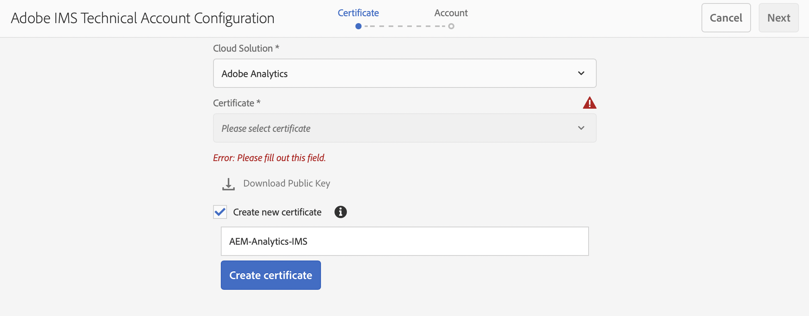
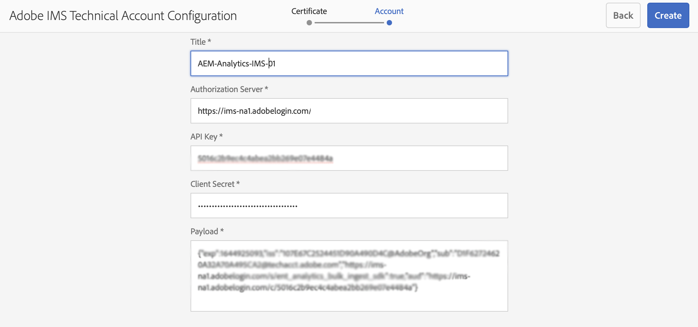

# 使用IMS與Adobe Analytics整合 {#integration-with-adobe-analytics-using-ims}

通過分析標AEM準API與Adobe Analytics進行整合需要使用Adobe開發人員控制台配置Adobe IMS(Identity Management系統)。

>[!NOTE]
>
>對Adobe Analytics StandardAPI 2.0的支援是6.5.12.0中的新增功AEM能。此版本的API支援IMS驗證。
>
>仍支援在中使用Adobe Analytics經AEM典API 1.4，以實現向後相容。 的 [Analytics Classic API使用用戶憑據驗證](/help/sites-administering/adobeanalytics-connect.md)。
>
>API選擇由用於AEM/Analytics整合的驗證方法驅動。
>
>進一步資訊也可在下 [遷移到2.0 API](https://developer.adobe.com/analytics-apis/docs/2.0/guides/migration/)。

## 必備條件 {#prerequisites}

開始此過程之前：

* [Adobe支援](https://helpx.adobe.com/tw/contact/enterprise-support.ec.html) 必須設定帳戶：

   * Adobe控制台
   * Adobe開發人員控制台
   * Adobe Analytics
   * Adobe IMS(Identity Management系統)

* 您組織的系統管理員應使用該Admin Console將組織中所需的開發人員添加到相關的產品配置檔案中。

   * 這為特定開發人員提供了在Adobe開發人員控制台中啟用整合的權限。
   * 有關詳細資訊，請參閱 [管理開發人員](https://helpx.adobe.com/enterprise/admin-guide.html/enterprise/using/manage-developers.ug.html)。

## 配置IMS配置 — 生成公鑰 {#configuring-an-ims-configuration-generating-a-public-key}

配置的第一階段是在中建立IMS配置並AEM生成公鑰。

1. 開啟AEM **工具** 的子菜單。
1. 在 **安全** 節選 **Adobe IMS配置**。
1. 選擇 **建立** 開啟 **Adobe IMS技術帳戶配置**。
1. 使用下拉框 **雲配置**&#x200B;選中 **Adobe Analytics**。
1. 激活 **建立新證書** 並輸入新別名。
1. 確認 **建立證書**。

   

1. 選擇 **下載** 或 **下載公鑰**)將檔案下載到本地驅動器，以便在 [配置IMS以與Adobe Analytics集AEM成](#configuring-ims-for-adobe-analytics-integration-with-aem)。

   >[!CAUTION]
   >
   >保持此配置開啟，當 [在中完成IMS配AEM置](#completing-the-ims-configuration-in-aem)。

   

## 配置IMS以與Adobe Analytics集AEM成 {#configuring-ims-for-adobe-analytics-integration-with-aem}

使用Adobe開發人員控制台，您需要與Adobe Analytics（供使用）建立項目(集AEM成)，然後分配所需的權限。

### 建立項目 {#creating-the-project}

開啟Adobe開發者控制台，以建立將使用以下功能的具有Adobe AnalyticsAEM的項目：

1. 開啟項目Adobe開發人員控制台：

   [https://developer.adobe.com/console/projects](https://developer.adobe.com/console/projects)

1. 將顯示您擁有的任何項目。 選擇 **建立新項目**  — 地點和用途取決於：

   * 如果你還沒有項目， **建立新項目** 中間，底部。
      
   * 如果您已經擁有現有項目，將列出並 **建立新項目** 右上。
      

1. 選擇 **添加到項目** 後跟 **API**:

   

1. 選擇 **Adobe Analytics**，則 **下一個**:

   >[!NOTE]
   >
   >如果您訂閱了Adobe Analytics，但未看到列出，則應檢查 [預請求](#prerequisites)。

   

1. 選擇 **服務帳戶(JWT)** 作為身份驗證類型，然後繼續 **下一個**:

   

1. **上載公鑰**，完成後繼續 **下一個**:

   

1. 查看憑據，並繼續 **下一個**:

   

1. 選擇所需的產品配置檔案，然後繼續 **保存已配置的API**:

   

1. 將確認配置。

### 為整合分配權限 {#assigning-privileges-to-the-integration}

您現在必須為整合分配所需的權限：

1. 開啟Adobe **Admin Console**:

   * [https://adminconsole.adobe.com](https://adminconsole.adobe.com/)

1. 導航到 **產品** （頂部工具欄），然後選擇 **Adobe Analytics- &lt;*您的租戶ID*>** （從左面板）。
1. 選擇 **產品配置檔案**，然後從顯示的清單中找到所需的工作區。 例如，預設工作區。
1. 選擇 **API憑據**，然後是所需的整合配置。
1. 選擇 **編輯器** 的 **產品角色**;而不是 **觀察者**。

## 為Adobe開發人員控制台整合項目儲存的詳細資訊 {#details-stored-for-the-ims-integration-project}

從Adobe開發人員項目控制台中，您可以看到所有整合項目的清單：

* [https://developer.adobe.com/console/projects](https://developer.adobe.com/console/projects)

選擇特定項目條目以顯示有關配置的詳細資訊。 這些包括：

* 項目概述
* 分析
* 憑據
   * 服務帳戶(JWT)
      * 憑據詳細資訊
      * 生成JWT
* APIS
   * 比如說Adobe Analytics

其中一些需要完成Adobe Analytics的整合工AEM作。

## 在中完成IMS配AEM置 {#completing-the-ims-configuration-in-aem}

返回AEM後，可以通過從Analytics整合項目中添加所需值來完成IMS配置：

1. 返回到 [IMS配置在中打AEM開](#configuring-an-ims-configuration-generating-a-public-key)。
1. 選擇 **下一個**。

1. 在這裡，你可以 [為Adobe開發人員控制台整合項目儲存的詳細資訊](#details-stored-for-the-ims-integration-project):

   * **標題**:你的簡訊。
   * **授權伺服器**:從 `aud` 行 **負載** 如 `https://ims-na1.adobelogin.com` 在下面的示例中
   * **API密鑰**:從 **憑據** 的下界 [項目概述](#details-stored-for-the-ims-integration-project)
   * **客戶端密碼**:在 [「服務帳戶(JWT)」部分的「客戶機密鑰」頁籤](#details-stored-for-the-ims-integration-project)，然後複製
   * **負載**:從 [生成「服務帳戶(JWT)」部分的JWT頁籤](#details-stored-for-the-ims-integration-project)

   

1. 確認 **建立**。

1. 您的Adobe Analytics配置將顯示在控AEM制台中。

   

## 確認IMS配置 {#confirming-the-ims-configuration}

要確認配置按預期運行，請執行以下操作：

1. 開啟:

   * `https://localhost<port>/libs/cq/adobeims-configuration/content/configurations.html`

   例如：

   * `https://localhost:4502/libs/cq/adobeims-configuration/content/configurations.html`

1. 選擇您的配置。
1. 選擇 **檢查運行狀況** ，然後 **檢查**。

   

1. 如果成功，您將看到一條確認消息。

## 配置Adobe Analytics Cloud服務 {#configuring-the-adobe-analytics-cloud-service}

現在，可以為Cloud Service引用配置以使用分析標準API:

1. 開啟 **工具** 的子菜單。 然後，在 **Cloud Services** 選擇 **舊Cloud Services**。
1. 向下滾動到 **Adobe Analytics** 選擇 **立即配置**。

   的 **建立配置** 對話框。

1. 輸入 **標題** 如果你願意， **名稱** （如果留空，則從標題生成）。

   也可以選擇所需的模板（如果有多個模板可用）。

1. 確認 **建立**。

   的 **編輯元件** 對話框。

1. 在 **分析設定** 頁籤：

   * **驗證**:IMS

   * **IMS配置**:選擇IMS配置的名稱

1. 按一下 **連接到分析** 初始化與Adobe Analytics的連接。

   如果連接成功，則消息 **連接成功** 的上界。

1. 選擇 **確定** 在留言上。

1. 根據需要完成其他參數，然後 **確定** 的子菜單。

1. 您現在可以繼續 [添加分析框架](/help/sites-administering/adobeanalytics-connect.md) 配置將發送到Adobe Analytics的參數。
