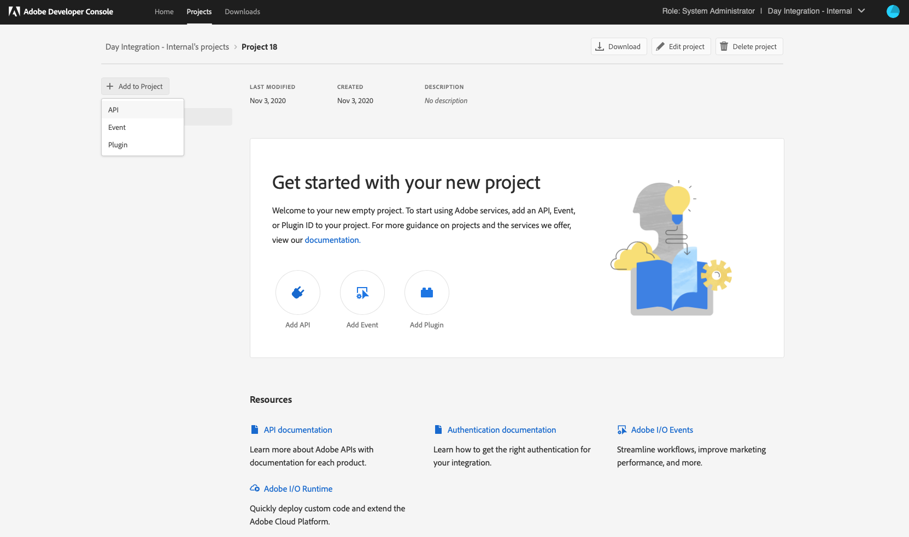
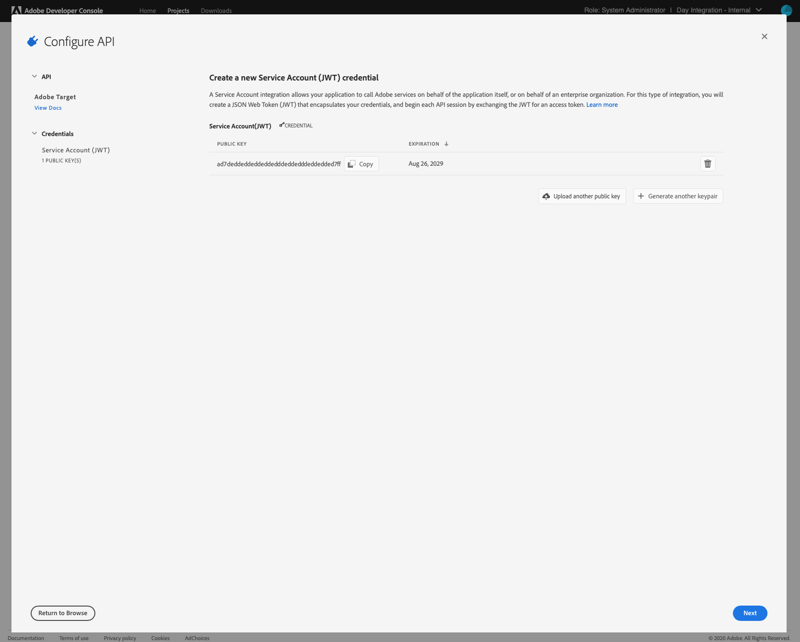

# 使用Adobe I/O{#integration-with-adobe-target-using-adobe-i-o}與Adobe Target整合

透過Target Standard API與AEMAdobe Target整合需要設定AdobeIMS(Identity Management系統)和Adobe I/O。

>[!NOTE]
>
>Adobe Target標準API的支援是6.5版AEM的新增功能。Target Standard API使用IMS驗證。
>
>在中使用Adobe Target經典APIAEM仍支援向後相容。 [Target Classic API使用用戶憑據驗證](/help/sites-administering/target-configuring.md#manually-integrating-with-adobe-target)。
>
>API選擇由用於AEM/Target整合的驗證方法驅動。
>另請參閱[租用戶ID和用戶端代碼](#tenant-client)一節。

## 必備條件 {#prerequisites}

開始此過程之前：

* [Adobe](https://helpx.adobe.com/tw/contact/enterprise-support.ec.html) 支援必須為您的帳戶提供：

   * Adobe控制台
   * Adobe I/O
   * Adobe Target和
   * AdobeIMS(Identity Management系統)

* 貴組織的系統管理員應使用Admin Console，將貴組織所需的開發人員新增至相關的產品設定檔。

   * 這可讓特定開發人員擁有在Adobe I/O中啟用整合的權限。
   * 如需詳細資訊，請參閱[管理開發人員](https://helpx.adobe.com/enterprise/admin-guide.html/enterprise/using/manage-developers.ug.html)。

## 配置IMS配置——生成公鑰{#configuring-an-ims-configuration-generating-a-public-key}

設定的第一階段是在中建立IMS設定，AEM並產生公開金鑰。

1. 在AEM開啟&#x200B;**工具**&#x200B;菜單。
1. 在&#x200B;**Security**&#x200B;區段中，選擇&#x200B;**AdobeIMS配置**。
1. 選擇&#x200B;**建立**&#x200B;以開啟&#x200B;**AdobeIMS技術帳戶配置**。
1. 使用&#x200B;**雲配置**&#x200B;下拉式清單，選擇&#x200B;**Adobe Target**。
1. 激活&#x200B;**建立新證書**&#x200B;並輸入新別名。
1. 使用&#x200B;**建立憑證**&#x200B;進行確認。

   

1. 選擇&#x200B;**下載**（或&#x200B;**下載公開密鑰**）將檔案下載到本地驅動器，以便在[配置用於與AEM](#configuring-adobe-i-o-for-adobe-target-integration-with-aem)整合的Adobe Target的Adobe I/O時使用。

   >[!CAUTION]
   >
   >保持此配置開啟狀態，當[完成](#completing-the-ims-configuration-in-aem)中的IMS配置時，將AEM再次需要此配置。

   

## 為Adobe Target整合配AEM置Adobe I/O{#configuring-adobe-i-o-for-adobe-target-integration-with-aem}

您需要與將使用的Adobe Target建立Adobe I/O項目（整合）AEM，然後分配所需的權限。

### 建立項目{#creating-the-project}

開啟Adobe I/O控制台以建立將使用以下功能的I/O項AEM目：

>[!NOTE]
>
>另請參閱[Adobe I/O教學課程](https://www.adobe.io/apis/experienceplatform/home/tutorials/alltutorials.html)。

1. 開啟專案的Adobe I/O主控台：

   [https://console.adobe.io/projects](https://console.adobe.io/projects)

1. 您擁有的任何專案都會顯示。 選擇&#x200B;**建立新項目** —— 位置和使用情況取決於：

   * 如果您尚未有任何專案，**建立新專案**將位於底部中央。
      
   * 如果您已有現有的專案，則會列出這些專案，而&#x200B;**建立新專案**將會在右上方。
      

1. 選擇&#x200B;**添加到項目**，後跟&#x200B;**API**:

   

1. 選擇&#x200B;**Adobe Target**，然後選擇&#x200B;**Next**:

   >[!NOTE]
   >
   >如果您訂閱了Adobe Target，但未看到列出，則應檢查[Prerequestes](#prerequisites)。

   

1. **上傳您的公開金鑰**，完成時，請繼續「下 **一步**:

   

1. 查看憑據，然後繼續&#x200B;**Next**:

   

1. 選擇所需的產品配置檔案，然後繼續&#x200B;**保存配置的API** :

   >[!NOTE]
   >
   >顯示的產品設定檔取決於您是否有：
   >
   >* Adobe Target標準版——僅&#x200B;**預設工作區**&#x200B;可用
   >* Adobe Target高級版——列出所有可用工作區，如下所示

   

1. 將確認建立。

<!--
1. The creation will be confirmed, you can now **Continue to integration details**; these are needed for [Completing the IMS Configuration in AEM](#completing-the-ims-configuration-in-aem).

   
-->

### 將權限分配給整合{#assigning-privileges-to-the-integration}

您現在必須將必要的權限指派給整合：

1. 開啟Adobe **Admin Console**:

   * [https://adminconsole.adobe.com](https://adminconsole.adobe.com/)

1. 導覽至&#x200B;**Products**（頂端工具列），然後選取&#x200B;**Adobe Target- &lt;*your-tenant-id*>**（從左側面板）。
1. 選擇「**產品描述檔**」，然後從顯示的清單中選擇您所需的工作區。 例如，預設工作區。
1. 選擇&#x200B;**整合**，然後選擇所需的整合設定。
1. 選擇&#x200B;**Editor**&#x200B;作為&#x200B;**產品角色**;而非&#x200B;**觀察者**。

## 為Adobe I/O整合項目{#details-stored-for-the-adobe-io-integration-project}儲存的詳細資訊

從「Adobe I/O專案」主控台，您可以看到所有整合專案的清單：

* [https://console.adobe.io/projects](https://console.adobe.io/projects)

選擇&#x200B;**View**（位於特定項目條目的右側）以顯示有關配置的詳細資訊。 其中包括：

* 專案概觀
* 分析
* 認證
   * 服務帳戶(JWT)
      * 憑據詳細資訊
      * 生成JWT
* APIS
   * 例如，Adobe Target

其中一些需要您完成中Target的Adobe I/O整合AEM。

## 完成{#completing-the-ims-configuration-in-aem}中AEM的IMS配置

返回AEM您可以透過從Target的Adobe I/O整合新增必要值來完成IMS設定：

1. 返回中開啟的AEMIMS配置。
1. 選擇&#x200B;**Next**。

1. 您可以在此處使用Adobe I/O](#details-stored-for-the-adobe-io-integration-project)中的[詳細資訊：

   * **標題**:您的文字。
   * **授權伺服器**:從下方的Payloadsection `"aud"` 行複製/ **** 貼上此選項，例如 `"https://ims-na1.adobelogin.com"` 在下方範例中
   * **API金鑰**:從TargetAdobe I/O整  合的「概述」區段複製此項
   * **用戶端密碼**:在TargetAdobe I/O整  合的「概述」區段中產生此項，並複製
   * **裝載**:從TargetAdobe I/O整 [合的](#details-stored-for-the-adobe-io-integration-project) Generate JWTsection複製此項

   

1. 使用&#x200B;**Create**&#x200B;確認。

1. 您的Adobe Target配置將顯示在控制台AEM中。

   

## 確認IMS配置{#confirming-the-ims-configuration}

要確認配置正如預期運行，請執行以下操作：

1. 開啟:

   * `https://localhost<port>/libs/cq/adobeims-configuration/content/configurations.html`

   例如：

   * `https://localhost:4502/libs/cq/adobeims-configuration/content/configurations.html`

1. 選擇您的配置。
1. 從工具欄中選擇&#x200B;**Check Health** ，然後選擇&#x200B;**Check**。

   

1. 如果成功，您將看到以下消息：

   

## 配置Adobe TargetCloud Service{#configuring-the-adobe-target-cloud-service}

現在可以參考設定，讓Cloud Service使用Target Standard API:

1. 開啟&#x200B;**工具**&#x200B;菜單。 然後，在&#x200B;**Cloud Services**&#x200B;部分中，選擇&#x200B;**舊Cloud Services**。
1. 向下滾動到&#x200B;**Adobe Target**&#x200B;並選擇&#x200B;**立即配置**。

   將開啟&#x200B;**建立配置**&#x200B;對話框。

1. 輸入&#x200B;**Title**&#x200B;和&#x200B;**Name**（如果保留為空白，則會從標題生成）。

   您也可以選取所需範本（如果有多個範本可用）。

1. 使用&#x200B;**Create**&#x200B;確認。

   將開啟&#x200B;**編輯元件**&#x200B;對話框。

1. 在&#x200B;**Adobe Target設定**&#x200B;頁籤中輸入詳細資訊：

   * **驗證**:IMS
   * **租用戶ID**:AdobeIMS租用戶ID。另請參閱[租用戶ID和用戶端代碼](#tenant-client)一節。

      >[!NOTE]
      >
      >對於IMS，此值必須取自Target本身。 您可以登入Target，並從URL擷取租用戶ID。
      >
      >例如，若URL為：
      >
      >`https://experience.adobe.com/#/@yourtenantid/target/activities`
      >
      >然後您會使用`yourtenantid`。
   * **用戶端代碼**:請參閱「 [租用戶ID和用戶端](#tenant-client) 代碼」區段。
   * **IMS設定**:選擇IMS設定的名稱
   * **API類型**:REST
   * **A4TAnalytics Cloud配置**:選取用於目標活動目標和度量的Analytics雲端設定。如果您在定位內容時使用Adobe Analytics作為報告來源，則需要此功能。 如果您看不到雲端設定，請參閱[設定A4TAnalytics Cloud設定](/help/sites-administering/target-configuring.md#configuring-a-t-analytics-cloud-configuration)中的附註。
   * **使用精確的定位**:預設情況下，此複選框處於選中狀態。如果選取此選項，雲端服務設定會等待載入內容後再載入內容。 請參閱以下附註。
   * **同步來自Adobe Target的區段**:選取此選項可下載Target中定義的區段，以便在中使AEM用。當「API類型」屬性為REST時，您必須選取此選項，因為不支援內嵌區段，而且您一律需要使用Target中的區段。 (請注意，AEM&#39;segment&#39;一詞等同於Target &#39;audience&#39;)。
   * **用戶端程式庫**:選擇您要AT.js用戶端程式庫或mbox.js（已過時）。
   * **使用標籤管理系統來傳送用戶端程式庫**:使用DTM（已過時）、Adobe啟動或任何其他標籤管理系統。
   * **自訂AT.js**:如果您勾選「標籤管理」方塊或使用預設AT.js，請留空。或者，上傳您的自訂AT.js。 只有在您選取了AT.js時才會顯示。

   >[!NOTE]
   >
   >[已不建議使用Target Classic ](/help/sites-administering/target-configuring.md#manually-integrating-with-adobe-target) API的Cloud Service配置(使用「Adobe Recommendations設定」頁籤)。
1. 按一下&#x200B;**連接到Target**&#x200B;以初始化與Adobe Target的連接。

   如果連接成功，則顯示消息&#x200B;**Connection successful**。

1. 在消息上選擇&#x200B;**OK**，然後在對話框上選擇&#x200B;**OK**&#x200B;以確認配置。
1. 您現在可以繼續[新增Target Framework](/help/sites-administering/target-configuring.md#adding-a-target-framework)，以設定將傳送至Target的ContextHub或ClientContext參數。 請注意，匯出體驗片段至Target時可AEM能不需要這個功能。

### 租用戶ID和用戶端代碼{#tenant-client}

在[Adobe Experience Manager6.5.8.0](/help/release-notes/sp-release-notes.md)中，「客戶端代碼」欄位已添加到「目標」配置窗口。

設定「租用戶ID」和「用戶端代碼」欄位時，請注意下列事項：

1. 對於大部分客戶而言，租用戶ID和用戶端代碼是相同的。 這表示這兩個欄位都包含相同的資訊，而且完全相同。 請務必在這兩個欄位中輸入租用戶ID。
2. 為了舊版用途，您也可以在「租用戶ID」和「用戶端代碼」欄位中輸入不同的值。

在這兩種情況下，請注意：

* 依預設，用戶端代碼（如果先新增）也會自動複製至「租用戶ID」欄位。
* 您可以選擇變更預設租用戶ID集。
* 因此，對Target的後端呼叫將以租用戶ID為基礎，而對Target的用戶端呼叫則以用戶端代碼為基礎。

如前所述，第一個案例是6.AEM5中最常見的案例。無論如何，請根據您的需求，確定&#x200B;**both**&#x200B;欄位皆包含正確的資訊。

>[!NOTE]
>
> 如果要更改現有的Target配置：
>
> 1. 重新輸入租用戶ID。
> 2. 重新連線至Target。
> 3. 儲存設定。

