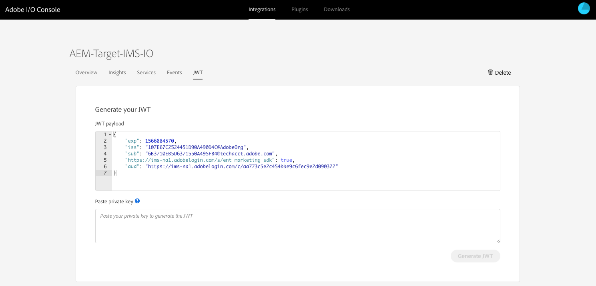

# 使用Adobe I/O與Adobe Target整合{#integration-with-adobe-target-using-adobe-i-o}

AEM與Adobe Target透過Target Standard API整合需要設定Adobe IMS（身分管理系統）和Adobe I/O。

>[!NOTE]
>
>AEM 6.5中新增了Adobe Target Standard API支援。Target Standard API使用IMS驗證。
>
>在AEM中使用Adobe Target Classic API仍支援回溯相容性。 Target [Classic API使用使用者認證驗證](/help/sites-administering/target-configuring.md#manually-integrating-with-adobe-target)。
>
>API選擇是由用於AEM/Target整合的驗證方法所驅動。

## 必備條件 {#prerequisites}

開始此程式之 [前，Adobe支援](https://helpx.adobe.com/contact/enterprise-support.ec.html) (Adobe Support)必須為您的帳戶布建：

* Adobe Console
* Adobe I/O
* Adobe Target和
* Adobe IMS（身分管理系統）

## 設定IMS設定——產生公開金鑰 {#configuring-an-ims-configuration-generating-a-public-key}

設定的第一個階段是在AEM中建立IMS設定並產生公用金鑰。

1. 在AEM中開啟「工 **具** 」選單。
1. 在「安 **全性** 」區段中 **選取「Adobe IMS設定」**。
1. 選 **取「建立** 」以開 **啟Adobe IMS技術帳戶設定**。
1. 使用「雲端設定」下 **方的下拉式清單**，選 **取「Adobe Target**」。
1. 啟動 **建立新憑證** ，然後輸入新別名。
1. 使用「建立 **憑證」確認**。

   

1. 選 **取「下載** 」(或「下載公開金鑰 **」)，將檔案下載至您的本機磁碟機，以便在與AEM整合時，為** Adobe I/O設定檔案可供使用 。

   >[!CAUTION]
   >
   >請保持此設定開啟，當在AEM中完成IMS [設定時，將會再次需要此設定](#completing-the-ims-configuration-in-aem)。

   

## 設定Adobe I/O以與AEM整合的Adobe Target {#configuring-adobe-i-o-for-adobe-target-integration-with-aem}

您必須與AEM將使用的Adobe target建立Adobe I/O整合，然後指派所需的權限。

### 建立整合 {#creating-the-integration}

開啟Adobe I/O主控台，以建立AEM將使用的Adobe Target I/O整合：

>[!NOTE]
>
>另請參閱 [Adobe I/O教學課程](https://www.adobe.io/apis/experienceplatform/home/tutorials/alltutorials.html)。

1. 開啟Adobe I/O主控台進行整合：

   * [https://console.adobe.io/integrations](https://console.adobe.io/integrations)

1. 選擇 **新整合**:

   >[!NOTE]
   >
   >如果您已有現有的整合，這些整合將會列出，而「 **新增整合** 」按鈕會位於右上角。

   

1. 選擇 **存取API** ，然後 **繼續**:

   

1. 依序 **選擇Adobe Target**、 **繼續**:

   

1. 新增整合設定所需的詳細資訊：

   * **名稱**

      輸入名稱。

   * **說明**

      說明是選用的。

   * **公開金鑰憑證**

      上傳公開金鑰檔案；在「設定 [IMS設定——產生公用金鑰」下產生](#configuring-an-ims-configuration-generating-a-public-key)。

      載入後，憑證將列在「憑證」 **下方**。

   * **產品設定檔**

      「產品設定檔」等同於Target中的「工作區」,AEM可用於內容匯出和選件建立。 預設會選取「目標預設工作區」。 選取AEM中應公開的任何其他描述檔／工作區，做為匯出目的地。
   例如：

   

1. 使用「建立 **整合」確認**。
1. 建立過程將得到確認，您現在可 **以繼續整合詳細資訊**;在AEM中完成 [IMS設定時，需要這些](#completing-the-ims-configuration-in-aem)。

   

### 指派權限給整合 {#assigning-privileges-to-the-integration}

您現在必須將必要的權限指派給整合：

1. 開啟Adobe **Admin Console**:

   * [https://adminconsole.adobe.com](https://adminconsole.adobe.com/)

1. 導覽至 **Products** （頂端工具列），然後選取 **Adobe Target - &lt;*your-tenant-id*>** （從左側面板）。
1. 選擇「 **產品描述檔**」，然後從顯示的清單中選擇您所需的工作區。 例如，預設工作區。
1. 選擇 **整合**，然後選擇所需的整合設定。
1. 選擇 **Editor** 作為 **Product Role**;而不是 **觀察者**。

## 儲存的Adobe I/O整合詳細資訊 {#details-stored-for-the-adobe-i-o-integration}

從Adobe I/O整合主控台，您可以看到所有整合的清單：

* [https://console.adobe.io/integrations](https://console.adobe.io/integrations)

選 **擇View** （特定整合項目的右側），以顯示有關配置的詳細資訊。 其中包括：

* 綜覽
* 分析
* 服務
* 事件
* JWT(JSON Web Token)

其中有些您需要完成AEM中Target的Adobe I/O整合。

1. **綜覽**:

   

1. **JWT**:

   

## 在AEM中完成IMS設定 {#completing-the-ims-configuration-in-aem}

返回AEM時，您可以從Target的Adobe I/O整合新增必要值，以完成IMS設定：

1. 返回在AEM中 [開啟的IMS設定](#configuring-an-ims-configuration-generating-a-public-key)。
1. 選擇 **下一步**。

1. 您可以在這裡使 [用Adobe I/O的詳細資訊](#details-stored-for-the-adobe-i-o-integration):

   * **標題**:您的文字。
   * **授權伺服器**:從下方的「裝載 `"aud"` 」區段行複製／貼上 **此項** ，例如 `"https://ims-na1.adobelogin.com"` 在下方範例中
   * **API金鑰**:從Adobe I/O [整合](#details-stored-for-the-adobe-i-o-integration) （適用於Target）的「概述」區段複製此項
   * **用戶端密碼**:在Target的Adobe I/O [整合](#details-stored-for-the-adobe-i-o-integration) 「概述」區段中產生此項，並複製
   * **裝載**:從Target的Adobe I/O [整合](#details-stored-for-the-adobe-i-o-integration) (JWT)區段複製此項
   

1. 使用「建立 **」確認**。

1. 您的Adobe target設定會顯示在AEM主控台中。

   

## 確認IMS配置 {#confirming-the-ims-configuration}

要確認配置正如預期運行，請執行以下操作：

1. 開啟:

   * `https://localhost<port>/libs/cq/adobeims-configuration/content/configurations.html`
   例如：

   * `https://localhost:4502/libs/cq/adobeims-configuration/content/configurations.html`

1. 選擇您的配置。
1. 從工 **具列中選擇** Check Health **，然後選擇** Check。

   

1. 如果成功，您將看到以下消息：

   

## 設定Adobe Target cloud服務 {#configuring-the-adobe-target-cloud-service}

現在，雲端服務可參考此設定，以使用Target Standard API:

1. 開啟「工 **具** 」功能表。 然後，在「雲端服 **務」區段中** ，選取「 **舊版雲端服務」**。
1. 向下捲動至 **Adobe Target** ，然後選 **取「立即設定」**。

   將會 **開啟「建立配置** 」對話框。

1. 輸入 **Title** （標題），並視需要輸入 **Name** （如果留空，則會從標題中產生此名稱）。

   您也可以選取所需範本（如果有多個範本可用）。

1. 使用「建立 **」確認**。

   將會 **開啟「編輯元件** 」(Edit Component)對話框。

1. 在「 **Adobe Target設定」標籤中輸入詳細資訊** :

   * **用戶端代碼**:adobe IMS租用戶ID

      >[!CAUTION]
      >
      >必須在標示「用戶端代碼」的欄位中輸入Adobe IMS租用戶ID。

   * **驗證**:IMS
   * **IMS設定**:選擇IMS設定的名稱
   * **API類型**:REST
   * **A4T Analytics雲端設定**:選取用於目標活動目標和度量的Analytics雲端設定。 如果您在定位內容時使用Adobe Analytics做為報告來源，則需要此功能。 如果您看不到雲端設定，請參閱「設定 [A4T Analytics雲端設定」中的附註](/help/sites-administering/target-configuring.md#configuring-a-t-analytics-cloud-configuration)。
   * **使用精確的定位**:預設情況下，此複選框處於選中狀態。 如果選取此選項，雲端服務設定會等待載入內容後再載入內容。 請參閱以下附註。
   * **從Adobe Target同步區段**:選取這個選項可下載在Target中定義的區段，以便在AEM中使用。 當「API類型」屬性為REST時，您必須選取此選項，因為不支援內嵌區段，而且您一律需要使用Target中的區段。 （請注意，「區段」的AEM詞語等同於「目標對象」。）
   * **用戶端程式庫**:選擇您要AT.js用戶端程式庫或mbox.js（已過時）。
   * **使用標籤管理系統來傳送用戶端程式庫**:使用DTM（已過時）、Adobe Launch或任何其他標籤管理系統。
   * **自訂AT.js**:如果您勾選「標籤管理」方塊或使用預設AT.js，請留空。 或者，上傳您的自訂AT.js。 只有在您選取了AT.js時才會顯示。
   >[!NOTE]
   >
   >[已停用雲端服務的設定以使用Target Classic API](/help/sites-administering/target-configuring.md#manually-integrating-with-adobe-target) （使用Adobe Recommendations的「設定」標籤）。

   例如：

   

1. 按一 **下「連線至Target** 」以初始化與Adobe Target的連線。

   如果連接成功，則顯示「 **Connection successful** （連接成功）」消息。

1. 在消 **息上選擇** 「確定」，然後在對話框上選 **擇「確定** 」以確認配置。
1. 您現在可以繼 [續「新增Target Framework](/help/sites-administering/target-configuring.md#adding-a-target-framework) 」，以設定將傳送至Target的ContextHub或ClientContext參數。 請注意，將AEM體驗片段匯出至Target時可能不需要這個功能。

