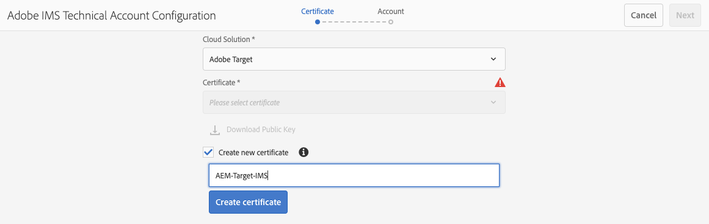
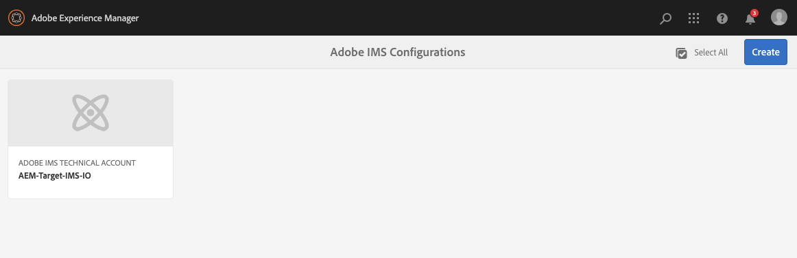

# 使用IMS與Adobe Target整合{#integration-with-adobe-target-using-ims}

通過目標標AEM準API與Adobe Target整合需要使用Adobe開發人員控制台配置Adobe IMS(Identity Management系統)。

>[!NOTE]
>
>對Adobe Target標準API的支援在6AEM.5中新增。目標標準API使用IMS驗證。
>
>仍支援在中使用Adobe TargetAEM經典API進行向後相容。 的 [目標經典API使用用戶憑據驗證](/help/sites-administering/target-configuring.md#manually-integrating-with-adobe-target)。
>
>API選擇由用於AEM/Target整合的驗證方法驅動。
>另請參閱 [租戶ID和客戶端代碼](#tenant-client) 的子菜單。

## 必備條件 {#prerequisites}

開始此過程之前：

* [Adobe支援](https://helpx.adobe.com/tw/contact/enterprise-support.ec.html) 必須設定帳戶：

   * Adobe控制台
   * Adobe開發人員控制台
   * Adobe Target
   * Adobe IMS(Identity Management系統)

* 您組織的系統管理員應使用該Admin Console將組織中所需的開發人員添加到相關的產品配置檔案中。

   * 這為特定開發人員提供了在Adobe開發人員控制台中啟用整合的權限。
   * 有關詳細資訊，請參閱 [管理開發人員](https://helpx.adobe.com/enterprise/admin-guide.html/enterprise/using/manage-developers.ug.html)。

## 配置IMS配置 — 生成公鑰 {#configuring-an-ims-configuration-generating-a-public-key}

配置的第一階段是在中建立IMS配置並AEM生成公鑰。

1. 開啟AEM **工具** 的子菜單。
1. 在 **安全** 節選 **Adobe IMS配置**。
1. 選擇 **建立** 開啟 **Adobe IMS技術帳戶配置**。
1. 使用下拉框 **雲配置**&#x200B;選中 **Adobe Target**。
1. 激活 **建立新證書** 並輸入新別名。
1. 確認 **建立證書**。

   

1. 選擇 **下載** 或 **下載公鑰**)將檔案下載到本地驅動器，以便在 [配置IMS以與Adobe Target集AEM成](#configuring-ims-for-adobe-target-integration-with-aem)。

   >[!CAUTION]
   >
   >保持此配置開啟，當 [在中完成IMS配AEM置](#completing-the-ims-configuration-in-aem)。

   

## 配置IMS以與Adobe Target集AEM成 {#configuring-ims-for-adobe-target-integration-with-aem}

使用Adobe開發人員控制台，您需要與Adobe Target建立一個項目（整合）,AEM然後分配所需的權限。

### 建立項目 {#creating-the-project}

開啟Adobe開發者控制台，以建立將使用以下功能的具有Adobe TargetAEM的項目：

1. 開啟項目Adobe開發人員控制台：

   [https://developer.adobe.com/console/projects](https://developer.adobe.com/console/projects)

1. 將顯示您擁有的任何項目。 選擇 **建立新項目**  — 地點和用途取決於：

   * 如果你還沒有項目， **建立新項目** 中間，底部。
      
   * 如果您已經擁有現有項目，將列出並 **建立新項目** 右上。
      

1. 選擇 **添加到項目** 後跟 **API**:

   

1. 選擇 **Adobe Target**，則 **下一個**:

   >[!NOTE]
   >
   >如果您訂閱了Adobe Target，但未看到列出，則應檢查 [預請求](#prerequisites)。

   

1. **上載公鑰**，完成後繼續 **下一個**:

   

1. 查看憑據，並繼續 **下一個**:

   

1. 選擇所需的產品配置檔案，然後繼續 **保存已配置的API**:

   >[!NOTE]
   >
   >顯示的產品配置檔案取決於您是否具有：
   >
   >* Adobe Target標準 — 僅 **預設工作區** 可用
   >* Adobe Target高級版 — 列出所有可用工作區，如下所示

   

1. 將確認建立。

<!--
1. The creation will be confirmed, you can now **Continue to integration details**; these are needed for [Completing the IMS Configuration in AEM](#completing-the-ims-configuration-in-aem).

   
-->

### 為整合分配權限 {#assigning-privileges-to-the-integration}

您現在必須為整合分配所需的權限：

1. 開啟Adobe **Admin Console**:

   * [https://adminconsole.adobe.com](https://adminconsole.adobe.com/)

1. 導航到 **產品** （頂部工具欄），然後選擇 **Adobe Target- &lt;*您的租戶ID*>** （從左面板）。
1. 選擇 **產品配置檔案**，然後從顯示的清單中找到所需的工作區。 例如，預設工作區。
1. 選擇 **API憑據**，然後是所需的整合配置。
1. 選擇 **編輯器** 的 **產品角色**;而不是 **觀察者**。

## 為Adobe開發人員控制台整合項目儲存的詳細資訊 {#details-stored-for-the-ims-integration-project}

在Adobe開發者控制台 — 項目中，您可以看到所有整合項目的清單：

* [https://developer.adobe.com/console/projects](https://developer.adobe.com/console/projects)

選擇 **視圖** （位於特定項目條目的右側）以顯示有關配置的詳細資訊。 這些包括：

* 項目概述
* 分析
* 憑據
   * 服務帳戶(JWT)
      * 憑據詳細資訊
      * 生成JWT
* APIS
   * 比如說Adobe Target

其中一些需要完成Adobe Target在基於IMSAEM的整合。

## 在中完成IMS配AEM置 {#completing-the-ims-configuration-in-aem}

返回到AEM，您可以通過添加目標Adobe開發者控制台整合中的所需值來完成IMS配置：

1. 返回到 [IMS配置在中打AEM開](#configuring-an-ims-configuration-generating-a-public-key)。
1. 選擇 **下一個**。

1. 在這裡，你可以 [Adobe開發人員控制台中項目配置的詳細資訊](#details-stored-for-the-ims-integration-project):

   * **標題**:你的簡訊。
   * **授權伺服器**:從 `aud` 行 **負載** 如 `https://ims-na1.adobelogin.com` 在下面的示例中
   * **API密鑰**:從 [概述](#details-stored-for-the-ims-integration-project) 節
   * **客戶端密碼**:在 [概述](#details-stored-for-the-ims-integration-project) 和複製
   * **負載**:從 [生成JWT](#details-stored-for-the-ims-integration-project) 節

   

1. 確認 **建立**。

1. 您的Adobe Target配置將顯示在控AEM制台中。

   

## 確認IMS配置 {#confirming-the-ims-configuration}

要確認配置按預期運行，請執行以下操作：

1. 開啟:

   * `https://localhost<port>/libs/cq/adobeims-configuration/content/configurations.html`

   例如：

   * `https://localhost:4502/libs/cq/adobeims-configuration/content/configurations.html`

1. 選擇您的配置。
1. 選擇 **檢查運行狀況** ，然後 **檢查**。

   

1. 如果成功，您將看到以下消息：

   

## 配置Adobe TargetCloud Service {#configuring-the-adobe-target-cloud-service}

現在，可以為Cloud Service引用配置以使用目標標準API:

1. 開啟 **工具** 的子菜單。 然後，在 **Cloud Services** 選擇 **舊Cloud Services**。
1. 向下滾動到 **Adobe Target** 選擇 **立即配置**。

   的 **建立配置** 對話框。

1. 輸入 **標題** 如果你願意， **名稱** （如果留空，則從標題生成）。

   也可以選擇所需的模板（如果有多個模板可用）。

1. 確認 **建立**。

   的 **編輯元件** 對話框。

1. 在 **Adobe Target設定** 頁籤：

   * **驗證**:IMS

   * **租戶ID**:Adobe IMS租戶ID。 另請參閱 [租戶ID和客戶端代碼](#tenant-client) 的子菜單。

      >[!NOTE]
      >
      >對於IMS而言，這一價值需要從Target本身中取出。 您可以登錄到目標並從URL中提取租戶ID。
      >
      >例如，如果URL為：
      >
      >`https://experience.adobe.com/#/@yourtenantid/target/activities`
      >
      >那你就用 `yourtenantid`。

   * **客戶端代碼**:查看 [租戶ID和客戶端代碼](#tenant-client) 的子菜單。

   * **IMS配置**:選擇IMS配置的名稱

   * **API類型**:休息

   * **A4TAnalytics Cloud配置**:選擇用於目標活動目標和度量的分析雲配置。 如果在針對內容時使用Adobe Analytics作為報告源，則需要此選項。 如果看不到雲配置，請參閱中的注釋 [配置A4TAnalytics Cloud配置](/help/sites-administering/target-configuring.md#configuring-a-t-analytics-cloud-configuration)。

   * **使用準確的目標**:預設情況下，此複選框處於選中狀態。 如果選中，則雲服務配置將在載入內容之前等待上下文載入。 請參閱下面的注釋。

   * **同步來自Adobe Target的段**:選擇此選項可下載在目標中定義的段以在中使AEM用。 當API Type屬性為REST時，必須選擇此選項，因為不支援內聯段，並且您始終需要使用「目標」中的段。 (請注意，AEM「段」的術語等同於目標「受眾」。)

   * **客戶端庫**:選擇是要AT.js客戶端庫還是mbox.js（不建議使用）。

   * **使用標籤管理系統來傳遞客戶端庫**:使用DTM（不建議使用）、Adobe啟動或任何其他標籤管理系統。

   * **自定義AT.js**:如果選中「標籤管理」框或使用預設AT.js，則保留為空。 或者上載自定義AT.js。 僅當選擇了AT.js時才顯示。
   >[!NOTE]
   >
   >[配置Cloud Service以使用目標經典API](/help/sites-administering/target-configuring.md#manually-integrating-with-adobe-target) 已棄用(使用「Adobe Recommendations設定」頁籤)。

1. 按一下 **連接到目標** 初始化與Adobe Target的連接。

   如果連接成功，則消息 **連接成功** 的上界。

1. 選擇 **確定** 在留言上，然後 **確定** 的子菜單。

1. 您現在可以繼續 [添加目標框架](/help/sites-administering/target-configuring.md#adding-a-target-framework) 配置將發送到目標的ContextHub或ClientContext參數。 請注意，將體驗片段導出到目AEM標時可能不需要這樣做。

### 租戶ID和客戶端代碼 {#tenant-client}

與 [Adobe Experience Manager6.5.8.0](/help/release-notes/release-notes.md)，「客戶機代碼」欄位已添加到「目標配置」窗口。

配置租戶ID和客戶端代碼欄位時，請注意以下事項：

1. 對於大多數客戶，租戶ID和客戶端代碼相同。 這意味著這兩個欄位包含相同的資訊且完全相同。 確保在這兩個欄位中輸入租戶ID。
2. 為了傳統目的，您還可以在「租戶ID」和「客戶端代碼」欄位中輸入不同的值。

在這兩種情況下，請注意：

* 預設情況下，客戶端代碼（如果先添加）也將自動複製到租戶ID欄位中。
* 您可以選擇更改預設租戶ID集。
* 因此，對目標的後端調用將基於租戶ID，而對目標的客戶端調用將基於客戶端代碼。

如前所述，第一個案例是6.AEM5中最常見的。不管怎樣，確保 **兩者** 欄位包含的資訊正確，具體取決於您的要求。

>[!NOTE]
>
> 如果要更改現有目標配置：
>
> 1. 重新輸入租戶ID。
> 2. 重新連接到目標。
> 3. 儲存設定。

