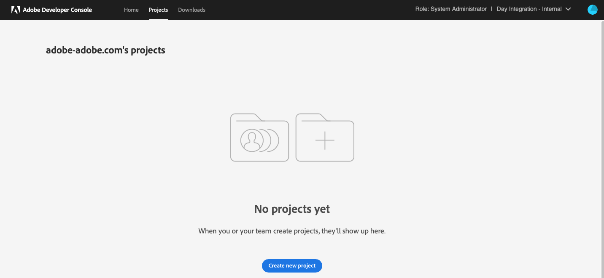
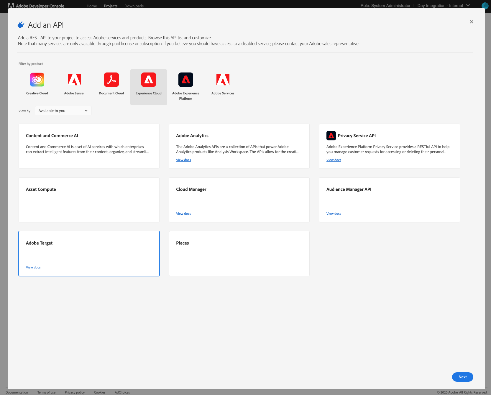

# 使用IMS與Adobe Target整合{#integration-with-adobe-target-using-ims}

透過Target Standard API整合AEM與Adobe Target時，需要使用Adobe Developer Console設定Adobe IMS (Identity Management系統)。

>[!NOTE]
>
>AEM 6.5最新支援Adobe Target Standard API。Target Standard API使用IMS驗證。
>
>我們仍支援在AEM中使用Adobe Target Classic API來提供回溯相容性。 此 [Target Classic API使用使用者認證](/help/sites-administering/target-configuring.md#manually-integrating-with-adobe-target).
>
>API選取是由用於AEM/Target整合的驗證方法驅動。
>另請參閱 [租使用者ID和使用者端代碼](#tenant-client) 區段。

## 先決條件 {#prerequisites}

開始此程式之前：

* [Adobe支援](https://experienceleague.adobe.com/?support-solution=General&amp;support-tab=home#support) 必須為以下專案布建您的帳戶：

   * Adobe主控台
   * Adobe Developer Console
   * Adobe Target和
   * Adobe IMS (Identity Management系統)

* 您組織的系統管理員應使用Admin Console，將您組織中所需的開發人員新增到相關的產品設定檔。

   * 這可讓特定開發人員在Adobe Developer Console中啟用整合。
   * 另請參閱 [管理開發人員](https://helpx.adobe.com/enterprise/using/manage-developers.html).

## 設定IMS設定 — 產生公開金鑰 {#configuring-an-ims-configuration-generating-a-public-key}

設定的第一個階段是在AEM中建立IMS設定並產生公開金鑰。

1. 在AEM中開啟 **工具** 功能表。
1. 在 **安全性** 區段，選取 **Adobe IMS設定**.
1. 選取 **建立** 以開啟 **Adobe IMS技術帳戶設定**.
1. 使用下方的下拉式清單 **雲端設定**，選取 **Adobe Target**.
1. 啟動 **建立新憑證** 並輸入新別名。
1. 確認 **建立憑證**.

   

1. 選取 **下載** (或 **下載公開金鑰**)將檔案下載至本機磁碟機，以便在下列情況下可以使用： [為Adobe Target與AEM的整合設定IMS](#configuring-ims-for-adobe-target-integration-with-aem).

   >[!CAUTION]
   >
   >將此設定保持開啟；此設定在 [在AEM中完成IMS設定](#completing-the-ims-configuration-in-aem).

   

## 為Adobe Target與AEM的整合設定IMS {#configuring-ims-for-adobe-target-integration-with-aem}

使用Adobe Developer Console，建立與AEM能使用的Adobe Target的專案（整合），然後指派所需的許可權。

### 建立專案 {#creating-the-project}

若要使用AEM能使用的Adobe Target建立專案，請開啟Adobe Developer Console：

>[!CAUTION]
>
>目前，Adobe僅支援Adobe Developer主控台的 **服務帳戶(JWT)** 認證型別。
>
>請勿使用 **OAuth伺服器對伺服器** 未來將支援的認證型別。

1. 開啟專案的Adobe Developer Console：

   [https://developer.adobe.com/console/projects](https://developer.adobe.com/console/projects)

1. 系統會顯示您擁有的任何專案。 選取 **建立新專案**  — 位置和使用情況取決於以下因素：

   * 如果您還沒有任何專案， **建立新專案** 是中下。
     
   * 如果您已有現有的專案，則會列出和 **建立新專案** 位於右上角。
     

1. 選取 **新增至專案** 後面接著 **API**：

   

1. 選取 **Adobe Target**，然後 **下一個**：

   >[!NOTE]
   >
   >如果您已訂閱Adobe Target，但它並未列出，您應檢視 [必要條件](#prerequisites).

   

1. **上傳您的公開金鑰**，完成後，請繼續 **下一個**：

   

1. 檢閱認證，然後繼續進行 **下一個**：

   

1. 選取所需的產品設定檔，並繼續 **儲存已設定的API**：

   >[!NOTE]
   >
   >顯示的產品設定檔取決於您是否擁有：
   >
   >* Adobe Target Standard — 僅限 **預設工作區** 可用
   >* Adobe Target Premium — 列出所有可用的工作區，如下所示

   

1. 已確認建立。

<!--
1. The creation is confirmed, you can now **Continue to integration details**; these are needed for [Completing the IMS Configuration in AEM](#completing-the-ims-configuration-in-aem).

   
-->

### 指派許可權給整合 {#assigning-privileges-to-the-integration}

現在將必要的許可權指派給整合：

1. 開啟Adobe **Admin Console**：

   * [https://adminconsole.adobe.com](https://adminconsole.adobe.com/)

1. 瀏覽至 **產品** （頂端工具列），然後選取 **ADOBE TARGET - &lt;*your-tenant-id*>** （從左側面板）。
1. 選取 **產品設定檔**，然後從呈現的清單中選取您所需的工作區。 例如，預設工作區。
1. 選取 **API認證**，則為所需的整合設定。
1. 選取 **編輯者** 作為 **產品角色**；而非 **觀察者**.

## 為Adobe Developer主控台整合專案儲存的詳細資訊 {#details-stored-for-the-ims-integration-project}

在「Adobe Developer主控台 — 專案」中，您可以看到所有整合專案的清單：

* [https://developer.adobe.com/console/projects](https://developer.adobe.com/console/projects)

若要顯示設定的詳細資訊，請選取 **檢視** （特定專案專案右側）。 這些類別包括：

* 專案概述
* Insights
* 認證
   * 服務帳戶(JWT)
      * 認證詳細資料
      * 產生JWT
* API
   * 例如，Adobe Target

其中部分專案您必須根據IMS在AEM中完成Adobe Target的整合。

## 在AEM中完成IMS設定 {#completing-the-ims-configuration-in-aem}

返回AEM時，您可以從Target的Adobe Developer主控台整合中新增必要值，以完成IMS設定：

1. 返回 [在AEM中開啟的IMS設定](#configuring-an-ims-configuration-generating-a-public-key).
1. 選取&#x200B;**「下一步」**。

1. 在這裡，您可以使用 [Adobe Developer Console中專案設定的詳細資料](#details-stored-for-the-ims-integration-project)：

   * **標題**：您的文字。
   * **授權伺服器**：從複製/貼上此 `aud` 行 **裝載** 下方區段，例如， `https://ims-na1.adobelogin.com` 在以下範例中
   * **API金鑰**：從以下位置複製此專案： [概觀](#details-stored-for-the-ims-integration-project) 區段
   * **使用者端密碼**：在中產生此專案 [概觀](#details-stored-for-the-ims-integration-project) 部分，並複製
   * **裝載**：從以下位置複製此專案： [產生JWT](#details-stored-for-the-ims-integration-project) 區段

   

1. 使用&#x200B;**建立**&#x200B;確認。

1. 您的Adobe Target設定會顯示在AEM主控台中。

   

## 確認IMS設定 {#confirming-the-ims-configuration}

若要確認組態是否如預期般運作：

1. 開啟：

   * `https://localhost<port>/libs/cq/adobeims-configuration/content/configurations.html`

   例如：

   * `https://localhost:4502/libs/cq/adobeims-configuration/content/configurations.html`

1. 選取您的設定。
1. 選取 **檢查健康狀態** ，接著再按 **檢查**.

   

1. 如果成功，您會看到訊息：

   

## 設定Adobe TargetCloud Service {#configuring-the-adobe-target-cloud-service}

現在可供使用Target Standard API的Cloud Service參考設定：

1. 開啟 **工具** 功能表。 然後，在 **Cloud Service** 區段，選取 **舊版Cloud Service**.
1. 向下捲動至 **Adobe Target** 並選取 **立即設定**.

   此 **建立設定** 對話方塊開啟。

1. 輸入 **標題** 如果您願意，也可以 **名稱** （如果保留為空白，則會從標題產生）。

   您也可以選取所需的範本（如果有多個範本可用）。

1. 使用&#x200B;**建立**&#x200B;確認。

   此 **編輯元件** 對話方塊開啟。

1. 請在以下欄位中輸入詳細資料： **Adobe Target設定** 標籤：

   * **驗證**： IMS

   * **租使用者ID**：Adobe IMS租使用者ID。 另請參閱 [租使用者ID和使用者端代碼](#tenant-client) 區段。

     >[!NOTE]
     >
     >對於IMS，此值必須從Target本身取得。 您可以登入Target，並從URL擷取租使用者ID。
     >
     >例如，如果URL為：
     >
     >`https://experience.adobe.com/#/@yourtenantid/target/activities`
     >
     >然後您會使用 `yourtenantid`.

   * **使用者端代碼**：請參閱 [租使用者ID和使用者端代碼](#tenant-client) 區段。

   * **IMS設定**：選取IMS設定的名稱

   * **API型別**：REST

   * **A4T Analytics Cloud設定**：選取用於鎖定活動目標和量度的Analytics Cloud設定。 如果您在鎖定目標內容時使用Adobe Analytics作為報表來源，則需要此專案。 如果您沒有看到雲端設定，請參閱中的注意事項 [設定A4T Analytics Cloud設定](/help/sites-administering/target-configuring.md#configuring-a-t-analytics-cloud-configuration).

   * **使用準確定位**：預設會選取此核取方塊。 如果選取，雲端服務設定會等待內容載入後再載入內容。 請參閱下列備註。

   * **從Adobe Target同步區段**：選取此選項，即可下載Target中定義的區段，以便在AEM中使用。 當「API型別」屬性為REST時，選取此選項，因為內嵌區段不受支援，且您必須一律使用Target中的區段。 ( AEM術語「區段」等同於Target「對象」。)

   * **客戶庫**：選取您想要使用AT.js使用者端程式庫，還是mbox.js （已棄用）。

   * **使用Tag Management系統提供使用者端資源庫**：使用DTM （已棄用）、Adobe Launch或任何其他標籤管理系統。

   * **自訂AT.js**：如果您已勾選Tag Management方塊或使用預設的AT.js，請留空。 或者上傳您的自訂AT.js。 只有在您已選取AT.js時才會顯示。

   >[!NOTE]
   >
   >[使用Target Classic API的Cloud Service設定](/help/sites-administering/target-configuring.md#manually-integrating-with-adobe-target) 已棄用(使用Adobe Recommendations設定索引標籤)。

1. 按一下 **連線到目標** 以初始化與Adobe Target的連線。

   如果連線成功，則訊息會顯示 **連線成功** 隨即顯示。

1. 選取 **確定** 在訊息上，後面接著 **確定** ，以便您確認組態。

1. 您現在可以繼續前往 [新增Target框架](/help/sites-administering/target-configuring.md#adding-a-target-framework) 以設定傳送至Target的ContextHub或ClientContext引數。 請注意，這可能不是將AEM體驗片段匯出至Target的必要專案。

### 租使用者ID和使用者端代碼 {#tenant-client}

替換為 [Adobe Experience Manager 6.5.8.0](/help/release-notes/release-notes.md)，則「使用者端代碼」欄位已新增至Target設定視窗。

設定租使用者ID和使用者端代碼欄位時，請注意下列事項：

1. 對於大多數客戶而言，租使用者ID和使用者端代碼是相同的。 這表示兩個欄位包含相同的資訊且相同。 請務必在兩個欄位中輸入租使用者ID。
2. 若是舊版用途，您也可以在「租使用者ID」和「使用者端代碼」欄位中輸入不同的值。

在這兩種情況下，請注意以下事項：

* 依預設，使用者端代碼（如果先新增）也會自動複製到「租使用者ID」欄位中。
* 您可以選擇變更預設租使用者ID集。
* 因此，對Target進行的後端呼叫以租使用者ID為基礎，而對Target進行的使用者端呼叫則以使用者端代碼為基礎。

如前所述，第一個案例是AEM 6.5最常見的情況。無論是哪一種方式，請確定 **兩者** 欄位包含正確的資訊，具體取決於您的需求。

>[!NOTE]
>
>如果您想要變更現有的Target組態：
>
>1. 重新輸入租使用者ID。
>2. 重新連線到Target。
>3. 儲存設定。
